# Technical Specification

# 1. Introduction

This document serves as the authoritative Technical Specification for the **Entertainment Services APIs** (`entservices-apis`) — an open-source, governed collection of interface definitions that forms the API contract layer for entertainment devices powered by RDK middleware and the Entertainment Operating System (EntOS). Hosted under the RDK Central organization on GitHub at `rdkcentral/entservices-apis`, this repository defines standardized service interfaces that enable RDK middleware developers to build Thunder plugins as services, and application developers to access platform functionalities across a wide range of entertainment devices.

---

## 1.1 Executive Summary

### 1.1.1 Project Overview

Entertainment Services APIs (abbreviated **Ent Services APIs**) are a set of interface definitions that allow RDK middleware (MW) developers to build Thunder plugins as services. These interface definitions are architected so that services can provide applications access to various platform functionalities in entertainment devices powered by RDK middleware. Application developers who would like to make use of the underlying features in entertainment devices may refer to this documentation to write, test, and deploy their apps on devices that run RDK MW.

The repository is published under the Apache License, Version 2.0, with the current API release at version **3.5.0** and the build component at version **4.4.1**. The project publishes its API reference documentation at [https://rdkcentral.github.io/entservices-apis/](https://rdkcentral.github.io/entservices-apis/).

| Attribute | Detail |
|---|---|
| Repository | `rdkcentral/entservices-apis` |
| License | Apache License 2.0 |
| API Release Version | 3.5.0 |
| Build Component Version | 4.4.1 |
| Documentation | Docsify-based static site |

### 1.1.2 Core Problem Statement

The entertainment device ecosystem — encompassing set-top boxes, smart TVs, and IPTV devices — requires a standardized, well-governed contract layer that decouples application development from low-level platform implementation details. Without a unified set of API contracts, middleware developers face fragmentation challenges: inconsistent service interfaces, incompatible communication protocols, and divergent naming conventions across device types and vendor implementations.

RDK is a fully modular, portable, and customizable open source software solution that standardizes core functions used in video, broadband, and IoT devices. The Entertainment Services APIs address fragmentation by providing a single, governed source of truth for all service interface definitions that target entertainment devices within this ecosystem. The RDK is a pre-integrated software bundle developed and licensed to create a common framework for powering IP or hybrid set-top boxes and gateway devices for CE manufacturers, SOCs vendors and other software developers, system integrators, and TV service providers.

By establishing formal interface contracts using C++ header definitions with annotated JSON-RPC metadata, the project enables both COM-RPC-based inter-plugin communication and JSON-RPC-based application-to-service communication from a single source definition.

### 1.1.3 Key Stakeholders and Users

The Entertainment Services APIs serve a tiered audience of technical stakeholders:

| Stakeholder Group | Role | Primary Interaction |
|---|---|---|
| **RDK Middleware Developers** | Build Thunder plugin services conforming to API contracts | Author and consume C++ interface headers in `apis/` |
| **Application Developers** | Write, test, and deploy apps on RDK MW devices | Reference JSON-RPC documentation for service integration |
| **Governance Board** | Oversee API lifecycle, approvals, and policy | Review proposals and enforce governance via `governance.md` |
| **System Architects** | Define cross-cutting architectural concerns | Strategic review participation (monthly cadence) |
| **Component Architects** | Own domain-specific API design decisions | Tactical review participation (weekly cadence) |
| **Plugin Maintainers** | Maintain individual service interface definitions | Day-to-day code review and PR approvals |

Code ownership is managed by the `@rdkcentral/rdkservices-apis-maintainers` team, as defined in `.github/CODEOWNERS`. Governance contacts include Ramasamy Thalavay Pillai and Anand Kandasamy (Comcast), as referenced in `README.md`.

### 1.1.4 Value Proposition and Business Impact

The Entertainment Services APIs deliver measurable value across the RDK ecosystem through the following impact areas:

- **Standardization**: A single governed API contract layer eliminates interface fragmentation across device types (IPTV, IPSTB, QAMIPSTB) and vendor implementations, ensuring consistent developer experience.
- **Decoupled Development**: By separating interface definitions from plugin implementations, the project enables parallel development streams — API contracts can evolve independently of service implementations.
- **Automated Toolchain**: Proxy/stub code generation (COM-RPC), JSON-RPC binding generation, and documentation generation from source headers reduce manual effort and ensure documentation never diverges from the actual interface contracts.
- **Open Governance**: A global community of operators, service providers, OEMs, SoCs, system integrators, app developers, and others collaborate to bring innovative products, services, and solutions. The formal governance model (proposal → review → approval → release) ensures API quality, backward compatibility, and security considerations are systematically addressed.
- **Ecosystem Scale**: The RDK community is comprised of more than 600 companies including: CPE manufacturers, SoC vendors, software developers, system integrators, and service providers.

---

## 1.2 System Overview

### 1.2.1 Project Context

#### Business Context and Market Positioning

Entertainment Services APIs operate within the broader RDK (Reference Design Kit) ecosystem — an open-source software platform managed by RDK Management, LLC. RDK7 is the newest open source software release, representing the first release of RDK-E (Entertainment), evolving from the previous RDK-V (Video) platform. It supports both IP and TV video platforms, integrating over-the-top (OTT) video apps through the Firebolt™ framework, standardizing interfaces for video playback, digital rights management (DRM), graphics, and security.

The `entservices-apis` repository provides the interface contract definitions that sit within the **Middleware Layer** of the RDK architecture. The ENT Services within the Middleware Layer handle core Entertainment device functionality, including the Media Framework for video decoding and rendering, DRM Systems for content protection and digital rights management, and device management for optimal performance.

#### Relationship to Predecessor Systems

The Entertainment Services APIs represent an evolution from the earlier `rdkservices` repository. While the legacy `rdkservices` project bundled both interface definitions and plugin implementations together as JSON-schema-described services, the `entservices-apis` repository modernizes this approach by:

1. **Separating contracts from implementations** — Interface headers reside in `entservices-apis`, while implementations live in dedicated plugin repositories (e.g., `entservices-runtime`, `entservices-inputoutput`).
2. **Adopting C++ header-based IDL** — Moving from JSON schema definitions to annotated C++ headers as the primary interface definition language, enabling native COM-RPC support alongside JSON-RPC generation.
3. **Formalizing governance** — Introducing a structured governance model with defined roles, review cadences, naming conventions, and versioning policies via `governance.md`.

#### Integration with Enterprise Landscape

The APIs integrate with the broader RDK middleware stack through two primary dependency channels:

- **Thunder Framework (WPEFramework)**: Thunder is an open-source plugin-based device abstraction layer, where business functionality can be implemented as plugins and applications can query and control those plugins. Designed from the ground up for embedded platforms and written in C++11, Thunder can be run on even the most low-power of devices (including ARM and MIPS-based platforms). The `entservices-apis` interfaces are compiled against Thunder's core libraries (`${NAMESPACE}Core`, `${NAMESPACE}COM`) and utilize Thunder's code generation tools (`ProxyStubGenerator`, `JsonGenerator`) via `ThunderTools`.
- **RDK Build System**: The interfaces are consumed as build-time dependencies by downstream plugin repositories, integrated through the Yocto/OE-based RDK build pipeline.

### 1.2.2 High-Level Description

#### Primary System Capabilities

Entertainment Services are JSON-RPC services for accessing component functionality available on RDK devices. These services are implemented as plugins for the Thunder framework, which manages plugins and handles client requests. The services are invoked using JSON-RPC interface over HTTP or WebSockets, making them accessible to Lightning applications, any web client that can process JSON, and native C/C++ applications.

The repository delivers the following core capabilities:

1. **Interface Contract Definitions**: Over 63 service-specific C++ interface headers in the `apis/` directory, each defining methods, properties, events, enumerations, and data structures for a specific platform capability domain.
2. **Dual-Protocol Support**: Each interface header inherently supports COM-RPC for inter-plugin communication. When annotated with `@json 1.0.0` and `@text:keep` tags, interfaces additionally support JSON-RPC for application-to-service communication.
3. **Automated Code Generation**: Build-time proxy/stub generation (for COM-RPC marshalling) and JSON-RPC binding generation from interface headers, driven by CMake build configurations in `CMakeLists.txt` and `build/CMakeLists.txt`.
4. **Automated Documentation**: A Python-based documentation generation pipeline (`tools/md_generator/`) that produces Markdown API reference pages from interface headers and JSON definitions.
5. **Governance Framework**: A comprehensive API lifecycle management model defined in `governance.md`, covering proposal, review, approval, versioning, deprecation, and release processes.

#### Major System Components

The following diagram illustrates the high-level architecture and component relationships of the Entertainment Services APIs repository:

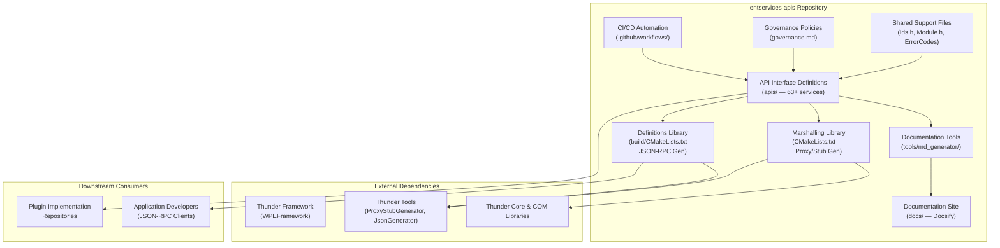
```mermaid
flowchart TB
    subgraph Repository["entservices-apis Repository"]
        direction TB
        APIs["API Interface Definitions<br/>(apis/ — 63+ services)"]
        Shared["Shared Support Files<br/>(Ids.h, Module.h, ErrorCodes)"]
        Marshalling["Marshalling Library<br/>(CMakeLists.txt — Proxy/Stub Gen)"]
        Definitions["Definitions Library<br/>(build/CMakeLists.txt — JSON-RPC Gen)"]
        DocTools["Documentation Tools<br/>(tools/md_generator/)"]
        DocSite["Documentation Site<br/>(docs/ — Docsify)"]
        CICD["CI/CD Automation<br/>(.github/workflows/)"]
        Gov["Governance Policies<br/>(governance.md)"]
    end

    subgraph External["External Dependencies"]
        direction TB
        Thunder["Thunder Framework<br/>(WPEFramework)"]
        ThunderTools["Thunder Tools<br/>(ProxyStubGenerator, JsonGenerator)"]
        ThunderCore["Thunder Core &amp; COM Libraries"]
    end

    subgraph Consumers["Downstream Consumers"]
        direction TB
        PluginRepos["Plugin Implementation<br/>Repositories"]
        AppDevs["Application Developers<br/>(JSON-RPC Clients)"]
    end

    APIs --> Marshalling
    APIs --> Definitions
    APIs --> DocTools
    Shared --> APIs
    DocTools --> DocSite
    Marshalling --> ThunderTools
    Definitions --> ThunderTools
    Marshalling --> ThunderCore
    APIs --> PluginRepos
    Definitions --> AppDevs
    Gov --> APIs
    CICD --> APIs
```

| Component | Location | Purpose |
|---|---|---|
| API Interface Definitions | `apis/` (63+ subdirectories) | C++ header-based service contracts with JSON-RPC annotations |
| Shared Support Files | `apis/Ids.h`, `apis/Module.h`, `apis/entservices_errorcodes.h` | Fixed numeric IDs, module wiring, custom error codes |
| Marshalling Library | `CMakeLists.txt` (root) | CMake build for COM-RPC proxy/stub generation |
| Definitions Library | `build/CMakeLists.txt` | CMake build for JSON-RPC code generation |
| Documentation Site | `docs/` | Docsify-based static API reference (64 documented services) |
| Documentation Tools | `tools/md_generator/` | Header-to-Markdown and JSON-to-Markdown pipelines |
| CI/CD Automation | `.github/workflows/` (7 workflows) | Build validation, header compliance, CLA, security scanning, release |
| Governance Policies | `governance.md` | API governance model, naming conventions, versioning rules |

#### Core Technical Approach

The repository adopts an **Interface Definition Language (IDL) approach using annotated C++ headers**. Each API service is defined as a C++ abstract interface inheriting from `Core::IUnknown` (a COM-style base interface), placed within the `WPEFramework::Exchange` namespace. Interfaces use fixed numeric identifiers registered in `apis/Ids.h` for stable proxy/stub compatibility across builds.

The technical approach follows this generation pipeline:

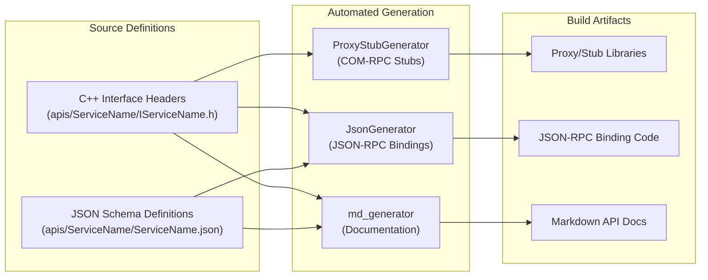
```mermaid
flowchart LR
    subgraph Input["Source Definitions"]
        Headers["C++ Interface Headers<br/>(apis/ServiceName/IServiceName.h)"]
        JSON["JSON Schema Definitions<br/>(apis/ServiceName/ServiceName.json)"]
    end

    subgraph Generation["Automated Generation"]
        PSG["ProxyStubGenerator<br/>(COM-RPC Stubs)"]
        JG["JsonGenerator<br/>(JSON-RPC Bindings)"]
        MDG["md_generator<br/>(Documentation)"]
    end

    subgraph Output["Build Artifacts"]
        Proxies["Proxy/Stub Libraries"]
        JSONRPC["JSON-RPC Binding Code"]
        Docs["Markdown API Docs"]
    end

    Headers --> PSG
    Headers --> JG
    Headers --> MDG
    JSON --> JG
    JSON --> MDG
    PSG --> Proxies
    JG --> JSONRPC
    MDG --> Docs
```

The technology stack underpinning this approach includes:

| Technology | Version / Detail | Evidence |
|---|---|---|
| C++ Standard | C++11 | `CMakeLists.txt`, line 76 |
| CMake | ≥ 3.3 (Definitions) / ≥ 3.12 (Marshalling) | `build/CMakeLists.txt`, `CMakeLists.txt` |
| Thunder / WPEFramework | R4_4 branch | `.github/workflows/Build_entservices-apis_on_Ubuntu.yml` |
| Python | 3.5+ | `README.md` (documentation generation requirement) |
| Docsify | Static site generator | `docs/index.html` |
| GitHub Actions | CI/CD platform | `.github/workflows/` (7 workflow definitions) |

### 1.2.3 Success Criteria

#### Measurable Objectives

The Entertainment Services APIs project establishes success through the following measurable objectives, derived from the governance model's stated objectives in `governance.md`:

| Objective | Measurement Criteria | Governance Alignment |
|---|---|---|
| **Openness** | All API definitions publicly available under Apache 2.0; contributions accepted via fork-and-PR model | Open development objective |
| **Consistency** | All services follow standardized naming conventions (PascalCase for COMRPC, camelCase for JSON-RPC, `org.rdk` callsign prefix) | Consistency objective |
| **Scalability** | Repository accommodates 63+ service definitions with automated validation; incremental header validation for PR efficiency | Scalable objective |
| **Maintainability** | Automated changelog generation, semantic versioning (Major.Minor.Patch), formal deprecation process | Maintainable objective |
| **Security** | CLA enforcement, security/license diff scanning (FOSSID), robust security mechanisms in API design where needed | Secure objective |

#### Critical Success Factors

- **Contract-Implementation Separation**: The repository must contain only interface definitions — not plugin implementations. This separation is a fundamental architectural principle, ensuring the API contracts serve as the single source of truth.
- **Backward Compatibility**: Non-breaking changes (minor/patch) must not require existing consumers to modify their integrations. Breaking changes (major version bumps) must follow the formal deprecation process.
- **Automation Fidelity**: Generated proxy/stubs, JSON-RPC bindings, and documentation must remain in perfect sync with the source interface headers. The CI/CD pipeline validates this through header compliance checks on every pull request.

#### Key Performance Indicators (KPIs)

| KPI | Target | Measurement Source |
|---|---|---|
| API coverage | 63+ service domains documented | `apis/` directory count, `docs/_sidebar.md` entry count |
| Release cadence | Multiple releases per development cycle | `CHANGELOG.md` (version 3.0.0 → 3.5.0 within a single quarter) |
| Build validation coverage | 100% of PRs validated against Thunder R4_4 | `.github/workflows/Build_entservices-apis_on_Ubuntu.yml` |
| Header compliance | 100% of changed headers pass validation | `.github/workflows/Validate_Interface_headers_incremental.yml` |
| Documentation currency | Auto-generated docs on every API change | `.github/workflows/generate_doc.yml` |

---

## 1.3 Scope

### 1.3.1 In-Scope

#### 1.3.1.1 Core Features and Functionalities

The Entertainment Services APIs encompass the following **must-have capabilities**:

**Interface Definition and Contract Management**
- C++ header-based API contracts for 63+ entertainment services, each following a consistent pattern: Apache 2.0 license header, `WPEFramework::Exchange` namespace, `Core::IUnknown` inheritance, fixed numeric IDs from `apis/Ids.h`, and JSON-RPC annotation tags (`@json`, `@text`, `@property`, `@brief`, `@param`, `@retval`, `@event`).
- Shared infrastructure files: `apis/Ids.h` (COM-RPC identifier registry), `apis/Module.h` (framework primitives), and `apis/entservices_errorcodes.h` (custom error code definitions using X-macro pattern with base offset of 1000).

**Communication Protocol Support**
- **COM-RPC** (default): Inherently supported by all API header definitions for inter-plugin communication. This is the mandatory protocol for service-to-service calls within the Thunder framework.
- **JSON-RPC** (application-facing): Enabled via `@json 1.0.0` and `@text:keep` annotations for application-to-service communication over HTTP or WebSockets.

**Automated Code and Documentation Generation**
- Proxy/stub library generation via `ProxyStubGenerator` (COM-RPC marshalling), configured in the root `CMakeLists.txt`.
- JSON-RPC binding code generation via `JsonGenerator`, configured in `build/CMakeLists.txt`.
- Markdown API documentation generation via `tools/md_generator/generate_md.py`, supporting both header-to-Markdown and JSON-to-Markdown pipelines.

**Governance and Lifecycle Management**
- Formal API governance model with defined roles (Governance Board, System Architects, Component Architects, Plugin Maintainers).
- Semantic versioning policy: Major (breaking changes), Minor (non-breaking additions), Patch (trivial fixes).
- Structured review cadences: Monthly (strategic), Weekly (tactical), Impromptu (emergency), Annual (policy review).
- Deprecation workflow requiring `@deprecated` tags in headers or `["deprecated"]` labels in JSON schemas.

#### 1.3.1.2 API Service Domains

The 63+ service interface definitions span the following functional domains:

| Domain | Services (representative) | Count |
|---|---|---|
| Browser / App Lifecycle & Management | AppManager, AppNotifications, AppStorageManager, PackageManager, LifecycleManager, RuntimeManager, Migration, Monitor | ~14 |
| Media & Playback | AVInput, FrameRate, HdcpProfile, HdmiCecSink, HdmiCecSource, LinearPlaybackControl, MiracastPlayer, PlayerInfo, ScreenCapture, SystemAudioPlayer, TextToSpeech | ~18 |
| Device & Platform Information | DeviceDiagnostics, DeviceIdentification, DeviceInfo, DisplayInfo, FrontPanel, PowerManager, ResourceManager, SystemMode, UserSettings | ~10 |
| Storage, Telemetry & Security | Backup, OpenCDMi, PersistentStore, SharedStorage, Telemetry, TelemetryMetrics, UnifiedCASManagement | ~8 |
| Browser / Compositor / Runtime | DTV, Netflix, OCIContainer, RDKShell, RDKWindowManager, WebKitBrowser, XCast | ~8 |
| Analytics & Updates | Analytics, FirmwareDownload, FirmwareUpdate, DownloadManager | ~5 |

#### 1.3.1.3 Primary User Workflows

The following primary workflows are supported within the scope of this repository:

1. **API Proposal and Contribution**: Developers fork the repository, create or modify interface headers following the naming conventions and coding guidelines defined in `governance.md` and `README.md`, and submit pull requests targeting the governance branch.
2. **Build-Time Integration**: Downstream plugin implementation repositories depend on `entservices-apis` as a build-time input. CMake configurations consume interface headers to generate proxy/stub libraries and JSON-RPC binding code.
3. **API Reference Consumption**: Application developers reference the auto-generated Docsify documentation site (`docs/`) to understand available methods, properties, events, and data types for each service.
4. **CI/CD Validation**: Every pull request triggers automated pipelines for Ubuntu build validation (against Thunder R4_4), interface header compliance checking, CLA enforcement, and security/license scanning.

#### 1.3.1.4 Essential Integrations

| Integration Point | Mechanism | Evidence |
|---|---|---|
| Thunder Framework | Build dependency; headers compiled against Thunder Core/COM libraries | `CMakeLists.txt` — `find_package(WPEFramework)` |
| ThunderTools | Code generation dependency; ProxyStubGenerator and JsonGenerator | `CMakeLists.txt`, `build/CMakeLists.txt` |
| GitHub Actions CI/CD | 7 workflow definitions for build, validation, release, CLA, and security | `.github/workflows/` |
| Docsify Documentation | Auto-generated Markdown published as static site | `docs/`, `tools/md_generator/` |

#### 1.3.1.5 Supported Device Types and Data Domains

Target device types, as enumerated in `apis/DeviceInfo/IDeviceInfo.h`:

| Device Type | Description |
|---|---|
| IPTV | IP Television devices |
| IPSTB | IP Set-Top Box devices |
| QAMIPSTB | QAM IP Set-Top Box devices |

The data domains covered by the APIs include device identity, display capabilities, audio/video input and output, content protection (DRM/CAS), firmware management, persistent storage, telemetry and diagnostics, application lifecycle, media playback, user settings, and network casting.

### 1.3.2 Out-of-Scope

The following elements are explicitly **excluded** from the scope of this repository and its technical specification:

| Exclusion | Rationale | Source |
|---|---|---|
| **Plugin implementation code** | This repository contains only interface definitions (contracts), not service implementations. The implementations of these APIs are single or groups of Thunder Plugins within the RDK Entertainment Services middleware components (e.g., `entservices-runtime`, `entservices-inputoutput`). | `governance.md`, line 42 |
| **Plugin versioning** | The versioning of RDK Entertainment Services APIs is distinct from plugin version numbers. Plugin version is not in scope. | `governance.md`, line 174 |
| **Runtime behavior and execution** | The repository provides API contracts only; runtime service execution, plugin activation, and process management are handled by the Thunder framework. | Architectural separation principle |
| **Detailed architecture documentation** | The architecture overview section (`docs/overview/arch.md`) is currently a placeholder ("Will be updated soon!!"). Comprehensive architectural diagrams are deferred. | `docs/overview/arch.md` |
| **Security implementation details** | While governance notes that APIs consider robust security mechanisms where needed, the actual security implementation (token management, access control) resides in the Thunder framework's SecurityAgent plugin. | `governance.md`, line 28 |
| **Firebolt Framework APIs** | The Firebolt API layer (used for standardized OTT app integration) is a separate project and is not defined in this repository. | External project boundary |
| **Hardware Abstraction Layer (HAL)** | Low-level hardware interfaces and driver-layer communication are outside the API contract scope. | Middleware layer boundary |
| **Vendor-specific customizations** | Device-specific adaptations and vendor-proprietary extensions to the APIs are not covered. | Open-source scope boundary |

#### Future Phase Considerations

The following items are identified as potential future enhancements based on repository evidence:

- **Architecture documentation completion**: The placeholder in `docs/overview/arch.md` indicates planned architectural documentation.
- **Expanded CI/CD details**: Sections of `README.md` marked "TO BE UPDATED!!" suggest pending documentation for additional CI/CD integration specifics.
- **Additional service interfaces**: The active development cadence (version 3.0.0 → 3.5.0 within a single quarter, with new services like GoogleCast, AppGatewayTelemetry, and Bluetooth enhancements being added) indicates ongoing expansion of the service catalog.

---

## 1.4 Document Conventions and Terminology

### 1.4.1 Key Terminology

The following terms are used throughout this specification, derived from `docs/overview/aat.md` and `governance.md`:

| Term | Definition |
|---|---|
| **API** | Application Programming Interface |
| **Entertainment Service** | A JSON-RPC service implemented as a Thunder plugin providing platform functionality |
| **Thunder / WPEFramework** | The open-source plugin-based device abstraction framework hosting all services |
| **COM-RPC** | COM-style Remote Procedure Call — Thunder's native inter-process communication mechanism |
| **JSON-RPC** | A remote procedure call protocol encoded in JSON, used for application-to-service communication |
| **Callsign** | The unique name identifying a plugin instance (prefixed with `org.rdk` per governance conventions) |
| **EntOS** | Entertainment Operating System — the RDK-based operating system for entertainment devices |
| **RDK** | Reference Design Kit — the open-source software platform for connected entertainment devices |
| **Proxy/Stub** | Auto-generated marshalling code enabling COM-RPC communication across process boundaries |

### 1.4.2 References

- `README.md` — Project overview, contribution guidelines, documentation generation instructions, coding guidelines, and versioning policy
- `governance.md` — Complete API governance model including objectives, structure, naming conventions, versioning rules, deprecation policy, and review processes
- `CONTRIBUTING.md` — Contribution workflow summary
- `LICENSE` — Apache License 2.0 full text
- `CHANGELOG.md` — Automated version history (3.0.0 through 3.5.0)
- `CMakeLists.txt` (root) — Marshalling component build configuration (version 4.4.1, CMake ≥ 3.12, C++11)
- `build/CMakeLists.txt` — Definitions component build configuration (version 4.4.1, JsonGenerator integration)
- `apis/` — Directory containing 63+ service-specific interface header subdirectories and 7 shared support files
- `apis/DeviceInfo/IDeviceInfo.h` — Representative API interface header demonstrating the standard interface pattern
- `apis/Ids.h` — Fixed numeric identifier registry for COM-RPC proxy/stub interface resolution
- `apis/entservices_errorcodes.h` — Custom error code definitions (X-macro pattern, base offset 1000)
- `docs/homepage.md` — Documentation landing page
- `docs/_coverpage.md` — Cover page branding (EntOS reference)
- `docs/_sidebar.md` — Full API reference navigation (64 documented service entries)
- `docs/overview/intro.md` — Functional overview of Entertainment Services
- `docs/overview/aat.md` — Glossary, acronyms, terms, and references
- `docs/overview/arch.md` — Architecture placeholder (pending content)
- `.github/workflows/` — 7 CI/CD workflow definitions (build, validation, release, CLA, security, documentation)
- `.github/CODEOWNERS` — Code ownership configuration (`@rdkcentral/rdkservices-apis-maintainers`)
- `tools/md_generator/` — Documentation generation tooling (header-to-Markdown and JSON-to-Markdown pipelines)
- [RDK Central](https://rdkcentral.com) — Official RDK ecosystem website (web search reference)
- [Thunder GitHub Repository](https://github.com/rdkcentral/Thunder) — Thunder framework source (web search reference)
- [RDK Central Wiki — WPEFramework](https://wiki.rdkcentral.com) — Thunder/WPEFramework documentation (web search reference)
- [GitHub — rdkcentral/entservices-apis](https://github.com/rdkcentral/entservices-apis) — Source repository (web search reference)

# 2. Product Requirements

## 2.1 Feature Catalog

### 2.1.1 Feature Index

The Entertainment Services APIs repository delivers ten discrete, verifiable features that collectively provide a governed, contract-only interface definition layer for RDK middleware entertainment services. Each feature is identified by a unique ID, categorized by functional domain, and prioritized based on its criticality to the system's core value proposition. All features are grounded in evidence from the repository's source files, governance documentation, and CI/CD configurations.

| Feature ID | Feature Name | Category |
|---|---|---|
| F-001 | Interface Contract Definitions | Core Platform |
| F-002 | Dual Communication Protocol Support | Core Platform |
| F-003 | Automated Code Generation | Build & Toolchain |
| F-004 | Automated Documentation Generation | Documentation & Tooling |
| F-005 | API Governance Framework | Process & Governance |
| F-006 | CI/CD Automation Pipeline | DevOps & Quality |
| F-007 | Interface ID Management | Core Platform |
| F-008 | Custom Error Code Management | Core Platform |
| F-009 | API Contribution & Review Process | Process & Governance |
| F-010 | API Versioning & Release Management | Process & Governance |

| Feature ID | Priority Level | Status |
|---|---|---|
| F-001 | Critical | Completed |
| F-002 | Critical | Completed |
| F-003 | Critical | Completed |
| F-004 | High | Completed |
| F-005 | High | Completed |
| F-006 | High | Completed |
| F-007 | Critical | Completed |
| F-008 | Medium | Completed |
| F-009 | High | Completed |
| F-010 | High | Completed |

### 2.1.2 Feature Descriptions

#### F-001: Interface Contract Definitions

| Attribute | Detail |
|---|---|
| **Feature ID** | F-001 |
| **Feature Name** | Interface Contract Definitions |
| **Category** | Core Platform |
| **Priority** | Critical |
| **Status** | Completed |

**Overview**

The foundational feature of the repository: over 63 service-specific C++ interface headers residing in the `apis/` directory, each defining methods, properties, events, enumerations, and data structures for a specific platform capability domain. Each interface follows a consistent pattern—Apache 2.0 license header, `WPEFramework::Exchange` namespace, inheritance from `Core::IUnknown` (COM-style base interface), and fixed numeric identifiers registered in `apis/Ids.h`. These interface definitions are the sole content of this contract-only repository; no plugin implementations are included (see Section 1.3.2 for out-of-scope items).

**Business Value**

This feature provides a single governed source of truth for all entertainment service interface definitions, eliminating interface fragmentation across device types (IPTV, IPSTB, QAMIPSTB) and vendor implementations. As stated in the user context, these interface definitions allow RDK MW developers to build Thunder plugins as services while giving app developers access to various platform functionalities in entertainment devices powered by RDK middleware.

**User Benefits**

- RDK MW developers receive stable, well-documented C++ abstract interfaces to implement as Thunder plugins.
- Application developers gain predictable API contracts for writing, testing, and deploying apps on RDK MW devices.
- System architects benefit from a decoupled contract layer that enables parallel development across API design and plugin implementation.

**Technical Context**

The 63+ service interfaces are organized into six functional domains (see Section 1.3.1.2): Browser / App Lifecycle & Management (~14 services), Media & Playback (~18 services), Device & Platform Information (~10 services), Storage / Telemetry & Security (~8 services), Browser / Compositor / Runtime (~8 services), and Analytics & Updates (~5 services). Representative interfaces include `apis/DeviceInfo/IDeviceInfo.h` (device identity, capabilities, EDID/HDCP), `apis/AppManager/IAppManager.h` (app lifecycle states, launch/preload/terminate operations), and `apis/PersistentStore/` (namespaced key/value storage with scope types and TTL support across three versioned interfaces).

| Dependency Type | Detail |
|---|---|
| **Prerequisite Features** | F-007 (Interface ID Management), F-008 (Custom Error Codes) |
| **System Dependencies** | Thunder Framework (`WPEFramework`), `apis/Module.h` |
| **External Dependencies** | None (contract-only definitions) |
| **Integration Requirements** | Downstream plugin repositories consume these headers as build-time inputs |

---

#### F-002: Dual Communication Protocol Support

| Attribute | Detail |
|---|---|
| **Feature ID** | F-002 |
| **Feature Name** | Dual Communication Protocol Support |
| **Category** | Core Platform |
| **Priority** | Critical |
| **Status** | Completed |

**Overview**

Each interface header inherently supports two communication protocols from a single source definition. **COM-RPC** (the default) is natively supported for inter-plugin communication within the Thunder framework. **JSON-RPC** is enabled via `@json 1.0.0` and `@text:keep` annotations for application-to-service communication over HTTP or WebSockets. This dual-protocol design ensures that a single interface header serves both middleware developers (COM-RPC) and application developers (JSON-RPC) without duplication.

**Business Value**

By generating both COM-RPC and JSON-RPC interfaces from a single C++ header, the system eliminates the need to maintain separate API definitions for inter-plugin and application-facing communication. This directly supports the RDK ecosystem's goal of consistent interface-driven development.

**User Benefits**

- Plugin developers use COM-RPC for efficient, low-overhead inter-service calls.
- Application developers (Lightning, web clients, native C/C++ apps) use JSON-RPC for standards-based HTTP/WebSocket access.
- A single source of truth prevents protocol-level API drift.

**Technical Context**

Naming conventions enforce protocol differentiation: PascalCase for COM-RPC method identifiers and camelCase for JSON-RPC (controlled by `@text` annotations in the headers). When a service supports only JSON-RPC and not COM-RPC, the `@stubgen:omit` tag is used to suppress proxy/stub generation. As documented in `governance.md` and `README.md`, COM-RPC must be used for inter-plugin communication—JSON-RPC is exclusively for application consumption and is "an overhead and not preferred for inter-plugin communication."

| Dependency Type | Detail |
|---|---|
| **Prerequisite Features** | F-001 (Interface Contract Definitions) |
| **System Dependencies** | Thunder Framework, ThunderTools |
| **External Dependencies** | None |
| **Integration Requirements** | ProxyStubGenerator (COM-RPC), JsonGenerator (JSON-RPC) |

---

#### F-003: Automated Code Generation

| Attribute | Detail |
|---|---|
| **Feature ID** | F-003 |
| **Feature Name** | Automated Code Generation (Marshalling) |
| **Category** | Build & Toolchain |
| **Priority** | Critical |
| **Status** | Completed |

**Overview**

Build-time proxy/stub and JSON-RPC binding code generation from interface headers, orchestrated by two CMake build configurations. The **Marshalling Component** (root `CMakeLists.txt`, project version 4.4.1) uses the `ProxyStubGenerator` to create COM-RPC proxy/stub code for cross-process communication. The **Definitions Component** (`build/CMakeLists.txt`) uses the `JsonGenerator` to create JSON-RPC binding code for application-facing interfaces. Input file patterns include `./apis/*/I*.h` for headers and `./apis/*/*.json` for JSON schema definitions.

**Business Value**

Automated code generation eliminates manual marshalling code, reducing development effort and ensuring that generated artifacts remain perfectly synchronized with source interface definitions. This is a core principle of the automated toolchain described in Section 1.1.4.

**User Benefits**

- Downstream plugin developers receive ready-to-link proxy/stub shared libraries.
- JSON-RPC binding code is automatically generated, removing the need for manual API wiring.
- Build-time generation guarantees artifacts never diverge from interface definitions.

**Technical Context**

The Marshalling component requires CMake ≥ 3.12 and C++11, while the Definitions component requires CMake ≥ 3.3. Both components depend on `find_package(WPEFramework)` and the `${NAMESPACE}Core` and `${NAMESPACE}COM` libraries from the Thunder framework. Generated outputs include `ProxyStubs*.cpp` files compiled into shared libraries and JSON-RPC binding headers.

| Dependency Type | Detail |
|---|---|
| **Prerequisite Features** | F-001 (Interface Contracts), F-002 (Protocol Annotations) |
| **System Dependencies** | CMake ≥ 3.12, C++11 compiler, `${NAMESPACE}Core`, `${NAMESPACE}COM`, `CompileSettingsDebug` |
| **External Dependencies** | ThunderTools (`ProxyStubGenerator`, `JsonGenerator`) |
| **Integration Requirements** | Thunder R4_4 branch compatibility |

---

#### F-004: Automated Documentation Generation

| Attribute | Detail |
|---|---|
| **Feature ID** | F-004 |
| **Feature Name** | Automated Documentation Generation |
| **Category** | Documentation & Tooling |
| **Priority** | High |
| **Status** | Completed |

**Overview**

A Python-based documentation generation pipeline that produces Markdown API reference pages from interface headers and JSON schema definitions. The pipeline supports two conversion paths: header-to-Markdown (`tools/md_generator/h2md/generate_md_from_header.py`) and JSON-to-Markdown (`tools/md_generator/json2md/generator_json.py`). A unified regeneration entry point (`tools/md_generator/generate_md.py`) drives the complete pipeline, outputting to the Docsify-based static documentation site at `docs/`.

**Business Value**

Documentation is auto-generated from the same source headers that define the API contracts, ensuring that API reference material never diverges from the actual interface definitions. As documented in the `docs/_sidebar.md`, 64 services are currently documented, with some services using the newer header-based generation and others still using legacy JSON-schema-based generation (indicated by the `@` superscript marker in the sidebar).

**User Benefits**

- Application developers access always-current API reference documentation.
- Contributors benefit from automated documentation updates on every API change, eliminating manual documentation maintenance.

**Technical Context**

The pipeline requires Python 3.5+ and the `jsonref` library. The CI/CD workflow `generate_doc.yml` automatically triggers documentation generation and auto-commits updated Markdown files when API changes are merged.

| Dependency Type | Detail |
|---|---|
| **Prerequisite Features** | F-001 (Interface Contracts) |
| **System Dependencies** | Python 3.5+, `jsonref` library |
| **External Dependencies** | Docsify (static site generator) |
| **Integration Requirements** | CI/CD integration via `generate_doc.yml` |

---

#### F-005: API Governance Framework

| Attribute | Detail |
|---|---|
| **Feature ID** | F-005 |
| **Feature Name** | API Governance Framework |
| **Category** | Process & Governance |
| **Priority** | High |
| **Status** | Completed |

**Overview**

A comprehensive API lifecycle management model defined in `governance.md` (203 lines) that establishes standards for naming conventions, coding patterns, documentation requirements, versioning rules, deprecation policies, and review processes. The governance model serves six stated objectives: Open, Collaborative, Scalable, Maintainable, Consistent, and Secure development.

**Business Value**

The governance framework ensures API quality, backward compatibility, and consistency across the 63+ service definitions. It provides the structural foundation that enables a large, distributed contributor community to produce coherent, standards-compliant interface definitions.

**User Benefits**

- All stakeholders benefit from predictable, consistent API design patterns.
- New contributors have clear guidelines to follow, reducing onboarding friction.
- Consumers (app developers) receive APIs that follow uniform conventions for naming, error handling, and documentation.

**Technical Context**

Key governance rules include: callsign prefix `org.rdk` with PascalCase service names; methods use PascalCase (COMRPC) and camelCase (JSON-RPC); parameters use camelCase with valid ASCII; enumerations use `ALL_UPPER_SNAKE_CASE`; events follow the `on[Object][Action]` naming pattern; all methods must return `Core::hresult`; getters start with `Get`/`get` and setters with `Set`/`set`; notification interfaces must have default implementations (not pure virtual); documentation tags (`@brief`, `@param`, `@details`, `@retval`) are mandatory; and TAB size is 4 spaces with TABs replaced by spaces.

| Dependency Type | Detail |
|---|---|
| **Prerequisite Features** | None (foundational) |
| **System Dependencies** | None |
| **External Dependencies** | None |
| **Integration Requirements** | Governs all other features |

---

#### F-006: CI/CD Automation Pipeline

| Attribute | Detail |
|---|---|
| **Feature ID** | F-006 |
| **Feature Name** | CI/CD Automation Pipeline |
| **Category** | DevOps & Quality |
| **Priority** | High |
| **Status** | Completed |

**Overview**

Seven GitHub Actions workflows and two Python validation scripts provide automated quality gates for every code change. The pipeline covers build validation, interface header compliance, Contributor License Agreement (CLA) enforcement, security/license scanning, automated release orchestration, and documentation generation.

**Business Value**

Automated CI/CD ensures that every contribution meets quality, compliance, and security standards before merge, protecting the integrity of the API contract repository at scale.

**User Benefits**

- Contributors receive immediate feedback on compliance issues.
- Maintainers benefit from automated gatekeeping, reducing manual review burden.
- The ecosystem benefits from consistent, validated API contracts.

**Technical Context**

The seven workflows are: (1) `Build_entservices-apis_on_Ubuntu.yml` — Ubuntu build against Thunder R4_4 branch on push/PR to `develop`; (2) `Validate_Interface_headers.yml` — full header compliance check on PRs; (3) `Validate_Interface_headers_incremental.yml` — incremental validation of changed files only; (4) `cla.yml` — CLA enforcement via `rdkcentral/cmf-actions` reusable workflow; (5) `component-release.yml` — automated release orchestration with git-flow and auto-changelog; (6) `fossid_integration_stateless_diffscan_target_repo.yml` — FOSSID security/license diff scanning; and (7) `generate_doc.yml` — documentation auto-generation and commit on API changes.

| Dependency Type | Detail |
|---|---|
| **Prerequisite Features** | F-003 (Code Gen), F-004 (Doc Gen), F-009 (Contribution Process), F-010 (Versioning) |
| **System Dependencies** | GitHub Actions, Python 3.x, `auto-changelog`, `git-flow` |
| **External Dependencies** | Thunder R4_4 branch, FOSSID, `rdkcentral/cmf-actions` |
| **Integration Requirements** | GitHub repository event triggers (push, PR) |

---

#### F-007: Interface ID Management

| Attribute | Detail |
|---|---|
| **Feature ID** | F-007 |
| **Feature Name** | Interface ID Management |
| **Category** | Core Platform |
| **Priority** | Critical |
| **Status** | Completed |

**Overview**

A fixed numeric identifier registry maintained in `apis/Ids.h` (364 lines) that assigns permanent, unique IDs to every COM-RPC interface for proxy/stub resolution. All IDs start from `ID_ENTOS_OFFSET = RPC::IDS::ID_EXTERNAL_CC_INTERFACE_OFFSET` and are grouped in blocks of 16 (default gap between groups). The observed ID range spans from `0x000` to `0x510`, covering dozens of interface groups.

**Business Value**

Stable interface identifiers are essential for ABI compatibility across builds and device firmware versions. As stated in `apis/Ids.h`, "the identifier associated with an interface becomes as important as the interface syntax and as interfaces are not allowed to be changed, the ID associated with the interface should also not be changed."

**User Benefits**

- Plugin developers can rely on stable interface resolution across Thunder framework versions.
- Binary compatibility is preserved, enabling independent plugin and framework updates.

**Technical Context**

Representative ID assignments include: `ID_BROWSER = ID_ENTOS_OFFSET` (base), `ID_DEVICE_INFO = ID_ENTOS_OFFSET + 0x0D0`, and many others spanning the complete service catalog. The 16-ID block grouping provides room for interface versioning within each service domain. IDs are permanently assigned and must never be reused or changed once allocated.

| Dependency Type | Detail |
|---|---|
| **Prerequisite Features** | None (foundational) |
| **System Dependencies** | Thunder Framework RPC::IDS |
| **External Dependencies** | None |
| **Integration Requirements** | Referenced by all interface headers and ProxyStubGenerator |

---

#### F-008: Custom Error Code Management

| Attribute | Detail |
|---|---|
| **Feature ID** | F-008 |
| **Feature Name** | Custom Error Code Management |
| **Category** | Core Platform |
| **Priority** | Medium |
| **Status** | Completed |

**Overview**

A custom error code framework defined in `apis/entservices_errorcodes.h` (48 lines) using the X-macro pattern. The base offset is 1000, mapping to the JSON-RPC implementation-defined error range (-32000 to -32099), allowing room for 100 custom error codes across all entertainment services. The framework includes the `IS_ENTSERVICES_ERRORCODE()` validation macro and `ERROR_MESSAGE()` lookup macro.

**Business Value**

Standardized error codes provide a consistent error-handling vocabulary across all 63+ services, enabling applications to handle service-specific errors programmatically.

**User Benefits**

- Application developers receive well-defined, documented error codes for domain-specific failure conditions.
- Plugin developers have a governed process for registering new error codes.

**Technical Context**

Current defined errors include: `ERROR_INVALID_DEVICENAME`, `ERROR_INVALID_MOUNTPOINT`, `ERROR_FIRMWAREUPDATE_INPROGRESS`, `ERROR_FIRMWAREUPDATE_UPTODATE`, and `ERROR_FILE_IO`. The governance guideline requires developers to "always consult Thunder Framework defined errors before defining a new error" to avoid duplication.

| Dependency Type | Detail |
|---|---|
| **Prerequisite Features** | None (foundational) |
| **System Dependencies** | Thunder Framework error code system |
| **External Dependencies** | None |
| **Integration Requirements** | Included by service interface headers as needed |

---

#### F-009: API Contribution & Review Process

| Attribute | Detail |
|---|---|
| **Feature ID** | F-009 |
| **Feature Name** | API Contribution & Review Process |
| **Category** | Process & Governance |
| **Priority** | High |
| **Status** | Completed |

**Overview**

A structured contribution workflow defined across `README.md` and `governance.md` that governs how new API definitions and modifications enter the repository. The process follows a fork-and-PR model targeting the `governance` branch, with CLA signing, automated compliance checks (BlackDuck, copyright, CLA), at least one approved reviewer requirement, and mandatory RDK ticket or GitHub issue references.

**Business Value**

The structured review process ensures that all API changes are formally reviewed, compliant with licensing requirements, and traceable to business requirements or issue tickets.

**User Benefits**

- Contributors have a clear, documented path for proposing API changes.
- Maintainers benefit from automated compliance checks that reduce manual overhead.
- The ecosystem benefits from traceable, reviewed API evolution.

**Technical Context**

The contribution workflow involves: (1) Fork the repository; (2) Create/modify interface headers following governance conventions; (3) Submit PR targeting the `governance` branch with RDK ticket/issue numbers; (4) Automated CI triggers BlackDuck, copyright, and CLA checks; (5) Initial review by at least one approved reviewer; (6) Feedback/revision cycles as needed; (7) Final approval and merge. Comcast developers must additionally include a gerrit verification link. Review cadences include Monthly Strategic, Weekly Tactical, Impromptu Emergency, and Annual Policy Review.

| Dependency Type | Detail |
|---|---|
| **Prerequisite Features** | F-005 (Governance Framework) |
| **System Dependencies** | GitHub platform, CLA tooling |
| **External Dependencies** | `rdkcentral/cmf-actions` (CLA workflow), BlackDuck |
| **Integration Requirements** | CI/CD pipeline triggers (F-006) |

---

#### F-010: API Versioning & Release Management

| Attribute | Detail |
|---|---|
| **Feature ID** | F-010 |
| **Feature Name** | API Versioning & Release Management |
| **Category** | Process & Governance |
| **Priority** | High |
| **Status** | Completed |

**Overview**

Automated semantic versioning and release management governed by `governance.md` and automated via the `component-release.yml` CI/CD workflow. The version format is Major.Minor.Patch, where Major indicates breaking/backward-incompatible changes, Minor indicates non-breaking routine additions, and Patch indicates clinical/trivial fixes. The automated changelog is generated via `auto-changelog`, and each PR description must contain a `version: <Major/Minor/Patch>` directive.

**Business Value**

Semantic versioning provides clear signaling of API stability and change impact, enabling downstream consumers to manage update risk. The observed release history (version 3.0.0 through 3.5.0 across 11+ releases) demonstrates active, managed API evolution.

**User Benefits**

- Consumers can assess update impact from version number alone.
- Automated changelog provides a complete record of changes per release.
- Deprecation rules protect consumers from surprise breaking changes.

**Technical Context**

Breaking changes must first go through deprecation, with the `@deprecated` tag in headers or `["deprecated"]` label in JSON schemas. Plugin versioning is explicitly out of scope—the versioning governs only the API contract definitions. The `component-release.yml` workflow orchestrates git-flow branching and release tagging.

| Dependency Type | Detail |
|---|---|
| **Prerequisite Features** | F-005 (Governance Framework) |
| **System Dependencies** | `auto-changelog`, `git-flow` |
| **External Dependencies** | GitHub release infrastructure |
| **Integration Requirements** | CI/CD pipeline automation (F-006) |

---

## 2.2 Functional Requirements

### 2.2.1 F-001: Interface Contract Definitions

#### Requirement Summary

| Requirement ID | Description | Priority | Complexity |
|---|---|---|---|
| F-001-RQ-001 | Each interface SHALL inherit from `Core::IUnknown` | Must-Have | Low |
| F-001-RQ-002 | Each interface SHALL reside in `WPEFramework::Exchange` namespace | Must-Have | Low |
| F-001-RQ-003 | Each interface SHALL have a fixed numeric ID from `apis/Ids.h` | Must-Have | Medium |
| F-001-RQ-004 | All methods SHALL return `Core::hresult` | Must-Have | Low |
| F-001-RQ-005 | Documentation tags SHALL be present on all public members | Must-Have | Medium |
| F-001-RQ-006 | Notification interfaces SHALL provide default implementations | Should-Have | Medium |

#### Acceptance Criteria

**F-001-RQ-001**: Every `I*.h` header file in the `apis/` directory tree defines at least one struct or class that inherits (directly or indirectly) from `Core::IUnknown`. Verification is performed by the `validate_interface_headers.py` script in CI.

**F-001-RQ-002**: All interface definitions are enclosed within the `WPEFramework::Exchange` namespace (or its alias via `MODULE_NAME`). No interface definitions exist outside this namespace boundary.

**F-001-RQ-003**: Every interface struct declares an `enum { ID = ... }` value that resolves to a unique constant registered in `apis/Ids.h`. No two interfaces share the same numeric ID.

**F-001-RQ-004**: All interface methods (except constructors and destructors) declare `Core::hresult` as the return type. Output values are passed via `@out`-annotated reference parameters, as prescribed by `governance.md`.

**F-001-RQ-005**: Each interface method, property, and event includes at minimum `@brief` and `@param` documentation tags. `@retval` tags document non-trivial error return values. `@details` provides extended descriptions where the brief is insufficient.

**F-001-RQ-006**: Notification callback interfaces (observer/listener patterns) provide default (non-pure-virtual) implementations for all methods, allowing consumers to override only the events they need.

#### Technical Specifications

| Attribute | Specification |
|---|---|
| **Input** | C++ header files following pattern `apis/*/I*.h` |
| **Output** | Abstract interface definitions consumable by Thunder framework |
| **Performance Criteria** | Compile-time only; no runtime performance impact from contract definitions |
| **Data Requirements** | Interface headers, `apis/Ids.h`, `apis/Module.h` |

#### Validation Rules

| Rule Type | Specification |
|---|---|
| **Business Rule** | Interfaces define contracts only — no implementation code in this repository |
| **Data Validation** | Automated header compliance checking via `validate_interface_headers.py` |
| **Security** | Apache 2.0 license header required on all files |
| **Compliance** | CLA signed before contribution; FOSSID license scanning on PRs |

---

### 2.2.2 F-002: Dual Communication Protocol Support

#### Requirement Summary

| Requirement ID | Description | Priority | Complexity |
|---|---|---|---|
| F-002-RQ-001 | All interfaces SHALL support COM-RPC by default | Must-Have | Low |
| F-002-RQ-002 | JSON-RPC SHALL be enabled via `@json 1.0.0` annotation | Must-Have | Medium |
| F-002-RQ-003 | COM-RPC methods SHALL use PascalCase naming | Must-Have | Low |
| F-002-RQ-004 | JSON-RPC methods SHALL use camelCase naming | Must-Have | Low |
| F-002-RQ-005 | COM-RPC SHALL be mandated for inter-plugin communication | Must-Have | Low |

#### Acceptance Criteria

**F-002-RQ-001**: Every interface header, by virtue of inheriting from `Core::IUnknown` and registering in `apis/Ids.h`, is inherently resolvable via COM-RPC without additional annotations.

**F-002-RQ-002**: Application-facing interfaces include the `@json 1.0.0` tag in the header comment block and `@text:keep` annotations on methods and parameters to enable JSON-RPC code generation.

**F-002-RQ-003**: COM-RPC method identifiers follow PascalCase convention (e.g., `GetDeviceInfo`, `SetBrightness`) as verified by header validation scripts.

**F-002-RQ-004**: JSON-RPC method identifiers follow camelCase convention (e.g., `getDeviceInfo`, `setBrightness`), controlled by `@text` annotations that map PascalCase to camelCase.

**F-002-RQ-005**: No interface definition directs inter-plugin communication over JSON-RPC. The `README.md` explicitly states JSON-RPC must be used only by applications and that COM-RPC is the required protocol for service-to-service calls.

#### Technical Specifications

| Attribute | Specification |
|---|---|
| **Input** | Annotated C++ interface headers |
| **Output** | COM-RPC proxy/stubs (via F-003), JSON-RPC bindings (via F-003) |
| **Performance Criteria** | COM-RPC is lower overhead than JSON-RPC for inter-process calls |
| **Data Requirements** | `@json`, `@text`, `@stubgen:omit` annotation tags |

#### Validation Rules

| Rule Type | Specification |
|---|---|
| **Business Rule** | JSON-RPC is exclusively for application consumption |
| **Data Validation** | `@text` annotations correctly map PascalCase to camelCase |
| **Security** | Security token handling is managed by the Thunder framework's SecurityAgent plugin |
| **Compliance** | JSON-RPC responses conform to JSON-RPC 2.0 specification |

---

### 2.2.3 F-003: Automated Code Generation

#### Requirement Summary

| Requirement ID | Description | Priority | Complexity |
|---|---|---|---|
| F-003-RQ-001 | ProxyStubGenerator SHALL produce COM-RPC proxy/stub code | Must-Have | High |
| F-003-RQ-002 | JsonGenerator SHALL produce JSON-RPC bindings | Must-Have | High |
| F-003-RQ-003 | Build SHALL require CMake ≥ 3.12 (Marshalling) | Must-Have | Low |
| F-003-RQ-004 | Build SHALL require CMake ≥ 3.3 (Definitions) | Must-Have | Low |
| F-003-RQ-005 | Generated code SHALL compile under C++11 standard | Must-Have | Medium |

#### Acceptance Criteria

**F-003-RQ-001**: The root `CMakeLists.txt` Marshalling component successfully invokes `ProxyStubGenerator` on all `apis/*/I*.h` headers and produces compilable `ProxyStubs*.cpp` source files that link into shared libraries.

**F-003-RQ-002**: The `build/CMakeLists.txt` Definitions component successfully invokes `JsonGenerator` on interface headers and JSON schema files (`apis/*/*.json`) to produce JSON-RPC binding code.

**F-003-RQ-003**: The Marshalling build configuration declares `cmake_minimum_required(VERSION 3.12)` and fails with a clear error on lower CMake versions.

**F-003-RQ-004**: The Definitions build configuration declares `cmake_minimum_required(VERSION 3.3)` and fails with a clear error on lower CMake versions.

**F-003-RQ-005**: All generated proxy/stub and binding code compiles successfully with `-std=c++11` flag under the Ubuntu build validation workflow.

#### Technical Specifications

| Attribute | Specification |
|---|---|
| **Input** | `apis/*/I*.h` headers, `apis/*/*.json` schemas |
| **Output** | `ProxyStubs*.cpp`, JSON-RPC binding headers, shared libraries |
| **Performance Criteria** | Build completes within CI timeout limits on Ubuntu runners |
| **Data Requirements** | `find_package(WPEFramework)`, `${NAMESPACE}Core`, `${NAMESPACE}COM` |

#### Validation Rules

| Rule Type | Specification |
|---|---|
| **Business Rule** | All generated code must derive from unmodified source headers |
| **Data Validation** | Ubuntu build workflow (`Build_entservices-apis_on_Ubuntu.yml`) validates compilation |
| **Security** | No secrets or credentials in generated code |
| **Compliance** | Apache 2.0 license propagated to generated outputs |

---

### 2.2.4 F-004: Automated Documentation Generation

#### Requirement Summary

| Requirement ID | Description | Priority | Complexity |
|---|---|---|---|
| F-004-RQ-001 | Header-to-Markdown generation SHALL be supported | Must-Have | Medium |
| F-004-RQ-002 | JSON-to-Markdown generation SHALL be supported | Must-Have | Medium |
| F-004-RQ-003 | Python 3.5+ SHALL be the runtime requirement | Must-Have | Low |
| F-004-RQ-004 | Output SHALL be Docsify-compatible Markdown | Must-Have | Medium |
| F-004-RQ-005 | CI/CD SHALL auto-generate docs on API changes | Should-Have | Medium |

#### Acceptance Criteria

**F-004-RQ-001**: Running `tools/md_generator/h2md/generate_md_from_header.py` on a valid interface header produces a well-formed Markdown file containing method signatures, parameter descriptions, return values, and event documentation.

**F-004-RQ-002**: Running `tools/md_generator/json2md/generator_json.py` on a valid JSON schema file produces a well-formed Markdown file documenting all methods, properties, and events defined in the schema.

**F-004-RQ-003**: The documentation generation pipeline executes successfully under Python 3.5 and later versions with the `jsonref` library installed.

**F-004-RQ-004**: Generated Markdown files render correctly in the Docsify static site at `docs/`, with proper sidebar navigation entries in `docs/_sidebar.md`.

**F-004-RQ-005**: The `generate_doc.yml` workflow triggers on API changes, regenerates documentation, and auto-commits updated Markdown files to the repository.

#### Technical Specifications

| Attribute | Specification |
|---|---|
| **Input** | C++ headers (`apis/*/I*.h`), JSON schemas (`apis/*/*.json`) |
| **Output** | Markdown files in `docs/` directory |
| **Performance Criteria** | Full regeneration completes within CI workflow timeout |
| **Data Requirements** | Python 3.5+, `jsonref` library, `docs/_sidebar.md` navigation manifest |

---

### 2.2.5 F-005: API Governance Framework

#### Requirement Summary

| Requirement ID | Description | Priority | Complexity |
|---|---|---|---|
| F-005-RQ-001 | Callsign prefix SHALL be `org.rdk` | Must-Have | Low |
| F-005-RQ-002 | Naming conventions SHALL be enforced per protocol | Must-Have | Medium |
| F-005-RQ-003 | Enumeration values SHALL use `ALL_UPPER_SNAKE_CASE` | Must-Have | Low |
| F-005-RQ-004 | Events SHALL follow `on[Object][Action]` pattern | Must-Have | Low |
| F-005-RQ-005 | Each subsystem SHALL have a requirement document | Should-Have | Medium |

#### Acceptance Criteria

**F-005-RQ-001**: All service callsigns defined in the repository use the `org.rdk` prefix with PascalCase service names (e.g., `org.rdk.DeviceInfo`).

**F-005-RQ-002**: COM-RPC identifiers use PascalCase; JSON-RPC identifiers use camelCase; parameters use camelCase with valid ASCII characters. Getters start with `Get`/`get`, setters with `Set`/`set`.

**F-005-RQ-003**: All enum values across interface headers use `ALL_UPPER_SNAKE_CASE` naming (e.g., `HDCP_V2_2`, `FIRMWARE_UPDATE_INPROGRESS`).

**F-005-RQ-004**: Event notification method names follow the `on[Object][Action]` pattern with present tense for before-event and past tense for after-event (e.g., `onAppStateChange`, `onFirmwareUpdateCompleted`).

**F-005-RQ-005**: Each service subsystem is accompanied by a subsystem requirement document as specified in `governance.md`.

#### Validation Rules

| Rule Type | Specification |
|---|---|
| **Business Rule** | Governance objectives: Open, Collaborative, Scalable, Maintainable, Consistent, Secure |
| **Data Validation** | Header validation scripts enforce naming and structural conventions |
| **Security** | APIs SHALL consider robust security mechanisms where needed |
| **Compliance** | All definitions under Apache 2.0 license |

---

### 2.2.6 F-006: CI/CD Automation Pipeline

#### Requirement Summary

| Requirement ID | Description | Priority | Complexity |
|---|---|---|---|
| F-006-RQ-001 | Build validation SHALL run on Ubuntu against Thunder R4_4 | Must-Have | High |
| F-006-RQ-002 | Header compliance SHALL be validated on all PRs | Must-Have | High |
| F-006-RQ-003 | CLA SHALL be enforced before code acceptance | Must-Have | Medium |
| F-006-RQ-004 | Security/license scanning SHALL be performed on PRs | Must-Have | Medium |
| F-006-RQ-005 | Incremental validation SHALL be available for PR efficiency | Should-Have | Medium |

#### Acceptance Criteria

**F-006-RQ-001**: The `Build_entservices-apis_on_Ubuntu.yml` workflow successfully compiles the Marshalling and Definitions components against the Thunder R4_4 branch on every push/PR to the `develop` branch.

**F-006-RQ-002**: The `Validate_Interface_headers.yml` workflow runs the full `validate_interface_headers.py` script on all interface headers, failing the PR if any header violates governance conventions.

**F-006-RQ-003**: The `cla.yml` workflow, using the `rdkcentral/cmf-actions` reusable workflow, blocks PR merge until the contributor has signed the CLA.

**F-006-RQ-004**: The `fossid_integration_stateless_diffscan_target_repo.yml` workflow performs FOSSID security and license diff scanning, reporting any licensing or security issues.

**F-006-RQ-005**: The `Validate_Interface_headers_incremental.yml` workflow validates only changed files in a PR, improving validation speed for focused changes.

#### Technical Specifications

| Attribute | Specification |
|---|---|
| **Input** | Git push/PR events, interface headers, contribution metadata |
| **Output** | CI pass/fail status, validation reports, security scan results |
| **Performance Criteria** | Incremental validation completes faster than full validation |
| **Data Requirements** | GitHub repository event triggers, Thunder R4_4 branch availability |

---

### 2.2.7 F-007: Interface ID Management

#### Requirement Summary

| Requirement ID | Description | Priority | Complexity |
|---|---|---|---|
| F-007-RQ-001 | All IDs SHALL start from `ID_ENTOS_OFFSET` | Must-Have | Low |
| F-007-RQ-002 | IDs SHALL be permanently assigned and never changed | Must-Have | Low |
| F-007-RQ-003 | IDs SHALL be grouped in blocks of 16 | Should-Have | Low |
| F-007-RQ-004 | No two interfaces SHALL share the same numeric ID | Must-Have | Medium |

#### Acceptance Criteria

**F-007-RQ-001**: Every `ID_*` constant in `apis/Ids.h` is defined as `ID_ENTOS_OFFSET + <hex_offset>`, where `ID_ENTOS_OFFSET` resolves to `RPC::IDS::ID_EXTERNAL_CC_INTERFACE_OFFSET`.

**F-007-RQ-002**: Once assigned, an interface ID is never modified, removed, or reassigned to a different interface. Historical ID assignments are preserved even if an interface is deprecated.

**F-007-RQ-003**: The default gap between interface ID groups is 16, providing room for interface versioning within each service domain. The observed pattern in `apis/Ids.h` shows consistent 16-ID group spacing (e.g., `0x0D0`, `0x0E0`, `0x0F0`).

**F-007-RQ-004**: A static analysis or review check confirms that all numeric ID values in `apis/Ids.h` are unique. No collision exists between any two `ID_*` constants.

#### Validation Rules

| Rule Type | Specification |
|---|---|
| **Business Rule** | "The ID associated with the interface should also not be changed" (`apis/Ids.h`) |
| **Data Validation** | Review process verifies uniqueness of new ID assignments |
| **Security** | ID stability is critical for ABI integrity across firmware versions |
| **Compliance** | IDs must conform to the `ID_ENTOS_OFFSET` base convention |

---

### 2.2.8 F-008: Custom Error Code Management

#### Requirement Summary

| Requirement ID | Description | Priority | Complexity |
|---|---|---|---|
| F-008-RQ-001 | Error codes SHALL use the X-macro pattern | Must-Have | Low |
| F-008-RQ-002 | Base offset SHALL be 1000 | Must-Have | Low |
| F-008-RQ-003 | Thunder errors SHALL be consulted before defining new errors | Must-Have | Low |
| F-008-RQ-004 | Maximum of 100 custom error codes SHALL be supported | Should-Have | Low |

#### Acceptance Criteria

**F-008-RQ-001**: All custom error codes in `apis/entservices_errorcodes.h` are defined using the X-macro pattern (`ENTSERVICES_ERRORCODES(X)`), enabling both enum generation and message lookup from a single definition.

**F-008-RQ-002**: The error code base offset is defined as 1000, mapping to the JSON-RPC implementation-defined range (-32000 to -32099).

**F-008-RQ-003**: The file header comment explicitly instructs developers to consult Thunder Framework-defined errors before introducing new custom error codes.

**F-008-RQ-004**: The total number of defined custom error codes does not exceed 100, respecting the JSON-RPC implementation-defined error code range.

#### Technical Specifications

| Attribute | Specification |
|---|---|
| **Input** | Error condition identification by service developers |
| **Output** | `IS_ENTSERVICES_ERRORCODE()` macro, `ERROR_MESSAGE()` macro |
| **Performance Criteria** | Compile-time macro expansion; zero runtime overhead |
| **Data Requirements** | `apis/entservices_errorcodes.h`, Thunder Framework error definitions |

---

### 2.2.9 F-009: API Contribution & Review Process

#### Requirement Summary

| Requirement ID | Description | Priority | Complexity |
|---|---|---|---|
| F-009-RQ-001 | Fork-and-PR model SHALL be used for all contributions | Must-Have | Low |
| F-009-RQ-002 | CLA signing SHALL be required before code acceptance | Must-Have | Low |
| F-009-RQ-003 | At least one reviewer approval SHALL be required per PR | Must-Have | Low |
| F-009-RQ-004 | PRs SHALL include RDK ticket or GitHub issue numbers | Must-Have | Low |
| F-009-RQ-005 | Comcast PRs SHALL include gerrit verification link | Should-Have | Low |

#### Acceptance Criteria

**F-009-RQ-001**: All contributions are submitted as pull requests from forked repositories targeting the `governance` branch. Direct pushes to the main branch are prohibited.

**F-009-RQ-002**: The `cla.yml` workflow blocks PR merge until the contributor's CLA status is confirmed via the `rdkcentral/cmf-actions` integration.

**F-009-RQ-003**: GitHub branch protection rules require at least one approving review before a PR can be merged.

**F-009-RQ-004**: Each PR description includes RDK ticket numbers or GitHub issue numbers and a "reason for the change," enabling traceability.

**F-009-RQ-005**: Pull requests originating from Comcast developers include a link to successful gerrit verification in the PR comment section.

#### Validation Rules

| Rule Type | Specification |
|---|---|
| **Business Rule** | Approval flow: Proposal → CI/CD → Initial Review → Revisions → Final Approval → Merge |
| **Data Validation** | CI checks: BlackDuck, copyright, CLA automated gates |
| **Security** | CLA ensures intellectual property compliance |
| **Compliance** | Apache 2.0 licensing enforced on all contributed code |

---

### 2.2.10 F-010: API Versioning & Release Management

#### Requirement Summary

| Requirement ID | Description | Priority | Complexity |
|---|---|---|---|
| F-010-RQ-001 | Semantic versioning (Major.Minor.Patch) SHALL be used | Must-Have | Low |
| F-010-RQ-002 | Automated changelog SHALL be generated per release | Must-Have | Medium |
| F-010-RQ-003 | PRs SHALL contain `version:` directive | Must-Have | Low |
| F-010-RQ-004 | Breaking changes SHALL require deprecation first | Must-Have | Medium |
| F-010-RQ-005 | Plugin versioning SHALL be out of scope | Must-Have | Low |

#### Acceptance Criteria

**F-010-RQ-001**: All release tags follow the `Major.Minor.Patch` format. Major increments for breaking changes, Minor for non-breaking additions, Patch for trivial fixes. The observed release history (3.0.0 through 3.5.0) demonstrates consistent adherence.

**F-010-RQ-002**: The `component-release.yml` workflow uses `auto-changelog` to generate a complete changelog entry for each release, recorded in `CHANGELOG.md`.

**F-010-RQ-003**: Each pull request description contains a line matching `version: <Major/Minor/Patch>` to indicate the intended version impact.

**F-010-RQ-004**: Breaking changes to the API must first go through deprecation. The deprecated API is marked with `@deprecated` in the header file or `["deprecated"]` in the JSON schema. This ensures the change is visible in API documentation before removal.

**F-010-RQ-005**: The versioning model governs only API contract definitions. Plugin version numbers are distinct and not managed by this repository, as explicitly stated in `governance.md`.

#### Validation Rules

| Rule Type | Specification |
|---|---|
| **Business Rule** | Non-breaking changes (minor/patch) must not require consumer modifications |
| **Data Validation** | `component-release.yml` validates version directive presence |
| **Security** | Major version bumps may include security-related breaking changes |
| **Compliance** | Version history is immutable once released to `CHANGELOG.md` |

---

## 2.3 Feature Relationships

### 2.3.1 Feature Dependencies Map

The following diagram illustrates the dependency relationships between all ten features. Arrows indicate the direction of enablement — an arrow from Feature A to Feature B indicates that A provides a foundation or input that B depends on.

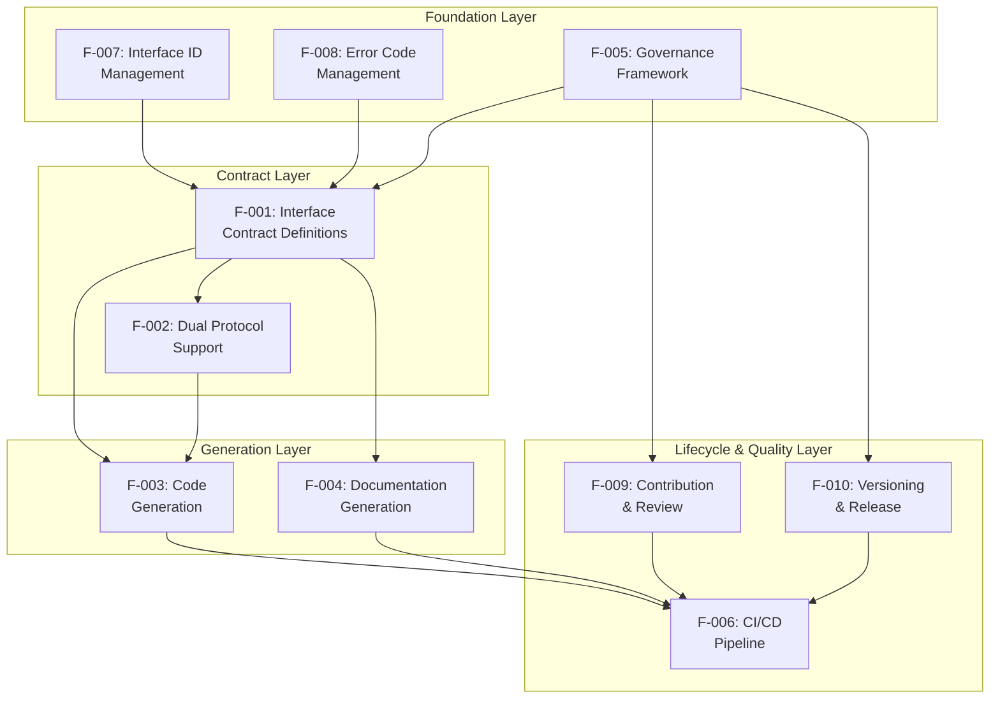
```mermaid
flowchart TD
    subgraph FoundationLayer["Foundation Layer"]
        F005["F-005: Governance<br/>Framework"]
        F007["F-007: Interface ID<br/>Management"]
        F008["F-008: Error Code<br/>Management"]
    end

    subgraph ContractLayer["Contract Layer"]
        F001["F-001: Interface<br/>Contract Definitions"]
        F002["F-002: Dual Protocol<br/>Support"]
    end

    subgraph GenerationLayer["Generation Layer"]
        F003["F-003: Code<br/>Generation"]
        F004["F-004: Documentation<br/>Generation"]
    end

    subgraph LifecycleLayer["Lifecycle & Quality Layer"]
        F009["F-009: Contribution<br/>& Review"]
        F010["F-010: Versioning<br/>& Release"]
        F006["F-006: CI/CD<br/>Pipeline"]
    end

    F007 --> F001
    F008 --> F001
    F005 --> F001
    F001 --> F002
    F001 --> F003
    F001 --> F004
    F002 --> F003
    F005 --> F009
    F005 --> F010
    F003 --> F006
    F004 --> F006
    F009 --> F006
    F010 --> F006
```

#### Dependency Summary

| Feature | Depends On | Depended On By |
|---|---|---|
| F-001 | F-005, F-007, F-008 | F-002, F-003, F-004 |
| F-002 | F-001 | F-003 |
| F-003 | F-001, F-002 | F-006 |
| F-004 | F-001 | F-006 |
| F-005 | None | F-001, F-009, F-010 |
| F-006 | F-003, F-004, F-009, F-010 | None |
| F-007 | None | F-001 |
| F-008 | None | F-001 |
| F-009 | F-005 | F-006 |
| F-010 | F-005 | F-006 |

### 2.3.2 Integration Points

The repository's features integrate with external systems through well-defined integration boundaries. The following table documents the integration points that are clearly evidenced in the codebase.

| Integration Point | Mechanism | Features Involved |
|---|---|---|
| Thunder Framework | Build dependency via `find_package(WPEFramework)` | F-001, F-002, F-003 |
| ThunderTools | Code gen tools: ProxyStubGenerator, JsonGenerator | F-003 |
| Thunder Core/COM Libraries | Link dependency: `${NAMESPACE}Core`, `${NAMESPACE}COM` | F-003 |
| GitHub Actions | CI/CD workflow event triggers | F-006, F-009 |
| FOSSID | Security/license diff scan integration | F-006 |
| `rdkcentral/cmf-actions` | CLA enforcement reusable workflow | F-006, F-009 |
| Docsify | Static site rendering for generated docs | F-004 |
| Downstream Plugin Repos | Build-time API header consumption | F-001, F-003 |
| `auto-changelog` | Automated changelog generation | F-010 |
| `git-flow` | Release branching strategy | F-010 |

### 2.3.3 Shared Components and Common Services

Several repository artifacts are shared across multiple features, forming common infrastructure.

| Shared Component | Location | Consumed By |
|---|---|---|
| Interface ID Registry | `apis/Ids.h` | F-001, F-003, F-007 |
| Framework Module Wiring | `apis/Module.h` | F-001, F-003 |
| Custom Error Codes | `apis/entservices_errorcodes.h` | F-001, F-008 |
| Common JSON Schema | `apis/common.json` | F-003, F-004 |
| Portability Macros | `apis/Portability.h` | F-001, F-003 |
| Shared Definitions Header | `apis/definitions.h` | F-001, F-003 |
| Documentation Sidebar | `docs/_sidebar.md` | F-004 |

---

## 2.4 Implementation Considerations

### 2.4.1 Technical Constraints

The following technical constraints are derived from repository governance documents, build configurations, and architectural design decisions.

| Constraint | Impact | Source |
|---|---|---|
| IDs in `apis/Ids.h` are permanently assigned | Prevents ABI breakage; IDs cannot be reused or reassigned | `apis/Ids.h` (lines 25-29) |
| Custom error code range limited to 100 | Constrains the total number of service-specific errors | `apis/entservices_errorcodes.h` |
| Contract-only repository | No implementation code belongs here; only interfaces | `governance.md` (line 42) |
| C++11 standard required | Limits language features to C++11 compatibility | `CMakeLists.txt` |
| CMake ≥ 3.12 for Marshalling | Build environment minimum requirement | `CMakeLists.txt` |
| Thunder R4_4 branch compatibility | Build validation tied to specific Thunder branch | `.github/workflows/Build_entservices-apis_on_Ubuntu.yml` |

### 2.4.2 Performance Requirements

Performance considerations for a contract-only repository are primarily concerned with build-time and toolchain efficiency rather than runtime behavior.

| Requirement | Detail | Source |
|---|---|---|
| Scalable API Design | APIs SHALL be designed to scale efficiently both functionally and performance-wise | `governance.md` (line 22) |
| COM-RPC for inter-plugin calls | COM-RPC is mandatory for service-to-service communication due to lower overhead | `README.md` (line 151) |
| JSON-RPC for apps only | JSON-RPC overhead is acceptable only for application-to-service calls | `README.md` (line 151) |
| Incremental CI validation | Changed-file-only validation for faster PR feedback | `Validate_Interface_headers_incremental.yml` |

### 2.4.3 Scalability Considerations

The repository must accommodate a growing catalog of service interfaces while maintaining governance consistency and build reliability.

| Consideration | Approach | Evidence |
|---|---|---|
| Service catalog growth | 63+ services currently; modular directory structure (`apis/<ServiceName>/`) supports unlimited additions | `apis/` directory structure |
| ID space management | 16-ID blocks per service group; range 0x000–0x510+ with room for expansion | `apis/Ids.h` |
| Error code headroom | 100-code range with 5 currently defined; ample room for growth | `apis/entservices_errorcodes.h` |
| Documentation scaling | Auto-generation pipeline handles all 64+ documented services | `tools/md_generator/`, `docs/_sidebar.md` |
| Build scalability | Glob patterns (`./apis/*/I*.h`) automatically include new services | `CMakeLists.txt` |

### 2.4.4 Security Implications

Security is addressed at multiple levels across the feature set, though the actual runtime security implementation (token management, access control) resides in the Thunder framework's SecurityAgent plugin and is out of scope for this contract-only repository.

| Security Measure | Feature | Implementation |
|---|---|---|
| CLA Enforcement | F-006, F-009 | `cla.yml` via `rdkcentral/cmf-actions` |
| License Scanning | F-006 | FOSSID diff scan on PRs |
| BlackDuck Scanning | F-006 | Triggered on PR submission |
| Copyright Verification | F-006 | Automated CI check |
| Apache 2.0 Compliance | F-001 | License header required on all files |
| Secure API Design | F-005 | APIs consider robust security mechanisms where needed |

### 2.4.5 Maintenance Requirements

Ongoing maintenance of the API contract repository requires adherence to established processes and toolchain capabilities.

| Requirement | Detail | Source |
|---|---|---|
| Backward compatibility | Non-breaking changes (minor/patch) must not require consumer modifications | `governance.md` |
| Deprecation process | `@deprecated` tag in headers or `["deprecated"]` label in JSON before removal | `governance.md`, `README.md` |
| Review cadences | Monthly Strategic, Weekly Tactical, Impromptu Emergency, Annual Policy Review | `governance.md` (lines 147-192) |
| Documentation currency | Auto-generated docs updated on every API change | `generate_doc.yml` |
| Changelog maintenance | Automated via `auto-changelog`; immutable once released | `component-release.yml`, `CHANGELOG.md` |
| Code ownership | `@rdkcentral/rdkservices-apis-maintainers` team via `.github/CODEOWNERS` | `.github/CODEOWNERS` |

---

## 2.5 Requirements Traceability Matrix

The following matrix maps each feature and its requirements to the source evidence and validation method, ensuring complete traceability from requirement to implementation.

### 2.5.1 Feature-to-Source Traceability

| Feature ID | Primary Source | Validation Method |
|---|---|---|
| F-001 | `apis/` (63+ subdirectories), `apis/DeviceInfo/IDeviceInfo.h` | Header compliance CI, code review |
| F-002 | `governance.md` (lines 47-48, 64-73), `README.md` (lines 62-67) | Header validation scripts |
| F-003 | `CMakeLists.txt`, `build/CMakeLists.txt` | Ubuntu build CI workflow |
| F-004 | `tools/md_generator/`, `docs/_sidebar.md` | `generate_doc.yml` CI workflow |
| F-005 | `governance.md` (203 lines) | Review process, header validation |
| F-006 | `.github/workflows/` (7 YAML files) | GitHub Actions execution logs |
| F-007 | `apis/Ids.h` (364 lines) | Code review, uniqueness validation |
| F-008 | `apis/entservices_errorcodes.h` (48 lines) | Code review, compile-time validation |
| F-009 | `README.md` (lines 30-53), `governance.md` (lines 147-192) | CLA workflow, PR review process |
| F-010 | `governance.md` (lines 167-176), `CHANGELOG.md` | `component-release.yml` automation |

### 2.5.2 Requirement-to-Specification Cross-Reference

| Requirement ID | Tech Spec Section | Governance Reference |
|---|---|---|
| F-001-RQ-001 through RQ-006 | Section 1.2.2 (Core Technical Approach) | `governance.md` lines 41-99 |
| F-002-RQ-001 through RQ-005 | Section 1.2.2 (Dual-Protocol Support) | `governance.md` lines 64-73 |
| F-003-RQ-001 through RQ-005 | Section 1.2.2 (Automated Code Generation) | `CMakeLists.txt`, `build/CMakeLists.txt` |
| F-004-RQ-001 through RQ-005 | Section 1.3.1.1 (Automated Code and Doc Gen) | `README.md` lines 68-127 |
| F-005-RQ-001 through RQ-005 | Section 1.2.3 (Success Criteria — Consistency) | `governance.md` lines 16-99 |
| F-006-RQ-001 through RQ-005 | Section 1.3.1.3 (CI/CD Validation Workflow) | `.github/workflows/` |
| F-007-RQ-001 through RQ-004 | Section 1.2.2 (Core Technical Approach) | `apis/Ids.h` lines 25-29 |
| F-008-RQ-001 through RQ-004 | Section 1.3.1.1 (Shared Infrastructure Files) | `apis/entservices_errorcodes.h` |
| F-009-RQ-001 through RQ-005 | Section 1.3.1.3 (API Proposal Workflow) | `governance.md` lines 147-165 |
| F-010-RQ-001 through RQ-005 | Section 1.2.3 (Maintainability KPI) | `governance.md` lines 167-176 |

### 2.5.3 Feature-to-Service Domain Coverage

The following matrix maps features to the six API service domains defined in Section 1.3.1.2, showing which features apply to each domain.

| Domain | F-001 | F-002 | F-003 |
|---|---|---|---|
| Browser / App Lifecycle (~14) | ✓ | ✓ | ✓ |
| Media & Playback (~18) | ✓ | ✓ | ✓ |
| Device & Platform Info (~10) | ✓ | ✓ | ✓ |
| Storage / Telemetry / Security (~8) | ✓ | ✓ | ✓ |
| Browser / Compositor / Runtime (~8) | ✓ | ✓ | ✓ |
| Analytics & Updates (~5) | ✓ | ✓ | ✓ |

| Domain | F-004 | F-005 | F-006 |
|---|---|---|---|
| Browser / App Lifecycle (~14) | ✓ | ✓ | ✓ |
| Media & Playback (~18) | ✓ | ✓ | ✓ |
| Device & Platform Info (~10) | ✓ | ✓ | ✓ |
| Storage / Telemetry / Security (~8) | ✓ | ✓ | ✓ |
| Browser / Compositor / Runtime (~8) | ✓ | ✓ | ✓ |
| Analytics & Updates (~5) | ✓ | ✓ | ✓ |

> **Note**: Features F-007 through F-010 are cross-cutting infrastructure and process features that apply universally to all service domains. They are not domain-specific and therefore are not mapped individually.

---

## 2.6 Assumptions and Constraints

### 2.6.1 Assumptions

| ID | Assumption | Impact |
|---|---|---|
| A-001 | Thunder Framework R4_4 branch remains the target build baseline | Build validation workflows depend on this branch |
| A-002 | Downstream plugin repositories correctly consume generated headers | API utility depends on proper downstream integration |
| A-003 | Contributors sign the CLA before submitting PRs | Legal compliance depends on CLA workflow functioning |
| A-004 | Python 3.5+ is available in all CI/CD environments | Documentation generation requires this runtime |
| A-005 | The `ID_ENTOS_OFFSET` base value remains stable in the Thunder framework | All interface IDs derive from this offset |

### 2.6.2 Constraints

| ID | Constraint | Rationale |
|---|---|---|
| C-001 | No implementation code in this repository | Architectural separation of contracts from implementations |
| C-002 | Interface IDs are immutable once assigned | ABI stability across firmware versions |
| C-003 | Maximum 100 custom error codes | JSON-RPC implementation-defined range limitation |
| C-004 | Plugin versioning is out of scope | API version and plugin version are independent |
| C-005 | Security enforcement is delegated to Thunder SecurityAgent | This repository defines contracts, not runtime security |

---

## 2.7 References

#### Files Examined

- `governance.md` — Complete API governance model (203 lines): naming conventions, versioning, review processes, deprecation policy
- `README.md` — Project overview, contribution guidelines, documentation generation instructions, coding guidelines (180 lines)
- `CMakeLists.txt` (root) — Marshalling component build configuration: project version 4.4.1, CMake ≥ 3.12, C++11
- `build/CMakeLists.txt` — Definitions component build configuration: JsonGenerator integration, CMake ≥ 3.3
- `apis/Ids.h` — Fixed numeric identifier registry for COM-RPC interface resolution (364 lines)
- `apis/entservices_errorcodes.h` — Custom error codes using X-macro pattern (48 lines)
- `apis/Module.h` — Framework module wiring primitives shared by all interface headers
- `apis/Portability.h` — Cross-compiler portability macros
- `apis/definitions.h` — Shared header definitions
- `apis/common.json` — Shared JSON schema definitions
- `apis/DeviceInfo/IDeviceInfo.h` — Representative interface header: device identity, capabilities, HDCP, EDID
- `apis/AppManager/IAppManager.h` — Representative interface: app lifecycle states, launch/preload/terminate
- `apis/PersistentStore/` — Multi-interface service: IStore, IStore2, IStoreCache with namespaced key/value storage
- `apis/PlayerInfo/` — Multi-header service: IDolby.h, IPlayerInfo.h, PlayerInfo.json
- `apis/HdmiCecSink/IHdmiCecSink.h` — HDMI-CEC sink operations, ARC lifecycle, notification callbacks
- `apis/OpenCDMi/` — DRM/CDM interfaces: session, key, and content decryption management
- `docs/_sidebar.md` — Full API reference navigation (64 documented service entries)
- `CHANGELOG.md` — Automated version history (3.0.0 through 3.5.0)
- `.github/CODEOWNERS` — Code ownership: `@rdkcentral/rdkservices-apis-maintainers`

#### Folders Examined

- `apis/` — 7 shared support files + 68 service subdirectories containing interface definitions
- `build/` — Definitions component build configuration
- `docs/` — Docsify-based static documentation site
- `tools/md_generator/` — Header-to-Markdown and JSON-to-Markdown generation pipelines
- `.github/workflows/` — 7 CI/CD workflow definitions + 2 Python validation scripts

#### CI/CD Workflows Examined

- `.github/workflows/Build_entservices-apis_on_Ubuntu.yml` — Ubuntu build validation against Thunder R4_4
- `.github/workflows/Validate_Interface_headers.yml` — Full interface header compliance check
- `.github/workflows/Validate_Interface_headers_incremental.yml` — Incremental header validation
- `.github/workflows/cla.yml` — CLA enforcement via `rdkcentral/cmf-actions`
- `.github/workflows/component-release.yml` — Automated release with git-flow and auto-changelog
- `.github/workflows/fossid_integration_stateless_diffscan_target_repo.yml` — FOSSID security/license scanning
- `.github/workflows/generate_doc.yml` — Documentation auto-generation and commit

#### Cross-Referenced Tech Spec Sections

- Section 1.1 — Executive Summary: project overview, stakeholders, value proposition
- Section 1.2 — System Overview: architecture, components, technology stack, success criteria
- Section 1.3 — Scope: in-scope features, service domains, workflows, device types, out-of-scope items
- Section 1.4 — Document Conventions and Terminology: key terms, reference documents

#### Web Sources

- [rdkcentral/entservices-apis (GitHub)](https://github.com/rdkcentral/entservices-apis) — Source repository and README
- [rdkcentral/Thunder (GitHub)](https://github.com/rdkcentral/Thunder) — Thunder framework documentation
- [RDK Documentation Portal](https://developer.rdkcentral.com) — RDK Entertainment platform documentation
- [RDK Central Wiki — Thunder Security](https://wiki.rdkcentral.com/display/RDK/Thunder+Security) — Thunder SecurityAgent access control

# 3. Technology Stack

The Entertainment Services APIs repository (`rdkcentral/entservices-apis`) is a **contract-only interface definition repository** — not a traditional application. Its technology stack is purpose-built around three primary concerns: (1) defining C++ interface contracts for RDK entertainment services, (2) generating proxy/stub and JSON-RPC binding code from those contracts, and (3) automating documentation, validation, and release workflows. As a result, many components from a typical web or mobile application stack (e.g., backend frameworks, databases, frontend SPA frameworks, containerization, cloud infrastructure) are not applicable and are intentionally excluded from this section.

The following diagram illustrates the technology stack layers and their interdependencies:

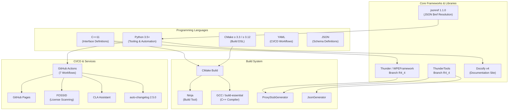
```mermaid
flowchart TB
    subgraph Languages["Programming Languages"]
        CPP["C++11<br/>(Interface Definitions)"]
        Python["Python 3.5+<br/>(Tooling & Automation)"]
        CMakeLang["CMake ≥ 3.3 / ≥ 3.12<br/>(Build DSL)"]
        YAML["YAML<br/>(CI/CD Workflows)"]
        JSON["JSON<br/>(Schema Definitions)"]
    end

    subgraph Frameworks["Core Frameworks & Libraries"]
        Thunder["Thunder / WPEFramework<br/>Branch R4_4"]
        ThunderTools["ThunderTools<br/>Branch R4_4"]
        Docsify["Docsify v4<br/>(Documentation Site)"]
        JsonRef["jsonref 1.1.0<br/>(JSON $ref Resolution)"]
    end

    subgraph BuildSystem["Build System"]
        CMakeBuild["CMake Build"]
        Ninja["Ninja<br/>(Build Tool)"]
        GCC["GCC / build-essential<br/>(C++ Compiler)"]
        PSG["ProxyStubGenerator"]
        JG["JsonGenerator"]
    end

    subgraph CICD["CI/CD & Services"]
        GHA["GitHub Actions<br/>(7 Workflows)"]
        GHPages["GitHub Pages"]
        FOSSID["FOSSID<br/>(License Scanning)"]
        CLA["CLA Assistant"]
        AutoCL["auto-changelog 2.5.0"]
    end

    CPP --> Thunder
    CPP --> CMakeBuild
    Python --> Docsify
    Python --> GHA
    CMakeLang --> CMakeBuild
    Thunder --> PSG
    ThunderTools --> PSG
    ThunderTools --> JG
    CMakeBuild --> Ninja
    CMakeBuild --> GCC
    GHA --> FOSSID
    GHA --> CLA
    GHA --> AutoCL
    GHA --> GHPages
    JsonRef --> Python
```

## 3.1 Programming Languages

The repository employs a focused set of languages, each serving a distinct role within the interface definition, build, documentation, and CI/CD layers.

### 3.1.1 C++ — Interface Definition Language

C++ serves as the primary language for all API interface definitions, functioning as a de facto Interface Definition Language (IDL) through annotated header files.

| Attribute | Detail | Evidence |
|---|---|---|
| **Standard** | C++11 (strictly enforced) | `CMakeLists.txt` — `CXX_STANDARD 11`, `CXX_STANDARD_REQUIRED YES` |
| **Purpose** | API contract definitions for 63+ entertainment services | `apis/` directory (63+ service subdirectories) |
| **Namespace** | `WPEFramework::Exchange` | All interface headers (e.g., `apis/DeviceInfo/IDeviceInfo.h`) |
| **Base Class** | `Core::IUnknown` (COM-style inheritance) | All interface headers |
| **Return Types** | `Core::hresult` mandated for all methods | `governance.md`, validation scripts |

#### Selection Justification

C++ was chosen as the IDL because the Thunder framework, which hosts all entertainment service plugins, is itself written in C++11, designed specifically for embedded platforms including ARM and MIPS-based devices. Using annotated C++ headers as the interface definition source allows direct compilation against Thunder's core libraries for COM-RPC proxy/stub generation while simultaneously supporting JSON-RPC binding generation through annotation tags (`@json`, `@text`, `@property`, `@event`). This dual-protocol-from-single-source approach eliminates interface drift between COM-RPC and JSON-RPC representations.

#### Cross-Compiler Portability

The shared header `apis/Portability.h` provides compiler abstraction macros to ensure interface definitions compile consistently across toolchains:

| Compiler | Detection Macro | Supported Features |
|---|---|---|
| **GCC** (≥ 4.x) | `__GNUC__` | `__attribute__` directives, diagnostic pragmas |
| **Clang** | `clang diagnostic` | Pragma-based warning suppression |
| **MSVC / Windows** | `__pragma` | Warning code suppression (4127, 4200, 4251, etc.) |

Portability abstractions provided include `DEPRECATED`, `VARIABLE_IS_NOT_USED`, `WARNING_RESULT_NOT_USED`, `PUSH_WARNING`, and `POP_WARNING`, ensuring that interface headers produce clean builds regardless of the target compiler.

### 3.1.2 Python — Tooling and Automation

Python is the scripting language for all documentation generation, interface validation, and CI/CD orchestration tasks.

| Attribute | Detail | Evidence |
|---|---|---|
| **Minimum Version** | 3.5+ (general); 3.8.10+ (recommended for `h2md` pipeline) | `README.md`; `tools/md_generator/h2md/README.md` |
| **CI/CD Version** | `python-version: '3.x'` (latest Python 3.x on `ubuntu-latest`) | `.github/workflows/generate_doc.yml`, `.github/workflows/Validate_Interface_headers.yml` |

#### Key Python Use Cases

1. **Documentation Generation Pipeline** (`tools/md_generator/`): Orchestrates header-to-Markdown (`h2md`) and JSON-to-Markdown (`json2md`) conversion, sidebar maintenance, and incremental generation.
2. **Interface Header Validation** (`.github/workflows/validate_interface_headers.py`, `validate_interface_headers_incremental.py`): Regex-driven parsing and compliance checking of PascalCase naming, camelCase annotations, parameter naming, enum casing (`ALL_UPPER_SNAKE_CASE`), `Core::hresult` return types, and ID registry consistency.
3. **CI/CD Workflow Scripting**: Inline Python invocations within GitHub Actions workflows for build validation, file filtering, and PR commenting.

#### Standard Library Modules Used

The Python tooling relies exclusively on the standard library (plus one third-party package), using: `os`, `re`, `glob`, `shutil`, `time`, `sys`, `argparse`, `json`, and `subprocess`.

#### Selection Justification

Python's extensive standard library for text processing, file system operations, and regular expression parsing makes it well-suited for the code generation and validation tasks that dominate the toolchain. The low barrier to entry supports contributions from the broad RDK community, and its universal availability on CI/CD runners eliminates environment setup complexity.

### 3.1.3 CMake — Build System DSL

CMake serves as the build system configuration language, orchestrating code generation and compilation.

| Attribute | Detail | Evidence |
|---|---|---|
| **Minimum Version (Marshalling)** | ≥ 3.12 | `CMakeLists.txt`, line 18 |
| **Minimum Version (Definitions)** | ≥ 3.3 | `build/CMakeLists.txt`, line 18 |
| **Build Generator** | Ninja (`-G Ninja` in CI) | `.github/workflows/Build_entservices-apis_on_Ubuntu.yml` |

CMake provides the declarative configuration for two distinct build components: the **Marshalling** library (COM-RPC proxy/stub generation) and the **Definitions** library (JSON-RPC binding generation). Both leverage CMake functions provided by the ThunderTools package (`ProxyStubGenerator()`, `JsonGenerator()`) to transform interface headers and JSON schemas into compiled artifacts.

### 3.1.4 Supporting Languages

Several additional languages serve narrowly scoped roles within the repository:

| Language | Purpose | Evidence |
|---|---|---|
| **YAML** | CI/CD workflow definitions (7 GitHub Actions workflows) | `.github/workflows/*.yml` |
| **JSON** | JSON-RPC schema definitions, plugin documentation catalog, validation schemas | `apis/*/*.json`, `tools/md_generator/json/`, `tools/md_generator/json2md/schemas/` |
| **HTML / CSS** | Docsify documentation site bootstrap (single-page application shell) | `docs/index.html` |
| **Bash / Shell** | Inline CI/CD scripting for build orchestration, file filtering, git operations | GitHub Actions workflow `run:` blocks |
| **Markdown** | API reference documentation content, governance documents | `docs/*.md`, `README.md`, `governance.md` |

## 3.2 Frameworks and Libraries

### 3.2.1 Thunder Framework (WPEFramework)

Thunder is the foundational runtime framework against which all Entertainment Services API interfaces are defined and compiled.

| Attribute | Detail |
|---|---|
| **Full Name** | Thunder (a.k.a. WPEFramework) |
| **Source Repository** | `https://github.com/rdkcentral/Thunder.git` |
| **Pinned Branch** | R4_4 |
| **License** | Apache License 2.0 |
| **Language** | C++11 |
| **Maintainer** | Metrological (a Comcast company) / RDK Central |

#### CMake Packages Consumed

The `entservices-apis` build configurations consume the following Thunder CMake packages:

| Package | Required | Purpose |
|---|---|---|
| `${NAMESPACE}Core` | Yes | Core utility library (string handling, containers, threading) |
| `${NAMESPACE}COM` | Yes | COM-RPC communication framework |
| `CompileSettingsDebug` | Yes | Compile-time debug configuration and flags |
| `${NAMESPACE}PrivilegedRequest` | No (QUIET) | Privileged request handling (optional component) |

#### Headers Consumed

Interface definitions include Thunder headers for framework integration: `<core/core.h>`, `<plugins/IPlugin.h>`, `<plugins/ISubSystem.h>`, `<plugins/IShell.h>`, `<plugins/IStateControl.h>`, and `<com/IIteratorType.h>`, as evidenced by `apis/Module.h`.

#### Selection Justification

Thunder is the mandated plugin hosting framework for the RDK entertainment middleware stack. As an open-source, plugin-based device abstraction layer written in C++11, it provides the COM-RPC and JSON-RPC runtime infrastructure that the `entservices-apis` interface definitions target. The R4_4 branch is specifically pinned in CI/CD to ensure build validation against a stable, QA-tested release train. The Thunder tags on GitHub show that the R4_4 release line includes versions R4.4.1 (November 2023) through R4.4.4 (June 2025), confirming it as an actively maintained Long-Term Support branch.

#### Build Patches

Custom patches from the `.github/Patches/` directory are applied during CI builds to ensure compatibility:
- `1004-Add-support-for-project-dir.patch` — Applied to Thunder
- `00010-R4.4-Add-support-for-project-dir.patch` — Applied to ThunderTools

### 3.2.2 ThunderTools (Code Generation Framework)

ThunderTools provides the automated code generation capabilities that transform interface headers into protocol-specific binding code.

| Attribute | Detail |
|---|---|
| **Source Repository** | `https://github.com/rdkcentral/ThunderTools.git` |
| **Pinned Branch** | R4_4 |
| **License** | Apache License 2.0 |

#### Code Generators Provided

| Generator | Input | Output | Build Config |
|---|---|---|---|
| `ProxyStubGenerator` | C++ interface headers (`./apis/*/I*.h`) | COM-RPC proxy/stub source files (`ProxyStubs*.cpp`) | Root `CMakeLists.txt` (Marshalling) |
| `JsonGenerator` | C++ headers + JSON schemas (`./apis/*/*.json`) | JSON-RPC binding code and headers | `build/CMakeLists.txt` (Definitions) |

#### Selection Justification

ThunderTools is the official companion toolset to the Thunder framework, providing purpose-built code generators that understand the annotated C++ header format used by `entservices-apis`. Using `ProxyStubGenerator` and `JsonGenerator` ensures that generated artifacts remain perfectly synchronized with the Thunder runtime's expectations, eliminating compatibility risks from third-party or custom generators.

### 3.2.3 Docsify (Documentation Framework)

Docsify provides the static documentation site framework for the API reference portal.

| Attribute | Detail | Evidence |
|---|---|---|
| **Version** | v4 (CDN semver range: `@4`, resolving to latest 4.x, currently 4.13.1) | `docs/index.html`, line 47 |
| **Delivery** | jsDelivr CDN (`cdn.jsdelivr.net/npm/docsify@4/`) | `docs/index.html` |
| **Hosted At** | `https://rdkcentral.github.io/entservices-apis/` | GitHub Pages |
| **Local Preview** | `docsify serve` on `localhost:3000` | `docs/README.md` |

#### Docsify Configuration

The documentation site is configured in `docs/index.html` with the following settings:

| Setting | Value | Purpose |
|---|---|---|
| `coverpage` | `true` | Enables cover page (`_coverpage.md`) |
| `loadSidebar` | `_sidebar.md` | Custom sidebar navigation (64 documented services) |
| `auto2top` | `true` | Auto-scroll to top on page navigation |
| `search.maxAge` | 86400000 (24 hours) | Search index cache duration |
| `search.depth` | 6 | Heading depth for search indexing |

#### Docsify Plugins

| Plugin | CDN Version | Purpose |
|---|---|---|
| `docsify-themeable` | `@0` | Theming engine (`theme-simple.css`, `defaults.css`) |
| `docsify-tabs` | `@1` | Tabbed content component support |
| `docsify-copy-code` | `@2` | Code block copy-to-clipboard buttons |
| `docsify-pagination` | `@2` | Page-level navigation controls |
| `docsify/plugins/search.js` | `@4` | Built-in full-text search |
| `docsify/plugins/external-script.min.js` | `@4` | External script embedding |
| `docsify/plugins/ga.min.js` | `@4` | Google Analytics integration |
| `docsify/plugins/zoom-image.min.js` | `@4` | Image zoom functionality |
| `prismjs` (Bash) | `@1` | Bash syntax highlighting for code blocks |

#### Selection Justification

Docsify was selected because it generates documentation sites directly from Markdown files without a build step, aligning perfectly with the auto-generated Markdown output of the `h2md` and `json2md` documentation pipelines. Its zero-build architecture simplifies the CI/CD integration — generated Markdown files are committed to the `docs/` directory and immediately served by GitHub Pages without a compilation or rendering step.

### 3.2.4 Supporting Libraries

| Library | Version | Language | Purpose | Evidence |
|---|---|---|---|---|
| **jsonref** | 1.1.0 (latest via `pip install jsonref`) | Python | Automatic dereferencing of JSON `$ref` objects in API schema definitions | `tools/md_generator/json2md/generator_json.py`; `README.md` |

The `jsonref` library is the sole third-party Python dependency. It is MIT-licensed and supports Python 3.7+. It resolves `$ref` references within the JSON-RPC schema files (`apis/*/*.json`) during the JSON-to-Markdown documentation generation pipeline, enabling the `json2md` generator to produce fully resolved API reference documentation from modular schema definitions.

## 3.3 Open Source Dependencies

The repository maintains a minimal dependency footprint with no `package.json`, `requirements.txt`, or `Pipfile` — all dependencies are installed inline within CI/CD workflows or documented in `README.md`.

### 3.3.1 Build-Time Dependencies

These dependencies are required for compiling the Marshalling and Definitions libraries:

| Dependency | Source | Version / Branch | License | Purpose |
|---|---|---|---|---|
| Thunder (WPEFramework) | `github.com/rdkcentral/Thunder.git` | Branch R4_4 | Apache 2.0 | Core framework libraries (`${NAMESPACE}Core`, `${NAMESPACE}COM`) |
| ThunderTools | `github.com/rdkcentral/ThunderTools.git` | Branch R4_4 | Apache 2.0 | Code generators (`ProxyStubGenerator`, `JsonGenerator`) |
| CMake | System package (`apt`) | ≥ 3.3 (Definitions) / ≥ 3.12 (Marshalling) | BSD 3-Clause | Build system configuration |
| Ninja | System package (`ninja-build`) | Latest via `apt` on `ubuntu-latest` | Apache 2.0 | Fast parallel build tool |
| GCC / build-essential | System package (`apt`) | Latest via `apt` on `ubuntu-latest` | GPL | C++ compiler toolchain |
| Git | System package (`apt`) | Latest via `apt` on `ubuntu-latest` | GPL v2 | Source control and submodule management |

### 3.3.2 Python Dependencies

| Dependency | Version | License | Installation | Purpose |
|---|---|---|---|---|
| **jsonref** | 1.1.0 (latest) | MIT | `pip install jsonref` | JSON `$ref` resolution for `json2md` documentation generation |
| **Python Standard Library** | Bundled with Python 3.5+ / 3.8.10+ | PSF | Built-in | `os`, `re`, `glob`, `shutil`, `sys`, `json`, `argparse`, `time`, `subprocess` |

### 3.3.3 Documentation Site Dependencies (CDN-Delivered)

All JavaScript dependencies for the documentation site are served via the jsDelivr CDN, requiring no local installation or package management:

| Dependency | CDN Semver | Resolved Latest | License | Purpose |
|---|---|---|---|---|
| docsify | `@4` | 4.13.1 | MIT | Documentation site runtime engine |
| docsify-themeable | `@0` | 0.x | MIT | Theme management (`theme-simple`) |
| docsify-tabs | `@1` | 1.x | MIT | Tabbed content support |
| docsify-copy-code | `@2` | 2.x | MIT | Code copy functionality |
| docsify-pagination | `@2` | 2.x | MIT | Page navigation |
| prismjs (bash component) | `@1` | 1.x | MIT | Bash syntax highlighting |

### 3.3.4 Release Pipeline Dependencies

| Dependency | Installation | Version | License | Purpose |
|---|---|---|---|---|
| **auto-changelog** | `npm install -g auto-changelog` | 2.5.0 (latest) | MIT | Automated changelog generation from git tags and commit history |
| **git-flow** | `apt-get install -y git-flow` | Latest via `apt` | LGPL | Git-flow branching model for release orchestration |

#### Security Considerations for Dependencies

- All CDN-delivered JavaScript resources use the jsDelivr CDN with semver range pinning (e.g., `@4`, `@0`, `@1`, `@2`), which limits exposure to breaking changes while still receiving patch-level security fixes within the pinned major version.
- The `jsonref` library has been scanned for known vulnerabilities and has no reported issues. The Thunder and ThunderTools repositories are both open-source, Apache 2.0 licensed, and maintained by Metrological / RDK Central with active security review processes.
- FOSSID and BlackDuck scanning (see Section 3.4.3) provide ongoing license compliance and vulnerability detection for all repository contributions.

## 3.4 Third-Party Services

### 3.4.1 GitHub Platform Services

The repository relies on GitHub as its primary hosting, CI/CD, and documentation publishing platform:

| Service | Purpose | Evidence |
|---|---|---|
| **GitHub Repository Hosting** | Source control for all interface definitions, tooling, and CI/CD configurations | `github.com/rdkcentral/entservices-apis` |
| **GitHub Actions** | CI/CD execution platform for all 7 automated workflows | `.github/workflows/` (7 YAML definitions) |
| **GitHub Pages** | Static hosting for the Docsify API reference documentation | `https://rdkcentral.github.io/entservices-apis/` |
| **GitHub Pull Requests** | Code review, automated checks, and contribution workflow | `README.md`, `governance.md` |
| **GitHub Issues** | Defect tracking and feature requests | Referenced in contribution guidelines |

#### GitHub Actions Versions Used

The workflows consume the following official and community GitHub Actions:

| Action | Version | Workflow(s) |
|---|---|---|
| `actions/checkout` | `@v4` | Build, documentation generation |
| `actions/checkout` | `@v3` | Release pipeline |
| `actions/checkout` | `@v2` | Validation workflows |
| `actions/setup-python` | `@v5` | Documentation generation |
| `actions/setup-python` | `@v2` | Validation workflows |
| `actions/github-script` | `@v7` | PR commenting (documentation generation) |

### 3.4.2 Reusable External Workflows

The repository delegates specialized compliance checks to reusable workflows maintained by the broader RDK Central organization:

| Workflow | Source Repository | Version | Purpose |
|---|---|---|---|
| **CLA Enforcement** | `rdkcentral/cmf-actions/.github/workflows/cla.yml` | `@v1` | Contributor License Agreement verification |
| **FOSSID Diff Scan** | `rdkcentral/build_tools_workflows/.github/workflows/fossid_integration_stateless_diffscan.yml` | `@1.0.0` | Open source license and security scanning |

### 3.4.3 Security and Compliance Services

Three external security and compliance services are integrated into the CI/CD pipeline to protect the integrity of the API contract repository:

| Service | Integration Method | Trigger | Purpose |
|---|---|---|---|
| **FOSSID** | Reusable GitHub Actions workflow | PR opened/synchronized/reopened (non-fork) | Stateless diff scanning for open-source license compliance and security vulnerabilities |
| **BlackDuck** | Automated check on PR submission | PR events | Software composition analysis and vulnerability scanning |
| **CLA Assistant** | Reusable GitHub Actions workflow via `CLA_ASSISTANT` secret | Issue comments + PR events | Legal compliance: ensures all contributors have signed the Contributor License Agreement |

#### Required Secrets for Security Services

| Secret Name | Service | Purpose |
|---|---|---|
| `FOSSID_CONTAINER_USERNAME` | FOSSID | Container registry authentication |
| `FOSSID_CONTAINER_PASSWORD` | FOSSID | Container registry authentication |
| `FOSSID_HOST_USERNAME` | FOSSID | Host-level authentication |
| `FOSSID_HOST_TOKEN` | FOSSID | API access token |
| `CLA_ASSISTANT` | CLA Assistant | CLA verification token |

### 3.4.4 Content Delivery and Analytics

| Service | Purpose | Evidence |
|---|---|---|
| **jsDelivr CDN** (`cdn.jsdelivr.net`) | Delivery of all Docsify framework, plugin, and theme resources | `docs/index.html` (all `<script>` and `<link>` tags) |
| **Google Analytics** | Usage analytics for the documentation site | `docsify@4/lib/plugins/ga.min.js` in `docs/index.html` |

## 3.5 Databases and Storage

This section is intentionally brief because the `entservices-apis` repository is a **contract-only** repository containing interface definitions — it does not implement any runtime services, data persistence, or state management.

### 3.5.1 Applicability Assessment

| Storage Category | Applicable? | Rationale |
|---|---|---|
| Primary Database | **No** | No runtime application; API contract definitions only |
| Secondary Database | **No** | No data persistence requirements |
| Caching | **No** | No runtime caching; Docsify search uses client-side 24-hour cache |
| Object/File Storage | **No** | No binary artifacts or file storage services |
| Cloud Storage | **No** | No cloud service dependencies |

### 3.5.2 Repository Artifact Storage

While no databases are used, the repository does manage persistent artifacts through the following mechanisms:

| Artifact Type | Storage Mechanism | Location |
|---|---|---|
| C++ interface headers | Git version control | `apis/` (63+ service subdirectories) |
| JSON schema definitions | Git version control | `apis/*/*.json` |
| Generated Markdown documentation | Git version control (auto-committed by CI) | `docs/` |
| Documentation site (published) | GitHub Pages static hosting | `https://rdkcentral.github.io/entservices-apis/` |
| Build artifacts (proxy/stubs, bindings) | Not stored in repository; generated at build-time by consumers | Downstream plugin build environments |

## 3.6 Development and Deployment

### 3.6.1 Development Environment Tools

The following tools constitute the development environment for contributors to the Entertainment Services APIs:

| Tool | Minimum Version | Purpose | Evidence |
|---|---|---|---|
| CMake | ≥ 3.3 (Definitions) / ≥ 3.12 (Marshalling) | Build system configuration and code generation orchestration | `CMakeLists.txt`, `build/CMakeLists.txt` |
| Ninja | Latest | Fast parallel build execution (used via `-G Ninja`) | `.github/workflows/Build_entservices-apis_on_Ubuntu.yml` |
| GCC / build-essential | Latest (on `ubuntu-latest`) | C++11 compiler toolchain | CI build workflow (`apt-get install build-essential`) |
| Python | 3.5+ (general); 3.8.10+ (recommended) | Documentation generation and header validation | `README.md`, `tools/md_generator/h2md/README.md` |
| Git | Latest | Version control, submodule management | All workflows |
| git-flow | Latest (via `apt`) | Git-flow branching model for releases | `component-release.yml` |
| Docsify CLI | Latest (via `npm`) | Local documentation site preview on `localhost:3000` | `docs/README.md` |

### 3.6.2 Build System Architecture

The build system comprises two distinct CMake projects that generate different categories of build artifacts from the same set of interface headers. The relationship between these components is illustrated below:

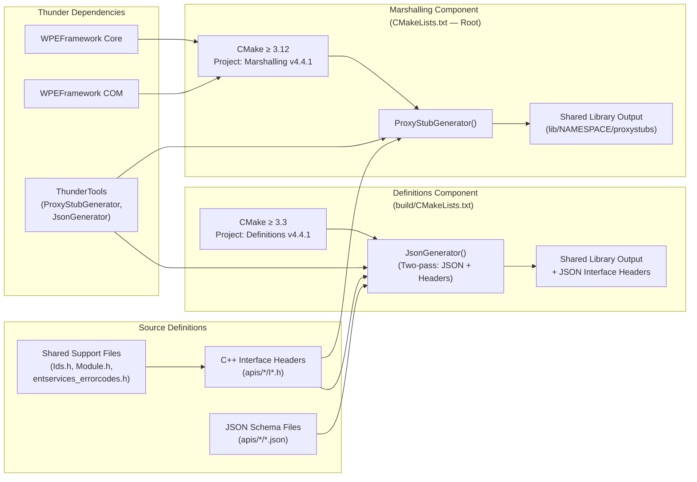
```mermaid
flowchart LR
    subgraph Sources["Source Definitions"]
        Headers["C++ Interface Headers<br/>(apis/*/I*.h)"]
        JSONSchemas["JSON Schema Files<br/>(apis/*/*.json)"]
        SharedHeaders["Shared Support Files<br/>(Ids.h, Module.h,<br/>entservices_errorcodes.h)"]
    end

    subgraph MarshallingBuild["Marshalling Component<br/>(CMakeLists.txt — Root)"]
        MarshalCMake["CMake ≥ 3.12<br/>Project: Marshalling v4.4.1"]
        PSGen["ProxyStubGenerator()"]
        MarshalLib["Shared Library Output<br/>(lib/NAMESPACE/proxystubs)"]
    end

    subgraph DefinitionsBuild["Definitions Component<br/>(build/CMakeLists.txt)"]
        DefCMake["CMake ≥ 3.3<br/>Project: Definitions v4.4.1"]
        JGen["JsonGenerator()<br/>(Two-pass: JSON + Headers)"]
        DefLib["Shared Library Output<br/>+ JSON Interface Headers"]
    end

    subgraph ThunderDeps["Thunder Dependencies"]
        ThunderCore["WPEFramework Core"]
        ThunderCOM["WPEFramework COM"]
        ThunderToolsPkg["ThunderTools<br/>(ProxyStubGenerator,<br/>JsonGenerator)"]
    end

    Headers --> PSGen
    SharedHeaders --> Headers
    Headers --> JGen
    JSONSchemas --> JGen
    MarshalCMake --> PSGen
    PSGen --> MarshalLib
    DefCMake --> JGen
    JGen --> DefLib
    ThunderCore --> MarshalCMake
    ThunderCOM --> MarshalCMake
    ThunderToolsPkg --> PSGen
    ThunderToolsPkg --> JGen
```

#### Marshalling Component (Root `CMakeLists.txt`)

| Attribute | Detail |
|---|---|
| **Project Name** | `Marshalling` |
| **Version** | 4.4.1 |
| **CMake Minimum** | 3.12 |
| **C++ Standard** | C++11 (required) |
| **Input Pattern** | `./apis/*/I*.h` (glob for all interface headers) |
| **Generator** | `ProxyStubGenerator()` CMake function |
| **Output** | Shared library installed to `lib/${NAMESPACE_LIB}/proxystubs` |
| **Headers Installed To** | `include/${NAMESPACE}/interfaces` |
| **Required Packages** | `WPEFramework` (`${NAMESPACE}Core`, `${NAMESPACE}COM`, `CompileSettingsDebug`) |
| **Linked Libraries** | `${NAMESPACE}Core::${NAMESPACE}Core`, `${NAMESPACE}COM::${NAMESPACE}COM` |

#### Definitions Component (`build/CMakeLists.txt`)

| Attribute | Detail |
|---|---|
| **Project Name** | `Definitions` |
| **Version** | 4.4.1 |
| **CMake Minimum** | 3.3 |
| **Input Pattern** | JSON files + interface headers (two-pass generation) |
| **Generator** | `JsonGenerator()` CMake function |
| **Output** | Shared library + JSON-RPC interface headers |
| **Headers Installed To** | `include/${NAMESPACE}/interfaces/json` |
| **Package Publishing** | `InstallPackageConfig()`, `InstallCMakeConfig()` for downstream consumption |

### 3.6.3 CI/CD Pipeline

The repository maintains seven GitHub Actions workflows that collectively provide automated build validation, interface compliance checking, documentation generation, security scanning, license compliance, and release management. All workflows run on the `ubuntu-latest` runner.

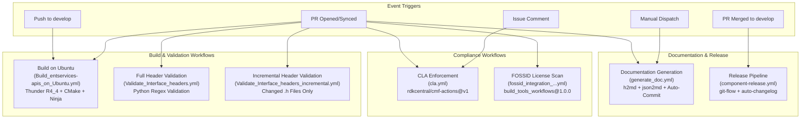
```mermaid
flowchart TB
    subgraph Triggers["Event Triggers"]
        Push["Push to develop"]
        PROpen["PR Opened/Synced"]
        PRMerge["PR Merged to develop"]
        Manual["Manual Dispatch"]
        IssueComment["Issue Comment"]
    end

    subgraph BuildValidation["Build & Validation Workflows"]
        BuildUbuntu["Build on Ubuntu<br/>(Build_entservices-apis_on_Ubuntu.yml)<br/>Thunder R4_4 + CMake + Ninja"]
        ValidateFull["Full Header Validation<br/>(Validate_Interface_headers.yml)<br/>Python Regex Validation"]
        ValidateIncr["Incremental Header Validation<br/>(Validate_Interface_headers_incremental.yml)<br/>Changed .h Files Only"]
    end

    subgraph Compliance["Compliance Workflows"]
        CLAWorkflow["CLA Enforcement<br/>(cla.yml)<br/>rdkcentral/cmf-actions@v1"]
        FOSSIDScan["FOSSID License Scan<br/>(fossid_integration_...yml)<br/>build_tools_workflows@1.0.0"]
    end

    subgraph DocRelease["Documentation & Release"]
        GenDoc["Documentation Generation<br/>(generate_doc.yml)<br/>h2md + json2md + Auto-Commit"]
        Release["Release Pipeline<br/>(component-release.yml)<br/>git-flow + auto-changelog"]
    end

    Push --> BuildUbuntu
    PROpen --> BuildUbuntu
    PROpen --> ValidateFull
    PROpen --> ValidateIncr
    PROpen --> CLAWorkflow
    PROpen --> FOSSIDScan
    PROpen --> GenDoc
    IssueComment --> CLAWorkflow
    PRMerge --> Release
    Manual --> GenDoc
```

#### Workflow Summary

| # | Workflow File | Trigger | Purpose | Key Dependencies |
|---|---|---|---|---|
| 1 | `Build_entservices-apis_on_Ubuntu.yml` | Push/PR to `develop` | Full CMake + Ninja build against Thunder R4_4 | Thunder, ThunderTools, CMake, Ninja, GCC |
| 2 | `Validate_Interface_headers.yml` | All PRs | Comprehensive header compliance check (all headers in `apis/`) | Python 3.x |
| 3 | `Validate_Interface_headers_incremental.yml` | All PRs | Incremental validation of changed `.h` files under `apis/` | Python 3.x |
| 4 | `generate_doc.yml` | PR to `develop` (when `.h`/`.json` change) + manual dispatch | Auto-generate Markdown documentation, auto-commit to PR | Python 3.x, `jsonref`, `actions/github-script@v7` |
| 5 | `component-release.yml` | PR to `develop` (open/close/merge) | Semantic versioning release orchestration | `auto-changelog`, `git-flow` |
| 6 | `cla.yml` | Issue comments + PR events | CLA enforcement | `rdkcentral/cmf-actions@v1` |
| 7 | `fossid_integration_stateless_diffscan_target_repo.yml` | PR open/sync/reopen (non-fork) | License and security diff scanning | `rdkcentral/build_tools_workflows@1.0.0`, FOSSID secrets |

#### Validation Tooling Detail

The Python-based validation scripts (`.github/workflows/validate_interface_headers.py` and `validate_interface_headers_incremental.py`) enforce the following coding standards through regex-driven analysis:

| Validation Rule | Convention | Scope |
|---|---|---|
| Interface naming | PascalCase | Interface class names |
| Annotation casing | camelCase | `@json`, `@text` annotation values |
| Parameter naming | camelCase | Method and event parameters |
| Enumeration values | `ALL_UPPER_SNAKE_CASE` | Enum members |
| Struct member naming | Governed convention | Struct field names |
| Notification patterns | `on[Object][Action]` | Event notification method names |
| Return types | `Core::hresult` | All public method signatures |
| ID registry consistency | Unique, non-reused IDs | `apis/Ids.h` cross-reference |

Four coding guideline instruction documents in `.github/instructions/` provide supplementary enforcement covering methods, notifications, structs/enums, and general API header conventions.

### 3.6.4 Release Management

| Attribute | Detail | Evidence |
|---|---|---|
| **Versioning Scheme** | Semantic Versioning (Major.Minor.Patch) | `governance.md` |
| **Current API Version** | 3.5.0 | `CHANGELOG.md` |
| **Build Component Version** | 4.4.1 | `CMakeLists.txt`, `build/CMakeLists.txt` |
| **Release Tool** | git-flow with `auto-changelog` | `component-release.yml` |
| **Changelog Generator** | `auto-changelog` v2.5.0 (`CookPete/auto-changelog`) | `component-release.yml` |

#### Branching Model

| Branch | Purpose |
|---|---|
| `main` | Stable release branch |
| `develop` | Active development integration branch |
| `governance` | API proposal and review branch |
| `release/*` | Release preparation branches (git-flow) |
| `feature/*` | Feature development branches |
| `bugfix/*` | Bug fix branches |
| `hotfix/*` | Emergency hotfix branches |

## 3.7 Technology Stack Summary

The following table provides a consolidated view of all technology stack components, organized by functional layer:

| Layer | Technology | Version | Role |
|---|---|---|---|
| **Interface Definition** | C++11 | ISO C++11 | API contract definitions (63+ services) |
| **Build System** | CMake | ≥ 3.3 / ≥ 3.12 | Build configuration and code generation orchestration |
| **Build Tool** | Ninja | Latest | Fast parallel compilation |
| **Compiler** | GCC (build-essential) | Latest on `ubuntu-latest` | C++11 compilation |
| **Core Framework** | Thunder / WPEFramework | R4_4 branch | Plugin framework, Core/COM libraries |
| **Code Generation** | ThunderTools | R4_4 branch | ProxyStubGenerator, JsonGenerator |
| **Scripting** | Python | 3.5+ / 3.8.10+ | Documentation generation, validation |
| **JSON Processing** | jsonref | 1.1.0 | JSON `$ref` resolution |
| **Documentation Site** | Docsify | v4 (4.13.1) | Static site from Markdown |
| **CI/CD Platform** | GitHub Actions | N/A | 7 automated workflows |
| **Documentation Hosting** | GitHub Pages | N/A | Static site hosting |
| **CDN** | jsDelivr | N/A | Docsify resource delivery |
| **Release Tooling** | auto-changelog | 2.5.0 | Changelog generation |
| **Branching** | git-flow | Latest | Release branching model |
| **License Scanning** | FOSSID | via reusable workflow @1.0.0 | Open-source compliance |
| **Composition Analysis** | BlackDuck | Automated PR check | Vulnerability scanning |
| **CLA** | CLA Assistant | via `rdkcentral/cmf-actions@v1` | Contributor license enforcement |
| **Analytics** | Google Analytics | Docsify plugin | Documentation usage tracking |

### 3.7.1 Notable Exclusions

The following technologies from the default technology stack template are **not applicable** to this contract-only repository, and their absence is an intentional architectural decision:

| Excluded Technology | Reason for Exclusion |
|---|---|
| Docker / Containerization | No runtime application to containerize; interface definitions are consumed as build-time inputs |
| Terraform / Infrastructure as Code | No cloud infrastructure to manage; GitHub provides all hosting services |
| AWS / Azure / GCP Cloud Services | No cloud service dependencies; GitHub Pages serves documentation |
| Flask / Express / Backend Frameworks | No backend application; API contracts only |
| React / Vue / Frontend Frameworks | No web application; Docsify serves static documentation |
| React Native / Swift / Kotlin / Mobile | Targets embedded entertainment devices (IPTV, IPSTB, QAMIPSTB), not mobile platforms |
| MongoDB / PostgreSQL / Databases | No data persistence requirements |
| Auth0 / Authentication Services | Security enforcement delegated to Thunder SecurityAgent plugin at runtime |
| Redis / Caching Solutions | No runtime caching requirements |
| ElectronJS / Desktop Apps | Not applicable to embedded middleware interface definitions |
| LangChain / AI Frameworks | No AI/ML components |
| TailwindCSS / CSS Frameworks | Documentation site uses Docsify's built-in theming via `docsify-themeable` |

#### References

- `CMakeLists.txt` — Root Marshalling component build configuration (project version 4.4.1, CMake ≥ 3.12, C++11 standard enforcement, Thunder package dependencies)
- `build/CMakeLists.txt` — Definitions component build configuration (version 4.4.1, CMake ≥ 3.3, JsonGenerator integration)
- `README.md` — Project overview, Python 3.5+ requirement, `jsonref` dependency, contribution guidelines
- `governance.md` — API governance model, naming conventions, versioning policy, review cadences
- `CHANGELOG.md` — Version history (3.0.0 through 3.5.0), `auto-changelog` tool evidence
- `apis/Module.h` — Framework module wiring, Thunder header includes
- `apis/Portability.h` — Cross-compiler portability macros (GCC, Clang, MSVC)
- `apis/Ids.h` — Fixed numeric ID registry for COM-RPC interface resolution
- `apis/DeviceInfo/IDeviceInfo.h` — Representative API interface header demonstrating standard pattern
- `docs/index.html` — Docsify v4 configuration, all CDN plugin/theme references, Google Analytics
- `docs/README.md` — Docsify local preview instructions (`docsify serve`)
- `.github/workflows/Build_entservices-apis_on_Ubuntu.yml` — Main CI build pipeline (Thunder/ThunderTools R4_4, patch application, CMake+Ninja build)
- `.github/workflows/Validate_Interface_headers.yml` — Full header compliance validation workflow
- `.github/workflows/Validate_Interface_headers_incremental.yml` — Incremental header validation workflow
- `.github/workflows/generate_doc.yml` — Documentation auto-generation workflow (Python, jsonref, auto-commit)
- `.github/workflows/component-release.yml` — Release pipeline (git-flow, auto-changelog, semantic versioning)
- `.github/workflows/cla.yml` — CLA enforcement (rdkcentral/cmf-actions@v1)
- `.github/workflows/fossid_integration_stateless_diffscan_target_repo.yml` — FOSSID security/license scanning
- `.github/workflows/validate_interface_headers.py` — Python validation script (full-scope, regex-driven)
- `.github/workflows/validate_interface_headers_incremental.py` — Python validation script (changed-files only)
- `tools/md_generator/` — Documentation generation tooling directory
- `tools/md_generator/h2md/README.md` — h2md tool usage documentation, Python 3.8.10+ recommendation
- `tools/md_generator/json2md/generator_json.py` — JSON-to-Markdown generator (jsonref dependency)
- `.github/Patches/` — Build compatibility patches for Thunder and ThunderTools
- `.github/instructions/` — Coding guideline instruction documents (4 files)
- [Thunder GitHub Repository — Tags](https://github.com/rdkcentral/Thunder/tags) — Thunder release versions (R4.4.1 through R5.3.0)
- [Docsify npm Package](https://www.npmjs.com/package/docsify/v/4.5.1) — Docsify latest version (4.13.1)
- [jsonref PyPI](https://pypi.org/project/jsonref/) — jsonref version 1.1.0, Python ≥ 3.7, MIT license
- [auto-changelog npm](https://www.npmjs.com/package/auto-changelog) — auto-changelog version 2.5.0, MIT license

# 4. Process Flowchart

## 4.1 HIGH-LEVEL SYSTEM WORKFLOW

### 4.1.1 Overview

The Entertainment Services APIs (`entservices-apis`) repository is a **contract-only** repository containing C++ interface definitions for 63+ entertainment services within the RDK middleware ecosystem. As such, all process flowcharts in this section focus exclusively on **build-time, contribution, governance, and lifecycle processes** rather than runtime behavior. Runtime service execution, plugin activation, and process management are handled by the Thunder framework and are out of scope for this repository (see Section 1.3.2).

The repository's operational processes span five primary workflow domains, each corresponding to one or more features defined in the Feature Catalog (Section 2.1):

| Workflow Domain | Features | Core Processes |
|---|---|---|
| **API Contribution & Governance** | F-005, F-009 | Fork-and-PR model, governance review, CLA enforcement |
| **Build Validation** | F-003, F-006 | Ubuntu build against Thunder R4_4, header compliance checks |
| **Code Generation** | F-001, F-002, F-003 | ProxyStubGenerator (COM-RPC), JsonGenerator (JSON-RPC) |
| **Documentation Generation** | F-004, F-006 | Header-to-Markdown, JSON-to-Markdown, Docsify site updates |
| **Release Management** | F-010, F-006 | Semantic versioning, git-flow releases, automated changelog |

These domains interact through a layered dependency architecture: Foundation Layer components (F-005, F-007, F-008) underpin Contract Layer definitions (F-001, F-002), which feed the Generation Layer (F-003, F-004), all orchestrated by the Lifecycle & Quality Layer (F-006, F-009, F-010). This hierarchy, documented in Section 2.3, governs the sequencing and dependencies of all processes described below.

### 4.1.2 End-to-End Process Map

The following diagram illustrates the complete end-to-end system workflow, from initial contributor action through to downstream consumption. Each swim lane represents a distinct actor domain, and arrows indicate the flow of artifacts and control between them.

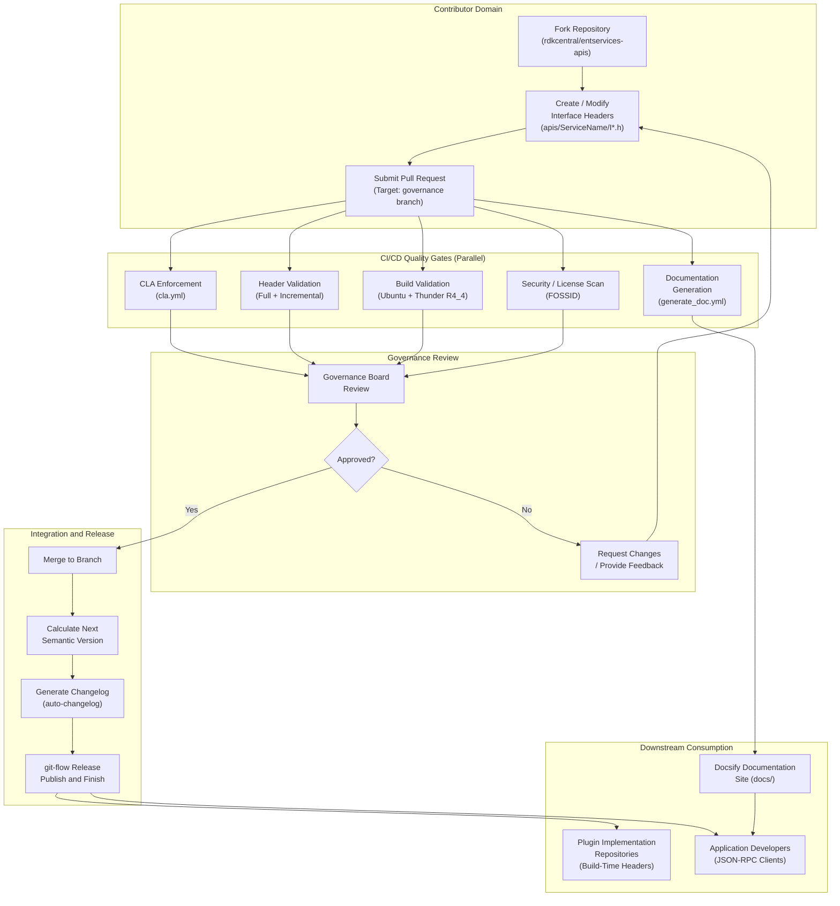
```mermaid
flowchart TB
    subgraph ContributorDomain["Contributor Domain"]
        ForkRepo["Fork Repository<br/>(rdkcentral/entservices-apis)"]
        CreateHeaders["Create / Modify<br/>Interface Headers<br/>(apis/ServiceName/I*.h)"]
        SubmitPR["Submit Pull Request<br/>(Target: governance branch)"]
    end

    subgraph CIDomain["CI/CD Quality Gates (Parallel)"]
        CLAGate["CLA Enforcement<br/>(cla.yml)"]
        HeaderGate["Header Validation<br/>(Full + Incremental)"]
        BuildGate["Build Validation<br/>(Ubuntu + Thunder R4_4)"]
        SecurityGate["Security / License Scan<br/>(FOSSID)"]
        DocGenGate["Documentation<br/>Generation<br/>(generate_doc.yml)"]
    end

    subgraph GovernanceDomain["Governance Review"]
        GovBoardReview["Governance Board<br/>Review"]
        ApprovalDecision{"Approved?"}
        FeedbackLoop["Request Changes<br/>/ Provide Feedback"]
    end

    subgraph ReleaseDomain["Integration and Release"]
        MergeToBranch["Merge to Branch"]
        CalcVersion["Calculate Next<br/>Semantic Version"]
        GenerateChangelog["Generate Changelog<br/>(auto-changelog)"]
        GitFlowRelease["git-flow Release<br/>Publish and Finish"]
    end

    subgraph ConsumptionDomain["Downstream Consumption"]
        PluginRepos["Plugin Implementation<br/>Repositories<br/>(Build-Time Headers)"]
        AppDevelopers["Application Developers<br/>(JSON-RPC Clients)"]
        DocsifySite["Docsify Documentation<br/>Site (docs/)"]
    end

    ForkRepo --> CreateHeaders
    CreateHeaders --> SubmitPR

    SubmitPR --> CLAGate
    SubmitPR --> HeaderGate
    SubmitPR --> BuildGate
    SubmitPR --> SecurityGate
    SubmitPR --> DocGenGate

    CLAGate --> GovBoardReview
    HeaderGate --> GovBoardReview
    BuildGate --> GovBoardReview
    SecurityGate --> GovBoardReview

    GovBoardReview --> ApprovalDecision
    ApprovalDecision -->|"Yes"| MergeToBranch
    ApprovalDecision -->|"No"| FeedbackLoop
    FeedbackLoop --> CreateHeaders

    MergeToBranch --> CalcVersion
    CalcVersion --> GenerateChangelog
    GenerateChangelog --> GitFlowRelease

    GitFlowRelease --> PluginRepos
    GitFlowRelease --> AppDevelopers
    DocGenGate --> DocsifySite
    DocsifySite --> AppDevelopers
```

### 4.1.3 Process Interaction Summary

The five workflow domains interact through shared artifacts and event triggers, as evidenced by the CI/CD workflow configurations in `.github/workflows/`. The following table summarizes the key interactions:

| Source Process | Target Process | Interaction Mechanism | Shared Artifact |
|---|---|---|---|
| API Contribution (F-009) | CI/CD Pipeline (F-006) | PR event triggers parallel workflows | Interface headers in `apis/` |
| Build Validation (F-006) | Code Generation (F-003) | Build workflow invokes CMake/Ninja build | `CMakeLists.txt`, `build/CMakeLists.txt` |
| Code Generation (F-003) | Downstream Consumers | Install artifacts to system prefix | Proxy/stub libs, JSON binding headers |
| Documentation Generation (F-004) | API Reference Site | Auto-commit Markdown to `docs/` | `docs/apis/*.md`, `docs/_sidebar.md` |
| Release Management (F-010) | Version Tags | git-flow creates release tags on `main` | `CHANGELOG.md`, Git tags |
| Governance Framework (F-005) | All Processes | Naming conventions, review cadences | `governance.md` |

---

## 4.2 CORE BUSINESS PROCESS FLOWS

### 4.2.1 API Contribution and Review Workflow

#### Process Description

The API Contribution and Review Workflow (Feature F-009) defines the end-to-end journey for a contributor proposing new or modified interface definitions. This process is governed by the policies in `governance.md` and `CONTRIBUTING.md`, enforced through automated CI/CD gates in `.github/workflows/`, and requires formal governance board approval before merge.

The contribution targets the `governance` branch, and each pull request must include an RDK ticket or GitHub issue reference, a `version: major|minor|patch` directive in the PR description (per F-010-RQ-003), and compliance with all naming conventions defined in `governance.md` (PascalCase for COM-RPC, camelCase for JSON-RPC, `org.rdk` callsign prefix, `Core::IUnknown` inheritance).

#### Detailed Flowchart

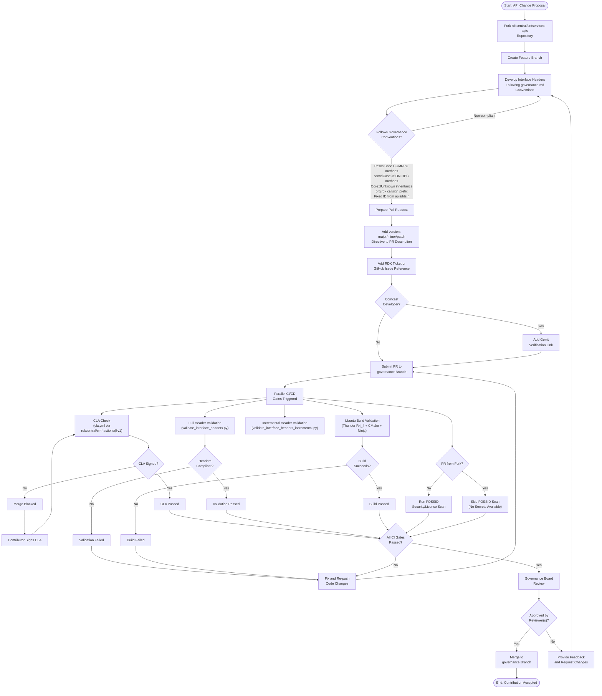
```mermaid
flowchart TD
    StartNode(["Start: API Change Proposal"]) --> ForkStep["Fork rdkcentral/entservices-apis<br/>Repository"]
    ForkStep --> BranchStep["Create Feature Branch"]
    BranchStep --> DevStep["Develop Interface Headers<br/>Following governance.md<br/>Conventions"]

    DevStep --> ConventionCheck{"Follows Governance<br/>Conventions?"}
    ConventionCheck -->|"PascalCase COMRPC methods<br/>camelCase JSON-RPC methods<br/>Core::IUnknown inheritance<br/>org.rdk callsign prefix<br/>Fixed ID from apis/Ids.h"| PRPrepare["Prepare Pull Request"]
    ConventionCheck -->|"Non-compliant"| DevStep

    PRPrepare --> AddVersionDir["Add version: major/minor/patch<br/>Directive to PR Description"]
    AddVersionDir --> AddTicketRef["Add RDK Ticket or<br/>GitHub Issue Reference"]
    AddTicketRef --> ComcastCheck{"Comcast<br/>Developer?"}
    ComcastCheck -->|"Yes"| AddGerrit["Add Gerrit<br/>Verification Link"]
    ComcastCheck -->|"No"| SubmitPRStep["Submit PR to<br/>governance Branch"]
    AddGerrit --> SubmitPRStep

    SubmitPRStep --> ParallelCI["Parallel CI/CD<br/>Gates Triggered"]

    ParallelCI --> CLACheckNode["CLA Check<br/>(cla.yml via<br/>rdkcentral/cmf-actions@v1)"]
    ParallelCI --> FullValNode["Full Header Validation<br/>(validate_interface_headers.py)"]
    ParallelCI --> IncrValNode["Incremental Header Validation<br/>(validate_interface_headers_incremental.py)"]
    ParallelCI --> BuildCheckNode["Ubuntu Build Validation<br/>(Thunder R4_4 + CMake + Ninja)"]
    ParallelCI --> ForkCheckNode{"PR from Fork?"}

    ForkCheckNode -->|"Yes"| SkipScan["Skip FOSSID Scan<br/>(No Secrets Available)"]
    ForkCheckNode -->|"No"| RunScan["Run FOSSID<br/>Security/License Scan"]

    CLACheckNode --> CLASignedNode{"CLA Signed?"}
    CLASignedNode -->|"Yes"| CLAPassNode["CLA Passed"]
    CLASignedNode -->|"No"| CLABlockNode["Merge Blocked"]
    CLABlockNode --> SignCLANode["Contributor Signs CLA"]
    SignCLANode --> CLACheckNode

    FullValNode --> HeadersOK{"Headers<br/>Compliant?"}
    HeadersOK -->|"Yes"| ValPassNode["Validation Passed"]
    HeadersOK -->|"No"| ValFailNode["Validation Failed"]

    BuildCheckNode --> BuildOK{"Build<br/>Succeeds?"}
    BuildOK -->|"Yes"| BuildPassNode["Build Passed"]
    BuildOK -->|"No"| BuildFailNode["Build Failed"]

    CLAPassNode --> AllGatesNode{"All CI Gates<br/>Passed?"}
    ValPassNode --> AllGatesNode
    BuildPassNode --> AllGatesNode
    RunScan --> AllGatesNode
    SkipScan --> AllGatesNode

    ValFailNode --> FixCodeNode["Fix and Re-push<br/>Code Changes"]
    BuildFailNode --> FixCodeNode
    AllGatesNode -->|"No"| FixCodeNode
    FixCodeNode --> SubmitPRStep

    AllGatesNode -->|"Yes"| ReviewNode["Governance Board<br/>Review"]

    ReviewNode --> ApprovalNode{"Approved by<br/>Reviewer(s)?"}
    ApprovalNode -->|"Yes"| MergeNode["Merge to<br/>governance Branch"]
    ApprovalNode -->|"No"| FeedbackNode["Provide Feedback<br/>and Request Changes"]
    FeedbackNode --> DevStep

    MergeNode --> EndNode(["End: Contribution Accepted"])
```

#### Key Decision Points

| Decision Point | Rule | Automated? | Reference |
|---|---|---|---|
| Governance convention compliance | PascalCase COMRPC, camelCase JSON-RPC, `Core::IUnknown`, `org.rdk` prefix | Partially (header validation scripts) | F-005-RQ-001 through F-005-RQ-004 |
| CLA signed | Contributor must have signed CLA | Yes (`cla.yml`) | F-009-RQ-002 |
| PR from fork (FOSSID) | Non-fork PRs get FOSSID scan; fork PRs skip (no secrets) | Yes (workflow condition) | F-006-RQ-004 |
| Headers compliant | All interface headers pass validation rules | Yes (`validate_interface_headers.py`) | F-006-RQ-002 |
| Build succeeds | Full CMake + Ninja build against Thunder R4_4 | Yes (`Build_entservices-apis_on_Ubuntu.yml`) | F-006-RQ-001 |
| Governance approval | At least one reviewer approves the PR | Manual (reviewer) | F-009-RQ-003 |

### 4.2.2 Build Validation Pipeline

#### Process Description

The Build Validation Pipeline (Features F-003 and F-006) ensures that all interface headers compile correctly against the Thunder R4_4 framework. This workflow is defined in `.github/workflows/Build_entservices-apis_on_Ubuntu.yml` and triggers on every push to `develop` or pull request targeting `develop`. The pipeline clones, patches, and builds both ThunderTools and Thunder before building the repository's Marshalling and Definitions components.

#### Detailed Flowchart

```mermaid
flowchart TD
    BuildTrigger(["Trigger: Push or PR to develop"]) --> CheckoutRepo["Checkout Repository<br/>(actions/checkout@v4)"]
    CheckoutRepo --> InstallDeps["Install System Dependencies<br/>(cmake, ninja-build,<br/>build-essential, git)"]
    InstallDeps --> CloneTTools["Clone ThunderTools<br/>(git clone -b R4_4<br/>rdkcentral/ThunderTools)"]
    CloneTTools --> CloneThunderFW["Clone Thunder Framework<br/>(git clone -b R4_4<br/>rdkcentral/Thunder)"]
    CloneThunderFW --> InstallJsonref["Install Python jsonref<br/>(pip install jsonref)"]
    InstallJsonref --> ApplyTToolsPatch["Apply ThunderTools Patch<br/>(.github/Patches/<br/>00010-R4.4-Add-support-<br/>for-project-dir.patch)"]
    ApplyTToolsPatch --> ApplyThunderPatch["Apply Thunder Patch<br/>(.github/Patches/<br/>1004-Add-support-for-<br/>project-dir.patch)"]
    ApplyThunderPatch --> BuildTToolsStep["Build ThunderTools<br/>(CMake + Ninja, Install<br/>to Shared Prefix)"]
    BuildTToolsStep --> BuildThunderFWStep["Build Thunder Framework<br/>(CMake + Ninja<br/>BINDING=127.0.0.1<br/>PORT=55555, DEBUG Mode)"]
    BuildThunderFWStep --> BuildMarshalStep["Build Marshalling Component<br/>(Root CMakeLists.txt)<br/>ProxyStubGenerator on<br/>all apis/*/I*.h"]
    BuildMarshalStep --> BuildDefsStep["Build Definitions Component<br/>(build/CMakeLists.txt)<br/>JsonGenerator Two-Pass<br/>(JSON + Headers)"]
    BuildDefsStep --> BuildOutcome{"Build<br/>Succeeded?"}
    BuildOutcome -->|"Yes"| BuildPassResult(["Build Passed"])
    BuildOutcome -->|"No"| BuildFailResult(["Build Failed"])
```

#### Build Component Parameters

| Parameter | Marshalling Component | Definitions Component |
|---|---|---|
| **CMake Minimum** | 3.12 | 3.3 |
| **C++ Standard** | C++11 (required) | Inherited |
| **Project Version** | 4.4.1 | 4.4.1 |
| **Input Discovery** | `file(GLOB_RECURSE)` on `./apis/*/I*.h` | JSON files + interface headers |
| **Generator Tool** | `ProxyStubGenerator()` | `JsonGenerator()` (two-pass) |
| **Output Artifacts** | `ProxyStubs*.cpp` → shared library | `JsonEnum*.cpp` + `J*.h` → shared library |
| **Link Dependencies** | `${NAMESPACE}Core`, `${NAMESPACE}COM` | `${NAMESPACE}Core`, `${NAMESPACE}COM` |
| **Install Location** | `lib/${NAMESPACE_LIB}/proxystubs` | `include/${NAMESPACE}/interfaces/json` |

### 4.2.3 Code Generation Pipeline

#### Process Description

The Code Generation Pipeline (Feature F-003) transforms annotated C++ interface headers and JSON schema definitions into marshalling code and JSON-RPC bindings. This pipeline operates at build time through two CMake-driven components: the **Marshalling Component** (root `CMakeLists.txt`) which invokes `ProxyStubGenerator` for COM-RPC proxy/stub generation, and the **Definitions Component** (`build/CMakeLists.txt`) which invokes `JsonGenerator` in a two-pass strategy for JSON-RPC binding code. The dual-protocol support (F-002) ensures that a single C++ interface header produces both COM-RPC and JSON-RPC artifacts.

#### Code Generation Flow

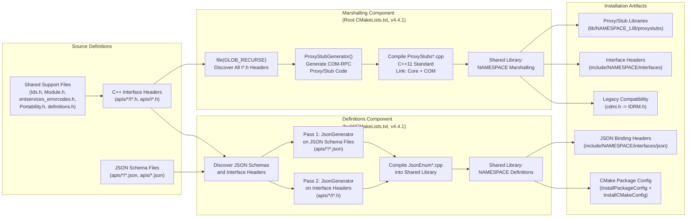
```mermaid
flowchart LR
    subgraph SourceDefs["Source Definitions"]
        InterfaceHeaders["C++ Interface Headers<br/>(apis/*/I*.h, apis/I*.h)"]
        JSONSchemas["JSON Schema Files<br/>(apis/*/*.json, apis/*.json)"]
        SharedSupport["Shared Support Files<br/>(Ids.h, Module.h,<br/>entservices_errorcodes.h,<br/>Portability.h, definitions.h)"]
    end

    subgraph MarshalComp["Marshalling Component<br/>(Root CMakeLists.txt, v4.4.1)"]
        GlobAllHeaders["file(GLOB_RECURSE)<br/>Discover All I*.h Headers"]
        RunPSGen["ProxyStubGenerator()<br/>Generate COM-RPC<br/>Proxy/Stub Code"]
        CompileProxyStubs["Compile ProxyStubs*.cpp<br/>C++11 Standard<br/>Link: Core + COM"]
        MarshalSharedLib["Shared Library:<br/>NAMESPACE Marshalling"]
    end

    subgraph DefsComp["Definitions Component<br/>(build/CMakeLists.txt, v4.4.1)"]
        GlobJSONHeaders["Discover JSON Schemas<br/>and Interface Headers"]
        JsonGenPassOne["Pass 1: JsonGenerator<br/>on JSON Schema Files<br/>(apis/*/*.json)"]
        JsonGenPassTwo["Pass 2: JsonGenerator<br/>on Interface Headers<br/>(apis/*/I*.h)"]
        CompileJsonEnum["Compile JsonEnum*.cpp<br/>into Shared Library"]
        DefsSharedLib["Shared Library:<br/>NAMESPACE Definitions"]
    end

    subgraph Artifacts["Installation Artifacts"]
        ProxyStubLibOut["Proxy/Stub Libraries<br/>(lib/NAMESPACE_LIB/proxystubs)"]
        HeadersOut["Interface Headers<br/>(include/NAMESPACE/interfaces)"]
        JsonBindOut["JSON Binding Headers<br/>(include/NAMESPACE/interfaces/json)"]
        PkgConfigOut["CMake Package Config<br/>(InstallPackageConfig +<br/>InstallCMakeConfig)"]
        LegacyLink["Legacy Compatibility<br/>(cdmi.h -> IDRM.h)"]
    end

    SharedSupport --> InterfaceHeaders
    InterfaceHeaders --> GlobAllHeaders
    GlobAllHeaders --> RunPSGen
    RunPSGen --> CompileProxyStubs
    CompileProxyStubs --> MarshalSharedLib

    InterfaceHeaders --> GlobJSONHeaders
    JSONSchemas --> GlobJSONHeaders
    GlobJSONHeaders --> JsonGenPassOne
    GlobJSONHeaders --> JsonGenPassTwo
    JsonGenPassOne --> CompileJsonEnum
    JsonGenPassTwo --> CompileJsonEnum
    CompileJsonEnum --> DefsSharedLib

    MarshalSharedLib --> ProxyStubLibOut
    MarshalSharedLib --> HeadersOut
    MarshalSharedLib --> LegacyLink
    DefsSharedLib --> JsonBindOut
    DefsSharedLib --> PkgConfigOut
```

#### Dual-Protocol Generation Pathways

Each C++ interface header serves as a single source of truth for two communication protocols, as mandated by `governance.md` and detailed in Feature F-002:

| Protocol | Generation Tool | Naming Convention | Use Case | Annotation Requirement |
|---|---|---|---|---|
| **COM-RPC** | `ProxyStubGenerator` | PascalCase (e.g., `GetDeviceInfo`) | Inter-plugin communication (mandatory) | Inherent from `Core::IUnknown` |
| **JSON-RPC** | `JsonGenerator` | camelCase (e.g., `getDeviceInfo`) | Application-to-service (HTTP/WebSocket) | `@json 1.0.0` + `@text:keep` |

When a service supports only JSON-RPC and not COM-RPC, the `@stubgen:omit` tag suppresses proxy/stub generation for that interface, as documented in the governance conventions.

### 4.2.4 Documentation Generation Pipeline

#### Process Description

The Documentation Generation Pipeline (Feature F-004) automatically produces Markdown API reference pages from interface headers and JSON schema definitions. The pipeline is orchestrated by `.github/workflows/generate_doc.yml` and supports two operational modes: **Incremental Mode** (triggered by PRs to `develop` when API files change) and **Full Regeneration Mode** (triggered by manual `workflow_dispatch` with the `regenerate_all` flag). The generated documentation feeds the Docsify-based static site at `docs/`, which currently documents 64 services via `docs/_sidebar.md`.

#### Documentation Generation Flow

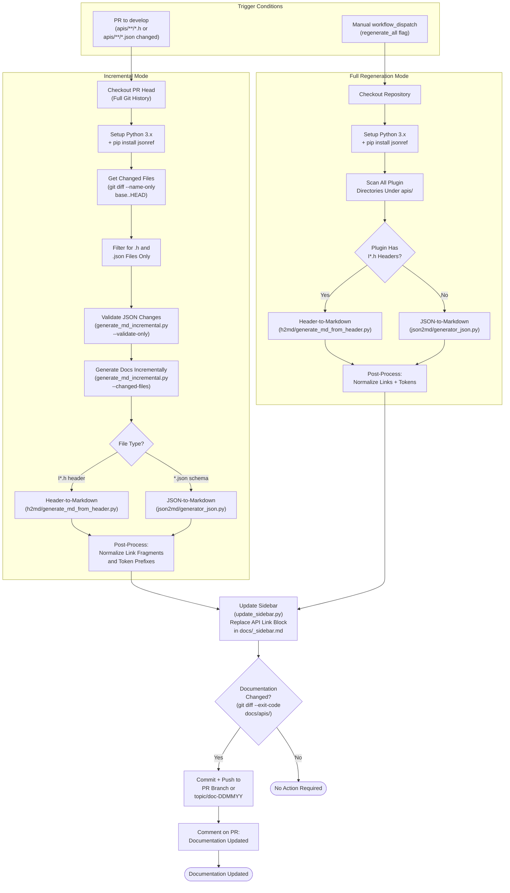
```mermaid
flowchart TD
    subgraph TriggerConds["Trigger Conditions"]
        PRApiChange["PR to develop<br/>(apis/**/*.h or<br/>apis/**/*.json changed)"]
        ManualDispatch["Manual workflow_dispatch<br/>(regenerate_all flag)"]
    end

    PRApiChange --> IncrCheckout
    ManualDispatch --> FullCheckout

    subgraph IncrementalMode["Incremental Mode"]
        IncrCheckout["Checkout PR Head<br/>(Full Git History)"]
        IncrSetup["Setup Python 3.x<br/>+ pip install jsonref"]
        GetChangedFiles["Get Changed Files<br/>(git diff --name-only<br/>base..HEAD)"]
        FilterAPIFiles["Filter for .h and<br/>.json Files Only"]
        ValidateJSONOnly["Validate JSON Changes<br/>(generate_md_incremental.py<br/>--validate-only)"]
        GenIncrDocs["Generate Docs Incrementally<br/>(generate_md_incremental.py<br/>--changed-files)"]
        IncrFileType{"File Type?"}
        IncrHeaderPipe["Header-to-Markdown<br/>(h2md/generate_md_from_header.py)"]
        IncrJSONPipe["JSON-to-Markdown<br/>(json2md/generator_json.py)"]
        IncrPostProcess["Post-Process:<br/>Normalize Link Fragments<br/>and Token Prefixes"]
    end

    IncrCheckout --> IncrSetup
    IncrSetup --> GetChangedFiles
    GetChangedFiles --> FilterAPIFiles
    FilterAPIFiles --> ValidateJSONOnly
    ValidateJSONOnly --> GenIncrDocs
    GenIncrDocs --> IncrFileType
    IncrFileType -->|"I*.h header"| IncrHeaderPipe
    IncrFileType -->|"*.json schema"| IncrJSONPipe
    IncrHeaderPipe --> IncrPostProcess
    IncrJSONPipe --> IncrPostProcess

    subgraph FullRegenMode["Full Regeneration Mode"]
        FullCheckout["Checkout Repository"]
        FullSetup["Setup Python 3.x<br/>+ pip install jsonref"]
        ScanAllPlugins["Scan All Plugin<br/>Directories Under apis/"]
        PluginHasHeader{"Plugin Has<br/>I*.h Headers?"}
        FullHeaderPipe["Header-to-Markdown<br/>(h2md/generate_md_from_header.py)"]
        FullJSONPipe["JSON-to-Markdown<br/>(json2md/generator_json.py)"]
        FullPostProcess["Post-Process:<br/>Normalize Links + Tokens"]
    end

    FullCheckout --> FullSetup
    FullSetup --> ScanAllPlugins
    ScanAllPlugins --> PluginHasHeader
    PluginHasHeader -->|"Yes"| FullHeaderPipe
    PluginHasHeader -->|"No"| FullJSONPipe
    FullHeaderPipe --> FullPostProcess
    FullJSONPipe --> FullPostProcess

    IncrPostProcess --> SidebarUpdate["Update Sidebar<br/>(update_sidebar.py)<br/>Replace API Link Block<br/>in docs/_sidebar.md"]
    FullPostProcess --> SidebarUpdate

    SidebarUpdate --> DocsChangedCheck{"Documentation<br/>Changed?<br/>(git diff --exit-code<br/>docs/apis/)"}
    DocsChangedCheck -->|"Yes"| CommitPushDocs["Commit + Push to<br/>PR Branch or<br/>topic/doc-DDMMYY"]
    DocsChangedCheck -->|"No"| NoDocAction(["No Action Required"])
    CommitPushDocs --> PRComment["Comment on PR:<br/>Documentation Updated"]
    PRComment --> DocsDone(["Documentation Updated"])
```

#### Documentation Pipeline Decision Logic

| Decision Point | Condition | Incremental Mode Action | Full Mode Action |
|---|---|---|---|
| File type detection | Is the changed file an `I*.h` header or a `.json` schema? | Route to `h2md` or `json2md` pipeline | Route per plugin based on header presence |
| Plugin header presence | Does the plugin directory contain `I*.h` files? | N/A (file-level routing) | Use `h2md` if headers exist; else use `json2md` |
| Documentation changed | Does `git diff --exit-code docs/apis/` detect changes? | Commit and push to PR branch; comment on PR | Commit and push to topic branch |

### 4.2.5 Release Management Pipeline

#### Process Description

The Release Management Pipeline (Feature F-010) automates semantic versioning and release orchestration via `.github/workflows/component-release.yml`. The workflow responds to PR events (opened, edited, ready_for_review, closed) targeting `develop` and consists of two jobs: **validate-version** (on PR open/edit) and **release** (on PR merge). The release job uses git-flow branching and `auto-changelog` to generate release artifacts, as defined in `governance.md`.

#### Release Management Flow

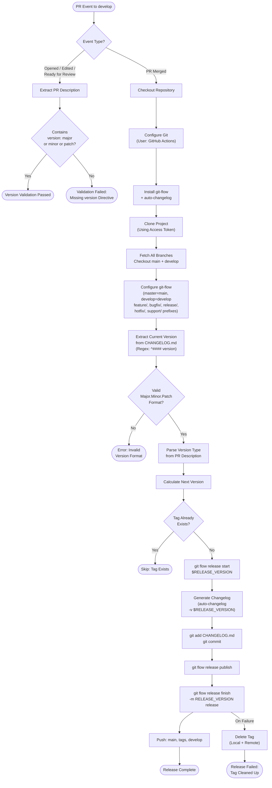
```mermaid
flowchart TD
    PREventNode(["PR Event to develop"]) --> EventTypeCheck{"Event Type?"}

    EventTypeCheck -->|"Opened / Edited /<br/>Ready for Review"| ExtractDesc["Extract PR Description"]
    EventTypeCheck -->|"PR Merged"| RCheckoutStep["Checkout Repository"]

    ExtractDesc --> VersionDirPresent{"Contains<br/>version: major<br/>or minor or patch?"}
    VersionDirPresent -->|"Yes"| VVPassNode(["Version Validation Passed"])
    VersionDirPresent -->|"No"| VVFailNode(["Validation Failed:<br/>Missing version Directive"])

    RCheckoutStep --> RConfigGitStep["Configure Git<br/>(User: GitHub Actions)"]
    RConfigGitStep --> RInstallToolsStep["Install git-flow<br/>+ auto-changelog"]
    RInstallToolsStep --> RCloneStep["Clone Project<br/>(Using Access Token)"]
    RCloneStep --> RFetchStep["Fetch All Branches<br/>Checkout main + develop"]
    RFetchStep --> RFlowConfig["Configure git-flow<br/>(master=main, develop=develop<br/>feature/, bugfix/, release/,<br/>hotfix/, support/ prefixes)"]
    RFlowConfig --> RExtractVer["Extract Current Version<br/>from CHANGELOG.md<br/>(Regex: ^#### version)"]
    RExtractVer --> RVerValid{"Valid<br/>Major.Minor.Patch<br/>Format?"}
    RVerValid -->|"No"| RFormatError(["Error: Invalid<br/>Version Format"])
    RVerValid -->|"Yes"| RParseTypeStep["Parse Version Type<br/>from PR Description"]
    RParseTypeStep --> RCalcNextStep["Calculate Next Version"]
    RCalcNextStep --> RTagExistsCheck{"Tag Already<br/>Exists?"}
    RTagExistsCheck -->|"Yes"| RSkipRelease(["Skip: Tag Exists"])
    RTagExistsCheck -->|"No"| RStartFlowStep["git flow release start<br/>$RELEASE_VERSION"]
    RStartFlowStep --> RGenCLStep["Generate Changelog<br/>(auto-changelog<br/>-v $RELEASE_VERSION)"]
    RGenCLStep --> RCommitCLStep["git add CHANGELOG.md<br/>git commit"]
    RCommitCLStep --> RPublishStep["git flow release publish"]
    RPublishStep --> RFinishStep["git flow release finish<br/>-m RELEASE_VERSION release"]
    RFinishStep --> RPushStep["Push: main, tags, develop"]
    RPushStep --> RCompleteNode(["Release Complete"])

    RFinishStep -->|"On Failure"| RCleanupStep["Delete Tag<br/>(Local + Remote)"]
    RCleanupStep --> RFailedNode(["Release Failed:<br/>Tag Cleaned Up"])
```

#### Version Calculation Rules

As defined in `governance.md` and implemented in `component-release.yml`, the semantic versioning rules are:

| Version Type | Calculation | Trigger Condition | Example |
|---|---|---|---|
| **Major** | `major+1`, `minor=0`, `patch=0` | Breaking/backward-incompatible API changes | `3.5.0` → `4.0.0` |
| **Minor** | `minor+1`, `patch=0` | Non-breaking routine additions | `3.5.0` → `3.6.0` |
| **Patch** | `patch+1` | Clinical/trivial fixes | `3.5.0` → `3.5.1` |
| **Default** | `patch+1` | No version type found in PR | Falls back to patch increment |

Breaking changes (Major) require prior deprecation, as mandated by F-010-RQ-004. The deprecated API must be marked with `@deprecated` in the header file or `["deprecated"]` in the JSON schema before removal.

---

## 4.3 INTEGRATION WORKFLOWS

### 4.3.1 CI/CD Orchestration Flow

#### Process Description

The CI/CD Orchestration Flow (Feature F-006) coordinates seven GitHub Actions workflows that collectively provide automated quality gates for every code change. All workflows run on `ubuntu-latest` runners and are triggered by repository events (push, PR, issue comment, manual dispatch). The workflows operate in parallel where possible, as defined in `.github/workflows/`.

#### CI/CD Event-Trigger Map

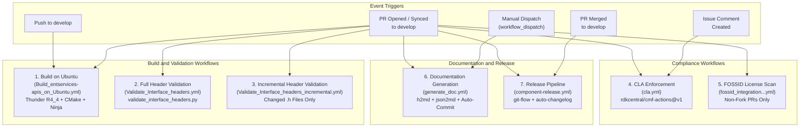
```mermaid
flowchart TB
    subgraph EventSources["Event Triggers"]
        EvPush["Push to develop"]
        EvPROpen["PR Opened / Synced<br/>to develop"]
        EvPRMerge["PR Merged<br/>to develop"]
        EvManual["Manual Dispatch<br/>(workflow_dispatch)"]
        EvComment["Issue Comment<br/>Created"]
    end

    subgraph BuildValidation["Build and Validation Workflows"]
        WFBuildUbuntu["1. Build on Ubuntu<br/>(Build_entservices-apis_on_Ubuntu.yml)<br/>Thunder R4_4 + CMake + Ninja"]
        WFHeaderFull["2. Full Header Validation<br/>(Validate_Interface_headers.yml)<br/>validate_interface_headers.py"]
        WFHeaderIncr["3. Incremental Header Validation<br/>(Validate_Interface_headers_incremental.yml)<br/>Changed .h Files Only"]
    end

    subgraph ComplianceGates["Compliance Workflows"]
        WFCLA["4. CLA Enforcement<br/>(cla.yml)<br/>rdkcentral/cmf-actions@v1"]
        WFFOSSID["5. FOSSID License Scan<br/>(fossid_integration...yml)<br/>Non-Fork PRs Only"]
    end

    subgraph DocReleaseWFs["Documentation and Release"]
        WFDocGen["6. Documentation Generation<br/>(generate_doc.yml)<br/>h2md + json2md + Auto-Commit"]
        WFRelease["7. Release Pipeline<br/>(component-release.yml)<br/>git-flow + auto-changelog"]
    end

    EvPush --> WFBuildUbuntu
    EvPROpen --> WFBuildUbuntu
    EvPROpen --> WFHeaderFull
    EvPROpen --> WFHeaderIncr
    EvPROpen --> WFCLA
    EvPROpen --> WFFOSSID
    EvPROpen --> WFDocGen
    EvPROpen --> WFRelease
    EvComment --> WFCLA
    EvManual --> WFDocGen
    EvPRMerge --> WFRelease
```

#### Workflow Execution Details

| # | Workflow | Trigger Events | Key Steps | External Dependencies |
|---|---|---|---|---|
| 1 | `Build_entservices-apis_on_Ubuntu.yml` | Push/PR to `develop` | Clone Thunder R4_4 → Patch → Build ThunderTools → Build Thunder → Build Marshalling → Build Definitions | Thunder, ThunderTools, CMake, Ninja, GCC |
| 2 | `Validate_Interface_headers.yml` | All PRs | Run `validate_interface_headers.py` on all headers in `apis/` | Python 3.x |
| 3 | `Validate_Interface_headers_incremental.yml` | All PRs | Fetch base → `git diff` → Filter deleted files → Validate only changed headers | Python 3.x |
| 4 | `cla.yml` | Issue comments + PR events | Delegate to `rdkcentral/cmf-actions/.github/workflows/cla.yml@v1` | `rdkcentral/cmf-actions` |
| 5 | `fossid_integration...yml` | PR open/sync/reopen (non-fork only) | Delegate to `rdkcentral/build_tools_workflows@1.0.0` with FOSSID secrets | FOSSID service |
| 6 | `generate_doc.yml` | PR to `develop` (API changes) + manual | Detect changes → Validate → Generate Markdown → Update sidebar → Auto-commit | Python 3.x, `jsonref` |
| 7 | `component-release.yml` | PR events to `develop` | Validate version directive → git-flow release → auto-changelog → Push tags | `auto-changelog`, `git-flow` |

#### Header Validation Rules

The Python-based validation scripts (`.github/workflows/validate_interface_headers.py` and `validate_interface_headers_incremental.py`) enforce the following governance conventions through regex-driven analysis:

| Validation Rule | Convention | Feature Reference |
|---|---|---|
| Interface naming | PascalCase class names | F-005-RQ-002 |
| Method naming | PascalCase (COMRPC) / camelCase (JSON-RPC) | F-005-RQ-002 |
| Parameter naming | camelCase with valid ASCII | F-005-RQ-002 |
| Enumeration values | `ALL_UPPER_SNAKE_CASE` | F-005-RQ-003 |
| Event naming | `on[Object][Action]` pattern | F-005-RQ-004 |
| Return types | All methods return `Core::hresult` | F-001-RQ-004 |
| ID registry | Unique, non-reused IDs in `apis/Ids.h` | F-007-RQ-004 |

### 4.3.2 Downstream Consumer Integration Sequence

#### Process Description

The Entertainment Services APIs serve two primary downstream consumer groups: **Plugin Implementation Repositories** (RDK MW developers building Thunder plugins) and **Application Developers** (writing apps against JSON-RPC services). This sequence diagram illustrates the end-to-end integration flow from contribution through to consumer usage.

#### Integration Sequence Diagram

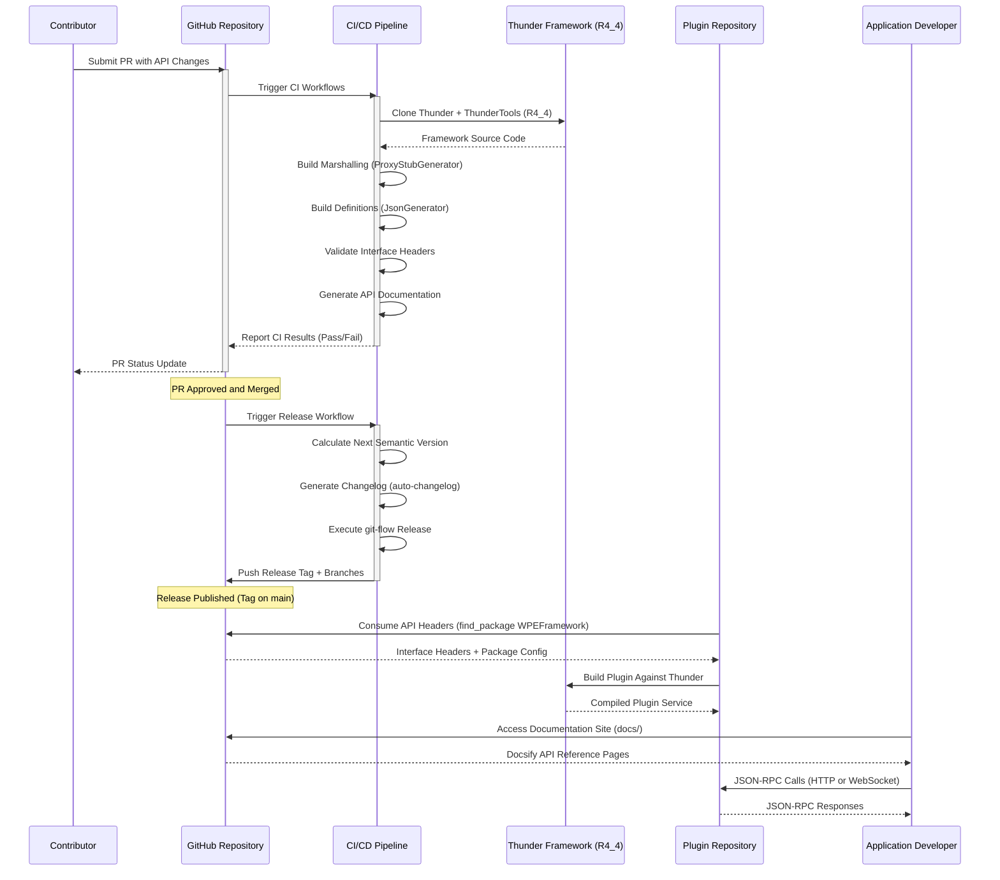
```mermaid
sequenceDiagram
    participant Contrib as Contributor
    participant Repo as GitHub Repository
    participant CICD as CI/CD Pipeline
    participant ThunderFW as Thunder Framework (R4_4)
    participant PluginRepo as Plugin Repository
    participant AppDev as Application Developer

    Contrib->>Repo: Submit PR with API Changes
    activate Repo
    Repo->>CICD: Trigger CI Workflows
    activate CICD
    CICD->>ThunderFW: Clone Thunder + ThunderTools (R4_4)
    ThunderFW-->>CICD: Framework Source Code
    CICD->>CICD: Build Marshalling (ProxyStubGenerator)
    CICD->>CICD: Build Definitions (JsonGenerator)
    CICD->>CICD: Validate Interface Headers
    CICD->>CICD: Generate API Documentation
    CICD-->>Repo: Report CI Results (Pass/Fail)
    deactivate CICD
    Repo-->>Contrib: PR Status Update
    deactivate Repo

    Note over Repo: PR Approved and Merged

    Repo->>CICD: Trigger Release Workflow
    activate CICD
    CICD->>CICD: Calculate Next Semantic Version
    CICD->>CICD: Generate Changelog (auto-changelog)
    CICD->>CICD: Execute git-flow Release
    CICD->>Repo: Push Release Tag + Branches
    deactivate CICD

    Note over Repo: Release Published (Tag on main)

    PluginRepo->>Repo: Consume API Headers (find_package WPEFramework)
    Repo-->>PluginRepo: Interface Headers + Package Config
    PluginRepo->>ThunderFW: Build Plugin Against Thunder
    ThunderFW-->>PluginRepo: Compiled Plugin Service

    AppDev->>Repo: Access Documentation Site (docs/)
    Repo-->>AppDev: Docsify API Reference Pages
    AppDev->>PluginRepo: JSON-RPC Calls (HTTP or WebSocket)
    PluginRepo-->>AppDev: JSON-RPC Responses
```

### 4.3.3 External System Integration Map

The following table documents all external integration points evidenced in the repository, their interaction mechanisms, and the features they support. These integration points are defined in the CI/CD workflow configurations and build system files.

| External System | Integration Mechanism | Direction | Features Involved | Evidence |
|---|---|---|---|---|
| Thunder Framework | `find_package(WPEFramework)` at build time | Inbound dependency | F-001, F-002, F-003 | `CMakeLists.txt`, `build/CMakeLists.txt` |
| ThunderTools (R4_4) | `ProxyStubGenerator`, `JsonGenerator` code gen tools | Inbound dependency | F-003 | `CMakeLists.txt`, `build/CMakeLists.txt` |
| Thunder Core/COM Libraries | `${NAMESPACE}Core`, `${NAMESPACE}COM` link dependencies | Inbound dependency | F-003 | `CMakeLists.txt` |
| GitHub Actions | CI/CD workflow event triggers | Platform | F-006, F-009 | `.github/workflows/` (7 files) |
| FOSSID | Security/license diff scan via reusable workflow | Outbound integration | F-006 | `fossid_integration...yml` |
| `rdkcentral/cmf-actions` | CLA enforcement reusable workflow (@v1) | Outbound integration | F-006, F-009 | `cla.yml` |
| `rdkcentral/build_tools_workflows` | FOSSID scan delegation (@1.0.0) | Outbound integration | F-006 | `fossid_integration...yml` |
| Docsify | Static site rendering for generated docs | Documentation platform | F-004 | `docs/index.html` |
| Downstream Plugin Repos | Build-time API header consumption via CMake | Outbound (consumers) | F-001, F-003 | `InstallPackageConfig`, `InstallCMakeConfig` |
| `auto-changelog` (v2.5.0) | Automated changelog generation per release | Tooling dependency | F-010 | `component-release.yml` |
| `git-flow` | Release branching strategy (master=main, develop=develop) | Tooling dependency | F-010 | `component-release.yml` |

---

## 4.4 STATE TRANSITION DIAGRAMS

### 4.4.1 API Lifecycle States

#### Process Description

The API Lifecycle defines the states through which an interface definition progresses, from initial proposal through active service to eventual deprecation and removal. This lifecycle is governed by the policies in `governance.md` (lines 147–176) and enforced through the contribution review process (F-009) and versioning policy (F-010). Breaking changes require prior deprecation, and the `@deprecated` tag in headers or `["deprecated"]` label in JSON schemas makes the deprecation visible in documentation before removal.

#### State Transition Diagram

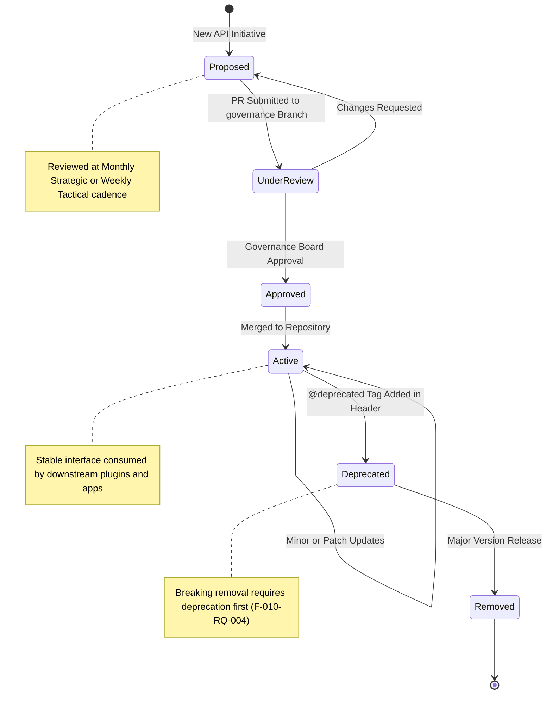
```mermaid
stateDiagram-v2
    [*] --> Proposed : New API Initiative
    Proposed --> UnderReview : PR Submitted to governance Branch
    UnderReview --> Approved : Governance Board Approval
    UnderReview --> Proposed : Changes Requested
    Approved --> Active : Merged to Repository
    Active --> Active : Minor or Patch Updates
    Active --> Deprecated : @deprecated Tag Added in Header
    Deprecated --> Removed : Major Version Release
    Removed --> [*]

    note right of Proposed : Reviewed at Monthly Strategic or Weekly Tactical cadence
    note right of Active : Stable interface consumed by downstream plugins and apps
    note right of Deprecated : Breaking removal requires deprecation first (F-010-RQ-004)
```

#### State Descriptions

| State | Description | Entry Condition | Exit Condition |
|---|---|---|---|
| **Proposed** | New API initiative under development | Contributor creates interface header | PR submitted for review |
| **Under Review** | PR undergoing CI/CD checks and governance review | PR submitted to `governance` branch | Approved or changes requested |
| **Approved** | Passed all quality gates and reviewer approval | Governance board approves | Merged to repository |
| **Active** | Stable interface available for downstream consumption | Merge completed | Marked for deprecation |
| **Deprecated** | Marked with `@deprecated` tag; scheduled for removal | Deprecation tag added | Removed in major version release |
| **Removed** | Interface removed from the repository | Major version release executed | Terminal state |

### 4.4.2 Pull Request Lifecycle States

#### State Transition Diagram

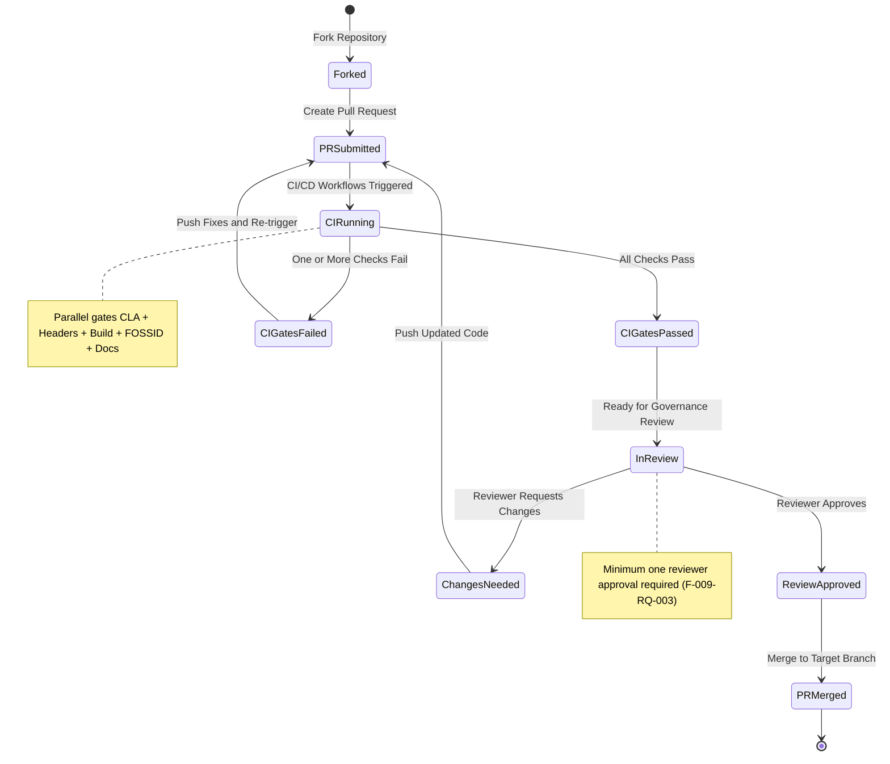
```mermaid
stateDiagram-v2
    [*] --> Forked : Fork Repository
    Forked --> PRSubmitted : Create Pull Request
    PRSubmitted --> CIRunning : CI/CD Workflows Triggered
    CIRunning --> CIGatesPassed : All Checks Pass
    CIRunning --> CIGatesFailed : One or More Checks Fail
    CIGatesFailed --> PRSubmitted : Push Fixes and Re-trigger
    CIGatesPassed --> InReview : Ready for Governance Review
    InReview --> ChangesNeeded : Reviewer Requests Changes
    InReview --> ReviewApproved : Reviewer Approves
    ChangesNeeded --> PRSubmitted : Push Updated Code
    ReviewApproved --> PRMerged : Merge to Target Branch
    PRMerged --> [*]

    note right of CIRunning : Parallel gates CLA + Headers + Build + FOSSID + Docs
    note right of InReview : Minimum one reviewer approval required (F-009-RQ-003)
```

### 4.4.3 Release Pipeline States

#### State Transition Diagram

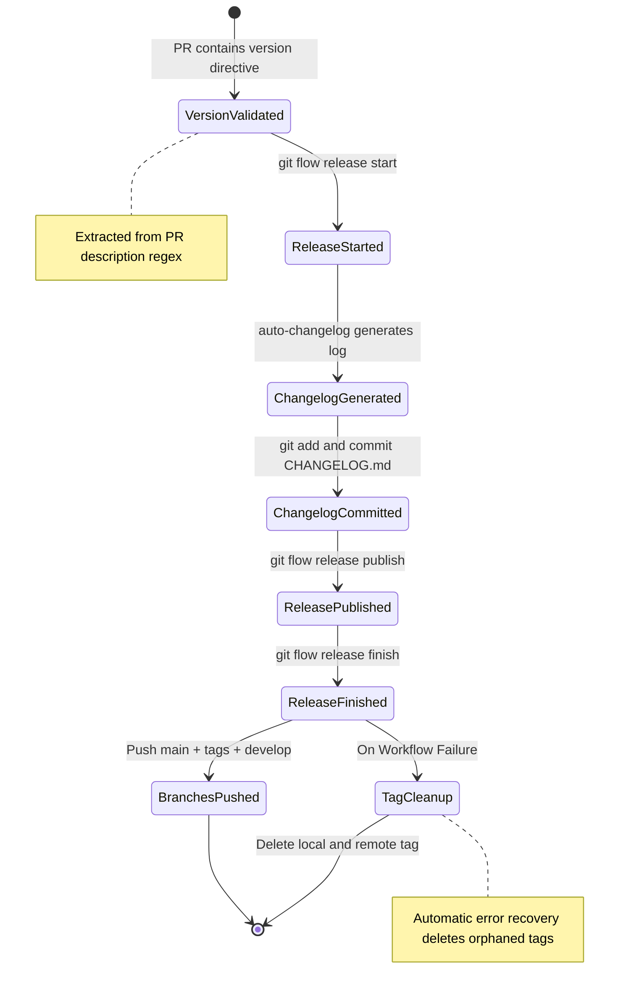
```mermaid
stateDiagram-v2
    [*] --> VersionValidated : PR contains version directive
    VersionValidated --> ReleaseStarted : git flow release start
    ReleaseStarted --> ChangelogGenerated : auto-changelog generates log
    ChangelogGenerated --> ChangelogCommitted : git add and commit CHANGELOG.md
    ChangelogCommitted --> ReleasePublished : git flow release publish
    ReleasePublished --> ReleaseFinished : git flow release finish
    ReleaseFinished --> BranchesPushed : Push main + tags + develop
    BranchesPushed --> [*]

    ReleaseFinished --> TagCleanup : On Workflow Failure
    TagCleanup --> [*] : Delete local and remote tag

    note right of VersionValidated : Extracted from PR description regex
    note right of TagCleanup : Automatic error recovery deletes orphaned tags
```

#### Interface ID States

Interface IDs managed in `apis/Ids.h` (Feature F-007) follow a simpler, two-state lifecycle. Once an ID is assigned from the `ID_ENTOS_OFFSET` base with a specific hex offset, it becomes permanently immutable. As stated in `apis/Ids.h`, the ID associated with an interface must never be changed, as it is as important as the interface syntax itself. IDs are grouped in blocks of 16 (default gap), with the observed range spanning `0x000` to `0x510+`.

| State | Description | Transition Rule |
|---|---|---|
| **Unassigned** | ID slot not yet allocated | Awaiting new interface registration |
| **Assigned (Permanent)** | ID permanently bound to a specific interface | Never changed, removed, or reassigned (F-007-RQ-002) |

---

## 4.5 ERROR HANDLING AND RECOVERY FLOWS

### 4.5.1 CI/CD Error Recovery Flowchart

#### Process Description

The CI/CD pipeline provides multiple error recovery pathways depending on the category of failure. The following flowchart documents all identified error categories, their detection mechanisms, and the prescribed recovery procedures as implemented across the seven GitHub Actions workflows.

#### Error Recovery Flow

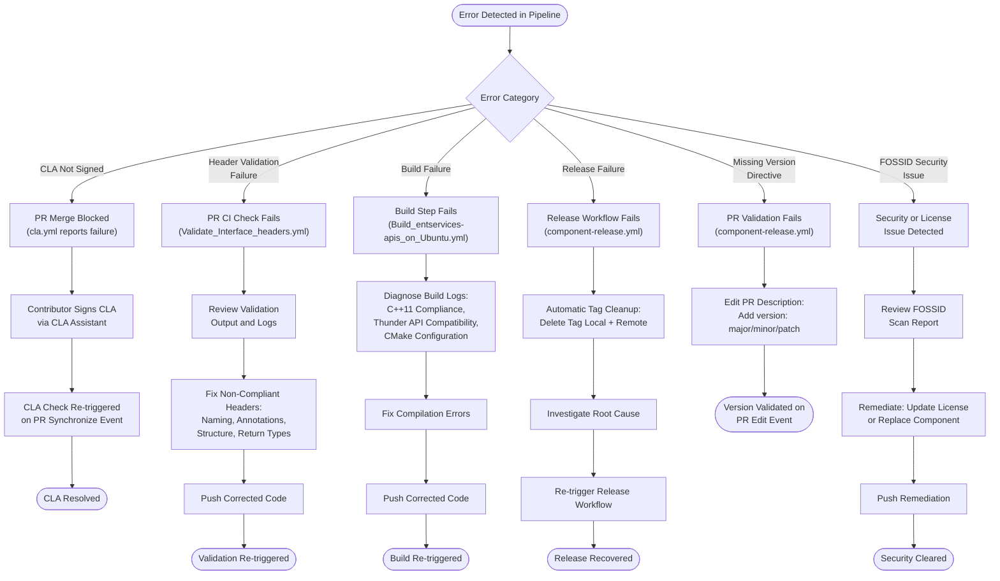
```mermaid
flowchart TD
    ErrorStart(["Error Detected in Pipeline"]) --> ErrorCat{"Error Category"}

    ErrorCat -->|"CLA Not Signed"| CLAErrNode["PR Merge Blocked<br/>(cla.yml reports failure)"]
    CLAErrNode --> ContSignNode["Contributor Signs CLA<br/>via CLA Assistant"]
    ContSignNode --> CLARetriggerNode["CLA Check Re-triggered<br/>on PR Synchronize Event"]
    CLARetriggerNode --> CLAResolvedNode(["CLA Resolved"])

    ErrorCat -->|"Header Validation<br/>Failure"| HeaderErrNode["PR CI Check Fails<br/>(Validate_Interface_headers.yml)"]
    HeaderErrNode --> ReviewValOutput["Review Validation<br/>Output and Logs"]
    ReviewValOutput --> FixHeadersNode["Fix Non-Compliant Headers:<br/>Naming, Annotations,<br/>Structure, Return Types"]
    FixHeadersNode --> PushHeaderFix["Push Corrected Code"]
    PushHeaderFix --> HeaderResolvedNode(["Validation Re-triggered"])

    ErrorCat -->|"Build Failure"| BuildErrNode["Build Step Fails<br/>(Build_entservices-apis_on_Ubuntu.yml)"]
    BuildErrNode --> DiagBuildLog["Diagnose Build Logs:<br/>C++11 Compliance,<br/>Thunder API Compatibility,<br/>CMake Configuration"]
    DiagBuildLog --> FixCompileNode["Fix Compilation Errors"]
    FixCompileNode --> PushBuildFix["Push Corrected Code"]
    PushBuildFix --> BuildResolvedNode(["Build Re-triggered"])

    ErrorCat -->|"Release Failure"| ReleaseErrNode["Release Workflow Fails<br/>(component-release.yml)"]
    ReleaseErrNode --> AutoTagCleanup["Automatic Tag Cleanup:<br/>Delete Tag Local + Remote"]
    AutoTagCleanup --> InvestigateRootNode["Investigate Root Cause"]
    InvestigateRootNode --> RetryReleaseNode["Re-trigger Release Workflow"]
    RetryReleaseNode --> ReleaseResolvedNode(["Release Recovered"])

    ErrorCat -->|"Missing Version<br/>Directive"| VersionErrNode["PR Validation Fails<br/>(component-release.yml)"]
    VersionErrNode --> EditPRDescNode["Edit PR Description:<br/>Add version: major/minor/patch"]
    EditPRDescNode --> VersionResolvedNode(["Version Validated on<br/>PR Edit Event"])

    ErrorCat -->|"FOSSID Security<br/>Issue"| SecurityErrNode["Security or License<br/>Issue Detected"]
    SecurityErrNode --> ReviewFindingsNode["Review FOSSID<br/>Scan Report"]
    ReviewFindingsNode --> RemediateNode["Remediate: Update License<br/>or Replace Component"]
    RemediateNode --> PushSecFix["Push Remediation"]
    PushSecFix --> SecurityResolvedNode(["Security Cleared"])
```

### 4.5.2 Release Failure Recovery

The release workflow in `component-release.yml` (lines 118–123) implements an automatic tag cleanup mechanism as its primary error recovery strategy. If any step in the release process fails after a Git tag has been created, the workflow's error handler deletes the tag both locally and remotely to prevent orphaned tags from blocking subsequent release attempts.

| Failure Scenario | Recovery Action | Automated? |
|---|---|---|
| Release workflow fails after tag creation | Delete tag locally and remotely | Yes (workflow error handler) |
| Version directive missing from PR | PR validation fails with error message; contributor edits PR | Semi-automated (requires human action) |
| Invalid version format in CHANGELOG.md | Workflow exits with format error | Manual investigation required |
| Tag already exists for calculated version | Workflow skips release silently | Yes (pre-check) |
| git-flow finish fails | Tag cleanup triggered; manual investigation | Partially automated |

### 4.5.3 Custom Error Code Framework

#### Process Description

The Custom Error Code Framework (Feature F-008), defined in `apis/entservices_errorcodes.h`, provides a standardized error vocabulary for all 63+ entertainment services. The framework uses the X-macro pattern (`ENTSERVICES_ERRORCODES(X)`) to generate both enum values and message lookup functions from a single definition. The base offset is 1000, mapping to the JSON-RPC implementation-defined error range (`-32000` to `-32099`), allowing up to 100 custom error codes.

#### Error Code Registration Flow

New error codes follow a governed registration process:

1. **Consult Thunder Framework errors first** — Developers must verify that no existing Thunder error code covers the use case (F-008-RQ-003).
2. **Define in X-macro** — Add the new error to the `ENTSERVICES_ERRORCODES(X)` macro in `apis/entservices_errorcodes.h`.
3. **Validate uniqueness** — Ensure the error code does not duplicate an existing entry.
4. **Submit via contribution process** — Follow the standard F-009 contribution workflow.

#### Currently Defined Error Codes

| Error Code | Description | Domain |
|---|---|---|
| `ERROR_INVALID_DEVICENAME` | Invalid device name provided | Device Management |
| `ERROR_INVALID_MOUNTPOINT` | Invalid mount point specified | Storage |
| `ERROR_FIRMWAREUPDATE_INPROGRESS` | Firmware update already in progress | Firmware |
| `ERROR_FIRMWAREUPDATE_UPTODATE` | Firmware already at latest version | Firmware |
| `ERROR_FILE_IO` | File I/O operation failure | General |

#### JSON-RPC Error Response Format

As documented in `governance.md` (lines 106–122), the JSON-RPC error response format follows strict rules enforced by the code generation framework:

| Response Type | Content | Rule |
|---|---|---|
| **Success** | Returns `result` object | Must NOT include `error` field |
| **Error** | Returns `error` object with `code` (integer) and `message` (concise string) | Must NOT include `result` field |
| **Mutual Exclusion** | Either `result` or `error` must be present | Never both simultaneously |

The Thunder framework handles this formatting automatically when code generators (`ProxyStubGenerator`, `JsonGenerator`) are used, as all interface methods return `Core::hresult` (F-001-RQ-004). The `IS_ENTSERVICES_ERRORCODE()` macro validates whether a given error code falls within the custom range, and `ERROR_MESSAGE()` provides human-readable descriptions.

---

## 4.6 VALIDATION AND DECISION LOGIC

### 4.6.1 Business Rules at Each Decision Point

The following table consolidates all decision points across the system workflows, documenting the business rule applied, the validation mechanism, and the relevant feature requirement.

| Decision Point | Business Rule | Validation Mechanism | Automated? | Requirement Reference |
|---|---|---|---|---|
| PR description contains `version:` directive | All PRs to `develop` must declare version impact | `component-release.yml` parses PR body | Yes | F-010-RQ-003 |
| CLA signed by contributor | All contributors must sign CLA before code acceptance | `cla.yml` via `rdkcentral/cmf-actions@v1` | Yes | F-009-RQ-002 |
| Interface headers comply with governance | PascalCase COMRPC, camelCase JSON-RPC, `Core::IUnknown`, `org.rdk` prefix, `Core::hresult` return | `validate_interface_headers.py` / `_incremental.py` | Yes | F-001-RQ-001 to RQ-006, F-005-RQ-001 to RQ-004 |
| PR from fork (FOSSID eligibility) | Fork PRs skip FOSSID scan (no secrets available) | Workflow condition check on PR source | Yes | F-006-RQ-004 |
| Breaking changes require deprecation | `@deprecated` tag required before removal | Governance review (manual) | No | F-010-RQ-004 |
| Interface IDs are unique and permanent | No two interfaces share the same ID; IDs never change | Review process verifies uniqueness | No | F-007-RQ-002, F-007-RQ-004 |
| Custom error codes consult Thunder first | Thunder Framework errors checked before defining new errors | Governance review (manual) | No | F-008-RQ-003 |
| Documentation changed after generation | Auto-commit only if `git diff --exit-code docs/apis/` detects changes | `generate_doc.yml` diff check | Yes | F-004-RQ-005 |
| Tag already exists for release version | Skip release to avoid duplication | Git tag existence check | Yes | F-010 |
| Version format is valid | Must match `Major.Minor.Patch` regex pattern | `component-release.yml` regex validation | Yes | F-010-RQ-001 |
| Build succeeds against Thunder R4_4 | Full Marshalling and Definitions build must pass | `Build_entservices-apis_on_Ubuntu.yml` | Yes | F-006-RQ-001 |
| At least one reviewer approves PR | Branch protection enforces minimum one approval | GitHub branch protection rules | Yes (platform) | F-009-RQ-003 |

### 4.6.2 Governance Review Cadences and Timing

The governance model in `governance.md` (lines 178–192) establishes four review cadences that determine when API changes are evaluated and what release impact they typically produce. These cadences directly influence the timing of process flows documented in Sections 4.2.1 and 4.2.5.

| Cadence | Frequency | Focus Areas | Typical Release Impact | Participants |
|---|---|---|---|---|
| **Monthly Strategic** | Monthly | New API initiatives, larger version changes, security and compliance reviews | Often Minor, rarely Major | System Architects, Governance Board |
| **Weekly Tactical** | Weekly | Review and approve minor changes or patches | Often Patch, rarely Minor | Component Architects, Plugin Maintainers |
| **Impromptu Emergency** | As needed | API outages, security vulnerabilities, critical defects | Any release type (Hotfix) | Relevant maintainers |
| **Annual Policy** | Annually | Revisit governance policies, naming conventions, tooling updates | No direct release | Full Governance Board |

#### Timing Constraints

| Process | SLA / Timing Consideration | Evidence |
|---|---|---|
| CI/CD build validation | Must complete within GitHub Actions runner timeout (default 6 hours) | `.github/workflows/Build_entservices-apis_on_Ubuntu.yml` |
| Incremental header validation | Faster than full validation (changed files only) | `Validate_Interface_headers_incremental.yml` |
| Documentation auto-commit | Occurs within the same CI run as the triggering PR | `generate_doc.yml` |
| Release orchestration | Triggered immediately on PR merge to `develop` | `component-release.yml` |
| CLA verification | Blocking — PR cannot be merged until CLA is confirmed | `cla.yml` |

---

## 4.7 REFERENCES

#### Files and Folders Examined

- `CMakeLists.txt` — Root Marshalling component build configuration: `ProxyStubGenerator` invocation, shared library creation, C++11 standard enforcement, header installation to `include/${NAMESPACE}/interfaces`
- `build/CMakeLists.txt` — Definitions component build configuration: `JsonGenerator` two-pass invocation (JSON schemas + interface headers), JSON-RPC binding generation, `InstallPackageConfig`/`InstallCMakeConfig`
- `.github/workflows/Build_entservices-apis_on_Ubuntu.yml` — Complete Ubuntu build validation pipeline: Thunder R4_4 clone, patch application, sequential ThunderTools → Thunder → Marshalling → Definitions build
- `.github/workflows/component-release.yml` — Full release pipeline: version directive validation, git-flow branching, `auto-changelog` generation, tag management, error recovery via tag cleanup
- `.github/workflows/generate_doc.yml` — Documentation auto-generation: incremental (PR-driven) and full (manual) modes, `generate_md_incremental.py`, `update_sidebar.py`, auto-commit to PR branch
- `.github/workflows/Validate_Interface_headers.yml` — Full header validation workflow: runs `validate_interface_headers.py` against all interface headers
- `.github/workflows/Validate_Interface_headers_incremental.yml` — Incremental header validation: `git diff` change detection, deleted file filtering, changed-file-only validation
- `.github/workflows/cla.yml` — CLA enforcement: delegates to `rdkcentral/cmf-actions/.github/workflows/cla.yml@v1`
- `.github/workflows/fossid_integration_stateless_diffscan_target_repo.yml` — FOSSID security/license scan: fork detection, delegation to `rdkcentral/build_tools_workflows@1.0.0`
- `governance.md` — Complete governance model: contribution workflow, naming conventions, versioning/deprecation policy, review cadences, error response format
- `apis/Ids.h` — Fixed numeric identifier registry: `ID_ENTOS_OFFSET` base, 16-ID block grouping, permanent assignment policy
- `apis/entservices_errorcodes.h` — Custom error code definitions: X-macro pattern, base offset 1000, `IS_ENTSERVICES_ERRORCODE()` and `ERROR_MESSAGE()` macros
- `apis/Module.h` — Framework module wiring for Thunder integration
- `tools/md_generator/` — Documentation generation tooling: `generate_md.py`, `generate_md_incremental.py`, `update_sidebar.py`, `h2md/`, `json2md/`
- `docs/` — Docsify documentation site: `index.html`, `homepage.md`, `_sidebar.md` (64 documented services)
- `.github/Patches/` — Build compatibility patches for ThunderTools and Thunder R4_4

#### Technical Specification Cross-References

- Section 1.1 — Executive Summary: Project overview, stakeholder roles, value proposition
- Section 1.2 — System Overview: Architecture, generation pipeline, component diagrams, technology stack
- Section 1.3 — Scope: In-scope features, primary user workflows, out-of-scope items
- Section 1.4 — Document Conventions and Terminology: Key terms (COM-RPC, JSON-RPC, callsign, proxy/stub)
- Section 2.1 — Feature Catalog: All 10 features (F-001 through F-010) with descriptions and dependencies
- Section 2.2 — Functional Requirements: Detailed requirements for all features with acceptance criteria
- Section 2.3 — Feature Relationships: Dependency map, integration points, shared components
- Section 2.4 — Implementation Considerations: Technical constraints, performance, scalability, security, maintenance
- Section 2.6 — Assumptions and Constraints: System assumptions (A-001 through A-005) and constraints (C-001 through C-005)
- Section 3.6 — Development and Deployment: Build system architecture, CI/CD pipeline details, release management
- Section 3.7 — Technology Stack Summary: Consolidated technology components across all layers

# 5. System Architecture

## 5.1 HIGH-LEVEL ARCHITECTURE

### 5.1.1 System Overview

#### Architecture Style and Rationale

The Entertainment Services APIs (`entservices-apis`) repository implements a **Contract-Only Interface Definition Layer (IDL Repository)** architecture. This is a deliberate architectural pattern in which the repository serves exclusively as the governed, single source of truth for C++ interface definitions across 63+ entertainment services within the RDK middleware ecosystem. No runtime implementation code, plugin logic, or service execution behavior resides in this repository; those responsibilities are delegated to dedicated plugin implementation repositories such as `entservices-runtime` and `entservices-inputoutput`.

This separation of interface contracts from service implementations is the foundational architectural principle, explicitly stated in `governance.md` and enforced through the CI/CD pipeline. The rationale for this approach includes:

- **Decoupled Development**: API contracts evolve independently of service implementations, enabling parallel development across teams — middleware developers design interfaces while plugin developers implement them concurrently.
- **Single Source of Truth**: All interface definitions are centralized, preventing fragmentation across device types (IPTV, IPSTB, QAMIPSTB) and vendor implementations within the RDK ecosystem of more than 600 companies.
- **Dual-Protocol Generation**: Each annotated C++ header simultaneously defines COM-RPC semantics (for inter-plugin communication) and JSON-RPC semantics (for application-to-service communication), ensuring protocol-level consistency from a single source definition.
- **ABI Stability**: Fixed interface identifiers in `apis/Ids.h` guarantee binary compatibility across builds and firmware versions, critical for embedded entertainment devices where full system rebuilds are not always feasible.

#### Key Architectural Principles

The system is governed by the following architectural principles, each grounded in evidence from the repository:

| Principle | Description | Evidence |
|---|---|---|
| Contract-Implementation Separation | Only interface definitions reside here; implementations are in plugin repos | `governance.md` (line 42) |
| Annotated C++ Headers as IDL | C++ headers with JSON-RPC annotations serve as the interface definition language | `apis/*/I*.h` headers, `@json 1.0.0` and `@text:keep` tags |
| Fixed Interface Identity | Numeric IDs permanently assigned and never reused or changed | `apis/Ids.h`, 16-ID block grouping |
| Automated Generation over Manual Code | Proxy/stubs, JSON bindings, and documentation are generated, never hand-written | `CMakeLists.txt`, `build/CMakeLists.txt`, `tools/md_generator/` |
| Governance-First Design | All APIs follow formal naming, versioning, deprecation, and review policies | `governance.md` (203 lines) |

#### System Boundaries and Major Interfaces

The repository occupies a clearly bounded position within the RDK middleware stack. Its boundaries are defined by the following interfaces:

- **Upper Boundary (Application Layer)**: Application developers consume JSON-RPC documentation from the Docsify site (`docs/`) and interact with services via HTTP or WebSocket JSON-RPC calls. This repository provides them the contract specifications but not the runtime services.
- **Lateral Boundary (Thunder Framework)**: The Thunder (WPEFramework) framework is the mandatory plugin host. Interface headers are compiled against Thunder's Core and COM libraries (`${NAMESPACE}Core`, `${NAMESPACE}COM`), and code generation tools (`ProxyStubGenerator`, `JsonGenerator`) from `ThunderTools` transform headers into protocol-specific artifacts.
- **Lower Boundary (Plugin Implementations)**: Downstream plugin repositories consume the generated proxy/stub libraries and JSON-RPC binding headers as build-time dependencies via CMake's `find_package` mechanism.
- **Toolchain Boundary (CI/CD and Documentation)**: GitHub Actions workflows, Python validation scripts, and the documentation generation pipeline operate on the repository's content but are not part of the delivered interface contract.

#### Layered Dependency Architecture

The system organizes its features into a four-layer dependency hierarchy, where each layer depends only on the layers below it. This stratification ensures that foundational concerns (governance, IDs, error codes) are stable before contract definitions are built upon them, which in turn feed the generation and lifecycle layers.

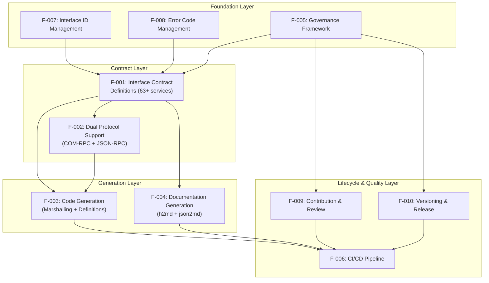
```mermaid
flowchart TB
    subgraph LifecycleQuality["Lifecycle &amp; Quality Layer"]
        F006["F-006: CI/CD Pipeline"]
        F009["F-009: Contribution &amp; Review"]
        F010["F-010: Versioning &amp; Release"]
    end

    subgraph GenerationLayer["Generation Layer"]
        F003["F-003: Code Generation<br/>(Marshalling + Definitions)"]
        F004["F-004: Documentation Generation<br/>(h2md + json2md)"]
    end

    subgraph ContractLayer["Contract Layer"]
        F001["F-001: Interface Contract<br/>Definitions (63+ services)"]
        F002["F-002: Dual Protocol Support<br/>(COM-RPC + JSON-RPC)"]
    end

    subgraph FoundationLayer["Foundation Layer"]
        F005["F-005: Governance Framework"]
        F007["F-007: Interface ID Management"]
        F008["F-008: Error Code Management"]
    end

    F007 --> F001
    F008 --> F001
    F005 --> F001
    F001 --> F002
    F001 --> F003
    F001 --> F004
    F002 --> F003
    F005 --> F009
    F005 --> F010
    F003 --> F006
    F004 --> F006
    F009 --> F006
    F010 --> F006
```

### 5.1.2 Core Components

The repository comprises eight major architectural components, each with distinct responsibilities, dependencies, and integration surface areas.

#### Component Registry

| Component | Primary Responsibility | Key Dependencies |
|---|---|---|
| API Interface Definitions (`apis/` — 63+ subdirs) | C++ header-based service contracts with JSON-RPC annotations | `apis/Ids.h`, `apis/Module.h`, Thunder `Core::IUnknown` |
| Shared Support Files (`apis/Ids.h`, `Module.h`, etc.) | Framework-wide infrastructure: IDs, module wiring, error codes, portability | Thunder `RPC::IDS`, Thunder core/plugin headers |
| Marshalling Library (root `CMakeLists.txt`) | COM-RPC proxy/stub generation and compilation | `${NAMESPACE}Core`, `${NAMESPACE}COM`, ThunderTools |
| Definitions Library (`build/CMakeLists.txt`) | JSON-RPC binding code generation (two-pass) | `${NAMESPACE}Core`, ThunderTools `JsonGenerator` |

| Component | Primary Responsibility | Key Dependencies |
|---|---|---|
| Documentation Tools (`tools/md_generator/`) | Header-to-Markdown and JSON-to-Markdown pipelines | Python 3.5+, `jsonref` 1.1.0 |
| Documentation Site (`docs/`) | Docsify-based static API reference (64 services) | Docsify v4 (4.13.1), jsDelivr CDN |
| CI/CD Automation (`.github/workflows/`) | Build validation, header compliance, CLA, security, release, docs | GitHub Actions, Thunder R4_4, FOSSID |
| Governance Policies (`governance.md`) | API lifecycle: naming, versioning, deprecation, review cadences | None (foundational) |

#### Component Integration Points

| Component | Integration Points | Critical Considerations |
|---|---|---|
| API Interface Definitions | ProxyStubGenerator, JsonGenerator, md_generator, downstream plugin repos | Stable ABI via fixed IDs; governance naming compliance |
| Shared Support Files | Referenced by all interface headers and all generators | IDs permanently assigned; error codes limited to 100 |
| Marshalling Library | Installs to `lib/${NAMESPACE_LIB}/proxystubs` and `include/${NAMESPACE}/interfaces` | Requires CMake ≥ 3.12, C++11; legacy `cdmi.h → IDRM.h` link |
| Definitions Library | Installs JSON headers to `include/${NAMESPACE}/interfaces/json`; exports CMake package config | Requires CMake ≥ 3.3; two-pass generation strategy |
| Documentation Tools | CI/CD `generate_doc.yml`, Docsify site (`docs/`) | Supports incremental and full regeneration modes |
| Documentation Site | GitHub Pages hosting, Google Analytics tracking | Zero-build architecture; Markdown files directly served |
| CI/CD Automation | GitHub PR/push events, external reusable workflows | Patches applied to Thunder/ThunderTools during CI build |
| Governance Policies | Governs all other components | Monthly, Weekly, Impromptu, Annual review cadences |

### 5.1.3 Data Flow Architecture

#### Primary Data Flow: Dual-Protocol Code Generation Pipeline

The central data flow in the system transforms annotated C++ interface headers and JSON schema definitions into two distinct sets of protocol-specific artifacts, all orchestrated at build time through CMake configurations.

The **COM-RPC path** begins when the Marshalling Component (root `CMakeLists.txt`, project version 4.4.1) uses `file(GLOB_RECURSE)` to discover all `I*.h` headers under the `apis/` directory. These headers are fed to the `ProxyStubGenerator` from ThunderTools, which reads the C++ abstract interfaces and generates `ProxyStubs*.cpp` source files into the `${CMAKE_CURRENT_BINARY_DIR}/generated` directory. The generated sources are then compiled into a shared library (`${NAMESPACE}Marshalling`) linked against Thunder's `${NAMESPACE}Core` and `${NAMESPACE}COM` libraries. The resulting proxy/stub library is installed to `lib/${NAMESPACE_LIB}/proxystubs`, and the original interface headers are installed to `include/${NAMESPACE}/interfaces` for downstream consumption.

The **JSON-RPC path** operates through the Definitions Component (`build/CMakeLists.txt`, version 4.4.1) using a two-pass generation strategy. In the first pass, `JsonGenerator` processes JSON schema files (`apis/*/*.json`) to produce initial binding definitions. In the second pass, `JsonGenerator` processes the C++ interface headers (`apis/*/I*.h`) to generate the remaining JSON-RPC binding code. The combined output — `JsonEnum*.cpp` compilation units and `J*.h` binding headers — is compiled into a shared library (`${NAMESPACE}Definitions`) and installed to `include/${NAMESPACE}/interfaces/json`. CMake package configuration is exported via `InstallPackageConfig()` and `InstallCMakeConfig()` for downstream integration.

The **documentation path** operates through the Python-based `tools/md_generator/` pipeline. Change detection via `git diff` identifies modified `.h` and `.json` files, which are routed to either the header-to-Markdown pipeline (`h2md/generate_md_from_header.py`) or the JSON-to-Markdown pipeline (`json2md/generator_json.py`). Post-processing normalizes link fragments and token prefixes, and `update_sidebar.py` maintains the API link block in `docs/_sidebar.md`. Changes are auto-committed to the PR branch or a dated topic branch.

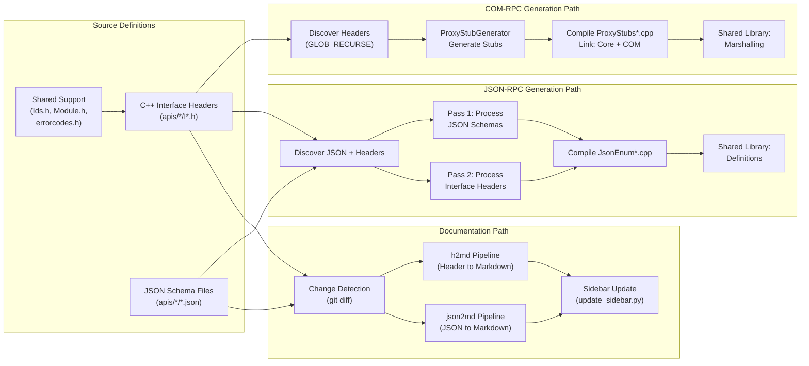
```mermaid
flowchart LR
    subgraph Sources["Source Definitions"]
        Headers["C++ Interface Headers<br/>(apis/*/I*.h)"]
        Schemas["JSON Schema Files<br/>(apis/*/*.json)"]
        Support["Shared Support<br/>(Ids.h, Module.h,<br/>errorcodes.h)"]
    end

    subgraph COMRPCPath["COM-RPC Generation Path"]
        PSGlob["Discover Headers<br/>(GLOB_RECURSE)"]
        PSGen["ProxyStubGenerator<br/>Generate Stubs"]
        PSCompile["Compile ProxyStubs*.cpp<br/>Link: Core + COM"]
        PSLib["Shared Library:<br/>Marshalling"]
    end

    subgraph JSONRPCPath["JSON-RPC Generation Path"]
        JGDiscover["Discover JSON + Headers"]
        JGPass1["Pass 1: Process<br/>JSON Schemas"]
        JGPass2["Pass 2: Process<br/>Interface Headers"]
        JGCompile["Compile JsonEnum*.cpp"]
        JGLib["Shared Library:<br/>Definitions"]
    end

    subgraph DocPath["Documentation Path"]
        DiffDetect["Change Detection<br/>(git diff)"]
        H2MD["h2md Pipeline<br/>(Header to Markdown)"]
        J2MD["json2md Pipeline<br/>(JSON to Markdown)"]
        Sidebar["Sidebar Update<br/>(update_sidebar.py)"]
    end

    Support --> Headers
    Headers --> PSGlob
    PSGlob --> PSGen
    PSGen --> PSCompile
    PSCompile --> PSLib

    Headers --> JGDiscover
    Schemas --> JGDiscover
    JGDiscover --> JGPass1
    JGDiscover --> JGPass2
    JGPass1 --> JGCompile
    JGPass2 --> JGCompile
    JGCompile --> JGLib

    Headers --> DiffDetect
    Schemas --> DiffDetect
    DiffDetect --> H2MD
    DiffDetect --> J2MD
    H2MD --> Sidebar
    J2MD --> Sidebar
```

#### Secondary Data Flow: Contribution and Release Pipeline

The contribution pipeline flows from contributor fork through parallel CI/CD quality gates (CLA enforcement, header validation, build validation, FOSSID scan, documentation generation), governance review, and finally to release via the git-flow branching model with automated changelog generation via `auto-changelog` (v2.5.0). Each merged PR to `develop` triggers the release workflow in `component-release.yml`, which calculates the next semantic version based on the `version: major|minor|patch` directive in the PR description, orchestrates the git-flow release cycle, and pushes tags to the repository.

### 5.1.4 External Integration Points

The repository integrates with external systems exclusively through build-time dependencies, CI/CD platform services, and documentation hosting infrastructure. No runtime integrations exist, consistent with the contract-only architecture.

| System Name | Integration Type | Data Exchange Pattern |
|---|---|---|
| Thunder Framework (WPEFramework, R4_4) | Build-time dependency | `find_package(WPEFramework)` — CMake package resolution |
| ThunderTools (R4_4) | Build-time code generation | `ProxyStubGenerator()`, `JsonGenerator()` CLI commands |
| GitHub Actions | CI/CD platform | Event-triggered YAML workflows (push, PR, comment, dispatch) |
| FOSSID | Security/license scanning | Reusable workflow delegation (`@1.0.0`), secrets-based |

| System Name | Integration Type | Data Exchange Pattern |
|---|---|---|
| rdkcentral/cmf-actions | CLA enforcement | Reusable workflow delegation (`@v1`) |
| Docsify (v4 via jsDelivr CDN) | Documentation rendering | Static Markdown files served as SPA via CDN |
| GitHub Pages | Documentation hosting | HTTPS static hosting from `docs/` directory |
| auto-changelog (v2.5.0) | Release tooling | Git log parsed to generate Markdown changelog |
| git-flow | Release branching | CLI branching commands (start, publish, finish) |
| Downstream Plugin Repos | API consumer (outbound) | `find_package` / CMake package config consumption |

---

## 5.2 COMPONENT DETAILS

### 5.2.1 API Interface Definitions

#### Purpose and Responsibilities

The `apis/` directory contains over 63 service-specific subdirectories, each housing one or more C++ abstract interface headers. These headers constitute the formal contract between the API definition layer and both downstream plugin implementations and application-facing JSON-RPC services. Each interface follows a standardized pattern: Apache 2.0 license header, `#pragma once` guard, `WPEFramework::Exchange` namespace, inheritance from `Core::IUnknown` (COM-style base interface), and a fixed numeric identifier registered in `apis/Ids.h`.

#### Service Domain Coverage

The interface definitions span six functional domains reflecting the breadth of entertainment device platform capabilities:

| Domain | Representative Services | Count |
|---|---|---|
| Browser / App Lifecycle & Management | AppManager, LifecycleManager, RuntimeManager, Monitor | ~14 |
| Media & Playback | AVInput, FrameRate, HdmiCecSink, PlayerInfo, TextToSpeech | ~18 |
| Device & Platform Information | DeviceDiagnostics, DeviceIdentification, DeviceInfo, DisplayInfo | ~10 |
| Storage, Telemetry & Security | Backup, OpenCDMi, PersistentStore, SharedStorage, Telemetry | ~8 |
| Browser / Compositor / Runtime | DTV, Netflix, OCIContainer, RDKShell, WebKitBrowser | ~8 |
| Analytics & Updates | Analytics, FirmwareDownload, FirmwareUpdate, DownloadManager | ~5 |

#### Technologies and Framework Integration

All interfaces are defined in C++11 and depend on the Thunder framework's core type system. The `apis/Module.h` file establishes the module wiring by including Thunder's `<core/core.h>`, `<plugins/IPlugin.h>`, `<plugins/ISubSystem.h>`, `<plugins/IShell.h>`, and `<plugins/IStateControl.h>`, along with local references to `Ids.h` and `entservices_errorcodes.h`. The default module name is set to `Interfaces`.

#### Key Interface Conventions

Interface headers adhere to governance-mandated conventions that ensure consistency across the entire service catalog:

- **Methods** return `Core::hresult` and use PascalCase for COM-RPC identifiers and camelCase for JSON-RPC (controlled by `@text` annotations)
- **Properties** use getter/setter patterns: `Get`/`Set` for COM-RPC, `get`/`set` for JSON-RPC
- **Events** follow the `on[Object][Action]` naming pattern with notification interfaces that have default (non-pure-virtual) implementations
- **Enumerations** use `ALL_UPPER_SNAKE_CASE` values
- **Parameters** are camelCase with valid ASCII characters
- **JSON-RPC annotations**: `@json 1.0.0`, `@text:keep`, `@property`, `@brief`, `@param`, `@retval`, `@event`

#### Scaling Considerations

The modular directory structure (`apis/<ServiceName>/`) supports unlimited service additions without modification to the build system, as glob patterns (`./apis/*/I*.h`) in both `CMakeLists.txt` files automatically discover new interfaces. The 16-ID block grouping in `apis/Ids.h` provides expansion room within each service domain, with the observed range spanning `0x000` to `0x510+`.

### 5.2.2 Shared Support Files

#### Purpose and Responsibilities

Seven shared infrastructure files at the `apis/` directory level provide foundational capabilities consumed by all interface headers, code generators, and build configurations.

#### Component Breakdown

**`apis/Ids.h`** (364 lines) serves as the canonical fixed numeric identifier registry for all Exchange interfaces. Within the `WPEFramework::Exchange` namespace, it defines the `IDS : uint32_t` enumeration starting from `ID_ENTOS_OFFSET = RPC::IDS::ID_EXTERNAL_CC_INTERFACE_OFFSET`. Each service group is allocated a 16-ID block (the default gap between groups), ensuring room for interface versioning within each domain. The permanence policy is absolute: once assigned, an ID is never changed, removed, or reassigned, as the identifier is as important as the interface syntax itself for ABI stability.

**`apis/entservices_errorcodes.h`** (48 lines) implements a custom error code framework using the X-macro pattern (`ENTSERVICES_ERRORCODES(X)`). The base offset of 1000 maps to the JSON-RPC implementation-defined error range (-32000 to -32099), allowing up to 100 custom error codes across all services. Five errors are currently defined: `ERROR_INVALID_DEVICENAME`, `ERROR_INVALID_MOUNTPOINT`, `ERROR_FIRMWAREUPDATE_INPROGRESS`, `ERROR_FIRMWAREUPDATE_UPTODATE`, and `ERROR_FILE_IO`. Utility macros `IS_ENTSERVICES_ERRORCODE()` and `ERROR_MESSAGE()` provide validation and human-readable lookup.

**`apis/Module.h`** provides the module wiring layer, defining `MODULE_NAME = Interfaces` and including all necessary Thunder core and plugin headers.

**`apis/Portability.h`** supplies cross-compiler macros for GCC, Clang, and MSVC — including `DEPRECATED`, `VARIABLE_IS_NOT_USED`, `WARNING_RESULT_NOT_USED`, `PUSH_WARNING`, and `POP_WARNING` — ensuring consistent behavior across the compiler toolchains used by various RDK device platforms.

**`apis/definitions.h`** and **`apis/common.json`** provide shared type definitions and common JSON schema objects consumed by the code generation toolchain.

### 5.2.3 Marshalling Library

#### Purpose and Responsibilities

The Marshalling Component, defined in the root `CMakeLists.txt` (project version 4.4.1), is responsible for generating and compiling COM-RPC proxy/stub code from interface headers. The generated proxy/stubs enable cross-process communication between Thunder plugins using the COM-RPC protocol, which is the mandatory communication mechanism for inter-plugin calls.

#### Technologies and Build Configuration

| Attribute | Detail |
|---|---|
| CMake Minimum | 3.12 |
| C++ Standard | C++11 (required) |
| Project Version | 4.4.1 |
| Input Discovery | `file(GLOB_RECURSE)` on `./apis/*/I*.h` and `./apis/I*.h` |
| Generator Tool | `ProxyStubGenerator()` from ThunderTools |
| Output | `ProxyStubs*.cpp` → `${NAMESPACE}Marshalling` shared library |
| Link Dependencies | `${NAMESPACE}Core`, `${NAMESPACE}COM`, `CompileSettingsDebug` |
| Install Location | Library: `lib/${NAMESPACE_LIB}/proxystubs`; Headers: `include/${NAMESPACE}/interfaces` |

The build configuration discovers Thunder via `find_package(WPEFramework NAMES WPEFramework Thunder)`, supporting dual naming conventions. A legacy compatibility symlink is maintained via `CreateLink(LINK cdmi.h TARGET IDRM.h)`. After building the Marshalling component, the build cascades to the Definitions component via `add_subdirectory(build)`.

### 5.2.4 Definitions Library

#### Purpose and Responsibilities

The Definitions Component, defined in `build/CMakeLists.txt` (version 4.4.1), generates JSON-RPC binding code from both JSON schema files and annotated C++ interface headers using a distinctive two-pass generation strategy.

#### Two-Pass Generation Strategy

| Pass | Input | Generator Command | Output |
|---|---|---|---|
| Pass 1 | JSON schema files (`apis/*/*.json`) | `JsonGenerator(CODE INPUT ${JSON_FILE} ...)` | Initial JSON-RPC binding definitions |
| Pass 2 | Interface headers (`apis/*/I*.h`) | `JsonGenerator(CODE INPUT ${INTERFACE_FILE} ...)` | Complete JSON-RPC binding code and headers |

The two-pass approach ensures that JSON schema definitions are processed first (establishing shared type definitions), followed by header-based generation that can reference the schemas. Symbolic links for `Module.h`, `Ids.h`, and `Ids_comcast.h` are created in the generated output directory to ensure proper include resolution during compilation.

The compiled output (`${NAMESPACE}Definitions` shared library from `JsonEnum*.cpp` files) and generated binding headers (`J*.h`) are installed to `include/${NAMESPACE}/interfaces/json`. CMake package configuration is exported via `InstallPackageConfig()` and `InstallCMakeConfig()`, enabling downstream repositories to consume the generated artifacts through standard CMake `find_package` integration.

An optional dependency on `${NAMESPACE}PrivilegedRequest` is resolved quietly (QUIET keyword), allowing the build to succeed in environments where privileged request handling is not available.

### 5.2.5 Documentation Toolchain

#### Purpose and Responsibilities

The documentation toolchain consists of two subsystems: the **generation pipeline** (`tools/md_generator/`) that transforms source definitions into Markdown, and the **presentation layer** (`docs/`) that renders the Markdown as a browsable API reference site.

#### Generation Pipeline Architecture

The generation pipeline provides three entry points: `generate_md.py` for full regeneration of all service documentation, `generate_md_incremental.py` for processing only changed files, and `update_sidebar.py` for maintaining the navigation sidebar.

Two parallel conversion pipelines handle the different source formats:
- **h2md pipeline** (`tools/md_generator/h2md/generate_md_from_header.py`): Parses C++ interface headers to extract methods, properties, events, enumerations, and structures, producing structured Markdown reference pages. Requires Python 3.8.10+ for optimal operation.
- **json2md pipeline** (`tools/md_generator/json2md/generator_json.py`): Processes JSON schema files using the `jsonref` library (version 1.1.0) to resolve `$ref` references, producing Markdown documentation for legacy JSON-schema-defined services.

#### Presentation Layer

The Docsify-based static site at `docs/` (version 4, currently 4.13.1) provides a zero-build documentation architecture. Markdown files are served directly by GitHub Pages at `https://rdkcentral.github.io/entservices-apis/` without any compilation step. The site is configured in `docs/index.html` with custom sidebar navigation, full-text search, tabbed content support, code block copy functionality, image zoom, pagination controls, and Google Analytics tracking via eight Docsify plugins loaded from jsDelivr CDN.

### 5.2.6 CI/CD Automation

#### Purpose and Responsibilities

Seven GitHub Actions workflows and two Python validation scripts provide comprehensive automated quality gates for every code change, covering build validation, interface compliance, contributor licensing, security scanning, documentation generation, and release orchestration.

#### Workflow Architecture

```mermaid
flowchart TB
    subgraph Triggers["Event Triggers"]
        PushDev["Push to develop"]
        PROpen["PR Opened/Synced"]
        PRMerge["PR Merged to develop"]
        Manual["Manual Dispatch"]
        Comment["Issue Comment"]
    end

    subgraph ValidationWFs["Build &amp; Validation Workflows"]
        WF1["Build on Ubuntu<br/>(Thunder R4_4 +<br/>CMake + Ninja)"]
        WF2["Full Header<br/>Validation<br/>(All apis/*.h)"]
        WF3["Incremental Header<br/>Validation<br/>(Changed .h Only)"]
    end

    subgraph ComplianceWFs["Compliance Workflows"]
        WF4["CLA Enforcement<br/>(cmf-actions@v1)"]
        WF5["FOSSID License Scan<br/>(Non-Fork PRs)"]
    end

    subgraph OutputWFs["Documentation &amp; Release"]
        WF6["Documentation Gen<br/>(h2md + json2md +<br/>Auto-Commit)"]
        WF7["Release Pipeline<br/>(git-flow +<br/>auto-changelog)"]
    end

    PushDev --> WF1
    PROpen --> WF1
    PROpen --> WF2
    PROpen --> WF3
    PROpen --> WF4
    PROpen --> WF5
    PROpen --> WF6
    PROpen --> WF7
    PRMerge --> WF7
    Manual --> WF6
    Comment --> WF4
```

#### Build Validation Pipeline Detail

The build validation workflow (`Build_entservices-apis_on_Ubuntu.yml`) executes a comprehensive multi-step process on every push or PR to `develop`:

1. Checkout the repository and install system dependencies (cmake, ninja-build, build-essential, git)
2. Clone ThunderTools and Thunder from the R4_4 branch
3. Install Python `jsonref` dependency
4. Apply custom patches from `.github/Patches/` to both ThunderTools and Thunder for compatibility
5. Build ThunderTools and install to a shared prefix
6. Build the Thunder Framework with `BINDING=127.0.0.1`, `PORT=55555`, and debug mode enabled
7. Build the Marshalling Component (root `CMakeLists.txt`) — invoking `ProxyStubGenerator` on all discovered `apis/*/I*.h` headers
8. Build the Definitions Component (`build/CMakeLists.txt`) — invoking `JsonGenerator` in its two-pass strategy

### 5.2.7 Component Interaction Diagram

The following diagram illustrates the detailed runtime interactions between all major components during the primary build and generation workflows:

```mermaid
sequenceDiagram
    participant Dev as Contributor
    participant GH as GitHub Repository
    participant CI as CI/CD Pipeline
    participant TT as ThunderTools (R4_4)
    participant TF as Thunder Framework (R4_4)
    participant Plugin as Downstream Plugin Repo
    participant App as Application Developer

    Dev->>GH: Submit PR with Interface Changes
    activate GH
    GH->>CI: Trigger Parallel CI Workflows
    activate CI

    CI->>TT: Clone ThunderTools R4_4 + Apply Patches
    CI->>TF: Clone Thunder R4_4 + Apply Patches
    TT-->>CI: ProxyStubGenerator + JsonGenerator Available
    TF-->>CI: Core + COM Libraries Available

    CI->>CI: Marshalling Build (ProxyStubGenerator)
    Note right of CI: Input: apis/*/I*.h<br/>Output: ProxyStubs*.cpp<br/>→ Marshalling Shared Library

    CI->>CI: Definitions Build (JsonGenerator Two-Pass)
    Note right of CI: Pass 1: apis/*/*.json<br/>Pass 2: apis/*/I*.h<br/>→ Definitions Shared Library

    CI->>CI: Validate Headers (Full + Incremental)
    CI->>CI: Generate Documentation (h2md/json2md)
    CI-->>GH: Report CI Results
    deactivate CI
    GH-->>Dev: PR Status Update
    deactivate GH

    Note over GH: PR Approved → Merged → Released

    Plugin->>GH: find_package(WPEFramework)
    GH-->>Plugin: Interface Headers + Package Config
    Plugin->>TF: Build Plugin Against Thunder
    TF-->>Plugin: Compiled Plugin Service

    App->>GH: Access docs/ Site
    GH-->>App: Docsify API Reference
    App->>Plugin: JSON-RPC Calls (HTTP/WebSocket)
    Plugin-->>App: JSON-RPC Responses
```

---

## 5.3 TECHNICAL DECISIONS

### 5.3.1 Architecture Style: Contract-Only Repository

#### Decision and Context

The most consequential architectural decision is the separation of interface definitions from plugin implementations into a dedicated contract-only repository.

| Aspect | Detail |
|---|---|
| Decision | Maintain interface definitions exclusively in `entservices-apis`; implementations in separate repos |
| Alternatives Considered | Bundled approach (as in predecessor `rdkservices` which combined contracts and implementations) |
| Rationale | Eliminates coupling; enables parallel development; provides single source of truth for contracts |
| Tradeoff | Requires build-time dependency management across repositories; adds integration complexity |

This decision evolved from the predecessor `rdkservices` repository, which bundled both interface definitions and plugin implementations. The modernized approach enables independent release cadences for API contracts versus service implementations, and reduces build times for contributors who only need to validate contract changes.

### 5.3.2 IDL Approach: Annotated C++ Headers

#### Decision and Context

| Aspect | Detail |
|---|---|
| Decision | Use annotated C++ abstract interface headers as the Interface Definition Language |
| Alternatives Considered | Dedicated IDL (e.g., Protocol Buffers, Thrift, FIDL), pure JSON schema definitions |
| Rationale | Thunder framework is C++11-native; enables direct COM-RPC support + JSON-RPC generation from annotations; eliminates interface drift between protocols |
| Tradeoff | Requires C++ compilation toolchain; annotations are specific to ThunderTools |

The annotation system (`@json 1.0.0`, `@text:keep`, `@property`, `@stubgen:omit`) enables the ThunderTools generators to produce protocol-specific artifacts from a single source. This is more efficient than maintaining separate definitions for each protocol and ensures that COM-RPC and JSON-RPC interfaces always remain synchronized.

### 5.3.3 Dual-Protocol Communication Strategy

#### Decision and Context

| Aspect | Detail |
|---|---|
| Decision | COM-RPC for inter-plugin communication (mandatory); JSON-RPC for application-to-service (optional) |
| Alternatives Considered | JSON-RPC only (simpler but higher overhead); gRPC (not native to Thunder) |
| Rationale | COM-RPC provides lower overhead for service-to-service calls; JSON-RPC provides standard-based access for apps |
| Evidence | `README.md` states JSON-RPC is "an overhead and not preferred for inter-plugin communication" |

When a service requires only JSON-RPC and does not need COM-RPC proxy/stub generation, the `@stubgen:omit` annotation suppresses the COM-RPC path for that interface. This selective generation capability provides flexibility while maintaining the dual-protocol default.

### 5.3.4 Fixed Interface Identifiers

| Aspect | Detail |
|---|---|
| Decision | Permanently assign numeric IDs to interfaces in `apis/Ids.h` with 16-ID block grouping |
| Alternatives Considered | Dynamic ID assignment at runtime; hash-based identification |
| Rationale | ABI stability across builds and firmware versions; some deployment scenarios do not rebuild all components |
| Constraint | IDs cannot be reused, changed, or removed once assigned (Constraint C-002) |

### 5.3.5 Documentation Framework Selection

| Aspect | Detail |
|---|---|
| Decision | Docsify v4 for zero-build static documentation |
| Alternatives Considered | Jekyll (requires Ruby build step); Sphinx (requires Python build step); MkDocs (requires build step) |
| Rationale | Serves Markdown directly without compilation; aligns with auto-generated Markdown from h2md/json2md pipelines |
| Evidence | `docs/index.html` configures Docsify with CDN delivery via jsDelivr |

### 5.3.6 Release Strategy: Semantic Versioning with git-flow

| Aspect | Detail |
|---|---|
| Decision | Semantic Versioning (Major.Minor.Patch) with git-flow branching |
| Alternatives Considered | Calendar versioning; trunk-based development |
| Rationale | Clear signaling of breaking vs. non-breaking changes; automated changelog generation; structured release process |
| Evidence | `component-release.yml` implements git-flow with `auto-changelog` v2.5.0 |

#### Version Calculation Decision Tree

```mermaid
flowchart TD
    PRMerged(["PR Merged to develop"]) --> ExtractDirective["Extract version: directive<br/>from PR description"]
    ExtractDirective --> DirectiveFound{{"Directive Found?"}}
    DirectiveFound -->|"No"| DefaultPatch["Default: Patch Increment"]
    DirectiveFound -->|"Yes"| ParseType{{"Version Type?"}}
    ParseType -->|"major"| MajorCalc["Major+1, Minor=0, Patch=0<br/>(Breaking Change)"]
    ParseType -->|"minor"| MinorCalc["Minor+1, Patch=0<br/>(Non-Breaking Addition)"]
    ParseType -->|"patch"| PatchCalc["Patch+1<br/>(Trivial Fix)"]
    MajorCalc --> CheckTag{{"Tag Exists?"}}
    MinorCalc --> CheckTag
    PatchCalc --> CheckTag
    DefaultPatch --> CheckTag
    CheckTag -->|"Yes"| SkipRelease(["Skip: Tag Exists"])
    CheckTag -->|"No"| ExecuteRelease["Execute git-flow Release<br/>+ auto-changelog"]
    ExecuteRelease --> PushArtifacts(["Push: main, tags, develop"])
```

### 5.3.7 Architecture Decision Summary

```mermaid
flowchart LR
    subgraph Decisions["Key Architecture Decisions"]
        ADR1["ADR-1: Contract-Only<br/>Repository Pattern"]
        ADR2["ADR-2: C++ Headers<br/>as IDL"]
        ADR3["ADR-3: Dual Protocol<br/>(COM-RPC + JSON-RPC)"]
        ADR4["ADR-4: Fixed<br/>Interface IDs"]
        ADR5["ADR-5: Docsify Zero-Build<br/>Documentation"]
        ADR6["ADR-6: Semantic Versioning<br/>+ git-flow"]
    end

    subgraph Drivers["Architectural Drivers"]
        D1["ABI Stability"]
        D2["Protocol Consistency"]
        D3["Parallel Development"]
        D4["Automation"]
        D5["Governance"]
    end

    D1 --> ADR4
    D2 --> ADR2
    D2 --> ADR3
    D3 --> ADR1
    D4 --> ADR2
    D4 --> ADR5
    D5 --> ADR6
    D5 --> ADR1
```

---

## 5.4 CROSS-CUTTING CONCERNS

### 5.4.1 Error Handling Patterns

#### Custom Error Code Framework

The repository defines a governed error handling vocabulary through `apis/entservices_errorcodes.h`, using the X-macro pattern to generate both enumeration values and string lookup tables from a single definition. The framework imposes a clear registration discipline:

1. Developers must consult Thunder Framework-defined errors before proposing new custom errors
2. New errors are added to the `ENTSERVICES_ERRORCODES(X)` macro
3. The error is submitted through the standard contribution workflow (F-009)
4. The `IS_ENTSERVICES_ERRORCODE()` macro validates whether a code falls within the custom range
5. The `ERROR_MESSAGE()` macro provides human-readable descriptions

#### JSON-RPC Error Response Contract

The governance framework mandates strict mutual exclusion in JSON-RPC responses:

| Response Type | Content | Rule |
|---|---|---|
| Success | Returns `result` object | Must NOT include `error` field |
| Error | Returns `error` with `code` + `message` | Must NOT include `result` field |
| Mutual Exclusion | Either `result` or `error` | Never both simultaneously |

The Thunder framework enforces this formatting automatically when `ProxyStubGenerator` and `JsonGenerator` are used, as all interface methods return `Core::hresult`.

#### CI/CD Error Recovery Flow

```mermaid
flowchart TD
    ErrorDetected(["Error Detected<br/>in Pipeline"]) --> ErrorCategory{{"Error Category"}}

    ErrorCategory -->|"CLA Not Signed"| CLABlock["PR Merge Blocked"]
    CLABlock --> SignCLA["Contributor Signs<br/>CLA via Assistant"]
    SignCLA --> CLARetrigger["Re-triggered on<br/>PR Synchronize"]
    CLARetrigger --> CLAResolved(["CLA Resolved"])

    ErrorCategory -->|"Header Validation<br/>Failure"| HeaderFail["CI Check Fails<br/>(Naming, Annotations,<br/>Structure, Return Types)"]
    HeaderFail --> FixHeaders["Fix Non-Compliant<br/>Headers"]
    FixHeaders --> PushFix1["Push Corrected Code"]
    PushFix1 --> HeaderResolved(["Validation Re-triggered"])

    ErrorCategory -->|"Build Failure"| BuildFail["Build Step Fails<br/>(C++11, Thunder API,<br/>CMake Config)"]
    BuildFail --> DiagBuild["Diagnose Build Logs"]
    DiagBuild --> FixBuild["Fix Compilation Errors"]
    FixBuild --> PushFix2["Push Corrected Code"]
    PushFix2 --> BuildResolved(["Build Re-triggered"])

    ErrorCategory -->|"Release Failure"| ReleaseFail["Release Workflow Fails"]
    ReleaseFail --> AutoCleanup["Automatic Tag Cleanup:<br/>Delete Local + Remote Tag"]
    AutoCleanup --> Investigate["Investigate Root Cause"]
    Investigate --> RetryRelease["Re-trigger Release"]
    RetryRelease --> ReleaseResolved(["Release Recovered"])

    ErrorCategory -->|"Missing Version<br/>Directive"| VersionFail["PR Validation Fails"]
    VersionFail --> EditPR["Edit PR Description:<br/>Add version: directive"]
    EditPR --> VersionResolved(["Validated on<br/>PR Edit Event"])
```

### 5.4.2 Security Framework

Security in the `entservices-apis` repository is addressed at the contribution and compliance layer rather than the runtime layer, consistent with the contract-only architecture. Runtime security enforcement (token management, access control) is delegated to the Thunder framework's SecurityAgent plugin and is explicitly out of scope (Constraint C-005).

#### Contribution-Level Security Measures

| Security Measure | Implementation | Automation |
|---|---|---|
| CLA Enforcement | `cla.yml` via `rdkcentral/cmf-actions@v1` | Fully automated; blocks merge until signed |
| License/Security Scanning | FOSSID diff scan on non-fork PRs | Automated via reusable workflow (`@1.0.0`) |
| Composition Analysis | BlackDuck automated PR check | Automated on PR submission |
| Copyright Verification | Automated CI check for Apache 2.0 headers | Automated |
| Apache 2.0 Compliance | License header required on all source files | Enforced through header validation |
| API Security Design | Governance requires robust security mechanisms where needed | Manual governance review |

### 5.4.3 Validation and Compliance

The repository employs a multi-layered validation strategy ensuring that all interface definitions meet governance standards before merge.

#### Header Validation Rules

Python-based validation scripts (`validate_interface_headers.py` for full scope and `validate_interface_headers_incremental.py` for changed files only) enforce governance conventions through regex-driven analysis:

| Validation Rule | Convention Enforced |
|---|---|
| Interface naming | PascalCase class names |
| Method naming | PascalCase (COMRPC) / camelCase (JSON-RPC) |
| Parameter naming | camelCase with valid ASCII |
| Enumeration values | `ALL_UPPER_SNAKE_CASE` |
| Event naming | `on[Object][Action]` pattern |
| Return types | All methods return `Core::hresult` |
| ID registry | Unique, non-reused IDs in `apis/Ids.h` |

The incremental validation mode processes only files changed in the current PR (determined via `git diff --name-only` between base and HEAD), providing faster feedback while the full validation mode checks all headers in the repository as a comprehensive sweep.

### 5.4.4 Performance and Scalability

Performance considerations for this contract-only repository center on build-time efficiency and scalability of the interface catalog rather than runtime behavior.

| Requirement | Approach | Evidence |
|---|---|---|
| Scalable API design | APIs designed to scale functionally and performance-wise | `governance.md` (line 22) |
| COM-RPC for inter-plugin | Mandatory for lower-overhead service-to-service communication | `README.md` (line 151) |
| JSON-RPC for apps only | Acceptable overhead for application-to-service calls | `README.md` (line 151) |
| Incremental CI validation | Changed-file-only validation for faster PR feedback | `Validate_Interface_headers_incremental.yml` |
| Build scalability | Glob patterns auto-discover new services without build config changes | `CMakeLists.txt` |

#### Scalability Design Points

- **Service catalog growth**: The modular `apis/<ServiceName>/` structure supports unlimited additions; 63+ services currently exist with active expansion (GoogleCast, AppGatewayTelemetry, Bluetooth enhancements added in recent release cycles)
- **ID space capacity**: The 16-ID block grouping with the range spanning `0x000` to `0x510+` provides substantial room for new service registrations
- **Error code headroom**: 100-code range with only 5 currently defined provides ample capacity for growth
- **Documentation scaling**: The auto-generation pipeline handles all 64+ documented services, with incremental mode ensuring that only changed APIs trigger regeneration

### 5.4.5 Versioning and Backward Compatibility

The repository employs semantic versioning (Major.Minor.Patch) governed by `governance.md` and automated through `component-release.yml`:

- **Major** (breaking/backward-incompatible): Requires prior deprecation via `@deprecated` tag in headers or `["deprecated"]` label in JSON schemas. Non-breaking consumers must not be forced to change.
- **Minor** (non-breaking additions): New methods, properties, or events added to existing interfaces or new interfaces introduced entirely.
- **Patch** (trivial fixes): Documentation corrections, annotation adjustments, or non-functional header changes.

The current API release stands at version 3.5.0 (with 11+ releases from 3.0.0 through 3.5.0 within a single quarter), and the build component at version 4.4.1. Plugin versioning is explicitly out of scope — the versioning governs only the API contract definitions (Constraint C-004).

### 5.4.6 Cross-Compiler Portability

The `apis/Portability.h` header provides compiler abstraction macros ensuring consistent behavior across the GCC, Clang, and MSVC toolchains used by various RDK device platforms. These macros abstract compiler-specific pragma syntax for warning management, deprecation markers, and unused variable annotations, enabling the same interface headers to compile cleanly across all target environments.

### 5.4.7 Architectural Assumptions

The following assumptions underpin the architecture and, if invalidated, would require architectural reassessment:

| ID | Assumption | Impact if Invalidated |
|---|---|---|
| A-001 | Thunder Framework R4_4 branch remains the target build baseline | Build validation workflows and patches must be updated |
| A-002 | Downstream plugin repos correctly consume generated headers | API utility diminished; integration patterns require revision |
| A-003 | Contributors sign the CLA before submitting PRs | Legal compliance workflow disrupted |
| A-004 | Python 3.5+ is available in all CI/CD environments | Documentation generation pipeline fails |
| A-005 | `ID_ENTOS_OFFSET` base value remains stable in Thunder | All interface IDs would require recalculation |

---

## 5.5 REFERENCES

#### Files Examined

- `CMakeLists.txt` — Root Marshalling component build configuration (project version 4.4.1, CMake ≥ 3.12, ProxyStubGenerator invocation, COM-RPC proxy/stub compilation, dependency chains)
- `build/CMakeLists.txt` — Definitions component build configuration (version 4.4.1, two-pass JsonGenerator invocation, JSON-RPC binding generation, CMake package export)
- `apis/Module.h` — Module infrastructure wiring (MODULE_NAME=Interfaces, Thunder core/plugin includes, Ids.h and errorcodes.h references)
- `apis/Ids.h` — Fixed numeric identifier registry (WPEFramework::Exchange namespace, IDS enum, 16-ID block grouping, permanence policy)
- `apis/entservices_errorcodes.h` — Custom error code framework (X-macro pattern, ERROR_BASE=1000, 5 defined errors, validation macros)
- `apis/Portability.h` — Cross-compiler portability macros (GCC, Clang, MSVC abstraction)
- `apis/definitions.h` — Shared type definitions for code generation
- `apis/common.json` — Common JSON schema objects for JSON-RPC generation
- `governance.md` — API governance model (naming conventions, versioning policy, review cadences, deprecation workflow)
- `README.md` — Project overview, contribution guidelines, protocol documentation
- `docs/index.html` — Docsify v4 configuration, CDN plugin/theme references, Google Analytics

#### Folders Examined

- `apis/` — 63+ service-specific subdirectories and 7 shared support files (full API surface)
- `build/` — Definitions component build configuration
- `.github/workflows/` — 7 YAML workflow definitions and 2 Python validation scripts (complete CI/CD surface)
- `.github/Patches/` — Build compatibility patches for Thunder and ThunderTools
- `tools/md_generator/` — Documentation generation pipeline (h2md, json2md, sidebar update)
- `docs/` — Docsify-based documentation site (64 documented services)

#### Cross-Referenced Technical Specification Sections

- Section 1.1 — Executive Summary: Project overview, stakeholder model, version information
- Section 1.2 — System Overview: Architecture diagrams, component table, technology stack
- Section 1.3 — Scope: In-scope/out-of-scope boundaries, service domain catalog, device types
- Section 1.4 — Document Conventions and Terminology: Key term definitions
- Section 2.1 — Feature Catalog: 10 features with dependencies and technical context
- Section 2.3 — Feature Relationships: Layered dependency architecture, integration points
- Section 2.4 — Implementation Considerations: Constraints, performance, scalability, security
- Section 2.6 — Assumptions and Constraints: Foundational assumptions and system constraints
- Section 3.2 — Frameworks and Libraries: Thunder, ThunderTools, Docsify, jsonref details
- Section 3.7 — Technology Stack Summary: Complete technology inventory and notable exclusions
- Section 4.1 — High-Level System Workflow: End-to-end process map, workflow domains
- Section 4.2 — Core Business Process Flows: Contribution, build, code generation, documentation, release pipelines
- Section 4.3 — Integration Workflows: CI/CD orchestration, downstream consumer integration, external system map
- Section 4.4 — State Transition Diagrams: API lifecycle, PR lifecycle, release pipeline, interface ID states
- Section 4.5 — Error Handling and Recovery Flows: CI/CD error recovery, release failure, custom error framework
- Section 4.6 — Validation and Decision Logic: Business rules, governance review cadences, timing constraints

# 6. SYSTEM COMPONENTS DESIGN

## 6.1 Core Services Architecture

#### SERVICE ARCHITECTURE

## 6.1 Core Services Architecture

### 6.1.1 Applicability Assessment

#### 6.1.1.1 Architecture Classification

**Core Services Architecture is not applicable for this system in the traditional runtime sense.** The Entertainment Services APIs (`entservices-apis`) repository implements a **Contract-Only Interface Definition Layer (IDL Repository)** — a deliberate architectural pattern in which the repository serves exclusively as the governed, single source of truth for C++ interface definitions across 63+ entertainment services within the RDK middleware ecosystem. No runtime implementation code, plugin logic, or service execution behavior resides in this repository; those responsibilities are delegated to dedicated plugin implementation repositories such as `entservices-runtime` and `entservices-inputoutput`.

As explicitly stated in `governance.md` and enforced through the CI/CD pipeline (Constraint C-001), this repository contains only interface definitions (contracts), not service implementations. Runtime service execution, plugin activation, and process management are handled by the Thunder framework and are entirely outside the repository's architectural boundary. Consequently, the conventional elements of a Core Services Architecture section — including service discovery mechanisms, load balancing strategies, circuit breaker patterns, horizontal/vertical scaling of running services, fault tolerance for live traffic, and disaster recovery procedures — do not apply.

Instead, this section documents the **build-time component architecture** that constitutes the repository's actual service layer: the pipeline of components that transforms interface definitions into protocol-specific artifacts, documentation, and governed releases. This build-time architecture has its own component boundaries, inter-component communication patterns, scalability mechanisms, and resilience patterns that merit thorough documentation.

#### 6.1.1.2 Non-Applicability of Traditional Runtime Service Patterns

The following table provides a systematic mapping of each conventional Core Services Architecture element to its status within this repository, with evidence-based rationale for non-applicability.

| Architecture Element | Applicability | Rationale |
|---|---|---|
| Service Boundaries & Responsibilities | Not Applicable (Runtime) | No runtime services exist; only interface definitions are maintained (`governance.md`, line 42) |
| Inter-Service Communication | Not Applicable (Runtime) | COM-RPC/JSON-RPC protocols are defined contractually but executed by the Thunder framework |
| Service Discovery | Not Applicable | No runtime service registry; Thunder handles plugin lifecycle and resolution |

| Architecture Element | Applicability | Rationale |
|---|---|---|
| Load Balancing | Not Applicable | IDL repository hosts no running services; no traffic distribution is required |
| Circuit Breakers | Not Applicable | No runtime failure handling exists; error code definitions are purely contractual |
| Retry/Fallback Mechanisms | Not Applicable | No runtime retry logic; JSON-RPC error contracts define error vocabulary only |

| Architecture Element | Applicability | Rationale |
|---|---|---|
| Horizontal/Vertical Scaling | Not Applicable (Runtime) | Build-time scalability via glob-based auto-discovery replaces runtime scaling |
| Auto-Scaling Triggers | Not Applicable | No runtime infrastructure; CI/CD operates on event-driven GitHub Actions |
| Fault Tolerance | Not Applicable (Runtime) | CI/CD workflows have error recovery; no live-traffic fault tolerance exists |
| Disaster Recovery | Not Applicable | Static content version-controlled in Git; no runtime state to recover |

#### 6.1.1.3 Contract-to-Runtime Boundary Mapping

The repository occupies a clearly bounded position within the RDK middleware stack. Understanding where the contract layer ends and where runtime services begin is essential for architectural clarity.

```mermaid
flowchart TB
    subgraph ContractLayer["entservices-apis Repository<br/>(Contract-Only — THIS REPOSITORY)"]
        direction TB
        IDL["C++ Interface Headers<br/>(apis/ — 63+ services)"]
        Foundation["Foundation Infrastructure<br/>(Ids.h, Module.h, ErrorCodes)"]
        MarshallingBuild["Marshalling Build<br/>(CMakeLists.txt → ProxyStubs)"]
        DefinitionsBuild["Definitions Build<br/>(build/CMakeLists.txt → JSON Bindings)"]
        DocGen["Documentation Pipeline<br/>(tools/md_generator/)"]
        Governance["Governance Framework<br/>(governance.md)"]
        CICD["CI/CD Quality Gates<br/>(.github/workflows/)"]
    end

    subgraph BoundaryZone["Build-Time Integration Boundary"]
        FindPkg["CMake find_package()<br/>Package Config Export"]
        HeaderInstall["Header Installation<br/>(include/interfaces/)"]
        LibInstall["Library Installation<br/>(lib/proxystubs/)"]
    end

    subgraph RuntimeLayer["Runtime Execution Layer<br/>(OUT OF SCOPE)"]
        direction TB
        Thunder["Thunder Framework<br/>(Plugin Host + SecurityAgent)"]
        PluginRuntime["entservices-runtime<br/>(Plugin Implementations)"]
        PluginIO["entservices-inputoutput<br/>(I/O Plugin Implementations)"]
        AppClients["Application Clients<br/>(JSON-RPC over HTTP/WS)"]
    end

    Foundation --> IDL
    IDL --> MarshallingBuild
    IDL --> DefinitionsBuild
    IDL --> DocGen
    Governance --> IDL
    CICD --> MarshallingBuild
    CICD --> DefinitionsBuild

    MarshallingBuild --> LibInstall
    DefinitionsBuild --> HeaderInstall
    MarshallingBuild --> FindPkg
    DefinitionsBuild --> FindPkg

    FindPkg --> PluginRuntime
    HeaderInstall --> PluginRuntime
    LibInstall --> PluginRuntime
    FindPkg --> PluginIO
    HeaderInstall --> PluginIO
    LibInstall --> PluginIO

    PluginRuntime --> Thunder
    PluginIO --> Thunder
    Thunder --> AppClients
```

The upper boundary of this repository is defined by the build artifacts it produces — proxy/stub shared libraries installed to `lib/${NAMESPACE_LIB}/proxystubs` and JSON-RPC binding headers installed to `include/${NAMESPACE}/interfaces/json`. Everything below this boundary — plugin activation, service discovery, load balancing, security enforcement, and runtime communication — is the domain of the Thunder framework and downstream plugin repositories.

---

### 6.1.2 Build-Time Component Service Architecture

While the repository does not host runtime microservices, it contains a well-defined set of **build-time components** that function as an integrated service architecture. These components have distinct boundaries, dependencies, interaction patterns, and lifecycle management — analogous to services in a runtime architecture but operating exclusively at build and contribution time.

#### 6.1.2.1 Component Boundaries and Responsibilities

The repository comprises eight major architectural components, each with clearly delineated responsibilities and integration surfaces.

| Component | Location | Primary Responsibility |
|---|---|---|
| API Interface Definitions | `apis/` (63+ subdirectories) | C++ header-based service contracts with JSON-RPC annotations |
| Shared Support Files | `apis/Ids.h`, `Module.h`, `entservices_errorcodes.h`, `Portability.h` | Fixed IDs, module wiring, error codes, cross-compiler portability |
| Marshalling Library | Root `CMakeLists.txt` (v4.4.1) | COM-RPC proxy/stub generation via `ProxyStubGenerator` |
| Definitions Library | `build/CMakeLists.txt` (v4.4.1) | JSON-RPC binding generation via `JsonGenerator` (two-pass) |

| Component | Location | Primary Responsibility |
|---|---|---|
| Documentation Tools | `tools/md_generator/` | h2md and json2md Markdown generation pipelines |
| Documentation Site | `docs/` (Docsify v4.13.1) | Zero-build static API reference (64 documented services) |
| CI/CD Automation | `.github/workflows/` (7 workflows) | Build validation, compliance, release orchestration |
| Governance Policies | `governance.md` (203 lines) | API lifecycle management: naming, versioning, deprecation, review |

Each component operates within strict boundaries enforced by the contract-only architectural constraint (Constraint C-001). The Governance Policies component is foundational, governing all other components. The Shared Support Files provide infrastructure consumed by all interface definitions and generators. The API Interface Definitions constitute the core value of the repository, feeding into the three generation components (Marshalling, Definitions, Documentation) which are orchestrated by the CI/CD Automation component.

#### 6.1.2.2 Inter-Component Communication and Dependencies

Components communicate through well-defined mechanisms: file-system artifact sharing, CMake build cascading, CI/CD event triggers, and governance policy enforcement. The following table documents each critical inter-component dependency.

| Source Component | Target Component | Communication Mechanism |
|---|---|---|
| Shared Support Files | API Interface Definitions | `#include "Module.h"`, `#include "Ids.h"` — C++ header inclusion |
| API Interface Definitions | Marshalling Library | `file(GLOB_RECURSE ./apis/*/I*.h)` — CMake glob-based discovery |
| API Interface Definitions | Definitions Library | `file(GLOB)` on `apis/*/*.json` and `apis/*/I*.h` — two-pass input |
| API Interface Definitions | Documentation Tools | `git diff --name-only` — change detection for incremental generation |

| Source Component | Target Component | Communication Mechanism |
|---|---|---|
| Marshalling Library | Definitions Library | `add_subdirectory(build)` — CMake build cascade from root |
| Documentation Tools | Documentation Site | File output to `docs/apis/*.md` + sidebar update |
| CI/CD Automation | All Build Components | GitHub Actions event triggers (push, PR, comment, dispatch) |
| Governance Policies | All Components | Policy enforcement via review cadences and naming conventions |

The build cascade is a critical architectural pattern: when the root `CMakeLists.txt` (Marshalling) completes its proxy/stub generation, it automatically cascades to the Definitions component via `add_subdirectory(build)`, ensuring both COM-RPC and JSON-RPC artifacts are generated in a single build invocation.

#### 6.1.2.3 Component Interaction Diagram

The following sequence diagram illustrates the complete interaction flow between all build-time components during a typical contribution cycle, from PR submission through artifact generation.

```mermaid
sequenceDiagram
    participant C as Contributor
    participant GH as GitHub Repository
    participant CI as CI/CD Pipeline
    participant TT as ThunderTools (R4_4)
    participant TF as Thunder Framework
    participant ML as Marshalling Library
    participant DL as Definitions Library
    participant DT as Documentation Tools
    participant DS as Documentation Site

    C->>GH: Submit PR with Interface Changes
    activate GH
    GH->>CI: Trigger Parallel CI Workflows

    activate CI
    Note over CI: CLA + Header Validation +<br/>Build + FOSSID + Doc Gen

    CI->>TT: Clone ThunderTools R4_4<br/>+ Apply Patches
    CI->>TF: Clone Thunder R4_4<br/>+ Apply Patches
    TT-->>CI: ProxyStubGenerator +<br/>JsonGenerator Available
    TF-->>CI: Core + COM Libraries Available

    CI->>ML: Execute Marshalling Build
    activate ML
    Note right of ML: GLOB_RECURSE apis/*/I*.h<br/>→ ProxyStubs*.cpp<br/>→ Marshalling Shared Library
    ML-->>CI: Proxy/Stub Artifacts Generated
    deactivate ML

    ML->>DL: add_subdirectory(build)
    activate DL
    Note right of DL: Pass 1: JSON Schemas<br/>Pass 2: Interface Headers<br/>→ J*.h + JsonEnum*.cpp<br/>→ Definitions Shared Library
    DL-->>CI: JSON-RPC Bindings Generated
    deactivate DL

    CI->>DT: Trigger Documentation Generation
    activate DT
    Note right of DT: git diff → Changed Files<br/>h2md + json2md pipelines
    DT->>DS: Output Markdown + Update Sidebar
    deactivate DT

    CI-->>GH: Report CI Results
    deactivate CI
    GH-->>C: PR Status Update
    deactivate GH
```

---

### 6.1.3 Interface Catalog as Service Contract Registry

Although the repository does not implement runtime service discovery, the `apis/` directory functions as a **static service contract registry** — a comprehensive catalog of all entertainment service interfaces that downstream runtime systems resolve and instantiate.

#### 6.1.3.1 Service Domain Coverage and Organization

The 63+ service interface definitions are organized into six functional domains that reflect the breadth of entertainment device platform capabilities. Each service occupies its own subdirectory under `apis/`, following the `apis/<ServiceName>/I<ServiceName>.h` convention.

| Domain | Representative Services | Approximate Count |
|---|---|---|
| Browser / App Lifecycle & Management | AppManager, LifecycleManager, RuntimeManager, Monitor | ~14 |
| Media & Playback | AVInput, FrameRate, HdmiCecSink, PlayerInfo, TextToSpeech | ~18 |
| Device & Platform Information | DeviceDiagnostics, DeviceIdentification, DeviceInfo, DisplayInfo | ~10 |

| Domain | Representative Services | Approximate Count |
|---|---|---|
| Storage, Telemetry & Security | Backup, OpenCDMi, PersistentStore, SharedStorage, Telemetry | ~8 |
| Browser / Compositor / Runtime | DTV, Netflix, OCIContainer, RDKShell, WebKitBrowser | ~8 |
| Analytics & Updates | Analytics, FirmwareDownload, FirmwareUpdate, DownloadManager | ~5 |

Each interface follows a standardized structural pattern evidenced by `apis/DeviceInfo/IDeviceInfo.h`: Apache 2.0 license header, `#pragma once` include guard, `#include "Module.h"` for framework dependencies, `WPEFramework::Exchange` namespace, `@json 1.0.0 @text:keep` annotations for JSON-RPC generation, inheritance from `Core::IUnknown`, a fixed numeric identifier (`enum { ID = ID_DEVICE_INFO }`), and property-style accessor methods returning `Core::hresult`.

Some services define multiple interfaces to support evolutionary growth. For example, the `apis/PersistentStore/` directory contains three versioned interface headers (`IStore.h`, `IStore2.h`, `IStoreCache.h`) plus a JSON-RPC schema (`PersistentStore.json`), demonstrating how the architecture supports interface evolution within a single service domain.

#### 6.1.3.2 Interface Identity and Discovery Mechanisms

The `apis/Ids.h` file (364 lines) serves as the canonical interface identity registry, providing the equivalent of a service discovery mechanism for build-time resolution. Within the `WPEFramework::Exchange` namespace, it defines the `IDS : uint32_t` enumeration starting from `ID_ENTOS_OFFSET = RPC::IDS::ID_EXTERNAL_CC_INTERFACE_OFFSET`.

| Identity Attribute | Detail |
|---|---|
| Base Offset | `ID_ENTOS_OFFSET = RPC::IDS::ID_EXTERNAL_CC_INTERFACE_OFFSET` |
| Block Grouping | 16-ID blocks per service domain |
| Range Observed | `0x000` to `0x510+` |
| Permanence Policy | Once assigned, IDs are never changed, removed, or reassigned (Constraint C-002) |

This fixed identity system guarantees ABI stability across builds and firmware versions — a critical requirement for embedded entertainment devices where full system rebuilds are not always feasible. The 16-ID block grouping provides expansion room within each service domain for interface versioning without disrupting adjacent ID allocations.

For build-time discovery, both CMake build configurations use glob-based auto-detection patterns:
- **Marshalling**: `file(GLOB_RECURSE INPUT_INTERFACES_HEADERS ./apis/*/I*.h ./apis/I*.h)` discovers all interface headers automatically.
- **Definitions**: Discovers both `apis/*/*.json` and `apis/*/I*.h` for the two-pass generation strategy.

This glob-based approach enables new services to be added simply by creating a new subdirectory under `apis/` — no build configuration modifications are required.

#### 6.1.3.3 Dual-Protocol Contract Design

Each interface header contractually defines semantics for two distinct communication protocols from a single source definition, eliminating protocol-level API drift.

```mermaid
flowchart LR
    subgraph SingleSource["Single Source Definition"]
        Header["C++ Interface Header<br/>(apis/ServiceName/IServiceName.h)<br/>@json 1.0.0 @text:keep"]
    end

    subgraph COMRPCContract["COM-RPC Contract<br/>(Mandatory — Inter-Plugin)"]
        COMMethod["PascalCase Methods<br/>(Get/Set Accessors)"]
        COMProxy["ProxyStubGenerator<br/>→ ProxyStubs*.cpp"]
        COMLib["Marshalling Library<br/>(Shared Object)"]
    end

    subgraph JSONRPCContract["JSON-RPC Contract<br/>(Optional — App-Facing)"]
        JSONMethod["camelCase Methods<br/>(get/set Accessors)"]
        JSONBind["JsonGenerator (Two-Pass)<br/>→ J*.h + JsonEnum*.cpp"]
        JSONLib["Definitions Library<br/>(Shared Object)"]
    end

    Header --> COMMethod
    Header --> JSONMethod
    COMMethod --> COMProxy
    COMProxy --> COMLib
    JSONMethod --> JSONBind
    JSONBind --> JSONLib
```

| Protocol | Role | Generation Tool | Output Artifact |
|---|---|---|---|
| COM-RPC | Mandatory inter-plugin communication | `ProxyStubGenerator` | `${NAMESPACE}Marshalling` shared library |
| JSON-RPC | Optional application-to-service communication | `JsonGenerator` (two-pass) | `${NAMESPACE}Definitions` shared library + `J*.h` headers |

As documented in `README.md`, COM-RPC is inherently supported by all API headers by default. JSON-RPC support requires explicit annotation with `@json 1.0.0` and `@text:keep` tags. The `@stubgen:omit` annotation can suppress COM-RPC generation for services that exclusively need JSON-RPC, providing selective protocol support.

---

### 6.1.4 Build-Time Scalability Design

While runtime horizontal and vertical scaling are not applicable, the repository implements deliberate scalability patterns for its build-time operations and interface catalog growth.

#### 6.1.4.1 Catalog Growth Strategy

The modular directory structure (`apis/<ServiceName>/`) is architecturally designed to support unbounded service additions without modification to any build or governance infrastructure.

| Scalability Mechanism | Implementation | Evidence |
|---|---|---|
| Modular Directory Convention | Each service in its own `apis/<ServiceName>/` directory | 73 subdirectories currently exist in `apis/` |
| Glob-Based Auto-Discovery | `file(GLOB_RECURSE)` patterns in CMake | `CMakeLists.txt`, `build/CMakeLists.txt` |
| Block ID Allocation | 16-ID blocks with room for intra-domain versioning | `apis/Ids.h` range `0x000` to `0x510+` |
| Error Code Headroom | 100-code capacity with only 5 currently defined | `apis/entservices_errorcodes.h` (95 codes available) |

The active development cadence demonstrates this scalability in practice: the repository has grown from version 3.0.0 to version 3.5.0 within a single quarter, with new services such as GoogleCast, AppGatewayTelemetry, and Bluetooth enhancements being added through the standard contribution workflow.

#### 6.1.4.2 Build System Scalability Mechanisms

The build system is designed to scale proportionally with the service catalog without requiring manual configuration updates.

| Mechanism | Description |
|---|---|
| Automatic Header Discovery | New `I*.h` files under `apis/` are automatically included in the Marshalling and Definitions builds via glob patterns |
| Incremental CI Validation | `Validate_Interface_headers_incremental.yml` processes only changed headers via `git diff --name-only`, avoiding full-catalog validation on every PR |
| Incremental Documentation | `generate_md_incremental.py` regenerates documentation only for modified `.h` and `.json` files, scaling documentation updates linearly with change size |
| Build Cascade | `add_subdirectory(build)` ensures Marshalling and Definitions builds are coordinated in a single invocation |

The incremental validation approach is architecturally significant: as the service catalog grows beyond 63+ interfaces, full validation of all headers becomes increasingly expensive. The incremental mode ensures PR feedback time remains proportional to the change set rather than the total catalog size, while periodic full validation sweeps maintain comprehensive compliance.

#### 6.1.4.3 Capacity Planning and Headroom

The following table summarizes current utilization against available capacity across key dimensions of the repository.

| Dimension | Current Utilization | Total Capacity | Headroom |
|---|---|---|---|
| Service Interfaces | 63+ services | Unlimited (glob-based) | Unbounded |
| Interface IDs | Range to `0x510+` | Limited by `uint32_t` space | Very high |
| Custom Error Codes | 5 defined | 100 (base offset 1000) | 95 available |
| Documented Services | 64 | Unlimited (auto-generated) | Unbounded |

```mermaid
flowchart TB
    subgraph CapacityModel["Build-Time Scalability Model"]
        direction TB
        NewService["New Service Added<br/>(apis/NewService/INewService.h)"]
        IDAlloc["Allocate 16-ID Block<br/>(apis/Ids.h)"]
        GlobDetect["Auto-Detected by<br/>GLOB_RECURSE Pattern"]
        MarshalGen["Marshalling: ProxyStub<br/>Auto-Generated"]
        DefsGen["Definitions: JSON Binding<br/>Auto-Generated"]
        DocAutoGen["Documentation:<br/>Auto-Generated on PR"]
        CIAutoVal["CI: Auto-Validated<br/>(Incremental Mode)"]
    end

    NewService --> IDAlloc
    IDAlloc --> GlobDetect
    GlobDetect --> MarshalGen
    GlobDetect --> DefsGen
    GlobDetect --> DocAutoGen
    GlobDetect --> CIAutoVal
```

---

### 6.1.5 Build-Time Resilience and Quality Patterns

The repository implements resilience patterns tailored to its build-time, contract-only nature. These patterns ensure that interface definitions maintain integrity, backward compatibility, and quality through automated enforcement mechanisms.

#### 6.1.5.1 CI/CD Fault Tolerance and Error Recovery

Seven GitHub Actions workflows provide comprehensive automated quality gates. When failures occur in the CI/CD pipeline, structured error recovery flows ensure that issues are identified, communicated, and resolved without compromising the integrity of the interface contract repository.

| Error Category | Detection Mechanism | Recovery Flow |
|---|---|---|
| CLA Not Signed | `cla.yml` via `rdkcentral/cmf-actions@v1` | PR merge blocked → Contributor signs CLA → Re-triggered on PR synchronize |
| Header Validation Failure | `validate_interface_headers.py` / `_incremental.py` | CI check fails → Fix non-compliant headers → Push corrected code |
| Build Failure | `Build_entservices-apis_on_Ubuntu.yml` | Build step fails → Diagnose logs → Fix compilation errors → Push fix |

| Error Category | Detection Mechanism | Recovery Flow |
|---|---|---|
| Release Failure | `component-release.yml` (git-flow) | Automatic tag cleanup (delete local + remote) → Investigate → Retry release |
| Missing Version Directive | `component-release.yml` PR validation | PR validation fails → Edit PR description to add `version:` directive |
| License/Security Issue | FOSSID diff scan | Non-fork PR scan → Resolve flagged items → Re-scan |

The parallel execution of CI workflows (CLA, header validation, build, FOSSID, documentation generation) ensures that independent failure modes are detected concurrently, minimizing total feedback time for contributors.

#### 6.1.5.2 ABI Stability and Backward Compatibility Guarantees

The repository enforces rigorous ABI stability through a combination of fixed identifiers, semantic versioning, and governance-mandated deprecation policies.

| Stability Mechanism | Enforcement | Impact |
|---|---|---|
| Fixed Interface IDs (Constraint C-002) | IDs in `apis/Ids.h` are immutable once assigned | Binary compatibility across builds and firmware versions |
| Semantic Versioning | `governance.md` + `component-release.yml` automation | Breaking changes (major) require prior deprecation |
| Deprecation Workflow | `@deprecated` tag in headers, `["deprecated"]` in JSON | Non-breaking consumers are never forced to change on minor/patch |
| Error Code Stability | X-macro pattern in `entservices_errorcodes.h` | Error codes map to fixed JSON-RPC range (-32000 to -32099) |

The governance framework establishes a formal deprecation process: before any breaking change (major version increment), the affected interface must first be marked with the `@deprecated` annotation. This ensures that downstream consumers of the interface contracts have advance notice and migration time before a breaking change is finalized.

#### 6.1.5.3 Governance-Enforced Quality Gates

The multi-layered validation strategy ensures that all interface definitions meet governance standards before merging into the repository.

| Quality Gate | Scope | Enforcement Mechanism |
|---|---|---|
| Interface Naming Compliance | PascalCase classes, camelCase params, `ALL_UPPER_SNAKE_CASE` enums | Python regex-driven validation scripts |
| Method Signature Standards | All methods return `Core::hresult`; proper Get/Set accessors | Header validation (full + incremental) |
| Event Naming Convention | `on[Object][Action]` pattern; default notification implementations | Automated header analysis |
| Documentation Annotations | `@brief`, `@param`, `@details`, `@retval` tags mandatory | CI validation + governance review |

```mermaid
flowchart LR
    subgraph QualityGates["Multi-Layer Quality Enforcement"]
        direction TB
        AutoGate["Automated Gates<br/>(CI/CD Pipeline)"]
        GovGate["Governance Gates<br/>(Review Cadences)"]
        AbiGate["ABI Gates<br/>(Fixed IDs + SemVer)"]
    end

    subgraph AutoChecks["Automated Checks"]
        CLA["CLA Enforcement"]
        HdrVal["Header Validation<br/>(Full + Incremental)"]
        Build["Build Validation<br/>(Thunder R4_4)"]
        Security["FOSSID License Scan"]
    end

    subgraph GovChecks["Governance Reviews"]
        Monthly["Monthly Strategic"]
        Weekly["Weekly Tactical"]
        Impromptu["Impromptu Emergency"]
        Annual["Annual Policy"]
    end

    subgraph AbiChecks["ABI Protections"]
        ImmutableIDs["Immutable Interface IDs<br/>(Constraint C-002)"]
        SemVer["Semantic Versioning<br/>(Major.Minor.Patch)"]
        Deprecation["Formal Deprecation<br/>Before Breaking Changes"]
    end

    AutoGate --> CLA
    AutoGate --> HdrVal
    AutoGate --> Build
    AutoGate --> Security
    GovGate --> Monthly
    GovGate --> Weekly
    GovGate --> Impromptu
    GovGate --> Annual
    AbiGate --> ImmutableIDs
    AbiGate --> SemVer
    AbiGate --> Deprecation
```

---

### 6.1.6 Runtime Service Architecture Delegation

#### 6.1.6.1 Delegated Runtime Responsibilities

All runtime service architecture concerns are explicitly delegated to external systems. The following mapping clarifies where each runtime responsibility is addressed within the broader RDK ecosystem.

| Runtime Concern | Delegated To | Evidence |
|---|---|---|
| Plugin Activation & Lifecycle | Thunder Framework (WPEFramework) | Section 1.3.2: "Runtime service execution... handled by the Thunder framework" |
| Service-to-Service Communication | Thunder COM-RPC Runtime | Proxy/stubs from this repo enable it; Thunder executes it |
| Application-to-Service Communication | Thunder JSON-RPC Runtime | JSON bindings from this repo define it; Thunder serves it |

| Runtime Concern | Delegated To | Evidence |
|---|---|---|
| Security Enforcement | Thunder SecurityAgent Plugin | Constraint C-005: "Security enforcement is delegated to Thunder SecurityAgent" |
| Plugin Process Management | Thunder Framework | Section 1.3.2: "Process management... handled by the Thunder framework" |
| Service Implementations | `entservices-runtime`, `entservices-inputoutput` | `governance.md`, line 42; Section 5.1.1 |
| Hardware Abstraction | RDK HAL Layer | Section 1.3.2: "Low-level hardware interfaces... outside the API contract scope" |

#### 6.1.6.2 Downstream Consumer Integration Model

Downstream plugin repositories and application developers consume the artifacts produced by this repository through two distinct integration paths.

**Plugin Implementation Repositories** (e.g., `entservices-runtime`, `entservices-inputoutput`) integrate at build time:
1. Invoke `find_package(WPEFramework)` to resolve CMake package configuration exported by the Marshalling and Definitions components.
2. Include interface headers from `include/${NAMESPACE}/interfaces/` for type definitions and COM-RPC interface contracts.
3. Link against the `${NAMESPACE}Marshalling` shared library from `lib/${NAMESPACE_LIB}/proxystubs/` for proxy/stub resolution.
4. Consume JSON-RPC binding headers from `include/${NAMESPACE}/interfaces/json/` for application-facing service endpoints.

**Application Developers** integrate at the documentation and runtime level:
1. Reference the auto-generated Docsify API documentation at `https://rdkcentral.github.io/entservices-apis/` to understand available methods, properties, events, and data types.
2. Issue JSON-RPC calls over HTTP or WebSocket to the running Thunder-hosted plugin services.
3. Handle responses conforming to the strict mutual exclusion contract: either a `result` object (success) or an `error` object with `code` and `message` (failure), never both simultaneously.

```mermaid
flowchart TB
    subgraph ThisRepo["entservices-apis<br/>(Contract Definitions)"]
        Headers["Interface Headers<br/>(apis/*/I*.h)"]
        ProxyLibs["Marshalling Library<br/>(ProxyStubs)"]
        JSONBindings["Definitions Library<br/>(J*.h + JsonEnum*.cpp)"]
        APIDocs["API Documentation<br/>(docs/)"]
    end

    subgraph PluginConsumers["Plugin Implementation Repos<br/>(Build-Time Integration)"]
        FindPkg["find_package<br/>(WPEFramework)"]
        IncludeHdrs["Include Interface<br/>Headers"]
        LinkLibs["Link Proxy/Stub<br/>Libraries"]
        UseBindings["Use JSON-RPC<br/>Binding Headers"]
    end

    subgraph AppConsumers["Application Developers<br/>(Runtime Integration)"]
        ReadDocs["Read API<br/>Documentation"]
        JSONRPCCall["JSON-RPC Calls<br/>(HTTP / WebSocket)"]
        HandleResp["Handle Success /<br/>Error Responses"]
    end

    Headers --> FindPkg
    ProxyLibs --> LinkLibs
    JSONBindings --> UseBindings
    FindPkg --> IncludeHdrs

    APIDocs --> ReadDocs
    ReadDocs --> JSONRPCCall
    JSONRPCCall --> HandleResp
```

---

### 6.1.7 Four-Layer Dependency Architecture

The repository organizes its features into a four-layer dependency hierarchy that represents the actual "service architecture" of this contract-only system. Each layer depends only on the layers below it, ensuring that foundational concerns are stable before higher-level operations build upon them.

| Layer | Components | Purpose |
|---|---|---|
| **Foundation Layer** | F-005 Governance, F-007 Interface IDs, F-008 Error Codes | Stable foundational policies and registries |
| **Contract Layer** | F-001 Interface Definitions (63+), F-002 Dual Protocol | Service API contracts (C++ headers + JSON-RPC annotations) |
| **Generation Layer** | F-003 Code Generation (Marshalling + Definitions), F-004 Documentation | Automated build-time artifact production |
| **Lifecycle & Quality Layer** | F-006 CI/CD Pipeline, F-009 Contribution & Review, F-010 Versioning | Quality gates, governance enforcement, release management |

This layered architecture ensures that:
- **Foundation Layer** stability (immutable IDs, fixed error codes, established governance) prevents cascading changes through higher layers.
- **Contract Layer** definitions depend solely on the foundation, enabling interface changes without governance policy modifications.
- **Generation Layer** transforms contracts into protocol-specific artifacts, operating independently of lifecycle processes.
- **Lifecycle & Quality Layer** orchestrates the entire system without modifying the artifacts it validates and releases.

---

#### References

#### Repository Files Examined

- `CMakeLists.txt` — Root build configuration for Marshalling library (COM-RPC proxy/stub generation, project version 4.4.1)
- `build/CMakeLists.txt` — Definitions library build configuration (JSON-RPC binding generation, two-pass strategy, project version 4.4.1)
- `README.md` — Project overview, contribution guidelines, protocol conventions, documentation standards
- `governance.md` — API governance policies, naming conventions, versioning rules, review cadences (203 lines)
- `apis/Ids.h` — Fixed numeric interface identifier registry (364 lines, range `0x000` to `0x510+`)
- `apis/entservices_errorcodes.h` — Custom error code framework using X-macro pattern (48 lines, 5 of 100 codes defined)
- `apis/Module.h` — Module wiring layer (`MODULE_NAME = Interfaces`, Thunder core/plugin header includes)
- `apis/Portability.h` — Cross-compiler macros for GCC, Clang, MSVC
- `apis/DeviceInfo/IDeviceInfo.h` — Representative service interface header demonstrating standard structural pattern
- `apis/PersistentStore/IStore.h`, `IStore2.h`, `IStoreCache.h`, `PersistentStore.json` — Multi-interface service example

#### Repository Folders Examined

- `apis/` — 73 service subdirectories + 7 shared support files
- `apis/DeviceInfo/` — Single interface header (representative service)
- `apis/PersistentStore/` — Multi-interface service (3 headers + 1 JSON schema)
- `.github/workflows/` — 7 CI/CD workflow definitions

#### Technical Specification Sections Cross-Referenced

- Section 1.1 Executive Summary — Project overview, stakeholders, value proposition
- Section 1.2 System Overview — Project context, RDK integration, technical approach
- Section 1.3 Scope — In-scope features, out-of-scope exclusions (runtime, implementations, security)
- Section 2.1 Feature Catalog — 10 features across 4 categories (Core Platform, Build & Toolchain, Documentation, Process & Governance)
- Section 2.6 Assumptions and Constraints — 5 assumptions (A-001 through A-005) + 5 constraints (C-001 through C-005)
- Section 4.1 High-Level System Workflow — Build-time-only workflow domains, end-to-end process map
- Section 5.1 High-Level Architecture — Contract-Only IDL Repository classification, layered dependency hierarchy, system boundaries
- Section 5.2 Component Details — 8 major components, build configurations, interaction patterns
- Section 5.3 Technical Decisions — 6 architecture decision records (ADR-1 through ADR-6)
- Section 5.4 Cross-Cutting Concerns — Error handling, security framework, validation, scalability, versioning, portability

## 6.2 Database Design

### 6.2.1 Applicability Assessment

#### 6.2.1.1 Architecture Classification

**Database Design is not applicable to this system.** The Entertainment Services APIs (`entservices-apis`) repository implements a **Contract-Only Interface Definition Layer (IDL Repository)** — a deliberate architectural pattern in which the repository serves exclusively as the governed, single source of truth for C++ interface definitions across 63+ entertainment services within the RDK middleware ecosystem. No runtime implementation code, data persistence logic, database connections, or state management resides in this repository; those responsibilities are delegated to dedicated plugin implementation repositories such as `entservices-runtime` and `entservices-inputoutput`.

This non-applicability is not an oversight but a foundational architectural decision. As documented in ADR-1 (Section 5.3.1), the repository was explicitly designed to maintain interface definitions separately from plugin implementations, evolving from the predecessor `rdkservices` repository which bundled both contracts and implementations. Constraint C-001 in `governance.md` formally prohibits implementation code in this repository, and Section 3.5 ("Databases and Storage") of this specification provides a comprehensive applicability assessment confirming that all storage categories — primary database, secondary database, caching, object/file storage, and cloud storage — are inapplicable.

#### 6.2.1.2 Non-Applicability of Database Design Elements

The following table provides a systematic mapping of each conventional Database Design element to its status within this repository, with evidence-based rationale for non-applicability.

| Database Design Element | Applicability | Rationale |
|---|---|---|
| Schema Design | Not Applicable | No database schemas exist; interface headers define API contracts, not data models |
| Entity Relationships | Not Applicable | No persistent entities are managed; service interfaces define abstract method contracts only |
| Data Models and Structures | Not Applicable | C++ abstract interfaces define service contracts, not storage-layer data structures |

| Database Design Element | Applicability | Rationale |
|---|---|---|
| Indexing Strategy | Not Applicable | No database tables or query patterns exist; `apis/Ids.h` provides build-time identity resolution only |
| Partitioning Approach | Not Applicable | No data volumes to partition; repository content is organized by service domain directories |
| Replication Configuration | Not Applicable | No database replication; Git distributed version control handles repository replication |

| Database Design Element | Applicability | Rationale |
|---|---|---|
| Migration Procedures | Not Applicable | No database migrations; interface evolution follows semantic versioning and deprecation policies |
| Caching Policies | Not Applicable | No runtime caching; Docsify search uses client-side 24-hour browser cache only |
| Connection Pooling | Not Applicable | No database connections of any kind exist in this repository |

| Database Design Element | Applicability | Rationale |
|---|---|---|
| Query Optimization | Not Applicable | No query logic; glob-based file discovery (`file(GLOB_RECURSE)`) is the closest analogue |
| Read/Write Splitting | Not Applicable | No database reads or writes; Git operations are the only read/write pattern |
| Batch Processing | Not Applicable | Build-time code generation processes all headers in bulk, but involves no database operations |

#### 6.2.1.3 Technology Stack Exclusion Evidence

Section 3.7 ("Technology Stack Summary") explicitly lists database and caching technologies among the notable exclusions from this repository's technology stack, confirming the architectural intent.

| Excluded Technology | Reason for Exclusion |
|---|---|
| MongoDB / PostgreSQL / Databases | No data persistence requirements |
| Redis / Caching Solutions | No runtime caching requirements |
| Docker / Containerization | No runtime application to containerize |
| AWS / Azure / GCP Cloud Services | No cloud service dependencies |

Filesystem-level searches across the entire repository confirm zero instances of database-related artifacts (`.db`, `.sqlite`, `.sql`, `schema*`, `*migration*` files) and zero references to database technologies (`sqlite`, `mysql`, `postgres`, `mongodb`, `redis`, `ORM`, `sequelize`, `prisma`, `typeorm`) in any configuration or source files.

#### 6.2.1.4 Architectural Constraints Prohibiting Database Implementation

Two formal architectural constraints directly prevent database design from being applicable to this repository:

| Constraint ID | Constraint | Impact on Database Design |
|---|---|---|
| C-001 | No implementation code in this repository | Prohibits any database connection logic, ORM configurations, query implementations, or storage engine integrations |
| C-005 | Security enforcement delegated to Thunder SecurityAgent | Data access controls and database-level security are outside this repository's boundary |

These constraints are codified in `governance.md` and enforced through the CI/CD pipeline's header validation workflows (`Validate_Interface_headers.yml` and `Validate_Interface_headers_incremental.yml`).

---

### 6.2.2 Storage-Related Interface Contracts

#### 6.2.2.1 Contract vs. Implementation Distinction

While the repository contains no database implementations, it does define **abstract interface contracts** for storage-related services. These contracts specify the method signatures, parameter types, and behavioral expectations that downstream plugin implementations must fulfill — but they contain no database connection logic, no SQL, no ORM configurations, and no storage engine integrations.

Understanding this distinction is essential: the `entservices-apis` repository defines *what* storage operations are contractually available; the implementing repositories (e.g., `entservices-runtime`) determine *how* those operations are fulfilled, including all database design decisions.

#### 6.2.2.2 Storage-Related Service Interface Catalog

The following storage-related interface definitions exist within the `apis/` directory, organized by service domain:

| Service | Directory | Interface Files | Contract Scope |
|---|---|---|---|
| PersistentStore | `apis/PersistentStore/` | `IStore.h`, `IStore2.h`, `IStoreCache.h`, `PersistentStore.json` | Key-value storage operations (Get, Set, Delete) with namespace and scope support |
| SharedStorage | `apis/SharedStorage/` | `ISharedStorage.h` | Cross-plugin shared data access contracts |
| Backup | `apis/Backup/` | `IBackup.h` | Backup and restore operation contracts |

Each of these interfaces follows the repository's standard structural pattern: Apache 2.0 license header, `#pragma once` include guard, `#include "Module.h"` for framework dependencies, `WPEFramework::Exchange` namespace, inheritance from `Core::IUnknown`, and a fixed numeric identifier from `apis/Ids.h`.

For example, `apis/PersistentStore/IStore.h` is a 47-line file consisting entirely of:
- License header and include guards
- A pure abstract `struct IStore : virtual public Core::IUnknown` declaration
- Virtual method signatures (e.g., `virtual Core::hresult SetValue(...) = 0;`)
- No implementation code, no database connections, and no data storage logic

#### 6.2.2.3 Interface Evolution Within Storage Services

The PersistentStore service demonstrates how the repository supports interface evolution within a single service domain. Three versioned interface headers coexist, each representing an evolutionary stage of the storage contract:

| Interface | Purpose | Relationship |
|---|---|---|
| `IStore.h` | Base key-value storage contract | Original interface definition |
| `IStore2.h` | Extended storage contract | Adds capabilities beyond base `IStore` |
| `IStoreCache.h` | Caching-aware storage contract | Extends storage with cache semantics |

This multi-interface pattern is governed by the 16-ID block allocation strategy in `apis/Ids.h`, which provides expansion room within each service domain for interface versioning without disrupting adjacent ID allocations (Constraint C-002: IDs are immutable once assigned).

#### 6.2.2.4 Contract-to-Implementation Boundary for Storage Services

The following diagram illustrates how storage-related interface contracts defined in this repository flow to downstream implementations where actual database design decisions are made.

```mermaid
flowchart TB
    subgraph ContractRepo["entservices-apis Repository<br/>(THIS REPOSITORY — Contracts Only)"]
        direction TB
        IStore["IStore.h<br/>(Pure Abstract Interface)"]
        IStore2["IStore2.h<br/>(Extended Interface)"]
        IStoreCache["IStoreCache.h<br/>(Cache-Aware Interface)"]
        ISharedStorage["ISharedStorage.h<br/>(Shared Data Interface)"]
        IBackup["IBackup.h<br/>(Backup/Restore Interface)"]
        PSJson["PersistentStore.json<br/>(JSON-RPC Schema)"]
    end

    subgraph BuildBoundary["Build-Time Integration Boundary"]
        ProxyGen["ProxyStubGenerator<br/>(COM-RPC Stubs)"]
        JsonGen["JsonGenerator<br/>(JSON-RPC Bindings)"]
        HeaderInstall["Header Installation<br/>(include/interfaces/)"]
    end

    subgraph RuntimeImpl["Plugin Implementation Repos<br/>(OUT OF SCOPE — Database Design Here)"]
        direction TB
        StoreImpl["PersistentStore Plugin<br/>(Actual DB Implementation)"]
        SharedImpl["SharedStorage Plugin<br/>(Actual Shared Data Implementation)"]
        BackupImpl["Backup Plugin<br/>(Actual Backup Implementation)"]
        DBDesign["Database Design Decisions<br/>(Schema, Indexes, Queries,<br/>Connection Pooling, etc.)"]
    end

    IStore --> ProxyGen
    IStore2 --> ProxyGen
    IStoreCache --> ProxyGen
    ISharedStorage --> ProxyGen
    IBackup --> ProxyGen
    PSJson --> JsonGen

    ProxyGen --> HeaderInstall
    JsonGen --> HeaderInstall

    HeaderInstall --> StoreImpl
    HeaderInstall --> SharedImpl
    HeaderInstall --> BackupImpl

    StoreImpl --> DBDesign
    SharedImpl --> DBDesign
    BackupImpl --> DBDesign
```

This boundary mapping clarifies that all database design concerns — schema definition, indexing strategy, query optimization, connection pooling, replication, backup architecture, and data retention policies — are the responsibility of the downstream plugin implementation repositories, not this contract-only repository.

---

### 6.2.3 Repository Artifact Persistence Model

#### 6.2.3.1 Git as the Sole Persistence Mechanism

In the absence of any database, Git distributed version control serves as the exclusive persistence mechanism for all repository artifacts. This model provides versioning, audit trails, branching, and collaboration capabilities without requiring any database infrastructure.

| Artifact Type | Storage Mechanism | Location |
|---|---|---|
| C++ interface headers | Git version control | `apis/` (63+ service subdirectories) |
| JSON schema definitions | Git version control | `apis/*/*.json` |
| Generated Markdown docs | Git version control (auto-committed by CI) | `docs/` |
| Documentation site | GitHub Pages static hosting | Published site |

| Artifact Type | Storage Mechanism | Location |
|---|---|---|
| Governance policies | Git version control | `governance.md` (203 lines) |
| Build configurations | Git version control | `CMakeLists.txt`, `build/CMakeLists.txt` |
| CI/CD workflows | Git version control | `.github/workflows/` (7 workflows) |
| Build artifacts | Not stored; generated at build-time by consumers | Downstream environments |

#### 6.2.3.2 Artifact Lifecycle and Versioning

The repository employs semantic versioning (Major.Minor.Patch) managed through the `component-release.yml` workflow with `auto-changelog` v2.5.0. This versioning model provides the functional equivalent of database migration versioning for interface contract evolution:

| Versioning Aspect | Database Analogue | Repository Implementation |
|---|---|---|
| Schema migrations | DB migration scripts | Semantic version increments with deprecation workflow |
| Data retention | Retention policies | Git history preserves all versions permanently |
| Rollback capability | Database rollback | Git revert/reset operations; git-flow branching model |

#### 6.2.3.3 Data Flow: Artifact Creation and Consumption

The following diagram illustrates the complete data flow for repository artifacts from creation through consumption, highlighting that all persistence relies exclusively on Git and GitHub infrastructure.

```mermaid
flowchart LR
    subgraph Creation["Artifact Creation"]
        Contributor["Contributor<br/>(Fork + PR)"]
        CIGen["CI/CD Pipeline<br/>(Auto-Generated Docs)"]
    end

    subgraph Persistence["Persistence Layer<br/>(Git + GitHub)"]
        GitRepo["Git Repository<br/>(Version Control)"]
        GitTags["Git Tags<br/>(Release Versions)"]
        GHPages["GitHub Pages<br/>(Static Hosting)"]
    end

    subgraph Consumption["Artifact Consumption"]
        PluginDevs["Plugin Developers<br/>(Build-Time Headers)"]
        AppDevs["Application Developers<br/>(JSON-RPC Documentation)"]
        GovBoard["Governance Board<br/>(Review + Audit)"]
    end

    Contributor --> GitRepo
    CIGen --> GitRepo
    GitRepo --> GitTags
    GitRepo --> GHPages

    GitRepo --> PluginDevs
    GHPages --> AppDevs
    GitRepo --> GovBoard
```

---

### 6.2.4 Downstream Database Design Delegation

#### 6.2.4.1 Delegated Storage Responsibilities

All database design responsibilities are explicitly delegated to external systems within the RDK middleware ecosystem. The following mapping clarifies where each storage concern is addressed:

| Storage Concern | Delegated To | Evidence |
|---|---|---|
| PersistentStore data storage | Plugin implementation in `entservices-runtime` or equivalent | `apis/PersistentStore/IStore.h` defines contract; implementation is external |
| SharedStorage data management | Plugin implementation repository | `apis/SharedStorage/ISharedStorage.h` defines contract only |
| Backup and restore operations | Plugin implementation repository | `apis/Backup/IBackup.h` defines contract only |

| Storage Concern | Delegated To | Evidence |
|---|---|---|
| Runtime caching | Thunder Framework and plugin implementations | Constraint C-005; no runtime caching in this repo |
| Security and access controls | Thunder SecurityAgent plugin | Constraint C-005: security enforcement delegated |
| Data encryption and privacy | Plugin implementation repositories | This repo defines contracts, not runtime security |

#### 6.2.4.2 Compliance Considerations for Downstream Implementors

While this repository does not implement any data persistence, the interface contracts it defines imply compliance responsibilities for downstream implementors. The following considerations are relevant to plugin developers who implement the storage-related interfaces:

| Compliance Domain | Contract Implication | Implementor Responsibility |
|---|---|---|
| Data Retention | `IStore.h` defines `DeleteKey` and `DeleteNamespace` operations | Implementors must ensure complete data removal when these contracts are invoked |
| Backup and Recovery | `IBackup.h` defines backup/restore method contracts | Implementors must design fault-tolerant backup architectures |
| Access Control | Interface methods return `Core::hresult` (success/failure) | Implementors must enforce appropriate access control before delegating to storage |

| Compliance Domain | Contract Implication | Implementor Responsibility |
|---|---|---|
| Audit Mechanisms | No explicit audit interfaces defined | Implementors should consider audit logging for storage operations |
| Data Privacy | No explicit privacy interfaces defined | Implementors must apply platform-appropriate privacy controls |
| Cache Coherence | `IStoreCache.h` defines caching contracts | Implementors must ensure cache invalidation and coherence strategies |

#### 6.2.4.3 Downstream Integration Model

```mermaid
flowchart TB
    subgraph Contracts["Interface Contracts<br/>(entservices-apis)"]
        StorageContracts["Storage Interface Contracts<br/>(IStore, ISharedStorage, IBackup)"]
    end

    subgraph PluginImpl["Plugin Implementations<br/>(Downstream Repositories)"]
        direction TB
        DBChoice["Database Technology Selection<br/>(SQLite, LevelDB, etc.)"]
        SchemaDesign["Schema Design<br/>(Tables, Indexes, Constraints)"]
        QueryOpt["Query Optimization<br/>(Indexing, Caching, Pooling)"]
        DataMgmt["Data Management<br/>(Migrations, Retention, Backup)"]
    end

    subgraph Runtime["Thunder Runtime"]
        PluginHost["Plugin Host<br/>(Lifecycle Management)"]
        SecurityAgent["SecurityAgent<br/>(Access Control)"]
    end

    StorageContracts -->|"Build-Time<br/>Headers + Stubs"| DBChoice
    DBChoice --> SchemaDesign
    SchemaDesign --> QueryOpt
    QueryOpt --> DataMgmt
    DataMgmt --> PluginHost
    PluginHost --> SecurityAgent
```

This delegation model ensures clean architectural separation: the `entservices-apis` repository governs *what* storage operations are contractually available across the RDK entertainment services ecosystem, while downstream implementations independently determine the optimal database technologies, schema designs, indexing strategies, and performance optimization patterns appropriate for their target device platforms (IPTV, IPSTB, QAMIPSTB).

---

### 6.2.5 Summary

Database Design is not applicable to the `entservices-apis` repository for the following definitive reasons:

1. **Contract-only architecture**: The repository contains exclusively C++ abstract interface headers and JSON-RPC schema definitions — no implementation code of any kind (Constraint C-001).
2. **No runtime execution**: No services run within this repository. Runtime execution, including data persistence, is handled by the Thunder framework and downstream plugin implementation repositories.
3. **No database artifacts**: Comprehensive filesystem searches confirm zero database files, zero database technology references, and zero ORM configurations across the entire repository.
4. **Intentional architectural decision**: The separation of contracts from implementations (ADR-1) deliberately excludes all database design concerns from this repository's scope.
5. **Technology stack exclusion**: Databases (MongoDB, PostgreSQL), caching solutions (Redis), and all persistence technologies are explicitly listed as excluded technologies in the technology stack.
6. **Storage interfaces are contracts only**: While `PersistentStore`, `SharedStorage`, and `Backup` interfaces define storage operation contracts, these are purely abstract C++ interfaces with no database connection code, no SQL, and no storage engine logic.

All database design responsibilities — schema design, entity relationships, indexing, partitioning, replication, migration procedures, caching policies, compliance controls, query optimization, and connection pooling — are delegated to the downstream plugin implementation repositories that fulfill these interface contracts within the Thunder runtime environment.

---

#### References

#### Repository Files Examined

- `apis/PersistentStore/IStore.h` — Pure abstract C++ interface for key-value storage operations (47 lines, no implementation code)
- `apis/PersistentStore/IStore2.h` — Extended storage interface contract
- `apis/PersistentStore/IStoreCache.h` — Cache-aware storage interface contract
- `apis/PersistentStore/PersistentStore.json` — JSON-RPC schema definition for PersistentStore service
- `apis/SharedStorage/ISharedStorage.h` — Pure abstract interface for cross-plugin shared data access
- `apis/Backup/IBackup.h` — Pure abstract interface for backup and restore operation contracts
- `apis/Ids.h` — Fixed numeric interface identifier registry (364 lines, 16-ID block allocation)
- `governance.md` — API governance policies, Constraint C-001 (no implementation code), lifecycle rules (203 lines)
- `CMakeLists.txt` — Root Marshalling component build configuration (glob-based header discovery)
- `build/CMakeLists.txt` — Definitions component build configuration (two-pass JSON-RPC generation)

#### Repository Folders Examined

- `apis/` — 63+ service interface subdirectories, all containing only abstract contract definitions
- `apis/PersistentStore/` — Multi-interface storage service (3 headers + 1 JSON schema)
- `apis/SharedStorage/` — Single-interface shared storage service
- `apis/Backup/` — Single-interface backup service
- `.github/workflows/` — 7 CI/CD workflow definitions enforcing contract-only constraints

#### Technical Specification Sections Cross-Referenced

- Section 1.3 Scope — In-scope features and explicit out-of-scope exclusions (runtime behavior, plugin implementations)
- Section 2.6 Assumptions and Constraints — Constraint C-001 (no implementation code), Constraint C-005 (security delegation)
- Section 3.5 Databases and Storage — Comprehensive non-applicability assessment for all storage categories
- Section 3.7 Technology Stack Summary — Databases and caching explicitly listed under notable exclusions
- Section 5.1 High-Level Architecture — Contract-Only Interface Definition Layer classification, system boundaries
- Section 5.3 Technical Decisions — ADR-1 (contract-only repository pattern), architectural separation rationale
- Section 6.1 Core Services Architecture — Non-applicability of runtime service architecture, build-time component model

## 6.3 Integration Architecture

### 6.3.1 Applicability Assessment

#### 6.3.1.1 Integration Architecture Classification

**Traditional runtime Integration Architecture is not applicable for this system.** The Entertainment Services APIs (`entservices-apis`) repository implements a **Contract-Only Interface Definition Layer (IDL Repository)** — an architectural pattern in which the repository serves exclusively as the governed, single source of truth for C++ interface definitions across 63+ entertainment services within the RDK middleware ecosystem. Consequently, the repository contains no runtime API gateways, no message brokers, no service mesh configurations, and no live external service integrations. All such runtime responsibilities are delegated to the Thunder framework and downstream plugin implementation repositories such as `entservices-runtime` and `entservices-inputoutput`.

This classification is enforced by **Constraint C-001** (no implementation code in this repository) as defined in `governance.md`, and validated through the CI/CD pipeline. The repository's integration surface is exclusively **build-time** and **contractual** in nature: it defines how protocols, identifiers, error vocabularies, and event patterns must behave at runtime but does not execute or host any of these interactions.

#### 6.3.1.2 Non-Applicability of Runtime Integration Patterns

The following table provides a systematic mapping of conventional Integration Architecture elements to their status within this contract-only repository.

| Integration Element | Applicability | Rationale |
|---|---|---|
| API Gateway | Not Applicable | No runtime request routing; Thunder handles plugin endpoint exposure |
| Message Queue / Broker | Not Applicable | No runtime message infrastructure; event contracts defined only |
| Stream Processing | Not Applicable | No real-time data stream handling; interfaces are static definitions |

| Integration Element | Applicability | Rationale |
|---|---|---|
| Batch Processing | Not Applicable | No scheduled data processing; CI/CD workflows are event-driven |
| Service Mesh | Not Applicable | No runtime service discovery or traffic management exists |
| Rate Limiting | Not Applicable | No runtime request throttling; delegated to Thunder framework |

| Integration Element | Applicability | Rationale |
|---|---|---|
| Circuit Breakers | Not Applicable | No runtime fault tolerance; error codes are vocabulary-only |
| Authentication Runtime | Not Applicable | Security enforcement delegated to Thunder SecurityAgent (Constraint C-005) |
| External Service Contracts | Partially Applicable | Build-time dependencies and CI/CD integrations exist |

#### 6.3.1.3 Applicable Integration Domains

While runtime integration is out of scope, the repository defines a rich set of **build-time integration points** and **contractual integration specifications** that merit comprehensive documentation. The applicable integration domains are:

| Domain | Nature | Description |
|---|---|---|
| API Protocol Contracts | Contractual | Dual-protocol (COM-RPC + JSON-RPC) interface definitions |
| Build-Time Artifact Integration | Build-time | CMake-based generation, compilation, and package export |
| CI/CD Platform Integration | Event-driven | GitHub Actions workflows with external service delegation |

| Domain | Nature | Description |
|---|---|---|
| Downstream Consumer Interfaces | Contractual + Build-time | Plugin repos and app developers consume contracts |
| Documentation Delivery | Infrastructure | Docsify site via GitHub Pages and jsDelivr CDN |
| Compliance & Security Services | CI/CD | FOSSID, CLA Assistant, BlackDuck integrations |

---

### 6.3.2 API Design — Contract-Level Protocol Definitions

#### 6.3.2.1 Dual-Protocol Architecture

The repository defines interface contracts that simultaneously target two distinct communication protocols from a single source definition, eliminating protocol-level API drift. This dual-protocol strategy is a foundational technical decision (ADR-3) documented in `README.md` (lines 62–66).

| Protocol | Role | Overhead | Requirement |
|---|---|---|---|
| COM-RPC | Inter-plugin communication | Low | Mandatory for all API headers |
| JSON-RPC | Application-to-service communication | Higher | Optional; requires `@json 1.0.0` annotation |

**COM-RPC** is inherently supported by all API interface headers by default. It is the preferred protocol for service-to-service calls within the Thunder plugin ecosystem due to its lower overhead. The `ProxyStubGenerator` tool from ThunderTools transforms the C++ abstract interface definitions into proxy/stub source files that enable cross-process COM-RPC communication.

**JSON-RPC** support is selectively enabled through annotations. When an interface header includes `@json 1.0.0` and `@text:keep` tags, the `JsonGenerator` tool produces JSON-RPC binding code and headers that expose the service to application clients over HTTP or WebSocket. The `@stubgen:omit` annotation can suppress COM-RPC generation for services that exclusively need JSON-RPC, providing fine-grained protocol selection.

```mermaid
flowchart LR
    subgraph SingleSourceDef["Single Source Definition"]
        Header["C++ Interface Header<br/>(apis/ServiceName/IServiceName.h)<br/>Annotations: @json 1.0.0, @text:keep"]
    end

    subgraph COMRPCGen["COM-RPC Generation Path<br/>(Mandatory)"]
        PSGen["ProxyStubGenerator<br/>(ThunderTools R4_4)"]
        ProxyStubs["ProxyStubs*.cpp<br/>→ Marshalling Library"]
    end

    subgraph JSONRPCGen["JSON-RPC Generation Path<br/>(Optional)"]
        JGen["JsonGenerator<br/>(Two-Pass Strategy)"]
        JSONBindings["J*.h + JsonEnum*.cpp<br/>→ Definitions Library"]
    end

    subgraph Consumers["Downstream Consumers"]
        PluginDev["Plugin Developers<br/>(COM-RPC Inter-Plugin)"]
        AppDev["Application Developers<br/>(JSON-RPC HTTP/WS)"]
    end

    Header --> PSGen
    Header --> JGen
    PSGen --> ProxyStubs
    JGen --> JSONBindings
    ProxyStubs --> PluginDev
    JSONBindings --> AppDev
```

#### 6.3.2.2 Protocol Specifications

The following table documents the complete protocol specification for each communication path, as defined by the build configurations in `CMakeLists.txt` and `build/CMakeLists.txt`.

| Attribute | COM-RPC Path | JSON-RPC Path |
|---|---|---|
| Build Configuration | Root `CMakeLists.txt` (v4.4.1) | `build/CMakeLists.txt` (v4.4.1) |
| CMake Minimum | 3.12 | 3.3 |
| Generator Tool | `ProxyStubGenerator` | `JsonGenerator` (two-pass) |

| Attribute | COM-RPC Path | JSON-RPC Path |
|---|---|---|
| Input Discovery | `file(GLOB_RECURSE ./apis/*/I*.h ./apis/I*.h)` | `apis/*/*.json` + `apis/*/I*.h` |
| Output Artifacts | `ProxyStubs*.cpp` → `${NAMESPACE}Marshalling` | `J*.h` + `JsonEnum*.cpp` → `${NAMESPACE}Definitions` |
| Install Location | `lib/${NAMESPACE_LIB}/proxystubs` | `include/${NAMESPACE}/interfaces/json` |

| Attribute | COM-RPC Path | JSON-RPC Path |
|---|---|---|
| Link Dependencies | `${NAMESPACE}Core`, `${NAMESPACE}COM` | `${NAMESPACE}Core` |
| C++ Standard | C++11 (required) | C++11 (required) |
| Package Export | Header installation only | `InstallPackageConfig()` + `InstallCMakeConfig()` |

The **two-pass JSON-RPC generation strategy** is architecturally significant: Pass 1 processes JSON schema files (`apis/*/*.json`) to establish shared type definitions, and Pass 2 processes C++ interface headers (`apis/*/I*.h`) to generate the remaining binding code that references those shared types. Symbolic links for `Module.h`, `Ids.h`, and `Ids_comcast.h` are created in the generated output directory to ensure proper include resolution during compilation.

The Thunder framework is resolved via `find_package(WPEFramework NAMES WPEFramework Thunder)`, supporting dual naming conventions for backward compatibility. A legacy compatibility symlink is maintained via `CreateLink(LINK cdmi.h TARGET IDRM.h)` for the DRM interface.

#### 6.3.2.3 API Annotation System and Documentation Standards

Interface headers use a structured annotation system that drives both code generation and documentation output. These annotations serve as the contractual specification layer that the ThunderTools generators interpret at build time.

| Annotation | Purpose | Example Context |
|---|---|---|
| `@json 1.0.0` | Enables JSON-RPC generation for the interface | Interface-level header tag |
| `@text:keep` | Preserves original text casing in JSON-RPC output | Paired with `@json` |
| `@property` | Marks method as a get/set property accessor | Method-level annotation |

| Annotation | Purpose | Example Context |
|---|---|---|
| `@brief` | Method or parameter short description | Documentation generation |
| `@param` | Parameter documentation | Per-parameter annotation |
| `@retval` | Return value documentation | Method return annotation |
| `@event` | Marks event notification method | Notification interface methods |

| Annotation | Purpose | Example Context |
|---|---|---|
| `@stubgen:omit` | Suppresses COM-RPC proxy/stub generation | JSON-RPC-only services |
| `@deprecated` | Marks interface or method as deprecated | Pre-breaking-change notification |

**Documentation standards** mandate that all interface headers include `@brief`, `@param`, `@details`, and `@retval` annotations. These annotations are processed by two documentation pipelines:

- **h2md pipeline** (`tools/md_generator/h2md/generate_md_from_header.py`): Parses C++ headers to extract methods, properties, events, enumerations, and structures into Markdown reference pages.
- **json2md pipeline** (`tools/md_generator/json2md/generator_json.py`): Processes JSON schema files using the `jsonref` library (v1.1.0) to resolve `$ref` references into Markdown documentation.

The generated documentation is published to the Docsify-based API reference site at `https://rdkcentral.github.io/entservices-apis/`, covering 64 documented services.

#### 6.3.2.4 Interface Identity and Addressing

The `apis/Ids.h` file (364 lines) serves as the canonical interface identity registry — the contract-level equivalent of a service discovery and addressing system. All interface identifiers reside within the `WPEFramework::Exchange` namespace as the `IDS : uint32_t` enumeration.

| Identity Attribute | Specification |
|---|---|
| Base Offset | `ID_ENTOS_OFFSET = RPC::IDS::ID_EXTERNAL_CC_INTERFACE_OFFSET` |
| Block Grouping | 16-ID blocks per service domain |
| Range Observed | `0x000` to `0x510+` |
| Permanence Policy | Immutable once assigned (Constraint C-002) |

The 16-ID block grouping provides expansion room within each service domain for interface versioning without disrupting adjacent ID allocations. This fixed identity system guarantees **ABI stability** across builds and firmware versions — a critical requirement for embedded entertainment devices where full system rebuilds are not always feasible.

**Callsign conventions** further define the addressing model: all Entertainment Services must have a callsign with the prefix `org.rdk`, and service names must be CamelCase starting with a capital letter, as specified in `README.md` (line 149).

#### 6.3.2.5 Authentication and Authorization Framework

**No authentication or authorization logic is implemented in this repository.** This is an explicit architectural decision enforced by **Constraint C-005**: security enforcement is delegated to the Thunder framework's **SecurityAgent plugin**, which manages token-based access control, permission validation, and runtime security policies.

| Security Concern | Responsibility | Evidence |
|---|---|---|
| Token Management | Thunder SecurityAgent (runtime) | Constraint C-005 |
| Access Control | Thunder SecurityAgent (runtime) | Out of scope per `governance.md` |
| Contributor Authentication | CLA enforcement via GitHub | `cla.yml` workflow |

| Security Concern | Responsibility | Evidence |
|---|---|---|
| License/Security Scanning | FOSSID + BlackDuck (CI/CD) | `fossid_integration...yml` workflow |
| Copyright Compliance | Apache 2.0 header validation | CI header validation scripts |
| API Documentation Access | Public (open GitHub Pages) | `https://rdkcentral.github.io/entservices-apis/` |

The repository's security posture focuses on **contribution-level security**: CLA enforcement blocks unsigned contributors from merging, FOSSID performs license and security diff scanning on non-fork PRs, and BlackDuck provides software composition analysis. These mechanisms protect the integrity of the API contract definitions without implementing runtime security.

#### 6.3.2.6 Versioning Approach

The API contract versioning strategy employs **Semantic Versioning** (Major.Minor.Patch), governed by `governance.md` and automated through the `component-release.yml` workflow.

| Version Type | Criteria | Impact |
|---|---|---|
| **Major** (breaking) | Backward-incompatible changes | Requires prior `@deprecated` marking |
| **Minor** (additive) | New methods, properties, events | Non-breaking; no consumer changes needed |
| **Patch** (trivial) | Documentation or annotation fixes | No functional impact |

| Version Attribute | Current Value |
|---|---|
| API Contract Version | 3.5.0 |
| Build Component Version | 4.4.1 |
| Release Cadence | Multiple per quarter (3.0.0 → 3.5.0 in one quarter) |
| Automation Tool | `auto-changelog` v2.5.0 + `git-flow` |

The release workflow is triggered by the `version: major|minor|patch` directive in PR descriptions. When a PR is merged to `develop`, the `component-release.yml` workflow calculates the next semantic version, generates the changelog, executes the git-flow release cycle, and pushes tags to the repository. Plugin versioning is explicitly out of scope (Constraint C-004) — the versioning governs only the API contract definitions.

#### 6.3.2.7 Error Response Contract Specifications

While no runtime rate limiting or request throttling exists in this repository, the error handling framework defines a comprehensive error vocabulary that downstream integrations must implement.

#### JSON-RPC Response Mutual Exclusion Contract

The governance framework mandates strict mutual exclusion in JSON-RPC responses, as documented in `apis/common.json` and `governance.md`:

| Response Type | Content | Rule |
|---|---|---|
| **Success** | Returns `result` object | MUST NOT include `error` field |
| **Error** | Returns `error` with `code` + `message` | MUST NOT include `result` field |
| **Void Success** | `{"type": "null", "default": null}` | Standard void result from `apis/common.json` |

#### Common Error Catalog

The `apis/common.json` file (192 lines) defines 44 shared error definitions (codes 1–44) that establish a common vocabulary across all services:

| Error Code | Name | Domain |
|---|---|---|
| 1 | `ERROR_GENERAL` | General |
| 2 | `ERROR_UNAVAILABLE` | Availability |
| 11 | `ERROR_TIMEDOUT` | Timing |

| Error Code | Name | Domain |
|---|---|---|
| 22 | `ERROR_UNKNOWN_KEY` | Key lookup |
| 30 | `ERROR_BAD_REQUEST` | Input validation |
| 42 | `ERROR_UNAUTHENTICATED` | Security |
| 44 | `ERROR_NOT_SUPPORTED` | Capability |

#### Custom Error Code Framework

The `apis/entservices_errorcodes.h` file (48 lines) extends the common catalog using the X-macro pattern (`ENTSERVICES_ERRORCODES(X)`), with a base offset of 1000 mapping to the JSON-RPC implementation-defined error range (-32000 to -32099).

| Custom Error Code | Description |
|---|---|
| `ERROR_INVALID_DEVICENAME` | Invalid device name provided |
| `ERROR_INVALID_MOUNTPOINT` | Invalid mount path specified |
| `ERROR_FIRMWAREUPDATE_INPROGRESS` | Firmware update already in progress |
| `ERROR_FIRMWAREUPDATE_UPTODATE` | Firmware is already up to date |
| `ERROR_FILE_IO` | File read or write error |

Utility macros `IS_ENTSERVICES_ERRORCODE()` and `ERROR_MESSAGE()` provide validation and human-readable lookup respectively. The framework supports up to 100 custom error codes, with 95 remaining slots available for future services.

---

### 6.3.3 Message Processing — Event and Notification Contracts

#### 6.3.3.1 Event Notification Contract Pattern

While no runtime message queue or stream processing infrastructure exists in this repository, the interface headers define a comprehensive **event notification contract pattern** that downstream implementations must follow. These contracts specify how services emit events and how consumers subscribe to them.

| Pattern Aspect | Specification |
|---|---|
| Naming Convention | `on[Object][Action]` (e.g., `onValueChanged`, `onStorageExceeded`) |
| Interface Pattern | Nested `INotification` interface within service interface |
| Registration | `Register(INotification*)` / `Unregister(INotification*)` methods |
| Implementation Style | Default (non-pure-virtual) implementations in notification interfaces |

The event notification model follows a **publish-subscribe pattern** defined contractually within each interface header. For example, the `IStore::INotification` interface in `apis/PersistentStore/IStore.h` defines `ValueChanged(ns, key, value)` and `StorageExceeded()` notification methods, while the parent `IStore` interface provides the `Register` and `Unregister` lifecycle methods.

```mermaid
sequenceDiagram
    participant App as Application Client
    participant Thunder as Thunder Runtime<br/>(OUT OF SCOPE)
    participant Plugin as Plugin Service<br/>(OUT OF SCOPE)
    participant Contract as Interface Contract<br/>(THIS REPOSITORY)

    Note over Contract: Defines INotification<br/>with on[Object][Action] methods

    App->>Thunder: JSON-RPC: register("onValueChanged")
    Thunder->>Plugin: INotification::Register(callback)
    Note over Plugin: State change occurs
    Plugin->>Thunder: INotification::ValueChanged(ns, key, value)
    Thunder->>App: JSON-RPC Event: {"method": "onValueChanged", ...}

    App->>Thunder: JSON-RPC: unregister("onValueChanged")
    Thunder->>Plugin: INotification::Unregister(callback)

    Note over Contract: Contract defines event signature,<br/>naming, and parameter types only.<br/>Runtime execution is delegated.
```

#### 6.3.3.2 CI/CD Event-Driven Processing Architecture

The repository's actual event processing occurs through an event-driven CI/CD architecture implemented via seven GitHub Actions workflows. These workflows respond to repository lifecycle events and execute integration tasks.

| Event Source | Trigger Type | Workflows Activated |
|---|---|---|
| Push to `develop` | `push` | Build validation (Workflow #1) |
| PR Opened / Synced | `pull_request` | All 7 workflows (parallel) |
| PR Merged to `develop` | `pull_request` (closed+merged) | Release pipeline (Workflow #7) |

| Event Source | Trigger Type | Workflows Activated |
|---|---|---|
| Issue Comment | `issue_comment` | CLA enforcement (Workflow #4) |
| Manual Dispatch | `workflow_dispatch` | Documentation generation (Workflow #6) |

```mermaid
flowchart TB
    subgraph EventTriggers["Repository Event Sources"]
        PushEvent["Push to develop"]
        PREvent["PR Opened / Synced"]
        MergeEvent["PR Merged"]
        CommentEvent["Issue Comment"]
        ManualEvent["Manual Dispatch"]
    end

    subgraph ParallelGates["Parallel CI/CD Quality Gates"]
        BuildVal["Build Validation<br/>(Thunder R4_4 +<br/>CMake + Ninja)"]
        HeaderFull["Full Header<br/>Validation"]
        HeaderIncr["Incremental Header<br/>Validation"]
        CLACheck["CLA Enforcement<br/>(cmf-actions@v1)"]
        FOSSIDScan["FOSSID License Scan<br/>(Non-Fork PRs)"]
        DocGen["Documentation<br/>Generation"]
    end

    subgraph OutputActions["Release and Output Actions"]
        ReleasePipe["Release Pipeline<br/>(git-flow +<br/>auto-changelog v2.5.0)"]
    end

    PushEvent --> BuildVal
    PREvent --> BuildVal
    PREvent --> HeaderFull
    PREvent --> HeaderIncr
    PREvent --> CLACheck
    PREvent --> FOSSIDScan
    PREvent --> DocGen
    PREvent --> ReleasePipe
    MergeEvent --> ReleasePipe
    CommentEvent --> CLACheck
    ManualEvent --> DocGen
```

#### 6.3.3.3 Error Handling Strategy for Integration Flows

Error handling in the integration architecture follows category-specific recovery patterns, each mapped to a distinct CI/CD workflow failure mode.

| Error Category | Detection Mechanism | Recovery Strategy |
|---|---|---|
| CLA Not Signed | `cla.yml` via `rdkcentral/cmf-actions@v1` | PR merge blocked → Sign CLA → Re-trigger on sync |
| Header Validation Failure | `validate_interface_headers.py` | CI fails → Fix headers → Push corrected code |
| Build Failure | `Build_entservices-apis_on_Ubuntu.yml` | Diagnose logs → Fix errors → Push fix |

| Error Category | Detection Mechanism | Recovery Strategy |
|---|---|---|
| Release Failure | `component-release.yml` | Auto tag cleanup → Investigate → Retry release |
| Missing Version Directive | `component-release.yml` PR validation | Edit PR description with `version:` directive |
| License/Security Issue | FOSSID diff scan | Review report → Remediate → Re-scan |

The release workflow implements a critical **automatic tag cleanup mechanism**: if a release step fails after a Git tag has been created, the workflow's error handler deletes the tag both locally and remotely to prevent orphaned tags from blocking subsequent release attempts. This provides idempotent recovery for the most complex integration flow in the system.

---

### 6.3.4 External Systems Integration

#### 6.3.4.1 Build-Time Framework Dependencies

The repository's primary external integration is with the Thunder framework ecosystem, consumed exclusively at build time via CMake package resolution.

| External System | Integration Method | Version |
|---|---|---|
| Thunder Framework | `find_package(WPEFramework NAMES WPEFramework Thunder)` | R4_4 branch |
| ThunderTools | `ProxyStubGenerator()`, `JsonGenerator()` CLI tools | R4_4 branch |
| Thunder Core Library | `${NAMESPACE}Core` link dependency | R4_4 |

| External System | Integration Method | Version |
|---|---|---|
| Thunder COM Library | `${NAMESPACE}COM` link dependency | R4_4 |
| PrivilegedRequest | `${NAMESPACE}PrivilegedRequest` (QUIET — optional) | R4_4 |
| CompileSettingsDebug | `CompileSettingsDebug` compile flags | R4_4 |

```mermaid
flowchart TB
    subgraph ThisRepo["entservices-apis Repository"]
        RootCMake["Root CMakeLists.txt<br/>(Marshalling Build)"]
        BuildCMake["build/CMakeLists.txt<br/>(Definitions Build)"]
        InterfaceHeaders["apis/*/I*.h<br/>(Interface Headers)"]
        JSONSchemas["apis/*/*.json<br/>(JSON Schemas)"]
    end

    subgraph ThunderEcosystem["Thunder Framework Ecosystem<br/>(R4_4 Branch)"]
        ThunderCore["Thunder Core<br/>(Core Library)"]
        ThunderCOM["Thunder COM<br/>(COM-RPC Library)"]
        PSG["ProxyStubGenerator<br/>(ThunderTools)"]
        JG["JsonGenerator<br/>(ThunderTools)"]
    end

    subgraph BuildArtifacts["Generated Build Artifacts"]
        MarshalLib["Marshalling Shared Library<br/>(lib/proxystubs/)"]
        DefsLib["Definitions Shared Library<br/>(include/interfaces/json/)"]
        PkgConfig["CMake Package Config<br/>(InstallPackageConfig)"]
    end

    subgraph DownstreamRepos["Downstream Plugin Repositories"]
        PluginRuntime["entservices-runtime"]
        PluginIO["entservices-inputoutput"]
    end

    RootCMake -->|"find_package"| ThunderCore
    RootCMake -->|"find_package"| ThunderCOM
    InterfaceHeaders -->|"GLOB_RECURSE"| PSG
    PSG --> MarshalLib
    JSONSchemas -->|"Pass 1"| JG
    InterfaceHeaders -->|"Pass 2"| JG
    JG --> DefsLib
    MarshalLib --> PkgConfig
    DefsLib --> PkgConfig
    PkgConfig -->|"find_package(WPEFramework)"| PluginRuntime
    PkgConfig -->|"find_package(WPEFramework)"| PluginIO
```

**Build validation** is performed via the `Build_entservices-apis_on_Ubuntu.yml` workflow, which executes the following integration sequence:

1. Install system dependencies: `cmake`, `ninja-build`, `build-essential`, `git`
2. Clone ThunderTools and Thunder from the R4_4 branch
3. Apply custom patches from `.github/Patches/` to both ThunderTools and Thunder
4. Build and install ThunderTools to a shared prefix
5. Build Thunder with `BINDING=127.0.0.1`, `PORT=55555`, and debug mode
6. Build Marshalling (invoking `ProxyStubGenerator` on all discovered `apis/*/I*.h` headers)
7. Build Definitions (invoking `JsonGenerator` in its two-pass strategy)

The build cascade pattern (`add_subdirectory(build)`) ensures that the Marshalling build automatically triggers the Definitions build, producing both COM-RPC and JSON-RPC artifacts in a single invocation.

#### 6.3.4.2 CI/CD Platform Integration

The repository integrates with the GitHub platform ecosystem through seven automated workflows and multiple third-party GitHub Actions.

| GitHub Action | Version(s) Used | Workflow(s) |
|---|---|---|
| `actions/checkout` | `@v2`, `@v3`, `@v4` | Build, validation, release, documentation |
| `actions/setup-python` | `@v2`, `@v5` | Validation, documentation generation |
| `actions/github-script` | `@v7` | PR commenting (documentation generation) |

| Reusable Workflow | Source Repository | Version |
|---|---|---|
| CLA Enforcement | `rdkcentral/cmf-actions/.github/workflows/cla.yml` | `@v1` |
| FOSSID Diff Scan | `rdkcentral/build_tools_workflows/.github/workflows/fossid_integration_stateless_diffscan.yml` | `@1.0.0` |

All workflows execute on `ubuntu-latest` runners and operate in a parallel, event-driven model. The following sequence diagram illustrates the end-to-end CI/CD integration flow for a typical contribution.

```mermaid
sequenceDiagram
    participant Contrib as Contributor
    participant GHRepo as GitHub Repository
    participant CICD as CI/CD Pipeline<br/>(GitHub Actions)
    participant ThunderFW as Thunder Ecosystem<br/>(R4_4)
    participant ExtSvc as External Services<br/>(FOSSID, CLA)
    participant PluginRepo as Plugin Repository
    participant AppDev as Application Developer

    Contrib->>GHRepo: Submit PR with API Changes
    activate GHRepo
    GHRepo->>CICD: Trigger Parallel CI Workflows
    activate CICD

    par Build Validation
        CICD->>ThunderFW: Clone Thunder + ThunderTools R4_4
        ThunderFW-->>CICD: Framework Source + Tools
        CICD->>CICD: Build Marshalling (ProxyStubGenerator)
        CICD->>CICD: Build Definitions (JsonGenerator Two-Pass)
    and Header Validation
        CICD->>CICD: Full + Incremental Header Checks
    and Compliance Checks
        CICD->>ExtSvc: CLA Verification (cmf-actions@v1)
        CICD->>ExtSvc: FOSSID License Scan (@1.0.0)
        ExtSvc-->>CICD: Compliance Results
    and Documentation
        CICD->>CICD: Generate Docs (h2md + json2md)
    end

    CICD-->>GHRepo: Report CI Results (Pass/Fail)
    deactivate CICD
    GHRepo-->>Contrib: PR Status Update
    deactivate GHRepo

    Note over GHRepo: PR Approved → Merged → Release Triggered

    GHRepo->>CICD: Trigger Release Workflow
    activate CICD
    CICD->>CICD: Calculate SemVer + git-flow Release
    CICD->>CICD: Generate Changelog (auto-changelog v2.5.0)
    CICD->>GHRepo: Push Tags + Branches
    deactivate CICD

    Note over GHRepo: Release Published

    PluginRepo->>GHRepo: find_package(WPEFramework)
    GHRepo-->>PluginRepo: Headers + Package Config + Libraries
    AppDev->>GHRepo: Access Docsify API Reference
    GHRepo-->>AppDev: API Documentation (docs/)
```

#### 6.3.4.3 Security and Compliance Service Integration

Three external security and compliance services are integrated into the CI/CD pipeline to protect the integrity of the API contract repository.

| Service | Integration Mechanism | Trigger Condition |
|---|---|---|
| **FOSSID** | Reusable workflow (`rdkcentral/build_tools_workflows@1.0.0`) | PR opened/synchronized/reopened (non-fork only) |
| **BlackDuck** | Automated check on PR submission | PR events |
| **CLA Assistant** | Reusable workflow (`rdkcentral/cmf-actions@v1`) | Issue comments + PR events |

#### Required Secrets for External Service Authentication

| Secret Name | Service | Purpose |
|---|---|---|
| `FOSSID_CONTAINER_USERNAME` | FOSSID | Container registry authentication |
| `FOSSID_CONTAINER_PASSWORD` | FOSSID | Container registry authentication |
| `FOSSID_HOST_USERNAME` | FOSSID | Host-level authentication |
| `FOSSID_HOST_TOKEN` | FOSSID | API access token |
| `CLA_ASSISTANT` | CLA Assistant | CLA verification token |

These services operate through a **delegation pattern**: the repository's workflow files define the trigger conditions and secret mappings, but the actual scanning and verification logic resides in the reusable workflow repositories maintained by the broader RDK Central organization.

#### 6.3.4.4 Documentation Delivery Infrastructure

The documentation delivery chain integrates four external systems to serve the auto-generated API reference site.

| System | Role | Evidence |
|---|---|---|
| **GitHub Pages** | Static hosting from `docs/` directory | `https://rdkcentral.github.io/entservices-apis/` |
| **jsDelivr CDN** | Docsify framework + plugin delivery | `cdn.jsdelivr.net/npm/docsify@4/` |
| **Google Analytics** | Documentation site usage tracking | `docsify@4/lib/plugins/ga.min.js` |
| **Docsify v4.13.1** | Zero-build Markdown SPA rendering | `docs/index.html` configuration |

Eight Docsify plugins are loaded from the jsDelivr CDN to enhance the documentation experience:

| Plugin | CDN Version | Purpose |
|---|---|---|
| `docsify-themeable` | `@0` | Theming engine (`theme-simple.css`) |
| `docsify-tabs` | `@1` | Tabbed content component |
| `docsify-copy-code` | `@2` | Code block copy buttons |
| `docsify-pagination` | `@2` | Page navigation controls |

| Plugin | CDN Version | Purpose |
|---|---|---|
| `search.js` | `@4` | Full-text search (24-hour cache) |
| `external-script.min.js` | `@4` | External script embedding |
| `ga.min.js` | `@4` | Google Analytics |
| `zoom-image.min.js` | `@4` | Image zoom functionality |
| `prismjs` (Bash) | `@1` | Syntax highlighting |

#### 6.3.4.5 Release Toolchain Integration

The release process integrates two external tools to automate the versioning and changelog workflow.

| Tool | Version | Integration Method | Purpose |
|---|---|---|---|
| `auto-changelog` | v2.5.0 | npm package in CI | Git log → Markdown changelog |
| `git-flow` | Latest | CLI in CI workflow | Release branching strategy |
| Python `jsonref` | 1.1.0 | pip install in CI | JSON `$ref` dereferencing for docs |

The release workflow (`component-release.yml`) orchestrates the following integration sequence upon PR merge to `develop`:

1. Extract `version: major|minor|patch` directive from the PR description
2. Calculate the next semantic version based on the directive (default: patch)
3. Check if the tag already exists (skip silently if so)
4. Execute `git-flow` release start → publish → finish
5. Generate changelog using `auto-changelog` v2.5.0
6. Push release tags and branches (`main`, `develop`, tags)

---

### 6.3.5 Downstream Consumer Integration Paths

#### 6.3.5.1 Plugin Implementation Repository Integration

Downstream plugin repositories (e.g., `entservices-runtime`, `entservices-inputoutput`) consume the build artifacts produced by this repository through a standardized CMake-based integration path.

| Integration Step | Mechanism | Artifact Consumed |
|---|---|---|
| 1. Package Resolution | `find_package(WPEFramework)` | CMake package config |
| 2. Header Inclusion | `include/${NAMESPACE}/interfaces/` | C++ interface headers |
| 3. Library Linking | `lib/${NAMESPACE_LIB}/proxystubs/` | Marshalling shared library |
| 4. JSON Binding Headers | `include/${NAMESPACE}/interfaces/json/` | `J*.h` binding headers |

This integration path ensures that plugin developers work against the exact same interface definitions that were validated through the CI/CD pipeline, maintaining contract fidelity across the RDK ecosystem of more than 600 companies.

#### 6.3.5.2 Application Developer Integration

Application developers interact with the Entertainment Services through a documentation-first integration model.

| Integration Step | Mechanism | Resource |
|---|---|---|
| 1. Discover APIs | Docsify documentation site | `https://rdkcentral.github.io/entservices-apis/` |
| 2. Understand Contracts | API reference pages (64 documented services) | Auto-generated Markdown |
| 3. Issue Requests | JSON-RPC over HTTP or WebSocket | Thunder-hosted plugin services |
| 4. Handle Responses | Strict mutual exclusion contract | `result` OR `error`, never both |

Application developers are a primary stakeholder group for this repository: as stated in the project context, app developers who would like to make use of the underlying features in entertainment devices may refer to this documentation to write, test, and deploy their apps on devices that run RDK middleware.

```mermaid
flowchart TB
    subgraph ContractRepo["entservices-apis<br/>(This Repository)"]
        InterfaceHeaders["C++ Interface Headers<br/>(63+ services)"]
        MarshallingArtifacts["Marshalling Library<br/>(COM-RPC ProxyStubs)"]
        DefinitionsArtifacts["Definitions Library<br/>(JSON-RPC J*.h)"]
        APIDocSite["API Documentation<br/>(Docsify — 64 services)"]
    end

    subgraph PluginPath["Plugin Developer Path<br/>(Build-Time Integration)"]
        FindPkg["find_package<br/>(WPEFramework)"]
        IncHeaders["Include Interface<br/>Headers"]
        LinkLibs["Link Proxy/Stub<br/>Libraries"]
        UseBindings["Consume JSON-RPC<br/>Binding Headers"]
        BuildPlugin["Build Plugin Against<br/>Thunder Framework"]
    end

    subgraph AppPath["Application Developer Path<br/>(Documentation → Runtime)"]
        BrowseDocs["Browse API<br/>Documentation"]
        LearnContracts["Learn Methods,<br/>Properties, Events"]
        IssueJSONRPC["JSON-RPC Calls<br/>(HTTP / WebSocket)"]
        HandleResponse["Handle result OR error<br/>(Mutual Exclusion)"]
    end

    InterfaceHeaders --> FindPkg
    MarshallingArtifacts --> LinkLibs
    DefinitionsArtifacts --> UseBindings
    FindPkg --> IncHeaders
    IncHeaders --> LinkLibs
    LinkLibs --> UseBindings
    UseBindings --> BuildPlugin

    APIDocSite --> BrowseDocs
    BrowseDocs --> LearnContracts
    LearnContracts --> IssueJSONRPC
    IssueJSONRPC --> HandleResponse
```

---

### 6.3.6 Integration Architecture Summary

#### 6.3.6.1 Complete External Dependency Map

The following table provides a consolidated view of all external systems that the repository integrates with, categorized by integration type.

| Category | System | Integration Type |
|---|---|---|
| Build Framework | Thunder Framework (R4_4) | `find_package` at build time |
| Build Tooling | ThunderTools (R4_4) | CLI code generators |
| Build System | CMake (≥3.3 / ≥3.12) | Build orchestration |

| Category | System | Integration Type |
|---|---|---|
| CI/CD Platform | GitHub Actions | Event-driven workflow execution |
| CI/CD Actions | `actions/checkout` (@v2/@v3/@v4) | Repository checkout |
| CI/CD Actions | `actions/setup-python` (@v2/@v5) | Python environment setup |

| Category | System | Integration Type |
|---|---|---|
| Compliance | FOSSID (@1.0.0 reusable workflow) | License/security scanning |
| Compliance | CLA Assistant (@v1 reusable workflow) | Contributor license verification |
| Compliance | BlackDuck | Composition analysis |

| Category | System | Integration Type |
|---|---|---|
| Documentation | Docsify v4.13.1 (jsDelivr CDN) | Static site rendering |
| Documentation | GitHub Pages | HTTPS static hosting |
| Documentation | Google Analytics | Usage analytics |
| Release | `auto-changelog` v2.5.0 | Changelog generation |
| Release | `git-flow` | Release branching |

#### 6.3.6.2 Integration Boundary Diagram

The following diagram provides a comprehensive view of where the entservices-apis integration boundary sits within the broader RDK middleware ecosystem.

```mermaid
flowchart TB
    subgraph ContractBoundary["entservices-apis Integration Boundary"]
        direction TB

        subgraph SourceLayer["Source Definition Layer"]
            Headers["C++ Interface Headers<br/>(apis/ — 63+ services)"]
            SharedFiles["Shared Support Files<br/>(Ids.h, Module.h, ErrorCodes)"]
            JSONSchemas["JSON Schema Files<br/>(apis/*/*.json)"]
        end

        subgraph GenerationLayer["Build-Time Generation Layer"]
            MarshalBuild["Marshalling Build<br/>(ProxyStubGenerator)"]
            DefsBuild["Definitions Build<br/>(JsonGenerator Two-Pass)"]
            DocPipeline["Documentation Pipeline<br/>(h2md + json2md)"]
        end

        subgraph QualityLayer["CI/CD Quality Layer"]
            HeaderVal["Header Validation<br/>(Full + Incremental)"]
            BuildCheck["Build Validation<br/>(Thunder R4_4)"]
            ComplianceCheck["Compliance Checks<br/>(CLA + FOSSID + BlackDuck)"]
            ReleaseFlow["Release Pipeline<br/>(SemVer + git-flow)"]
        end
    end

    subgraph ExternalIntegrations["External Integration Points"]
        ThunderEco["Thunder Ecosystem<br/>(R4_4 Branch)"]
        GitHubPlatform["GitHub Platform<br/>(Actions + Pages)"]
        ComplianceSvc["Compliance Services<br/>(FOSSID + CLA + BlackDuck)"]
        CDNDelivery["CDN Delivery<br/>(jsDelivr + Google Analytics)"]
    end

    subgraph ConsumerIntegrations["Consumer Integration Points"]
        PluginRepos["Plugin Repos<br/>(find_package)"]
        AppDevs["App Developers<br/>(JSON-RPC Docs)"]
    end

    SharedFiles --> Headers
    Headers --> MarshalBuild
    Headers --> DefsBuild
    Headers --> DocPipeline
    JSONSchemas --> DefsBuild
    JSONSchemas --> DocPipeline

    MarshalBuild --> ThunderEco
    DefsBuild --> ThunderEco
    BuildCheck --> ThunderEco

    HeaderVal --> GitHubPlatform
    BuildCheck --> GitHubPlatform
    ReleaseFlow --> GitHubPlatform
    DocPipeline --> GitHubPlatform

    ComplianceCheck --> ComplianceSvc
    DocPipeline --> CDNDelivery

    MarshalBuild --> PluginRepos
    DefsBuild --> PluginRepos
    DocPipeline --> AppDevs
```

---

#### References

#### Repository Files Examined

- `CMakeLists.txt` — Root build configuration for Marshalling library (COM-RPC proxy/stub generation, project version 4.4.1, CMake ≥ 3.12)
- `build/CMakeLists.txt` — Definitions library build configuration (JSON-RPC binding generation, two-pass strategy, project version 4.4.1, CMake ≥ 3.3)
- `README.md` — Protocol conventions (lines 62–66), callsign conventions (line 149), versioning (lines 153–164), contribution guidelines
- `governance.md` — API governance policies, Constraint C-001 (no implementation code), naming conventions, versioning rules, error response contracts (lines 106–122)
- `apis/Ids.h` — Fixed numeric interface identifier registry (364 lines, `IDS : uint32_t` enumeration, range `0x000` to `0x510+`)
- `apis/entservices_errorcodes.h` — Custom error code framework using X-macro pattern (48 lines, 5 of 100 codes defined, base offset 1000)
- `apis/common.json` — Shared JSON-RPC error catalog (192 lines, 44 error definitions) and standard void result type
- `apis/Module.h` — Module wiring layer (`MODULE_NAME = Interfaces`, Thunder core/plugin header includes)
- `apis/Portability.h` — Cross-compiler macros for GCC, Clang, MSVC
- `apis/DeviceInfo/IDeviceInfo.h` — Representative service interface header demonstrating standard structural pattern and annotation conventions
- `apis/PersistentStore/IStore.h` — Event notification contract pattern with `INotification` interface

#### Repository Folders Examined

- `apis/` — 73 service subdirectories + 7 shared support files
- `apis/PersistentStore/` — Multi-interface service example (3 headers + 1 JSON schema)
- `.github/workflows/` — 7 CI/CD workflow definitions + 2 Python validation scripts
- `.github/Patches/` — Thunder and ThunderTools compatibility patches
- `build/` — Definitions build configuration directory
- `tools/md_generator/` — Documentation generation pipelines (h2md + json2md)
- `docs/` — Docsify documentation site (64 documented services)

#### Technical Specification Sections Cross-Referenced

- Section 1.2 System Overview — Project context, RDK ecosystem positioning, technical approach
- Section 2.6 Assumptions and Constraints — Assumptions A-001 through A-005; Constraints C-001 through C-005
- Section 3.2 Frameworks and Libraries — Thunder, ThunderTools, Docsify, jsonref details
- Section 3.4 Third-Party Services — GitHub platform, reusable workflows, security services, CDN/analytics
- Section 4.3 Integration Workflows — CI/CD orchestration, downstream consumer sequence, external system map
- Section 4.5 Error Handling and Recovery Flows — CI/CD error recovery, custom error codes, JSON-RPC response contract
- Section 5.1 High-Level Architecture — Contract-Only IDL classification, system boundaries, layered dependency hierarchy
- Section 5.2 Component Details — 8 major components, build configurations, two-pass generation strategy
- Section 5.3 Technical Decisions — ADR-1 through ADR-6 (contract-only, C++ IDL, dual-protocol, fixed IDs, Docsify, SemVer)
- Section 5.4 Cross-Cutting Concerns — Error handling, security framework, validation, scalability, versioning
- Section 6.1 Core Services Architecture — Applicability assessment, build-time component architecture, interface catalog

## 6.4 Security Architecture

### 6.4.1 Applicability Assessment

#### 6.4.1.1 Security Architecture Classification

**Detailed Security Architecture for runtime authentication, authorization, and data protection is not applicable for this system.** The Entertainment Services APIs (`entservices-apis`) repository implements a **Contract-Only Interface Definition Layer (IDL Repository)** — a deliberate architectural pattern in which the repository serves exclusively as the governed, single source of truth for C++ interface definitions across 63+ entertainment services within the RDK middleware ecosystem. No runtime implementation code, plugin logic, or service execution behavior resides in this repository; all such responsibilities — including security enforcement — are explicitly delegated to the Thunder framework and downstream plugin implementation repositories.

This delegation is codified by **Constraint C-005**: *"Security enforcement is delegated to Thunder SecurityAgent — This repository defines contracts, not runtime security"* (defined in `governance.md` and documented in Section 2.6.2 of this specification). Consequently, traditional runtime security architecture elements — including token management, access control, permission validation, encryption, and key management — reside entirely within the Thunder framework's **SecurityAgent plugin** and are outside the repository's architectural boundary.

Instead of runtime security, this repository implements a robust **contribution-level and CI/CD security framework** that protects the integrity, provenance, and compliance of the API contract definitions. This section documents these actual security measures comprehensively.

#### 6.4.1.2 Non-Applicability of Runtime Security Patterns

The following table provides a systematic assessment of conventional Security Architecture elements against their status within this contract-only repository.

| Security Element | Applicability | Rationale |
|---|---|---|
| Identity Management | Not Applicable | No user identity store; Thunder SecurityAgent manages runtime identities |
| Multi-Factor Authentication | Not Applicable | No authentication endpoints; contributor identity verified via GitHub + CLA |
| Session Management | Not Applicable | No runtime sessions; interface definitions are static build-time artifacts |

| Security Element | Applicability | Rationale |
|---|---|---|
| Token Handling | Not Applicable | Token-based access control delegated to Thunder SecurityAgent (C-005) |
| Password Policies | Not Applicable | No credential management; GitHub platform handles contributor credentials |
| Role-Based Access Control | Not Applicable | No runtime RBAC; Thunder SecurityAgent enforces runtime permissions |

| Security Element | Applicability | Rationale |
|---|---|---|
| Encryption Standards | Not Applicable | No data-at-rest or data-in-transit encryption managed by this repository |
| Key Management | Not Applicable | DRM key management is contract-only via OpenCDMi interfaces |
| Data Masking | Not Applicable | No PII or sensitive data processed; interface definitions are public |

| Security Element | Applicability | Status |
|---|---|---|
| Contribution Security | **Applicable** | CLA, FOSSID, BlackDuck, copyright validation |
| CI/CD Pipeline Security | **Applicable** | Least-privilege permissions, secret management, fork protection |
| Governance Security Policies | **Applicable** | Security review cadences, emergency incident response |
| Security Contract Vocabulary | **Applicable** | Error codes for authentication/authorization failures |

#### 6.4.1.3 Runtime Security Delegation Model

The repository occupies a clearly bounded position within the RDK middleware stack where all runtime security is delegated to external systems. The following diagram illustrates the security responsibility boundary.

```mermaid
flowchart TB
    subgraph ContractBoundary["entservices-apis Repository<br/>(THIS REPOSITORY — Contract Only)"]
        direction TB
        ContractDefs["API Interface Definitions<br/>(apis/ — 63+ services)"]
        ErrorVocab["Security Error Vocabulary<br/>(ERROR_UNAUTHENTICATED,<br/>ERROR_PRIVILEGED_REQUEST,<br/>ERROR_INVALID_SIGNATURE)"]
        DRMContracts["DRM/Content Protection<br/>Contracts (OpenCDMi)"]
        CISecControls["CI/CD Security Controls<br/>(CLA, FOSSID, BlackDuck)"]
        GovPolicies["Governance Security<br/>Policies (governance.md)"]
    end

    subgraph RuntimeBoundary["Runtime Security Layer<br/>(OUT OF SCOPE — Delegated)"]
        direction TB
        SecurityAgent["Thunder SecurityAgent<br/>Plugin"]
        TokenMgmt["Token Management<br/>& Validation"]
        AccessControl["Access Control<br/>& Permissions"]
        PluginSecurity["Plugin-Level<br/>Security Enforcement"]
    end

    subgraph PlatformBoundary["Platform Security Layer<br/>(OUT OF SCOPE — External)"]
        direction TB
        GitHubAuth["GitHub Platform<br/>Authentication"]
        SecretStore["GitHub Encrypted<br/>Secret Storage"]
        FossidSvc["FOSSID Scanning<br/>Service"]
        BlackDuckSvc["BlackDuck Composition<br/>Analysis"]
        CLASvc["CLA Assistant<br/>Service"]
    end

    ContractDefs -->|"Defines contracts<br/>consumed at runtime"| SecurityAgent
    ErrorVocab -->|"Error codes used<br/>by runtime"| PluginSecurity
    DRMContracts -->|"DRM interfaces<br/>implemented at runtime"| PluginSecurity

    SecurityAgent --> TokenMgmt
    SecurityAgent --> AccessControl
    TokenMgmt --> PluginSecurity
    AccessControl --> PluginSecurity

    CISecControls -->|"Delegates scanning"| FossidSvc
    CISecControls -->|"Delegates analysis"| BlackDuckSvc
    CISecControls -->|"Delegates CLA"| CLASvc
    CISecControls -->|"Uses secrets from"| SecretStore
    GovPolicies -->|"Contributor auth via"| GitHubAuth
```

The following table maps each runtime security concern to its delegated owner, with evidence from the repository.

| Runtime Security Concern | Delegated To | Evidence |
|---|---|---|
| Token Management | Thunder SecurityAgent | Constraint C-005 (`governance.md`) |
| Access Control | Thunder SecurityAgent | Section 1.3.2: Explicit out-of-scope exclusion |
| Permission Validation | Thunder SecurityAgent | Section 6.1.6.1: Delegated Runtime Responsibilities |

| Runtime Security Concern | Delegated To | Evidence |
|---|---|---|
| DRM Key Operations | Plugin implementations (OpenCDMi) | `apis/OpenCDMi/` — contract only |
| Contributor Authentication | GitHub Platform + CLA Assistant | `.github/workflows/cla.yml` |
| Secret Storage | GitHub Encrypted Secrets | 6 secrets across CI/CD workflows |

---

### 6.4.2 Contribution-Level Security Framework

Security in the `entservices-apis` repository is addressed at the **contribution and compliance layer** rather than the runtime layer, consistent with the contract-only architecture. This framework ensures that all API contract definitions entering the repository meet legal, licensing, and security scanning requirements before merge.

#### 6.4.2.1 CLA Enforcement

The Contributor License Agreement (CLA) mechanism serves as the primary contributor authentication and legal compliance gateway. As stated in `README.md`: *"Before RDK accepts your code into the project you must sign the RDK Contributor License Agreement (CLA)."*

| Attribute | Specification |
|---|---|
| Workflow File | `.github/workflows/cla.yml` |
| Implementation | Thin wrapper delegating to `rdkcentral/cmf-actions/.github/workflows/cla.yml@v1` |
| Trigger Events | `issue_comment` (created), `pull_request_target` (opened, closed, synchronize) |

| Attribute | Specification |
|---|---|
| Permissions | `contents: read`, `pull-requests: write`, `actions: write`, `statuses: write` |
| Secret Required | `CLA_ASSISTANT` (mapped to `PERSONAL_ACCESS_TOKEN`) |
| Enforcement Effect | Blocks PR merge until contributor signs the CLA |

The CLA workflow operates as a **mandatory quality gate** — no contribution can be merged into the repository without a valid CLA signature. This mechanism validates contributor identity and establishes legal provenance for all interface definitions, which is critical given that the API contracts are consumed across the RDK ecosystem of more than 600 companies.

#### 6.4.2.2 License and Security Scanning (FOSSID)

FOSSID provides stateless diff scanning for license compliance and security vulnerability detection on every qualifying pull request.

| Attribute | Specification |
|---|---|
| Workflow File | `.github/workflows/fossid_integration_stateless_diffscan_target_repo.yml` |
| Implementation | Reusable workflow: `rdkcentral/build_tools_workflows/.github/workflows/fossid_integration_stateless_diffscan.yml@1.0.0` |
| Trigger Events | `pull_request` (opened, synchronize, reopened) |

| Attribute | Specification |
|---|---|
| Fork Protection | `if: ${{ ! github.event.pull_request.head.repo.fork }}` — only executes for non-fork PRs |
| Permissions | `contents: read`, `pull-requests: read` (minimal, read-only) |
| Secrets Forwarded | `FOSSID_CONTAINER_USERNAME`, `FOSSID_CONTAINER_PASSWORD`, `FOSSID_HOST_USERNAME`, `FOSSID_HOST_TOKEN` |

The FOSSID integration performs differential scanning — analyzing only the changes introduced by each PR rather than the full repository — to detect license compliance issues and known security vulnerabilities in any contributed code or interface definitions.

#### 6.4.2.3 Software Composition Analysis (BlackDuck)

BlackDuck provides automated software composition analysis to detect known vulnerabilities in dependencies.

| Attribute | Specification |
|---|---|
| Trigger | Automated check on PR submission |
| Purpose | Detect known vulnerabilities via composition analysis |
| Evidence | `README.md`: "When a pull request is submitted, blackduck, copyright and cla checks will automatically be triggered." |

#### 6.4.2.4 Copyright and License Compliance

Apache 2.0 license compliance is enforced through automated CI checks that validate license headers on all source files.

| Compliance Measure | Enforcement Mechanism |
|---|---|
| License Header Requirement | Each new file must include the latest RDKM Apache 2.0 license header |
| Single License Policy | `LICENSE` file at root; no additional license files permitted in subfolders |
| Automated Validation | CI pipeline validates Apache 2.0 headers on all contributed source files |
| Copyright Check | Automated copyright header verification on PR submission |

The following diagram illustrates the complete contribution security flow, showing how each security gate is applied during the PR lifecycle.

```mermaid
flowchart TD
    Contributor(["Contributor<br/>Submits PR"]) --> PRCreated["Pull Request Created<br/>on GitHub"]

    PRCreated --> ParallelGates{{"Parallel Security Gates<br/>(Automated)"}}

    ParallelGates --> CLAGate["CLA Enforcement<br/>(cmf-actions@v1)"]
    ParallelGates --> FOSSIDGate["FOSSID License &<br/>Security Diff Scan<br/>(@1.0.0)"]
    ParallelGates --> BlackDuckGate["BlackDuck Composition<br/>Analysis"]
    ParallelGates --> CopyrightGate["Apache 2.0 Copyright<br/>Header Validation"]
    ParallelGates --> HeaderGate["Interface Header<br/>Compliance Check"]
    ParallelGates --> BuildGate["Build Validation<br/>(Thunder R4_4)"]

    CLAGate -->|"Not Signed"| CLABlock["PR Merge Blocked<br/>Until CLA Signed"]
    CLAGate -->|"Signed"| CLAPass["CLA ✓"]

    FOSSIDGate -->|"Fork PR"| ForkSkip["Scan Skipped<br/>(Secret Protection)"]
    FOSSIDGate -->|"Non-Fork PR"| FOSSIDScan["Diff Scan Executed"]
    FOSSIDScan --> FOSSIDResult["License & Security<br/>Results Reported"]

    BlackDuckGate --> BDResult["Vulnerability<br/>Report Generated"]
    CopyrightGate --> CRResult["Header Compliance<br/>Status"]

    CLAPass --> MergeReady{{"All Gates Pass?"}}
    FOSSIDResult --> MergeReady
    BDResult --> MergeReady
    CRResult --> MergeReady
    HeaderGate --> MergeReady
    BuildGate --> MergeReady

    MergeReady -->|"Yes"| Mergeable["PR Eligible<br/>for Merge"]
    MergeReady -->|"No"| Remediate["Contributor<br/>Remediates Issues"]
    Remediate --> PRCreated

    CLABlock -->|"Contributor<br/>Signs CLA"| CLARetrigger["CLA Re-triggered<br/>on PR Synchronize"]
    CLARetrigger --> CLAPass
```

#### 6.4.2.5 Contribution Security Control Matrix

The following matrix summarizes all contribution-level security controls, their automation level, and enforcement scope.

| Security Control | Implementation | Automation Level |
|---|---|---|
| CLA Enforcement | `cla.yml` via `rdkcentral/cmf-actions@v1` | Fully automated; blocks merge until signed |
| License/Security Scanning | FOSSID diff scan on non-fork PRs | Automated via reusable workflow (`@1.0.0`) |
| Composition Analysis | BlackDuck automated PR check | Automated on PR submission |

| Security Control | Implementation | Automation Level |
|---|---|---|
| Copyright Verification | Automated CI check for Apache 2.0 headers | Automated |
| Apache 2.0 Compliance | License header required on all source files | Enforced through header validation |
| API Security Design | Governance requires robust security mechanisms where needed | Manual governance review |

---

### 6.4.3 CI/CD Security Controls

The CI/CD pipeline implements multiple security hardening measures to protect the repository, its secrets, and the integrity of the build and release process.

#### 6.4.3.1 Workflow Permissions Model

Each GitHub Actions workflow declares minimal permissions following the **principle of least privilege**. No workflow requests permissions beyond what is strictly necessary for its function.

| Workflow | Permissions | Rationale |
|---|---|---|
| `cla.yml` | `contents: read`, `pull-requests: write`, `actions: write`, `statuses: write` | Needs to update PR status for CLA checks |
| `fossid_integration...yml` | `contents: read`, `pull-requests: read` | Read-only; delegates to external FOSSID service |
| `component-release.yml` | `contents: write` | Needs to push tags, branches, and changelog |
| Other workflows | Default/minimal | Standard CI operations only |

The permission model ensures that even if a workflow is compromised, the blast radius is limited to the minimal set of capabilities explicitly granted. Notably, the FOSSID scanning workflow — which forwards secrets to an external service — operates with the most restrictive permissions (`read` only on both `contents` and `pull-requests`).

#### 6.4.3.2 Secret Management Architecture

The repository manages six distinct secrets across its CI/CD workflows, all stored in GitHub's encrypted secret storage and accessed through explicit `secrets:` mapping in workflow definitions.

| Secret Name | Service | Purpose |
|---|---|---|
| `CLA_ASSISTANT` | CLA Assistant | CLA verification token (mapped to `PERSONAL_ACCESS_TOKEN`) |
| `FOSSID_CONTAINER_USERNAME` | FOSSID | Container registry authentication |
| `FOSSID_CONTAINER_PASSWORD` | FOSSID | Container registry authentication |

| Secret Name | Service | Purpose |
|---|---|---|
| `FOSSID_HOST_USERNAME` | FOSSID | Host-level authentication |
| `FOSSID_HOST_TOKEN` | FOSSID | API access token |
| `RDKCM_RDKE` | GitHub | Repository access token for authenticated release operations |

#### Secret Security Properties

| Property | Implementation |
|---|---|
| Storage | GitHub Secrets — encrypted at rest by GitHub platform |
| Access Pattern | Passed to reusable workflows through explicit `secrets:` mapping |
| Log Exposure | Never exposed in workflow logs (GitHub redaction) |
| Scope Isolation | Each secret scoped to its specific workflow and service |

#### 6.4.3.3 Fork Protection Mechanism

The FOSSID scanning workflow implements an explicit fork protection safeguard to prevent secret exposure to untrusted execution environments.

```mermaid
flowchart LR
    PREvent(["Pull Request<br/>Event"]) --> ForkCheck{{"Is PR from<br/>a Fork?"}}

    ForkCheck -->|"Yes (Fork PR)"| SkipScan["FOSSID Scan Skipped<br/>Secrets NOT forwarded<br/>to fork environment"]
    ForkCheck -->|"No (Same-Repo PR)"| RunScan["FOSSID Scan Executed<br/>Secrets safely forwarded<br/>to reusable workflow"]

    RunScan --> SecretForward["4 FOSSID Secrets<br/>Forwarded via<br/>secrets: mapping"]
    SecretForward --> ExternalScan["FOSSID External<br/>Service Performs<br/>Diff Scan"]
    ExternalScan --> Results["Results Reported<br/>to PR"]

    SkipScan --> NoSecretExposure["Zero Secret<br/>Exposure Risk"]
```

The fork protection condition (`if: ${{ ! github.event.pull_request.head.repo.fork }}`) ensures that the four FOSSID authentication secrets are never forwarded to workflows triggered by pull requests originating from forked repositories. This is a critical security safeguard because GitHub Actions workflows triggered by fork PRs execute in a context where the fork owner could potentially access forwarded secrets.

#### 6.4.3.4 Release Security Controls

The release workflow (`component-release.yml`) implements multiple security controls for the automated versioning and release process.

| Control | Implementation |
|---|---|
| Authenticated Clone | Uses `git clone https://x-access-token:${{ secrets.RDKCM_RDKE }}@github.com/...` for authenticated repository access |
| Semantic Version Validation | Validates version format before proceeding with release |
| Duplicate Tag Detection | Checks for existing tags before creation to prevent conflicts |
| Automatic Failure Cleanup | Deletes both local and remote tags if release fails (idempotent recovery) |
| Controlled Branching | Uses git-flow branching model for structured release process |

The automatic tag cleanup mechanism is architecturally significant for security: if a release step fails after a Git tag has been created, the error handler deletes the tag both locally and remotely, preventing orphaned tags from creating confusion about the state of released API contracts. This ensures that downstream consumers always receive consistent, fully validated contract versions.

---

### 6.4.4 Security-Relevant Contract Definitions

While no runtime security is implemented in this repository, the interface contracts define security-relevant vocabulary and DRM/content protection interfaces that are consumed by downstream runtime implementations.

#### 6.4.4.1 Security Error Code Vocabulary

The repository's common error catalog (`apis/common.json`) defines three security-relevant error codes that establish a shared vocabulary for authentication and authorization failures across all 63+ services.

| Error Code | Name | Security Domain |
|---|---|---|
| 24 | `ERROR_PRIVILEGED_REQUEST` | Indicates the operation requires elevated privileges |
| 38 | `ERROR_INVALID_SIGNATURE` | Signature validation has failed |
| 42 | `ERROR_UNAUTHENTICATED` | The request lacks valid authentication credentials |

These error codes are **contractual definitions only** — they establish the error vocabulary that downstream plugin implementations and the Thunder SecurityAgent must use when reporting security-related failures. The actual decision logic for when to raise these errors resides in the runtime layer, outside this repository's scope.

Additionally, the custom error code framework in `apis/entservices_errorcodes.h` reserves the JSON-RPC implementation-defined error range (-32000 to -32099), with 95 of 100 available slots currently unused. This provides ample capacity for future security-specific custom error codes as the service catalog expands.

#### 6.4.4.2 DRM and Content Protection Interface Contracts

The repository defines interface contracts (not implementations) for Digital Rights Management (DRM) and content protection through the **OpenCDMi** (Open Content Decryption Module Interface) specification, located in `apis/OpenCDMi/`.

| Interface File | Contract Scope |
|---|---|
| `IDRM.h` | Core DRM contract — result codes, license/session state enums, encryption scheme identifiers, subsample metadata, session callbacks, key interfaces, metrics interfaces, and `ISystemFactory` factory pattern |
| `IContentDecryption.h` | Content decryption contract — `IContentDecryption` interface for plugin-backed decryption service (Initialize, Deinitialize, Reset), `DataExchange` shared-buffer wrapper for encrypted content |

| Interface File | Contract Scope |
|---|---|
| `IOCDM.h` | OpenCDMi DRM/CDM contract — session interfaces, key-system accessor/factory, `KeyId` helper, secure stop management |
| `OCDM.json` | JSON-RPC interface descriptor for the OpenCDMi API |

Additionally, the **UnifiedCASManagement** service within the "Storage, Telemetry & Security" domain defines contracts for Conditional Access System (CAS) management, extending content protection capabilities to broadcast and conditional access scenarios.

These contracts define the **interface surface** for content protection operations — including key system initialization, session lifecycle, license acquisition, and secure content decryption — but contain no implementation logic. The actual DRM enforcement is performed by plugin implementations in downstream repositories (e.g., `entservices-runtime`) running within the Thunder framework.

A legacy compatibility mechanism is maintained via a symbolic link: `CreateLink(LINK cdmi.h TARGET IDRM.h)` in the build configuration, ensuring backward compatibility for consumers that reference the older `cdmi.h` naming convention.

#### 6.4.4.3 Security Contract Authorization Flow

The following diagram illustrates the authorization flow as defined by the contract vocabulary — showing where contract definitions from this repository (error codes, DRM interfaces) are consumed at runtime by the Thunder SecurityAgent and plugin implementations.

```mermaid
sequenceDiagram
    participant App as Application Client<br/>(JSON-RPC)
    participant Thunder as Thunder Runtime<br/>(OUT OF SCOPE)
    participant SA as Thunder SecurityAgent<br/>(OUT OF SCOPE)
    participant Plugin as Plugin Service<br/>(OUT OF SCOPE)
    participant Contract as Error Code Contract<br/>(THIS REPOSITORY)

    Note over Contract: Defines ERROR_UNAUTHENTICATED (42)<br/>ERROR_PRIVILEGED_REQUEST (24)<br/>ERROR_INVALID_SIGNATURE (38)

    App->>Thunder: JSON-RPC Request
    Thunder->>SA: Validate Token & Permissions
    
    alt Token Invalid
        SA-->>Thunder: Authentication Failed
        Thunder-->>App: {"error": {"code": 42, "message": "ERROR_UNAUTHENTICATED"}}
        Note over Contract: Error code 42 defined<br/>in apis/common.json
    else Insufficient Privileges
        SA-->>Thunder: Privilege Check Failed
        Thunder-->>App: {"error": {"code": 24, "message": "ERROR_PRIVILEGED_REQUEST"}}
        Note over Contract: Error code 24 defined<br/>in apis/common.json
    else Authorized
        SA-->>Thunder: Access Granted
        Thunder->>Plugin: Execute Operation
        Plugin-->>Thunder: Operation Result
        Thunder-->>App: {"result": { ... }}
    end
```

---

### 6.4.5 Governance Security Policies

The governance framework in `governance.md` establishes security as a core API design objective and defines structured review processes that include security assessment.

#### 6.4.5.1 Security Design Objective

The governance framework identifies **Security** as one of its key API design objectives: *"Secure — APIs consider robust security mechanisms, where needed"* (`governance.md`, line 27–28). This indicates that security is a **design consideration** at the API definition level — meaning that when service interfaces are proposed, they must account for security requirements in their contract design (e.g., defining appropriate error codes for authentication failures, structuring methods to support access-controlled operations).

However, the enforcement of those security mechanisms at runtime is delegated entirely to the Thunder SecurityAgent plugin, maintaining the clean separation between contract definition and runtime implementation mandated by Constraint C-001 and Constraint C-005.

#### 6.4.5.2 Security Review Cadences

The governance model establishes multiple review cadences that incorporate security assessment, ensuring that security concerns are addressed at both strategic and emergency levels.

| Review Type | Frequency | Security Relevance |
|---|---|---|
| Monthly Strategic Meeting | Monthly | Focused on security and compliance among other strategic concerns |
| Weekly Tactical Meeting | Weekly | Tactical review of API proposals including security design aspects |
| Impromptu Review Meeting | As needed | Triggered for emergency incidents, including security vulnerabilities |
| Annual Policy Review | Annually | Revisits API governance policies to adapt to evolving security landscape |

The **Impromptu Review Meeting** is particularly significant for security: it is explicitly designed to handle "emergency incidents, such as API outages or security vulnerabilities" (`governance.md`, lines 188–189). This provides a rapid-response governance mechanism for security incidents that may affect the API contract definitions.

#### 6.4.5.3 CI/CD Validation as Security Gate

The governance framework mandates that all API contributions pass through the CI/CD process, which includes security validation. As documented in `governance.md` (lines 154–157), APIs are validated for *"Correctness and Compliance to the guidelines using code and document generation tools"* along with *"Contributor License Agreement (CLAs)."*

This CI/CD validation pipeline acts as the primary automated security enforcement mechanism within the repository's scope, ensuring that:
1. All contributors are legally identified via CLA
2. All contributions are scanned for license and security issues via FOSSID
3. All contributions undergo composition analysis via BlackDuck
4. All source files carry proper Apache 2.0 license headers

---

### 6.4.6 Security Zone Architecture

The following diagram provides a comprehensive view of the security zones within and surrounding the `entservices-apis` repository, illustrating the boundaries between the repository's actual security controls and the delegated runtime security responsibilities.

```mermaid
flowchart TB
    subgraph PublicZone["Public Access Zone"]
        APIDocs["API Documentation<br/>(Docsify via GitHub Pages)<br/>https://rdkcentral.github.io/entservices-apis/"]
        OpenSource["Open Source Code<br/>(Apache 2.0 Licensed)<br/>Public GitHub Repository"]
    end

    subgraph ContributionZone["Contribution Security Zone<br/>(This Repository)"]
        direction TB
        CLAEnforcement["CLA Enforcement Gate<br/>(cmf-actions@v1)<br/>Secret: CLA_ASSISTANT"]
        FOSSIDScanning["FOSSID License &<br/>Security Scanning<br/>(@1.0.0, 4 Secrets)"]
        BlackDuckScan["BlackDuck Composition<br/>Analysis"]
        CopyrightVal["Copyright & License<br/>Header Validation"]
        HeaderVal["Interface Header<br/>Compliance Validation"]
        BuildVal["Build Validation<br/>(Thunder R4_4)"]
    end

    subgraph SecretZone["Secret Management Zone<br/>(GitHub Platform)"]
        direction TB
        GHSecrets["GitHub Encrypted<br/>Secret Storage"]
        CLASecret["CLA_ASSISTANT"]
        FOSSIDSecrets["FOSSID Secrets (4)"]
        ReleaseSecret["RDKCM_RDKE"]
    end

    subgraph ReleaseZone["Release Security Zone<br/>(This Repository)"]
        direction TB
        AuthClone["Authenticated Clone<br/>(x-access-token)"]
        VersionValidation["Semantic Version<br/>Validation"]
        TagProtection["Tag Duplication<br/>Check & Cleanup"]
        GitFlowRelease["git-flow Controlled<br/>Release Process"]
    end

    subgraph DelegatedZone["Delegated Runtime Security Zone<br/>(OUT OF SCOPE)"]
        direction TB
        ThunderSA["Thunder SecurityAgent<br/>Plugin"]
        RuntimeTokens["Runtime Token<br/>Management"]
        RuntimeACL["Runtime Access<br/>Control Lists"]
        DRMRuntime["DRM/Content Protection<br/>Runtime Enforcement"]
    end

    PublicZone -->|"Open access"| ContributionZone
    ContributionZone -->|"Secrets accessed from"| SecretZone
    ContributionZone -->|"Validated contracts<br/>feed into"| ReleaseZone
    ReleaseZone -->|"Released contracts<br/>consumed by"| DelegatedZone

    GHSecrets --> CLASecret
    GHSecrets --> FOSSIDSecrets
    GHSecrets --> ReleaseSecret
```

---

### 6.4.7 Comprehensive Security Policy Summary

#### 6.4.7.1 Security Policies by Domain

The following tables consolidate all security policies applicable to this repository, organized by domain.

**Contribution Security Policies**

| Policy | Enforcement | Compliance Status |
|---|---|---|
| All contributors must sign the RDK CLA before code acceptance | Automated via `cla.yml` workflow; blocks merge | Active and enforced |
| All PRs scanned for license/security issues | FOSSID stateless diff scan on non-fork PRs | Active and enforced |
| All PRs undergo composition analysis | BlackDuck automated check on PR submission | Active and enforced |
| Apache 2.0 headers required on all source files | Automated CI copyright header validation | Active and enforced |

**CI/CD Security Policies**

| Policy | Enforcement | Compliance Status |
|---|---|---|
| Least-privilege workflow permissions | Each workflow declares minimal required permissions | Active and enforced |
| Fork PRs excluded from secret-forwarding workflows | Conditional execution: `! github.event.pull_request.head.repo.fork` | Active and enforced |
| Secrets never exposed in logs | GitHub platform-level redaction | Active (platform-managed) |
| Release operations use authenticated access | `x-access-token` secret for repository clone | Active and enforced |

**Governance Security Policies**

| Policy | Enforcement | Compliance Status |
|---|---|---|
| APIs must consider robust security mechanisms where needed | Governance review during API proposal process | Active (manual review) |
| Emergency response for security vulnerabilities | Impromptu Review Meeting governance process | Active (on-demand) |
| Annual policy review includes security adaptation | Annual Policy Review cadence | Active (scheduled) |

#### 6.4.7.2 Assumptions and Constraints Impacting Security

| ID | Statement | Security Impact |
|---|---|---|
| C-001 | No implementation code in this repository | No runtime security implementations are possible within this repository |
| C-005 | Security enforcement delegated to Thunder SecurityAgent | All runtime authentication, authorization, and access control are out of scope |
| A-003 | Contributors sign CLA before submitting PRs | Legal compliance and contributor identity verification depend on CLA workflow functioning correctly |

---

#### References

#### Repository Files Examined

- `.github/workflows/cla.yml` — CLA enforcement workflow configuration; trigger events, permissions (`contents: read`, `pull-requests: write`, `actions: write`, `statuses: write`), secret mapping to reusable workflow `rdkcentral/cmf-actions@v1`
- `.github/workflows/fossid_integration_stateless_diffscan_target_repo.yml` — FOSSID security scanning workflow; fork protection condition, 4 secrets forwarded, minimal read-only permissions, reusable workflow `@1.0.0`
- `.github/workflows/component-release.yml` — Release workflow; authenticated clone via `x-access-token`, semantic version validation, automatic tag cleanup on failure, `RDKCM_RDKE` secret usage
- `governance.md` — API governance policies; Constraint C-005 (security delegation), security design objective (line 27–28), emergency incident review process (lines 188–189), CI/CD validation requirements (lines 154–157), review cadences including security/compliance focus (line 180)
- `apis/common.json` — Shared JSON-RPC error catalog (192 lines, 44 error definitions); security-relevant error codes: `ERROR_PRIVILEGED_REQUEST` (code 24), `ERROR_INVALID_SIGNATURE` (code 38), `ERROR_UNAUTHENTICATED` (code 42)
- `apis/entservices_errorcodes.h` — Custom error code framework; X-macro pattern, base offset 1000, 5 of 100 codes currently defined, maps to JSON-RPC range (-32000 to -32099)
- `README.md` — CLA requirement (line 33), BlackDuck/copyright/CLA automated checks on PR (line 46), Apache 2.0 license header requirement (line 35), single license file policy (line 37)
- `apis/OpenCDMi/IDRM.h` — Core DRM interface contract; result codes, license/session state enums, encryption schemes, session callbacks, key interfaces, `ISystemFactory` factory pattern
- `apis/OpenCDMi/IContentDecryption.h` — Content decryption interface contract; `IContentDecryption` interface, `DataExchange` shared-buffer wrapper
- `apis/OpenCDMi/IOCDM.h` — OpenCDMi DRM/CDM contract; session interfaces, key-system accessor/factory, `KeyId` helper, secure stop management
- `apis/OpenCDMi/OCDM.json` — JSON-RPC interface descriptor for OpenCDMi API
- `LICENSE` — Apache License 2.0 full text at repository root

#### Repository Folders Examined

- `.github/workflows/` — 7 CI/CD workflow YAML definitions + 2 Python validation scripts; security-relevant workflows include CLA, FOSSID, and release
- `apis/OpenCDMi/` — DRM and content protection interface contracts (4 files)
- `apis/` — 73 service subdirectories + 7 shared support files; includes security-relevant services (OpenCDMi, UnifiedCASManagement)

#### Technical Specification Sections Cross-Referenced

- Section 1.2 System Overview — Project context, Thunder SecurityAgent delegation, success criteria including security
- Section 1.3 Scope — Explicit out-of-scope exclusion for security implementation details; OpenCDMi in service catalog
- Section 2.6 Assumptions and Constraints — Constraint C-005 (security delegation), Assumption A-003 (CLA requirement)
- Section 5.1 High-Level Architecture — System boundaries, contract-to-runtime boundary mapping, external integration points
- Section 5.4 Cross-Cutting Concerns — Section 5.4.2 Security Framework: contribution-level security measures, explicit runtime security delegation
- Section 6.1 Core Services Architecture — Non-applicability of runtime patterns, delegated runtime responsibilities table, SecurityAgent reference
- Section 6.3 Integration Architecture — Section 6.3.2.5 Authentication and Authorization Framework non-applicability; Section 6.3.4.3 Security and Compliance Service Integration with FOSSID, BlackDuck, and CLA details; secret management architecture

## 6.5 Monitoring and Observability

### 6.5.1 Applicability Assessment

#### 6.5.1.1 Monitoring Architecture Classification

**Detailed Monitoring Architecture is not applicable for this system in the traditional runtime sense.** The Entertainment Services APIs (`entservices-apis`) repository implements a **Contract-Only Interface Definition Layer (IDL Repository)** — a deliberate architectural pattern in which the repository serves exclusively as the governed, single source of truth for C++ interface definitions across 63+ entertainment services within the RDK middleware ecosystem. No runtime implementation code, plugin logic, or service execution behavior resides in this repository; those responsibilities are delegated to dedicated plugin implementation repositories such as `entservices-runtime` and `entservices-inputoutput`.

As explicitly stated in `governance.md` and enforced through the CI/CD pipeline (**Constraint C-001**: "No implementation code in this repository"), this repository contains only interface definitions (contracts), not service implementations. Runtime service execution, plugin activation, and process management — along with all associated runtime monitoring, metrics collection, log aggregation, and alerting — are handled by the Thunder framework and downstream plugin implementations. This is further reinforced by **Constraint C-005**: "Security enforcement is delegated to Thunder SecurityAgent," which establishes the broader pattern that all runtime operational concerns are out of scope for this repository.

This architectural classification is consistent with the non-applicability assessments documented in Section 6.1 (Core Services Architecture) and Section 6.4 (Security Architecture), both of which systematically declare traditional runtime elements "Not Applicable" for this system before documenting the build-time and contractual elements that constitute the repository's actual operational surface.

Instead of runtime monitoring, this section documents three applicable monitoring dimensions:

1. **Monitoring and Observability API Contract Definitions** — Seven service interfaces that define how downstream runtime implementations must expose monitoring, telemetry, analytics, diagnostics, and message control capabilities.
2. **CI/CD Build-Time Quality Monitoring** — Automated quality gates implemented through seven GitHub Actions workflows that provide continuous build-time health and compliance monitoring.
3. **Governance-Based Review and Incident Response** — Structured review cadences and emergency response processes defined in `governance.md` that serve as the repository's monitoring and escalation framework.

#### 6.5.1.2 Non-Applicability of Traditional Runtime Monitoring Patterns

The following table provides a systematic mapping of each conventional Monitoring and Observability element to its status within this contract-only repository.

| Monitoring Element | Applicability | Rationale |
|---|---|---|
| Metrics Collection (Prometheus, StatsD) | Not Applicable | No running services produce runtime metrics |
| Log Aggregation (ELK, Splunk) | Not Applicable | No runtime log generation; interface definitions are static artifacts |
| Distributed Tracing (Jaeger, Zipkin) | Not Applicable | No runtime request paths exist to trace |

| Monitoring Element | Applicability | Rationale |
|---|---|---|
| Runtime Alert Management (PagerDuty) | Not Applicable | No runtime incidents; CI/CD uses GitHub notification mechanisms |
| Runtime Dashboards (Grafana) | Not Applicable | No runtime metrics to visualize; build-time KPIs are documented |
| SLA Monitoring (Runtime Uptime) | Not Applicable | No runtime SLAs; CI/CD KPIs are the applicable performance metrics |

| Monitoring Element | Applicability | Rationale |
|---|---|---|
| Runtime Health Checks (Liveness/Readiness) | Not Applicable | No running services to probe; health indicators are build-time only |
| Capacity Auto-Scaling | Not Applicable | Build-time scalability via glob-based auto-discovery replaces runtime scaling |
| Incident Runbooks (Runtime) | Not Applicable | CI/CD error recovery flows serve as the applicable runbook equivalent |

| Applicable Element | Domain | Description |
|---|---|---|
| Monitoring API Contracts | Contractual | 7 service interfaces defining monitoring capabilities for downstream implementations |
| CI/CD Quality Gate Monitoring | Build-time | 7 GitHub Actions workflows providing automated quality feedback |
| Governance Review Cadences | Process | Monthly, weekly, impromptu, and annual review touchpoints |
| Documentation Usage Analytics | Infrastructure | Google Analytics on the Docsify documentation site |

#### 6.5.1.3 Runtime Monitoring Delegation Model

All runtime monitoring and observability concerns are explicitly delegated to external systems within the Thunder framework ecosystem. The following diagram illustrates the monitoring responsibility boundary between this repository's contract definitions and the downstream runtime layer.

```mermaid
flowchart TB
    subgraph ContractBoundary["entservices-apis Repository<br/>(THIS REPOSITORY — Contract Only)"]
        direction TB
        MonitorContract["Monitor Service Contract<br/>(apis/Monitor/Monitor.json)<br/>Service stats, restart limits, health"]
        TelemetryContracts["Telemetry Contracts<br/>(apis/Telemetry/, apis/TelemetryMetrics/)<br/>Report upload, metrics publish"]
        AnalyticsContract["Analytics Contract<br/>(apis/Analytics/IAnalytics.h)<br/>Event submission"]
        DiagnosticsContract["Diagnostics Contract<br/>(apis/DeviceDiagnostics/)<br/>Milestones, AV decoder status"]
        MsgControlContract["MessageControl Contract<br/>(apis/MessageControl/)<br/>Tracing, logging, reporting channels"]
        ErrorVocab["Monitoring Error Vocabulary<br/>(ERROR_UNAVAILABLE, ERROR_TIMEDOUT)"]
        CICDMonitoring["CI/CD Quality Gates<br/>(.github/workflows/ — 7 workflows)"]
    end

    subgraph RuntimeMonitoring["Runtime Monitoring Layer<br/>(OUT OF SCOPE — Delegated)"]
        direction TB
        ThunderMonitor["Thunder Monitor Plugin<br/>(Runtime Implementation)"]
        TelemetryRuntime["Telemetry Runtime<br/>(Report Collection)"]
        AnalyticsRuntime["Analytics Runtime<br/>(Event Processing)"]
        DiagnosticsRuntime["Diagnostics Runtime<br/>(Device Health)"]
        MsgControlRuntime["Message Control Runtime<br/>(Log/Trace Management)"]
    end

    subgraph PluginRepos["Plugin Implementation Repos<br/>(OUT OF SCOPE)"]
        direction TB
        EntRuntime["entservices-runtime"]
        EntIO["entservices-inputoutput"]
    end

    MonitorContract -->|"Defines contract<br/>consumed at runtime"| ThunderMonitor
    TelemetryContracts -->|"Defines telemetry<br/>interfaces"| TelemetryRuntime
    AnalyticsContract -->|"Defines event<br/>submission API"| AnalyticsRuntime
    DiagnosticsContract -->|"Defines diagnostic<br/>interfaces"| DiagnosticsRuntime
    MsgControlContract -->|"Defines message<br/>control API"| MsgControlRuntime

    ThunderMonitor --> EntRuntime
    TelemetryRuntime --> EntRuntime
    AnalyticsRuntime --> EntRuntime
    DiagnosticsRuntime --> EntIO
    MsgControlRuntime --> EntIO
```

The following table maps each runtime monitoring concern to its delegated owner, with evidence from the repository.

| Runtime Monitoring Concern | Delegated To | Evidence |
|---|---|---|
| Service Health Monitoring | Thunder Monitor Plugin | `apis/Monitor/Monitor.json` (contract only) |
| Telemetry Collection & Reporting | Plugin implementations | `apis/Telemetry/ITelemetry.h` (contract only) |
| Metrics Accumulation & Publishing | Plugin implementations | `apis/TelemetryMetrics/ITelemetryMetrics.h` (contract only) |

| Runtime Monitoring Concern | Delegated To | Evidence |
|---|---|---|
| Analytics Event Processing | Plugin implementations | `apis/Analytics/IAnalytics.h` (contract only) |
| Device Diagnostics & Milestones | Plugin implementations | `apis/DeviceDiagnostics/IDeviceDiagnostics.h` (contract only) |
| Log/Trace Channel Management | Plugin implementations | `apis/MessageControl/IMessageControl.h` (contract only) |

---

### 6.5.2 Monitoring and Observability API Contract Catalog

The repository defines **seven service interfaces** directly related to monitoring and observability functionality at the runtime layer — but as **contracts only**, not implementations. These contracts define how downstream plugin implementations must expose monitoring capabilities to the Thunder framework and application consumers. This section documents each contract's structure, methods, events, and data models as the authoritative specification for runtime monitoring behavior.

#### 6.5.2.1 Monitor Service Contract

**File**: `apis/Monitor/Monitor.json` (223 lines, JSON-RPC schema)
**Domain**: Browser / App Lifecycle & Management

The Monitor service is the primary service-level monitoring contract in the repository. It defines the interface for tracking service health, resource consumption, and restart lifecycle management across all Thunder-hosted plugins. At runtime, downstream implementations of this contract provide the core observability layer for the entertainment device platform.

#### Methods

| Method | Parameters | Description |
|---|---|---|
| `restartlimits` | `callsign`, `restart{limit, window}` | Configures the maximum restart count and time window for a service |
| `resetstats` | `callsign` | Resets accumulated memory and process statistics; returns pre-reset measurements |

#### Properties

| Property | Type | Description |
|---|---|---|
| `status` | Array of `info` (read-only) | Aggregate service statistics indexed by service callsign |

#### Events

| Event | Parameters | Description |
|---|---|---|
| `action` | `callsign`, `action`, `reason` | Emitted when a monitored service is Activated, Deactivated, or StoppedRestarting |

#### Data Structures

The Monitor contract defines a comprehensive measurement model for resource tracking:

| Structure | Fields | Description |
|---|---|---|
| `measurement` | `min`, `max`, `average`, `last` (all `uint64`) | Statistical aggregation for a single resource metric |
| `measurements` | `resident`, `allocated`, `shared`, `process`, `operational`, `count` | Complete resource snapshot including memory, CPU, and health status |
| `restart` | `limit` (max count), `window` (seconds) | Restart policy configuration per service |
| `info` | `measurements` + `observable` (callsign) + `restart` | Combined status record for a single monitored service |

The `operational` boolean field within the `measurements` structure serves as the **health check indicator** for monitored services — when `false`, the service is considered non-operational, which may trigger the restart lifecycle governed by the `restart` configuration.

#### 6.5.2.2 Telemetry Service Contracts

Two interface headers define the telemetry data collection and reporting pipeline.

#### Telemetry Service — `apis/Telemetry/ITelemetry.h`

**File**: `apis/Telemetry/ITelemetry.h` (97 lines)
**Interface ID**: `ID_TELEMETRY`
**JSON-RPC**: Enabled (`@json 1.0.0 @text:keep`)

This contract defines the lifecycle for telemetry report management, including event logging, report upload orchestration, and user opt-out controls.

| Method | Signature | Description |
|---|---|---|
| `SetReportProfileStatus` | `(const string& status)` | Configures the telemetry reporting profile |
| `LogApplicationEvent` | `(const string& eventName, const string& eventValue)` | Records an application-level telemetry event |
| `UploadReport` | `()` | Initiates the upload of the accumulated telemetry report |
| `AbortReport` | `()` | Cancels an in-progress report upload |

| Method | Signature | Description |
|---|---|---|
| `SetOptOutTelemetry` | `(bool optOut, TelemetrySuccess&)` | Configures the user's telemetry opt-out preference |
| `IsOptOutTelemetry` | `(bool& optOut, bool& success)` | Queries the current opt-out status |

**Notification**: `INotification::OnReportUpload(const string& telemetryUploadStatus)` — triggered upon completion of a telemetry report upload, providing the upload status to subscribers.

#### TelemetryMetrics Service — `apis/TelemetryMetrics/ITelemetryMetrics.h`

**File**: `apis/TelemetryMetrics/ITelemetryMetrics.h` (49 lines)
**Interface ID**: `ID_TELEMETRYMETRICS`

This contract defines a **Record → Accumulate → Publish → Clear** lifecycle for telemetry metrics batching.

| Method | Parameters | Description |
|---|---|---|
| `Record` | `id`, `telemetryMetrics` (JSON), `markerName` | Appends metric key/value pairs to an accumulation hash |
| `Publish` | `id`, `markerName` | Publishes all accumulated metrics via a T2 call, then clears the hash |

The separation of `Record` and `Publish` enables batched metric collection — downstream implementations accumulate multiple metric observations before a single publish operation transmits them, reducing telemetry overhead on constrained embedded devices.

#### 6.5.2.3 Analytics and Diagnostics Contracts

#### Analytics Service — `apis/Analytics/IAnalytics.h`

**File**: `apis/Analytics/IAnalytics.h` (62 lines)
**Interface ID**: `ID_ANALYTICS`
**JSON-RPC**: Enabled (`@json 1.0.0 @text:keep`)

The Analytics contract defines a rich event submission interface with comprehensive metadata support for downstream event processing pipelines.

| Parameter | Type | Description |
|---|---|---|
| `eventName` | `string` | Identifies the analytics event |
| `eventVersion` | `string` | Version of the event schema |
| `eventSource` | `string` | Origin component of the event |

| Parameter | Type | Description |
|---|---|---|
| `epochTimestamp` | Timestamp | Event occurrence time (epoch) |
| `uptimeTimestamp` | Timestamp | Device uptime at event time |
| `appId` | `string` | Application context identifier |
| `eventPayload` | `string` | Event data payload |
| `additionalContext` | `@opaque` | Opaque context metadata |

The 10-parameter `SendEvent` method provides a detailed analytics event envelope, allowing downstream analytics systems to correlate events across time, application context, and source component dimensions.

#### DeviceDiagnostics Service — `apis/DeviceDiagnostics/IDeviceDiagnostics.h`

**File**: `apis/DeviceDiagnostics/IDeviceDiagnostics.h` (87 lines)
**Interface ID**: `ID_DEVICE_DIAGNOSTICS`
**JSON-RPC**: Enabled (`@json 1.0.0 @text:keep`)

The DeviceDiagnostics contract defines device-level health inspection and milestone tracking capabilities.

| Method | Description |
|---|---|
| `GetConfiguration` | Retrieves configuration values for specified property names |
| `GetMilestones` | Returns the list of recorded device milestones |
| `LogMilestone` | Records a named marker to the RDK milestone log |
| `GetAVDecoderStatus` | Queries the audio/video decoder pipeline status |

**Notification**: `INotification::OnAVDecoderStatusChanged(const string&)` — emitted when the AV decoder pipeline status changes, enabling reactive monitoring of media playback health.

**Data Structures**: `ParamList` (name/value configuration pairs) and `AvDecoderStatusResult` (decoder pipeline health information).

#### AppGateway Telemetry — `apis/AppGateway/IAppGateway.h`

**Contained Interface**: `IAppGatewayTelemetry` (nested within the AppGateway service interface set)

This contract extends telemetry capabilities with gateway-context metadata for application-level observability.

| Method | Description |
|---|---|
| `RecordTelemetryEvent` | Records a telemetry event with gateway context metadata |
| `RecordTelemetryMetric` | Records a telemetry metric with identifiers and return status |

#### 6.5.2.4 Message Control Contract

**File**: `apis/MessageControl/IMessageControl.h` (66 lines, Copyright 2022 Metrological)
**Interface ID**: `ID_MESSAGE_CONTROL`
**JSON-RPC**: Enabled (`@json`)

The MessageControl contract defines a fine-grained, per-module, per-category control mechanism for log and trace channels. This is the contract-level specification for how runtime implementations must expose log verbosity management to operational tooling.

#### Message Type Enumeration

| Value | Name | Description |
|---|---|---|
| 1 | `TRACING` | Trace-level debug messages |
| 2 | `LOGGING` | Operational log-level messages |
| 3 | `REPORTING` | Report-level aggregated messages |
| 4 | `STANDARD_OUT` | Standard output channel |
| 5 | `STANDARD_ERROR` | Standard error channel |

#### Methods

| Method | Parameters | Description |
|---|---|---|
| `Enable` | `type`, `category`, `module`, `enabled` | Enables or disables a specific message control channel |
| `Controls` | `IControlIterator*&` | Retrieves the complete list of currently configured message controls |

**Control Structure**: Each control entry is defined as `{type, category, module, enabled}`, providing per-module, per-category granularity. This allows runtime operators to selectively enable tracing for individual service modules without affecting global log levels — a critical observability capability for debugging issues on production entertainment devices.

#### 6.5.2.5 Contract-to-Runtime Monitoring Architecture

The following diagram provides a comprehensive view of how the seven monitoring and observability contracts defined in this repository map to the runtime monitoring architecture implemented by downstream plugin repositories within the Thunder framework.

```mermaid
flowchart TB
    subgraph ContractLayer["Monitoring API Contracts<br/>(THIS REPOSITORY)"]
        direction LR
        MonSvc["Monitor<br/>(Monitor.json)"]
        TelSvc["Telemetry<br/>(ITelemetry.h)"]
        TelMetSvc["TelemetryMetrics<br/>(ITelemetryMetrics.h)"]
        AnaSvc["Analytics<br/>(IAnalytics.h)"]
        DiagSvc["DeviceDiagnostics<br/>(IDeviceDiagnostics.h)"]
        MsgSvc["MessageControl<br/>(IMessageControl.h)"]
        GwTelSvc["AppGatewayTelemetry<br/>(IAppGateway.h)"]
    end

    subgraph ObservabilityDomains["Runtime Observability Domains<br/>(Delegated — OUT OF SCOPE)"]
        direction LR
        HealthDomain["Health &<br/>Lifecycle"]
        MetricsDomain["Metrics &<br/>Telemetry"]
        EventsDomain["Analytics &<br/>Events"]
        DiagDomain["Diagnostics &<br/>Milestones"]
        LogDomain["Logging &<br/>Tracing"]
    end

    subgraph RuntimeConsumers["Runtime Consumers<br/>(OUT OF SCOPE)"]
        direction LR
        ThunderFW["Thunder<br/>Framework"]
        PluginImpl["Plugin<br/>Implementations"]
        AppClients["Application<br/>Clients"]
    end

    MonSvc --> HealthDomain
    TelSvc --> MetricsDomain
    TelMetSvc --> MetricsDomain
    GwTelSvc --> MetricsDomain
    AnaSvc --> EventsDomain
    DiagSvc --> DiagDomain
    MsgSvc --> LogDomain

    HealthDomain --> ThunderFW
    MetricsDomain --> PluginImpl
    EventsDomain --> PluginImpl
    DiagDomain --> PluginImpl
    LogDomain --> ThunderFW

    ThunderFW --> AppClients
    PluginImpl --> AppClients
```

---

### 6.5.3 CI/CD Build-Time Quality Monitoring

The repository implements build-time monitoring through seven GitHub Actions workflows defined in `.github/workflows/` that serve as automated quality gates. These workflows constitute the repository's actual monitoring infrastructure, providing continuous validation, compliance checking, and quality feedback on every code change.

#### 6.5.3.1 Automated Quality Gate Monitoring

Each workflow functions as a dedicated monitoring sensor for a specific quality dimension, collectively providing comprehensive coverage of the repository's operational health.

| Workflow | File | Quality Dimension |
|---|---|---|
| Build Validation | `Build_entservices-apis_on_Ubuntu.yml` | Compilation success against Thunder R4_4 |
| Full Header Validation | `Validate_Interface_headers.yml` | All headers meet governance conventions |
| Incremental Header Validation | `Validate_Interface_headers_incremental.yml` | Changed headers pass naming and annotation rules |

| Workflow | File | Quality Dimension |
|---|---|---|
| CLA Enforcement | `cla.yml` | Contributor license agreement compliance |
| FOSSID Scanning | `fossid_integration_stateless_diffscan_target_repo.yml` | License and security vulnerability scanning |
| Documentation Generation | `generate_doc.yml` | Documentation auto-generation success |
| Release Pipeline | `component-release.yml` | Release versioning and deployment integrity |

All seven workflows execute in parallel on PR events, providing concurrent multi-dimensional quality monitoring with minimal feedback latency. The parallel execution model ensures that independent failure modes are detected concurrently, enabling contributors to address all issues in a single remediation cycle.

#### 6.5.3.2 Build-Time KPIs and Success Metrics

The following key performance indicators define the measurable success criteria for the repository's build-time monitoring system, derived from the governance model in `governance.md` and the CI/CD pipeline architecture in `.github/workflows/`.

| KPI | Target | Measurement Source |
|---|---|---|
| API Coverage | 63+ service domains | `apis/` directory count |
| Build Validation Coverage | 100% of PRs validated | `Build_entservices-apis_on_Ubuntu.yml` |
| Header Compliance Rate | 100% of changed headers pass | `Validate_Interface_headers_incremental.yml` |
| Documentation Currency | Auto-generated on every API change | `generate_doc.yml` |

| KPI | Target | Measurement Source |
|---|---|---|
| CLA Compliance | 100% of contributors signed | `cla.yml` |
| License/Security Scan Coverage | All non-fork PRs scanned | FOSSID workflow |
| Release Cadence | Multiple per quarter | `CHANGELOG.md` (3.0.0 → 3.5.0 in one quarter) |

#### Alert Threshold Matrix

The CI/CD monitoring system uses binary pass/fail thresholds for all quality gates — there are no graduated warning levels, as the contract-only nature of the repository demands full compliance on every contribution.

| Quality Gate | Pass Condition | Fail Condition | Alert Mechanism |
|---|---|---|---|
| Build Validation | All CMake steps succeed | Any compilation error | GitHub PR status check |
| Header Compliance | All changed headers pass regex rules | Any naming, annotation, or return type violation | GitHub PR status check |
| CLA Enforcement | Contributor CLA signed | CLA not signed | PR merge blocked |
| FOSSID Scan | No license or security findings | Flagged license or vulnerability | CI workflow report |

#### 6.5.3.3 CI/CD Alert Flow

The following diagram illustrates the complete alert flow for the CI/CD build-time monitoring system, showing how quality gate failures are detected, communicated, and resolved.

```mermaid
flowchart TD
    PREvent(["Pull Request<br/>Submitted"]) --> ParallelExec{{"7 Parallel<br/>Quality Gates"}}

    ParallelExec --> BuildGate["Build Validation<br/>(Thunder R4_4)"]
    ParallelExec --> HeaderGate["Header Validation<br/>(Full + Incremental)"]
    ParallelExec --> CLAGate["CLA Enforcement<br/>(cmf-actions@v1)"]
    ParallelExec --> FOSSIDGate["FOSSID License &<br/>Security Scan"]
    ParallelExec --> DocGate["Documentation<br/>Generation"]
    ParallelExec --> ReleaseGate["Release<br/>Validation"]

    BuildGate -->|"Fail"| BuildAlert["Build Failure Alert<br/>→ GitHub PR Status"]
    BuildGate -->|"Pass"| BuildPass["Build ✓"]

    HeaderGate -->|"Fail"| HeaderAlert["Header Violation Alert<br/>→ GitHub PR Status"]
    HeaderGate -->|"Pass"| HeaderPass["Headers ✓"]

    CLAGate -->|"Not Signed"| CLAAlert["CLA Block Alert<br/>→ PR Merge Blocked"]
    CLAGate -->|"Signed"| CLAPass["CLA ✓"]

    FOSSIDGate -->|"Finding"| FOSSIDAlert["Security/License Alert<br/>→ CI Workflow Report"]
    FOSSIDGate -->|"Clear"| FOSSIDPass["FOSSID ✓"]

    DocGate -->|"Fail"| DocAlert["Doc Gen Alert<br/>→ GitHub PR Status"]
    DocGate -->|"Pass"| DocPass["Docs ✓"]

    ReleaseGate -->|"Invalid Version"| ReleaseAlert["Version Directive Alert<br/>→ PR Validation Fail"]
    ReleaseGate -->|"Valid"| ReleasePass["Release ✓"]

    BuildPass --> MergeDecision{{"All Gates<br/>Pass?"}}
    HeaderPass --> MergeDecision
    CLAPass --> MergeDecision
    FOSSIDPass --> MergeDecision
    DocPass --> MergeDecision
    ReleasePass --> MergeDecision

    MergeDecision -->|"Yes"| Mergeable["PR Eligible<br/>for Merge"]
    MergeDecision -->|"No"| Remediate["Contributor<br/>Remediates Issues"]
    Remediate -->|"Push Fix"| PREvent
```

#### 6.5.3.4 Error Recovery Monitoring

Each CI/CD failure mode has a defined detection mechanism and recovery procedure, functioning as the repository's equivalent of operational runbooks.

| Failure Scenario | Detection | Recovery | Automation Level |
|---|---|---|---|
| Release fails after tag creation | Release workflow error handler | Delete tag locally and remotely, investigate root cause | Fully automated cleanup |
| Missing version directive | PR validation in `component-release.yml` | Edit PR description to add `version:` directive | Semi-automated |
| Header validation failure | `validate_interface_headers.py` | Fix non-compliant headers, push corrected code | Manual fix required |

| Failure Scenario | Detection | Recovery | Automation Level |
|---|---|---|---|
| CLA not signed | `cla.yml` via `rdkcentral/cmf-actions@v1` | Block merge until contributor signs CLA | Fully automated |
| FOSSID security finding | FOSSID stateless diff scan | Review findings, remediate, re-scan | Manual review required |
| Build compilation error | `Build_entservices-apis_on_Ubuntu.yml` | Diagnose build logs, fix errors, push fix | Manual fix required |

The release workflow's automatic tag cleanup mechanism is architecturally significant for monitoring integrity: if a release step fails after a Git tag has been created, the error handler in `component-release.yml` (lines 118–123) deletes the tag both locally and remotely, preventing orphaned tags from creating false-positive version signals to downstream consumers.

---

### 6.5.4 Build-Time Health and Capacity Metrics

#### 6.5.4.1 Repository Health Indicators

Since no runtime services exist to probe, the repository's health is defined by build-time indicators that reflect the integrity, completeness, and compliance of the API contract catalog.

| Health Indicator | Healthy State | Measurement Method |
|---|---|---|
| Build Status | All PRs pass compilation against Thunder R4_4 | `Build_entservices-apis_on_Ubuntu.yml` exit code |
| Header Compliance | 100% of changed headers pass validation rules | `validate_interface_headers_incremental.py` output |
| Documentation Sync | Generated docs match current interface headers | `generate_doc.yml` success status |
| CLA Coverage | All active contributors have signed the CLA | `cla.yml` enforcement status |

| Health Indicator | Healthy State | Measurement Method |
|---|---|---|
| License Compliance | No FOSSID or BlackDuck findings on non-fork PRs | FOSSID workflow report |
| Release Integrity | All published tags have corresponding changelog entries | `component-release.yml` + `CHANGELOG.md` |
| ID Registry Integrity | No duplicate or reassigned IDs in `apis/Ids.h` | Constraint C-002 enforcement via governance |

#### 6.5.4.2 Capacity Tracking Metrics

The following capacity metrics track current utilization against available headroom across key dimensions of the repository, serving as the contract-only equivalent of runtime capacity planning.

| Dimension | Current Utilization | Total Capacity | Headroom |
|---|---|---|---|
| Service Interfaces | 63+ services | Unlimited (glob-based discovery) | Unbounded |
| Interface IDs | Range to `0x510+` | Limited by `uint32_t` space | Very high |
| Custom Error Codes | 5 defined | 100 (base offset 1000) | 95 available |
| Documented Services | 64 | Unlimited (auto-generated) | Unbounded |

The glob-based auto-discovery mechanism in both `CMakeLists.txt` (root: `file(GLOB_RECURSE ./apis/*/I*.h)`) and `build/CMakeLists.txt` ensures that the build system scales automatically as new service interfaces are added to the `apis/` directory — no manual build configuration modifications are required. The 16-ID block grouping in `apis/Ids.h` provides expansion room within each service domain for interface versioning without disrupting adjacent ID allocations.

#### 6.5.4.3 Build-Time Scalability Monitoring Model

```mermaid
flowchart TB
    subgraph CapacityMetrics["Capacity Monitoring Dimensions"]
        direction TB
        ServiceCap["Service Interface Catalog<br/>63+ of Unlimited"]
        IDCap["Interface ID Space<br/>0x510+ of uint32_t"]
        ErrorCap["Custom Error Codes<br/>5 of 100"]
        DocCap["Documented Services<br/>64 of Unlimited"]
    end

    subgraph ScalabilityMechanisms["Auto-Scaling Mechanisms"]
        direction TB
        GlobDiscover["GLOB_RECURSE<br/>Auto-Discovery"]
        IncrVal["Incremental CI<br/>Validation"]
        IncrDoc["Incremental Doc<br/>Generation"]
        BuildCascade["Build Cascade<br/>(add_subdirectory)"]
    end

    subgraph GrowthIndicators["Growth Indicators"]
        direction TB
        ReleaseCadence["Release Cadence:<br/>3.0.0 → 3.5.0 in 1 Quarter"]
        NewServices["Recent Additions:<br/>GoogleCast, AppGatewayTelemetry,<br/>Bluetooth Enhancements"]
    end

    ServiceCap --> GlobDiscover
    IDCap --> GlobDiscover
    ErrorCap --> BuildCascade
    DocCap --> IncrDoc

    GlobDiscover --> GrowthIndicators
    IncrVal --> GrowthIndicators
    IncrDoc --> GrowthIndicators
    BuildCascade --> GrowthIndicators
```

The incremental validation approach is architecturally significant for monitoring scalability: as the service catalog grows beyond 63+ interfaces, full validation of all headers becomes increasingly expensive. The incremental mode (via `Validate_Interface_headers_incremental.yml`, which uses `git diff --name-only` to identify changed files) ensures PR feedback time remains proportional to the change set rather than the total catalog size.

---

### 6.5.5 Governance-Based Incident Response

#### 6.5.5.1 Alert Routing and Escalation Procedures

In the absence of runtime monitoring infrastructure, the repository's alert routing and escalation model is defined by the governance framework in `governance.md` and the CI/CD pipeline's notification mechanisms.

| Alert Source | Routing Mechanism | Escalation Path |
|---|---|---|
| CI/CD Quality Gate Failure | GitHub PR status checks | Contributor → PR Reviewer → Component Architect |
| CLA Non-Compliance | PR merge block via `cla.yml` | Contributor → CLA Assistant → Governance Board |
| Security/License Finding | FOSSID/BlackDuck CI report | Contributor → Security Reviewer → Monthly Strategic Meeting |
| Emergency Security Vulnerability | Impromptu Review Meeting trigger | Discoverer → System Architects → Governance Board |

```mermaid
flowchart LR
    subgraph AlertSources["Alert Sources"]
        CIFail["CI/CD Quality<br/>Gate Failure"]
        SecurityFind["Security/License<br/>Finding"]
        EmergencyVuln["Emergency<br/>Vulnerability"]
    end

    subgraph RoutingLayer["Alert Routing"]
        PRStatus["GitHub PR<br/>Status Check"]
        CIReport["CI Workflow<br/>Report"]
        GovTrigger["Governance<br/>Meeting Trigger"]
    end

    subgraph EscalationLevels["Escalation Levels"]
        L1["Level 1:<br/>Contributor<br/>Self-Remediation"]
        L2["Level 2:<br/>Component Architect<br/>/ PR Reviewer"]
        L3["Level 3:<br/>System Architects<br/>/ Governance Board"]
    end

    CIFail --> PRStatus
    SecurityFind --> CIReport
    EmergencyVuln --> GovTrigger

    PRStatus --> L1
    L1 -->|"Unresolved"| L2
    CIReport --> L2
    L2 -->|"Strategic Impact"| L3
    GovTrigger --> L3
```

#### 6.5.5.2 Review Cadences as Monitoring Touchpoints

The governance model establishes structured review cadences that function as periodic monitoring checkpoints, ensuring that repository health, compliance posture, and strategic alignment are assessed at regular intervals.

| Review Type | Frequency | Monitoring Focus |
|---|---|---|
| Monthly Strategic Meeting | Monthly | Security, compliance, and long-term API health |
| Weekly Tactical Meeting | Weekly | API proposal quality, design review, immediate issues |
| Impromptu Review Meeting | As needed | Emergency incidents including security vulnerabilities |
| Annual Policy Review | Annually | Policy adaptation to evolving security and technology landscape |

The **Impromptu Review Meeting** is particularly significant for incident response: it is explicitly designed to handle emergency incidents, including API outages and security vulnerabilities (as documented in `governance.md`, lines 188–189). This provides a rapid-response governance mechanism for critical issues that may affect the API contract definitions and their downstream consumers across the RDK ecosystem.

#### 6.5.5.3 Post-Mortem and Improvement Tracking

The governance framework supports continuous improvement through several mechanisms:

| Mechanism | Implementation | Evidence |
|---|---|---|
| Semantic Versioning as Quality Signal | Version increments track contract evolution; breaking changes require prior deprecation | `governance.md` versioning policy |
| Changelog as Audit Trail | `auto-changelog` v2.5.0 generates comprehensive change records | `component-release.yml` |
| CI/CD Pipeline Evolution | Workflow improvements tracked through version pinning of reusable workflows | `cla.yml` (`@v1`), FOSSID (`@1.0.0`) |
| Annual Policy Review | Governance policies reviewed and adapted annually | `governance.md` review cadences |

The release cadence itself serves as a high-level improvement indicator: the progression from version 3.0.0 to 3.5.0 within a single quarter demonstrates active platform evolution, with new services (GoogleCast, AppGatewayTelemetry, Bluetooth enhancements) representing expanding monitoring and telemetry surface area for downstream implementations.

---

### 6.5.6 Documentation Usage Analytics

**File**: `docs/index.html`
**Plugin**: `docsify@4/lib/plugins/ga.min.js` (loaded from jsDelivr CDN)

The Docsify documentation site deployed at `https://rdkcentral.github.io/entservices-apis/` includes Google Analytics tracking, providing the only active usage analytics mechanism within the repository. This integration enables tracking of documentation consumption patterns across the 64 documented API services, providing insight into which service interfaces are most referenced by the RDK developer community.

| Analytics Dimension | Capability |
|---|---|
| Page Views | Track which API service documentation pages are most accessed |
| User Sessions | Measure documentation site engagement patterns |
| Search Queries | Monitor Docsify full-text search usage (24-hour cache) |
| Navigation Patterns | Understand developer journeys through the API catalog |

This documentation analytics capability is relevant to observability because it provides indirect feedback on which API contracts receive the most developer attention, which can inform governance prioritization decisions during the weekly tactical and monthly strategic review meetings.

---

### 6.5.7 Monitoring-Relevant Error Vocabulary

The repository defines a common error vocabulary in `apis/common.json` (192 lines, 44 error definitions) and `apis/entservices_errorcodes.h` (48 lines, 5 custom codes) that establishes the standardized error taxonomy for all downstream monitoring implementations. The following subset of error codes is directly relevant to monitoring and observability use cases.

#### 6.5.7.1 Availability and Performance Monitoring Errors

| Error Code | Name | Monitoring Relevance |
|---|---|---|
| 2 | `ERROR_UNAVAILABLE` | Service availability monitoring — indicates a service is not accessible |
| 11 | `ERROR_TIMEDOUT` | Performance and latency monitoring — indicates an operation exceeded its time limit |
| 1 | `ERROR_GENERAL` | General failure detection — catch-all for unclassified errors |

#### 6.5.7.2 Security Monitoring Errors

| Error Code | Name | Monitoring Relevance |
|---|---|---|
| 24 | `ERROR_PRIVILEGED_REQUEST` | Authorization monitoring — operation requires elevated privileges |
| 38 | `ERROR_INVALID_SIGNATURE` | Integrity monitoring — signature validation has failed |
| 42 | `ERROR_UNAUTHENTICATED` | Authentication monitoring — request lacks valid credentials |

#### 6.5.7.3 Custom Error Codes for Domain-Specific Monitoring

| Custom Error Code | Monitoring Relevance |
|---|---|
| `ERROR_FIRMWAREUPDATE_INPROGRESS` | Firmware update lifecycle monitoring |
| `ERROR_FIRMWAREUPDATE_UPTODATE` | Firmware currency monitoring |
| `ERROR_FILE_IO` | Storage subsystem health monitoring |
| `ERROR_INVALID_DEVICENAME` | Device management validation monitoring |
| `ERROR_INVALID_MOUNTPOINT` | Storage mount health monitoring |

These error codes are **contractual definitions only** — they establish the error vocabulary that downstream plugin implementations and monitoring systems must use when reporting operational failures. The custom error code framework supports up to 100 codes (base offset 1000, mapping to JSON-RPC range -32000 to -32099), with 95 remaining slots available for future monitoring-specific error codes as the service catalog expands.

---

### 6.5.8 Monitoring and Observability Summary

#### 6.5.8.1 Applicable SLA Equivalents

Since the repository hosts no runtime services, traditional SLAs (uptime percentages, response time guarantees, error rate thresholds) are not applicable. The following build-time quality commitments serve as the contract-only equivalent of SLA targets.

| Quality Commitment | Target | Enforcement |
|---|---|---|
| PR Build Validation | 100% of PRs validated before merge | `Build_entservices-apis_on_Ubuntu.yml` |
| Header Compliance | 100% compliance with governance naming conventions | `Validate_Interface_headers_incremental.yml` |
| Contributor License Coverage | 100% of contributors CLA-signed | `cla.yml` merge gate |
| ABI Stability | Zero ID changes after assignment | Constraint C-002 immutability policy |

#### 6.5.8.2 Complete Monitoring Surface Summary

| Monitoring Domain | Implementation | Nature |
|---|---|---|
| Runtime Service Monitoring | 7 API contracts (Monitor, Telemetry, TelemetryMetrics, Analytics, DeviceDiagnostics, MessageControl, AppGatewayTelemetry) | Contract definitions only |
| CI/CD Quality Gates | 7 GitHub Actions workflows | Automated build-time monitoring |
| Governance Reviews | Monthly, weekly, impromptu, annual cadences | Manual process monitoring |
| Documentation Analytics | Google Analytics on Docsify site | Usage tracking |
| Error Vocabulary | 44 common + 5 custom error codes | Contractual monitoring taxonomy |

---

#### References

#### Repository Files Examined

- `apis/Monitor/Monitor.json` — Monitor service JSON-RPC schema (223 lines); defines service health monitoring contract including memory/process statistics, restart limits, `operational` health boolean, and service action events
- `apis/Telemetry/ITelemetry.h` — Telemetry service interface (97 lines); defines telemetry report lifecycle management including event logging, report upload, opt-out controls, and upload notification
- `apis/TelemetryMetrics/ITelemetryMetrics.h` — TelemetryMetrics service interface (49 lines); defines Record → Accumulate → Publish → Clear metrics batching lifecycle
- `apis/Analytics/IAnalytics.h` — Analytics event submission interface (62 lines); defines 10-parameter `SendEvent` method for rich analytics event envelope
- `apis/DeviceDiagnostics/IDeviceDiagnostics.h` — Device diagnostics interface (87 lines); defines device-level health inspection, milestone tracking, and AV decoder status monitoring
- `apis/MessageControl/IMessageControl.h` — Message control interface (66 lines); defines per-module, per-category log/trace channel management with TRACING, LOGGING, REPORTING, STANDARD_OUT, and STANDARD_ERROR message types
- `apis/AppGateway/IAppGateway.h` — AppGateway interface set; contains nested `IAppGatewayTelemetry` interface for gateway-context telemetry events and metrics
- `apis/common.json` — Shared JSON-RPC error catalog (192 lines, 44 error definitions); includes monitoring-relevant error codes: `ERROR_UNAVAILABLE` (2), `ERROR_TIMEDOUT` (11), `ERROR_PRIVILEGED_REQUEST` (24), `ERROR_INVALID_SIGNATURE` (38), `ERROR_UNAUTHENTICATED` (42)
- `apis/entservices_errorcodes.h` — Custom error code framework (48 lines); X-macro pattern with base offset 1000, 5 of 100 codes currently defined
- `governance.md` — API governance policies (203 lines); review cadences (monthly strategic, weekly tactical, impromptu emergency, annual policy), security design objective, CI/CD validation requirements
- `docs/index.html` — Docsify documentation site configuration; includes Google Analytics tracking via `docsify@4/lib/plugins/ga.min.js`

#### Repository Folders Examined

- `apis/` — 73 service subdirectories + 7 shared support files; contains all monitoring/observability-related interface contracts
- `apis/Monitor/` — Single `Monitor.json` schema file for the Monitor service
- `apis/Telemetry/` — Single `ITelemetry.h` header for the Telemetry service
- `apis/TelemetryMetrics/` — Single `ITelemetryMetrics.h` header for the TelemetryMetrics service
- `apis/Analytics/` — Single `IAnalytics.h` header for the Analytics service
- `apis/DeviceDiagnostics/` — Single `IDeviceDiagnostics.h` header for the DeviceDiagnostics service
- `apis/MessageControl/` — Single `IMessageControl.h` header for the MessageControl service
- `apis/AppGateway/` — `IAppGateway.h` header containing nested `IAppGatewayTelemetry` interface
- `.github/workflows/` — 7 CI/CD workflow YAML files + 2 Python validation scripts

#### Technical Specification Sections Cross-Referenced

- Section 1.2 System Overview — Project context, RDK ecosystem, success criteria and KPIs
- Section 1.3 Scope — In-scope features, out-of-scope exclusions (runtime behavior, security implementation)
- Section 2.6 Assumptions and Constraints — Constraints C-001 (no implementation code), C-002 (immutable IDs), C-005 (security delegation)
- Section 4.5 Error Handling and Recovery Flows — CI/CD error recovery, custom error code framework, JSON-RPC response contract
- Section 5.2 Component Details — 8 major components, service domain breakdown, CI/CD automation architecture
- Section 5.4 Cross-Cutting Concerns — Error handling patterns, security framework, validation and compliance
- Section 6.1 Core Services Architecture — Non-applicability assessment pattern, build-time component architecture, build-time scalability design
- Section 6.3 Integration Architecture — Non-applicability assessment, CI/CD platform integration, security and compliance service integration
- Section 6.4 Security Architecture — Non-applicability assessment pattern, contribution-level security framework, governance security policies

## 6.6 Testing Strategy

### 6.6.1 Applicability Assessment

#### 6.6.1.1 Testing Architecture Classification

**Detailed Testing Strategy with traditional unit, integration, and end-to-end testing is not applicable for this system.** The Entertainment Services APIs (`entservices-apis`) repository implements a **Contract-Only Interface Definition Layer (IDL Repository)** — a deliberate architectural pattern in which the repository serves exclusively as the governed, single source of truth for C++ interface definitions across 63+ entertainment services within the RDK middleware ecosystem. No runtime implementation code, plugin logic, or service execution behavior resides in this repository; those responsibilities are delegated to dedicated plugin implementation repositories such as `entservices-runtime` and `entservices-inputoutput`.

As explicitly stated in `governance.md` and enforced through the CI/CD pipeline (**Constraint C-001**: "No implementation code in this repository"), the repository contains only interface definitions (contracts), not executable service implementations. Consequently, there is no runtime code to execute, no functions to invoke, no state to manipulate, and no behavioral output to assert against — which are the fundamental prerequisites for all conventional testing paradigms (unit, integration, end-to-end, and performance testing).

This classification is confirmed by comprehensive evidence of absence:

| Verification Method | Result | Evidence |
|---|---|---|
| Search for test directories | **None found** | Zero directories named `test`, `tests`, `__tests__`, or `spec` in entire repository |
| Search for test files | **None found** | Zero files matching `*.test.*`, `test_*`, `*_test.*`, or `*_spec.*` patterns |
| CMake test configuration | **None present** | No `enable_testing()`, `add_test()`, or CTest calls in `CMakeLists.txt` or `build/CMakeLists.txt` |
| Test framework configs | **None present** | No `pytest.ini`, `jest.config`, `tox.ini`, `setup.py`, or `pyproject.toml` |
| CI/CD test execution | **None configured** | No test execution steps in any of the 7 GitHub Actions workflows |
| Technology Stack | **None listed** | Section 3.7 lists no testing framework; testing frameworks are absent from the Notable Exclusions table because there was never a reason to consider them |

This non-applicability assessment is consistent with the pattern established across the Technical Specification document:
- **Section 6.1** (Core Services Architecture): "Core Services Architecture is not applicable for this system in the traditional runtime sense."
- **Section 6.4** (Security Architecture): "Detailed Security Architecture for runtime authentication, authorization, and data protection is not applicable for this system."
- **Section 6.5** (Monitoring and Observability): "Detailed Monitoring Architecture is not applicable for this system in the traditional runtime sense."

#### 6.6.1.2 Non-Applicability of Traditional Testing Paradigms

The following table provides a systematic mapping of conventional testing strategy elements to their status within this contract-only repository, with evidence-based rationale for each determination.

| Testing Paradigm | Applicability | Rationale |
|---|---|---|
| Unit Testing | Not Applicable | No functions, methods, or classes with executable behavior exist; interface headers define signatures only |
| Integration Testing | Not Applicable | No inter-module or inter-service runtime communication to test; COM-RPC/JSON-RPC protocols are defined contractually but executed by the Thunder framework |
| End-to-End Testing | Not Applicable | No user-facing workflows or application execution paths; API contracts are consumed as build-time inputs |

| Testing Paradigm | Applicability | Rationale |
|---|---|---|
| Performance Testing | Not Applicable | No runtime execution to benchmark; interface definitions are static artifacts with no performance characteristics |
| UI/Browser Testing | Not Applicable | Docsify documentation site is a static CDN-hosted page with no interactive application logic |
| Security Penetration Testing | Not Applicable | No authentication endpoints, session management, or attack surfaces; security enforcement delegated to Thunder SecurityAgent (Constraint C-005) |

| Applicable Element | Domain | Description |
|---|---|---|
| Build-Time Validation | Contract Compliance | Python regex-driven header validation scripts enforce governance conventions |
| Compilation Verification | Structural Integrity | CMake+Ninja build against Thunder R4_4 verifies header correctness |
| CI/CD Quality Gates | Automated Compliance | 7 parallel GitHub Actions workflows provide multi-dimensional validation |
| Contributor-Side Testing | External Delegation | Contributors test implementations externally in approved test platforms |

#### 6.6.1.3 Delegated Testing Responsibilities

Runtime testing — including unit testing of plugin behavior, integration testing of inter-service communication, and end-to-end testing of application workflows — is the responsibility of downstream plugin implementation repositories and the Thunder framework. The following diagram illustrates the testing responsibility boundary.

```mermaid
flowchart TB
    subgraph ContractBoundary["entservices-apis Repository<br/>(THIS REPOSITORY — Contract Only)"]
        direction TB
        HeaderVal["Header Validation Scripts<br/>(validate_interface_headers.py)<br/>Regex-Driven Static Analysis"]
        BuildVal["Build Compilation Validation<br/>(CMake + Ninja + Thunder R4_4)<br/>Structural Integrity Check"]
        QualityGates["CI/CD Quality Gates<br/>(.github/workflows/ — 7 Workflows)<br/>Automated Compliance"]
        ContribGuide["Contributor Testing Guidance<br/>(README.md, line 40)<br/>External Test Mandate"]
    end

    subgraph BuildBoundary["Build-Time Integration Boundary"]
        ProxyStubs["ProxyStub Generation<br/>(ProxyStubGenerator)"]
        JSONBindings["JSON Binding Generation<br/>(JsonGenerator — Two-Pass)"]
        HeaderInstall["Header Installation<br/>(include/interfaces/)"]
    end

    subgraph RuntimeTesting["Runtime Testing Layer<br/>(OUT OF SCOPE — Delegated)"]
        direction TB
        PluginUnit["Plugin Unit Tests<br/>(entservices-runtime)"]
        IntegrationTests["Service Integration Tests<br/>(Thunder Framework)"]
        E2ETests["End-to-End Tests<br/>(Application Layer)"]
        PerfTests["Performance Tests<br/>(Runtime Benchmarks)"]
    end

    HeaderVal --> ProxyStubs
    BuildVal --> ProxyStubs
    BuildVal --> JSONBindings
    QualityGates --> HeaderInstall
    ContribGuide --> RuntimeTesting

    ProxyStubs --> PluginUnit
    JSONBindings --> IntegrationTests
    HeaderInstall --> E2ETests
```

The `README.md` explicitly mandates contributor-side testing: contributors are instructed to "Fork the repository, commit your changes, build and test it in at least one approved test platform." This testing occurs externally in downstream plugin repositories, not within this contract-only repository.

---

### 6.6.2 Build-Time Validation as Testing Strategy

While the repository does not employ conventional testing frameworks, it implements a rigorous **multi-layered build-time validation strategy** that serves as the functional equivalent of a testing suite for a contract-only repository. This strategy ensures that every interface definition meets governance standards, compiles correctly, and maintains structural integrity before it is merged into the repository.

#### 6.6.2.1 Validation Strategy Overview

The build-time validation strategy comprises three tiers of automated verification, analogous to the unit → integration → system testing pyramid in traditional software development.

```mermaid
flowchart TB
    subgraph ValidationPyramid["Validation Strategy Pyramid<br/>(Build-Time Testing Equivalent)"]
        direction TB
        Tier1["Tier 1: Header Compliance Validation<br/>(Analogous to Unit Testing)<br/>Python regex-driven static analysis<br/>validate_interface_headers.py"]
        Tier2["Tier 2: Build Compilation Validation<br/>(Analogous to Integration Testing)<br/>Full CMake+Ninja build against Thunder R4_4<br/>Build_entservices-apis_on_Ubuntu.yml"]
        Tier3["Tier 3: Multi-Dimensional Quality Gates<br/>(Analogous to System/Acceptance Testing)<br/>CLA + FOSSID + BlackDuck + Doc Gen + Release<br/>5 additional parallel CI/CD workflows"]
    end

    Tier1 --> Tier2
    Tier2 --> Tier3
```

| Validation Tier | Testing Analogue | Scope | Speed |
|---|---|---|---|
| Tier 1: Header Compliance | Unit Testing | Individual header files | Seconds (per file) |
| Tier 2: Build Compilation | Integration Testing | All headers + Thunder dependency | Minutes (full build) |
| Tier 3: Quality Gates | Acceptance Testing | Legal, security, documentation, release | Minutes (parallel) |

#### 6.6.2.2 Tier 1: Header Compliance Validation (Unit Testing Equivalent)

The Python-based header validation scripts represent the closest analogue to unit testing within this contract-only repository. They perform static analysis on individual C++ interface header files to verify compliance with governance naming conventions, structural patterns, and cross-file consistency.

#### Validation Scripts

| Script | File | Lines | Scope |
|---|---|---|---|
| Full Validation | `.github/workflows/validate_interface_headers.py` | 277 | All `.h` files under `apis/` |
| Incremental Validation | `.github/workflows/validate_interface_headers_incremental.py` | 288 | Only changed `.h` files (via `git diff`) |

Both scripts use regex-driven pattern matching to enforce the following governance conventions:

#### Validation Rule Matrix

| Validation Rule | Expected Convention | Regex Pattern | Scope |
|---|---|---|---|
| Interface/Class naming | PascalCase | `^[A-Z][a-zA-Z0-9_]*$` | Interface class names |
| Annotation naming | camelCase | `^[a-z][a-zA-Z0-9_]*$` | `@json`, `@text` annotation values |
| Parameter naming | camelCase | `^[a-z][a-zA-Z0-9]*$` | Method and event parameters |
| Enum name | PascalCase | `^[A-Z][a-zA-Z0-9]*$` | Enumeration type names |

| Validation Rule | Expected Convention | Regex Pattern | Scope |
|---|---|---|---|
| Enum members | ALL_UPPER_SNAKE_CASE | `^[A-Z][A-Z0-9_]*$` | Enumeration member values |
| Struct name | PascalCase | `^[A-Z][a-zA-Z0-9]*$` | Struct type names |
| Struct members | camelCase | `^[a-z][a-zA-Z0-9]*$` | Struct field names |
| Return types | `Core::hresult` | Direct pattern match | All public method signatures |

#### Advanced Cross-File Validation Rules

| Validation Rule | Enforcement Mechanism | Description |
|---|---|---|
| ID registry consistency | Cross-reference with `apis/Ids.h` | IDs declared in headers must exist in the canonical ID registry |
| Notification pattern | Regex + structural analysis | Notifications must NOT be pure virtual; must have empty default implementation |
| `@in` tag prohibition | Regex pattern detection | `@in` tag disallowed (parameters are input by default; only `@inout` is permitted) |

#### Execution Modes

The dual-mode execution model mirrors the "fast feedback vs. comprehensive coverage" principle found in traditional test suite design:

- **Incremental Mode** (fast feedback): Processes only files changed in the current PR, identified via `git diff --name-only` between the base branch and HEAD. Deleted files are filtered out. This mode ensures PR feedback time remains proportional to the change set size rather than the total catalog size (63+ services).
- **Full Mode** (comprehensive sweep): Scans ALL `.h` files across all `apis/*` subdirectories. This mode provides a comprehensive compliance sweep analogous to a full regression test suite.

Both scripts output line-specific issue reports, identifying the exact file, line number, and rule violation. On any finding, the script raises `SystemExit("Validation failed")`, producing a binary pass/fail result that gates the PR merge process.

#### 6.6.2.3 Tier 2: Build Compilation Validation (Integration Testing Equivalent)

The build validation workflow serves as the integration testing equivalent, verifying that all interface headers compile correctly when assembled together and built against the Thunder framework dependencies. This is architecturally significant because it validates the structural integrity of the complete interface contract catalog as an integrated whole.

#### Build Validation Workflow

| Attribute | Specification |
|---|---|
| **Workflow File** | `.github/workflows/Build_entservices-apis_on_Ubuntu.yml` |
| **Trigger** | Push and PR events targeting `develop` branch |
| **Runner** | `ubuntu-latest` |
| **Build Generator** | Ninja (`-G Ninja`) |
| **C++ Standard** | C++11 |
| **CMake Minimum** | ≥ 3.12 (Marshalling) / ≥ 3.3 (Definitions) |

#### Build Execution Sequence

The build workflow executes a deterministic, multi-step compilation process that validates the entire interface contract catalog:

| Step | Action | Validation Purpose |
|---|---|---|
| 1 | Install dependencies (cmake, ninja-build, build-essential, git) | Environment integrity |
| 2 | Clone ThunderTools R4_4 branch | Tool dependency resolution |
| 3 | Clone Thunder R4_4 branch | Framework dependency resolution |
| 4 | Install Python `jsonref` | JSON processing dependency |
| 5 | Apply repository-specific patches to ThunderTools and Thunder | Compatibility alignment |
| 6 | Build ThunderTools with CMake+Ninja | Code generator availability |
| 7 | Build Thunder with CMake+Ninja (Debug mode) | Core/COM library availability |
| 8 | Build entservices-apis with CMake+Ninja using `TOOLS_SYSROOT` | **Full contract validation** |

Step 8 is the critical validation step. It exercises both the Marshalling component (root `CMakeLists.txt` — ProxyStubGenerator processing all `apis/*/I*.h` headers via `file(GLOB_RECURSE)`) and the Definitions component (`build/CMakeLists.txt` — JsonGenerator processing both JSON schemas and interface headers in a two-pass strategy). A successful build confirms:

- All interface headers are syntactically valid C++11
- All `#include` directives resolve correctly (especially `Module.h`, `Ids.h`)
- All interface IDs are valid and non-conflicting
- ProxyStub generation succeeds for all COM-RPC interfaces
- JSON-RPC binding generation succeeds for all annotated interfaces
- Both shared libraries (`Marshalling` and `Definitions`) link correctly

**The build itself IS the test.** No separate test execution step follows the build, because the act of successfully compiling all interface definitions against the Thunder framework constitutes the definitive validation that the contracts are structurally sound and internally consistent.

#### 6.6.2.4 Tier 3: Multi-Dimensional Quality Gates (Acceptance Testing Equivalent)

Beyond header validation and build compilation, five additional CI/CD workflows provide quality gate coverage across legal, security, documentation, and release integrity dimensions. These workflows function as acceptance-level checks that validate non-functional requirements.

| Quality Gate | Workflow File | Testing Analogue |
|---|---|---|
| CLA Enforcement | `cla.yml` | Legal/compliance acceptance test |
| FOSSID License Scan | `fossid_integration_stateless_diffscan_target_repo.yml` | Security acceptance test |
| BlackDuck Analysis | Automated PR check | Vulnerability acceptance test |
| Documentation Generation | `generate_doc.yml` | Documentation regression test |
| Release Validation | `component-release.yml` | Release integrity test |

---

### 6.6.3 Test Automation and CI/CD Integration

#### 6.6.3.1 Automated Validation Pipeline Architecture

All validation activities are fully automated through GitHub Actions, triggered by repository events (push, pull request, issue comment, manual dispatch). The following diagram illustrates the complete validation execution flow — the repository's equivalent of a test automation pipeline.

```mermaid
flowchart TD
    PRSubmit(["Contributor Submits PR"]) --> EventTrigger{{"GitHub Event<br/>Dispatched"}}

    EventTrigger --> ParallelGates["7 Parallel Quality Gate<br/>Workflows Triggered"]

    ParallelGates --> Gate1["Gate 1: Build Validation<br/>(Thunder R4_4 + CMake + Ninja)<br/>Build_entservices-apis_on_Ubuntu.yml"]
    ParallelGates --> Gate2["Gate 2: Full Header Validation<br/>(All apis/ headers)<br/>Validate_Interface_headers.yml"]
    ParallelGates --> Gate3["Gate 3: Incremental Header Validation<br/>(Changed .h files only)<br/>Validate_Interface_headers_incremental.yml"]
    ParallelGates --> Gate4["Gate 4: CLA Enforcement<br/>(Contributor license check)<br/>cla.yml"]
    ParallelGates --> Gate5["Gate 5: FOSSID Scan<br/>(License + security diff scan)<br/>fossid_integration...yml"]
    ParallelGates --> Gate6["Gate 6: Documentation Generation<br/>(Auto-generate + verify)<br/>generate_doc.yml"]
    ParallelGates --> Gate7["Gate 7: Release Validation<br/>(Version directive + integrity)<br/>component-release.yml"]

    Gate1 -->|"Pass/Fail"| Results{{"All Gates<br/>Pass?"}}
    Gate2 -->|"Pass/Fail"| Results
    Gate3 -->|"Pass/Fail"| Results
    Gate4 -->|"Pass/Fail"| Results
    Gate5 -->|"Pass/Fail"| Results
    Gate6 -->|"Pass/Fail"| Results
    Gate7 -->|"Pass/Fail"| Results

    Results -->|"All Pass"| MergeEligible["PR Eligible for Merge<br/>(Reviewer Approval Required)"]
    Results -->|"Any Failure"| RemediationCycle["Contributor<br/>Remediates Issues"]
    RemediationCycle -->|"Push Fix"| EventTrigger
```

#### 6.6.3.2 Automated Validation Triggers

Each workflow is triggered by specific GitHub repository events. The trigger matrix ensures that every code change undergoes the appropriate set of validations before it can be merged.

| Workflow | Push to `develop` | PR Opened/Synced | PR Merged | Issue Comment | Manual Dispatch |
|---|---|---|---|---|---|
| Build Validation | ✓ | ✓ | — | — | — |
| Full Header Validation | — | ✓ | — | — | — |
| Incremental Header Validation | — | ✓ | — | — | — |
| CLA Enforcement | — | ✓ | — | ✓ | — |
| FOSSID Scanning | — | ✓ (non-fork only) | — | — | — |
| Documentation Generation | — | ✓ | — | — | ✓ |
| Release Pipeline | — | ✓ (open/close/merge) | ✓ | — | — |

#### 6.6.3.3 Parallel Execution Model

All seven quality gate workflows execute in parallel, leveraging GitHub Actions' concurrent job execution capability. This parallel execution model provides several advantages that mirror best practices in test automation:

| Characteristic | Implementation | Benefit |
|---|---|---|
| Concurrent execution | All 7 workflows run simultaneously | Minimizes total feedback latency |
| Independent failure modes | Each workflow reports independently | Contributor can address all issues in a single cycle |
| Binary pass/fail | No graduated warnings | Eliminates ambiguity — full compliance required |
| Event-driven re-triggering | Push fix → all workflows re-triggered | Automatic regression validation |

#### 6.6.3.4 Failed Validation Handling and Recovery

Each validation failure mode has a defined detection mechanism and recovery procedure, functioning as the repository's equivalent of test failure triage and resolution workflows.

| Failure Scenario | Detection Mechanism | Recovery Flow | Automation Level |
|---|---|---|---|
| Header naming violation | `validate_interface_headers.py` | Fix non-compliant headers → Push fix → Auto re-trigger | Manual fix, auto re-trigger |
| Build compilation error | `Build_entservices-apis_on_Ubuntu.yml` | Diagnose build logs → Fix errors → Push fix | Manual fix, auto re-trigger |
| CLA not signed | `cla.yml` via `rdkcentral/cmf-actions@v1` | PR merge blocked → Contributor signs CLA → Auto re-triggered | Fully automated |

| Failure Scenario | Detection Mechanism | Recovery Flow | Automation Level |
|---|---|---|---|
| Release failure after tag | `component-release.yml` error handler | Auto-cleanup: delete local + remote tag → Investigate → Retry | Fully automated cleanup |
| Missing version directive | `component-release.yml` PR validation | Edit PR description → Add `version:` directive | Semi-automated |
| FOSSID security finding | FOSSID stateless diff scan | Review findings → Remediate → Re-scan | Manual review required |

The release workflow's automatic tag cleanup mechanism is architecturally significant: if a release step fails after a Git tag has been created, the error handler in `component-release.yml` deletes the tag both locally and remotely, preventing orphaned tags from creating false-positive version signals to downstream consumers. This mirrors the concept of automatic test environment cleanup in traditional testing frameworks.

#### 6.6.3.5 Validation Reporting

Validation results are communicated through GitHub's native PR status check mechanism. Each workflow produces a pass/fail status that is displayed directly on the pull request interface.

| Reporting Channel | Mechanism | Audience |
|---|---|---|
| PR Status Checks | GitHub Actions workflow status | Contributors, reviewers |
| Inline CI Annotations | Line-specific header validation findings | Contributors |
| Workflow Logs | Full build and validation output | Debugging by contributors |
| CODEOWNERS Review | `@rdkcentral/rdkservices-apis-maintainers` approval | Governance enforcement |

---

### 6.6.4 Quality Metrics and Success Criteria

#### 6.6.4.1 Build-Time Quality KPIs

Since no runtime test suites exist, the repository defines quality through build-time KPIs that measure the integrity, compliance, and completeness of the API contract catalog.

| KPI | Target | Measurement Source |
|---|---|---|
| API Coverage | 63+ service domains | `apis/` directory count |
| Build Validation Coverage | 100% of PRs validated | `Build_entservices-apis_on_Ubuntu.yml` |
| Header Compliance Rate | 100% pass rate | `Validate_Interface_headers_incremental.yml` |
| CLA Compliance | 100% of contributors signed | `cla.yml` enforcement |
| Documentation Currency | Auto-generated on every API change | `generate_doc.yml` |
| License/Security Scan Coverage | All non-fork PRs scanned | FOSSID workflow |
| Release Cadence | Multiple releases per quarter | `CHANGELOG.md` (3.0.0 → 3.5.0 in one quarter) |

#### 6.6.4.2 Quality Gate Thresholds

The CI/CD validation system uses **binary pass/fail thresholds** for all quality gates — there are no graduated warning levels, partial compliance scores, or risk-based overrides. The contract-only nature of the repository demands full compliance on every contribution, reflecting the critical role these interface definitions play across the RDK ecosystem (consumed by 600+ companies).

| Quality Gate | Pass Condition | Fail Condition |
|---|---|---|
| Build Validation | All CMake build steps succeed | Any compilation error |
| Header Compliance | All changed headers pass all regex rules | Any naming, annotation, or structural violation |
| CLA Enforcement | Contributor CLA is signed | CLA not signed — PR merge blocked |
| FOSSID Scan | No license or security findings | Any flagged license or vulnerability |
| Documentation Generation | Markdown generation completes without error | Generator failure on changed files |
| Release Validation | Valid `version:` directive in PR description | Missing or invalid version directive |
| Copyright Check | Apache 2.0 headers present on all source files | Missing or incorrect license header |

#### 6.6.4.3 Code Coverage Equivalent: Validation Coverage Model

Traditional code coverage metrics (line coverage, branch coverage, function coverage) are not applicable because there is no executable code to instrument. Instead, the repository measures **validation coverage** across four dimensions that represent the completeness of quality assurance over the contract catalog.

| Coverage Dimension | Current Coverage | Measurement Method |
|---|---|---|
| Structural Coverage | 100% of `apis/*/I*.h` files compiled | `file(GLOB_RECURSE)` in `CMakeLists.txt` |
| Convention Coverage | 100% of changed headers validated against 11+ rules | Regex rules in `validate_interface_headers.py` |
| Legal Coverage | 100% of contributors CLA-signed | `cla.yml` merge gate |
| Security Scan Coverage | 100% of non-fork PRs scanned | FOSSID conditional workflow |

```mermaid
flowchart LR
    subgraph CoverageDimensions["Validation Coverage Model<br/>(Code Coverage Equivalent)"]
        direction TB
        Structural["Structural Coverage<br/>100% of headers compiled<br/>against Thunder R4_4"]
        Convention["Convention Coverage<br/>100% of changed headers<br/>validated (11+ rules)"]
        Legal["Legal Coverage<br/>100% of contributors<br/>CLA-signed"]
        Security["Security Coverage<br/>100% of non-fork PRs<br/>FOSSID + BlackDuck scanned"]
    end

    subgraph Enforcement["Enforcement Mechanisms"]
        direction TB
        GlobRecurse["file(GLOB_RECURSE)<br/>Auto-Discovery"]
        RegexEngine["Python Regex<br/>Validation Engine"]
        CLAGate["CLA Merge<br/>Gate"]
        DiffScan["FOSSID Stateless<br/>Diff Scan"]
    end

    Structural --> GlobRecurse
    Convention --> RegexEngine
    Legal --> CLAGate
    Security --> DiffScan
```

---

### 6.6.5 Validation Data Flow and Test Environment

#### 6.6.5.1 Validation Data Flow

The following diagram illustrates the complete data flow through the validation pipeline — from contributor submission through multi-tier validation to merge eligibility.

```mermaid
flowchart TD
    subgraph InputData["Input Data Sources"]
        ChangedHeaders["Changed Interface Headers<br/>(apis/*/I*.h)"]
        ChangedJSON["Changed JSON Schemas<br/>(apis/*/*.json)"]
        IDRegistry["ID Registry<br/>(apis/Ids.h)"]
        PRMetadata["PR Description<br/>(version: directive)"]
    end

    subgraph Tier1Validation["Tier 1: Header Compliance"]
        GitDiff["git diff --name-only<br/>(Identify Changed Files)"]
        RegexEngine["Python Regex Engine<br/>(11+ Validation Rules)"]
        CrossFileCheck["Cross-File ID Validation<br/>(Header IDs ↔ Ids.h)"]
        T1Result["Per-Line Issue Report<br/>or Pass"]
    end

    subgraph Tier2Validation["Tier 2: Build Compilation"]
        ThunderClone["Clone Thunder R4_4<br/>+ ThunderTools R4_4"]
        PatchApply["Apply Repository<br/>Patches"]
        CMakeBuild["CMake + Ninja Build<br/>(Marshalling + Definitions)"]
        T2Result["Build Success<br/>or Failure"]
    end

    subgraph Tier3Validation["Tier 3: Quality Gates"]
        CLACheck["CLA Verification"]
        FOSSIDScan["FOSSID Diff Scan"]
        DocGen["Documentation Generation"]
        T3Result["Multi-Dimensional<br/>Quality Report"]
    end

    ChangedHeaders --> GitDiff
    ChangedHeaders --> CMakeBuild
    ChangedJSON --> CMakeBuild
    ChangedJSON --> DocGen
    IDRegistry --> CrossFileCheck
    PRMetadata --> CLACheck

    GitDiff --> RegexEngine
    RegexEngine --> CrossFileCheck
    CrossFileCheck --> T1Result

    ThunderClone --> PatchApply
    PatchApply --> CMakeBuild
    CMakeBuild --> T2Result

    CLACheck --> T3Result
    FOSSIDScan --> T3Result
    DocGen --> T3Result
```

#### 6.6.5.2 Validation Environment Architecture

All validation activities execute on GitHub Actions runners in an ephemeral, reproducible environment. No persistent test environments, test databases, or long-lived infrastructure are required — consistent with the contract-only nature of the repository.

| Environment Attribute | Specification | Evidence |
|---|---|---|
| Runner | `ubuntu-latest` (GitHub-hosted) | All 7 workflow YAML files |
| Build Toolchain | CMake + Ninja + GCC (build-essential) | `Build_entservices-apis_on_Ubuntu.yml` |
| Framework Dependency | Thunder R4_4 + ThunderTools R4_4 | Cloned at workflow runtime |
| Python Runtime | 3.x (system default on `ubuntu-latest`) | Validation scripts and documentation tools |
| Patch Layer | Repository-specific patches in `.github/Patches/` | Applied during build workflow |
| Lifecycle | Ephemeral — created fresh per workflow run | GitHub Actions architecture |
| Isolation | Each workflow runs in a separate runner instance | Concurrent execution guaranteed |

```mermaid
flowchart TB
    subgraph GitHubActions["GitHub Actions Platform"]
        direction TB
        subgraph Runner1["Runner 1: Build Validation"]
            R1OS["ubuntu-latest"]
            R1Deps["CMake + Ninja + GCC"]
            R1Thunder["Thunder R4_4<br/>(Cloned at Runtime)"]
            R1Tools["ThunderTools R4_4<br/>(Cloned at Runtime)"]
            R1Build["CMake Build<br/>(Marshalling + Definitions)"]
        end

        subgraph Runner2["Runner 2: Header Validation"]
            R2OS["ubuntu-latest"]
            R2Python["Python 3.x"]
            R2Script["validate_interface_headers.py<br/>(277 lines)"]
            R2IncrScript["validate_interface_headers_incremental.py<br/>(288 lines)"]
        end

        subgraph Runner3["Runner 3: Compliance Gates"]
            R3CLA["CLA Assistant<br/>(cmf-actions@v1)"]
            R3FOSSID["FOSSID Diff Scan<br/>(@1.0.0)"]
            R3Doc["Documentation Gen<br/>(Python + jsonref)"]
        end
    end

    subgraph Secrets["GitHub Encrypted Secrets"]
        CLA_SECRET["CLA_ASSISTANT"]
        FOSSID_SECRETS["FOSSID Credentials (4)"]
        RELEASE_SECRET["RDKCM_RDKE"]
    end

    R1OS --> R1Deps
    R1Deps --> R1Thunder
    R1Thunder --> R1Build
    R1Tools --> R1Build
    R2OS --> R2Python
    R2Python --> R2Script
    R2Python --> R2IncrScript
    Secrets --> Runner3
```

#### 6.6.5.3 Test Data Management Equivalent

In a contract-only repository, the "test data" consists of the interface header files themselves and the governance rules against which they are validated. There is no synthetic test data generation, fixture management, or database seeding.

| Data Element | Role in Validation | Location |
|---|---|---|
| C++ Interface Headers | Primary validation targets | `apis/*/I*.h` (63+ service dirs) |
| JSON Schemas | Secondary validation targets | `apis/*/*.json` |
| ID Registry | Cross-reference baseline | `apis/Ids.h` (364 lines) |
| Validation Rules (regex) | Expected behavior definitions | `.github/workflows/validate_interface_headers.py` |
| Thunder R4_4 Source | Build dependency for compilation validation | Cloned from GitHub at workflow runtime |

---

### 6.6.6 Security Testing Considerations

#### 6.6.6.1 Security Validation in the Contract-Only Context

Traditional security testing (penetration testing, OWASP vulnerability scanning, authentication/authorization testing) is not applicable because no runtime attack surface exists. However, the repository implements security validation at the contribution layer, consistent with the delegation model described in Section 6.4 (Security Architecture).

| Security Testing Domain | Implementation | Automation |
|---|---|---|
| License Compliance | FOSSID stateless diff scan on non-fork PRs | Automated via reusable workflow (`@1.0.0`) |
| Vulnerability Scanning | BlackDuck composition analysis on PR submission | Fully automated |
| Contributor Authentication | CLA enforcement via `rdkcentral/cmf-actions@v1` | Fully automated merge gate |
| Copyright Compliance | Apache 2.0 header validation on all source files | Automated CI check |
| Fork Protection | FOSSID workflow skipped for fork PRs to prevent secret exposure | Conditional execution (`! github.event.pull_request.head.repo.fork`) |

#### 6.6.6.2 Security Error Vocabulary Validation

The repository defines a standardized security error vocabulary in `apis/common.json` that establishes the contractual error codes for authentication and authorization failures:

| Error Code | Name | Security Testing Relevance |
|---|---|---|
| 24 | `ERROR_PRIVILEGED_REQUEST` | Authorization failure vocabulary |
| 38 | `ERROR_INVALID_SIGNATURE` | Integrity validation failure vocabulary |
| 42 | `ERROR_UNAUTHENTICATED` | Authentication failure vocabulary |

These error codes are contractual definitions only — they define the vocabulary that downstream runtime implementations must use. Validation of the correct usage of these error codes in runtime scenarios is the responsibility of the downstream plugin implementation repositories and their respective test suites.

---

### 6.6.7 Contributor-Side Testing Requirements

#### 6.6.7.1 External Testing Mandate

While no testing infrastructure exists within this repository, the `README.md` establishes a clear testing expectation for contributors: they must build and test their changes externally in at least one approved test platform before submitting a pull request. This requirement acknowledges that interface definition changes can have significant downstream impact across the RDK ecosystem.

| Requirement | Source | Enforcement |
|---|---|---|
| Build in approved test platform | `README.md` (line 40) | Manual — contributor responsibility |
| Follow coding guidelines | `README.md`, `.github/instructions/` (4 files) | Automated (header validation) + Manual (governance review) |
| Sign CLA before submission | `README.md` (line 33) | Automated (CLA merge gate) |
| Comply with Apache 2.0 licensing | `README.md` (line 35) | Automated (copyright check) |

#### 6.6.7.2 Downstream Testing Integration Pattern

The interface definitions produced by this repository feed into downstream plugin repositories where traditional testing is performed. The following pattern describes how contract changes flow into the downstream testing ecosystem:

| Phase | Location | Testing Activity |
|---|---|---|
| Contract Definition | `entservices-apis` (this repo) | Build-time validation only (CI/CD quality gates) |
| Plugin Implementation | `entservices-runtime`, `entservices-inputoutput` | Unit and integration testing of plugin behavior |
| Framework Integration | Thunder Framework | System-level testing of plugin lifecycle |
| Application Testing | App developer environments | E2E testing of JSON-RPC service interactions |

---

### 6.6.8 Validation Strategy Summary

#### 6.6.8.1 Complete Validation Surface Matrix

| Validation Domain | Tool/Mechanism | Trigger | Target |
|---|---|---|---|
| Header naming compliance | `validate_interface_headers.py` | PR events | All/changed `.h` files under `apis/` |
| Compilation integrity | CMake + Ninja + Thunder R4_4 | Push/PR to `develop` | All interface headers + build configs |
| CLA compliance | `rdkcentral/cmf-actions@v1` | PR + issue comment | Contributor identity |
| License/security scanning | FOSSID (`@1.0.0`) | PR (non-fork) | Changed files |
| Vulnerability analysis | BlackDuck | PR submission | Dependency composition |
| Documentation validity | `generate_doc.yml` | PR to `develop` + manual | Changed `.h`/`.json` files |
| Release integrity | `component-release.yml` (git-flow) | PR to `develop` | Version directive + tag management |

#### 6.6.8.2 Validation Technology Stack

| Technology | Version | Role in Validation |
|---|---|---|
| Python | 3.x (CI), 3.5+ (minimum) | Header validation scripts, documentation generation |
| GitHub Actions | N/A | CI/CD orchestration platform for 7 workflows |
| CMake | ≥ 3.3 / ≥ 3.12 | Build validation orchestration |
| Ninja | Latest | Fast parallel build execution |
| GCC (build-essential) | Latest on `ubuntu-latest` | C++11 compilation validation |
| Thunder / WPEFramework | R4_4 branch | Build dependency for compilation validation |
| ThunderTools | R4_4 branch | ProxyStubGenerator / JsonGenerator |
| FOSSID | via reusable workflow `@1.0.0` | License and security scanning |
| BlackDuck | Automated PR check | Vulnerability scanning |
| CLA Assistant | via `rdkcentral/cmf-actions@v1` | Contributor license enforcement |
| auto-changelog | 2.5.0 | Release pipeline validation |
| git-flow | Latest | Release branching validation |

#### 6.6.8.3 Architectural Constraints Impacting Validation Strategy

The following architectural constraints, defined in `governance.md` and documented in Section 2.6, directly shape the validation strategy and explain why traditional testing is neither applicable nor necessary.

| ID | Constraint | Impact on Testing Strategy |
|---|---|---|
| C-001 | No implementation code in this repository | No runtime code to unit test, integration test, or performance test |
| C-002 | Interface IDs are immutable once assigned | ID registry validation via cross-file checks replaces ID-related testing |
| C-003 | Maximum 100 custom error codes | Error code framework capacity managed through governance, not test coverage |
| C-005 | Security enforcement delegated to Thunder SecurityAgent | No security implementation to test; only error vocabulary validation applies |

| ID | Assumption | Impact on Testing Strategy |
|---|---|---|
| A-001 | Thunder R4_4 branch as build baseline | Build validation tied to specific external dependency version |
| A-004 | Python 3.5+ available in CI/CD | Validation scripts depend on Python runtime availability |

---

#### References

#### Repository Files Examined

- `CMakeLists.txt` — Root Marshalling build configuration (version 4.4.1, CMake ≥ 3.12, C++11, `file(GLOB_RECURSE)` pattern for auto-discovery); confirmed zero test-related CMake commands (`enable_testing()`, `add_test()`, CTest)
- `build/CMakeLists.txt` — Definitions build configuration (version 4.4.1, CMake ≥ 3.3, JsonGenerator two-pass strategy); confirmed zero test-related CMake commands
- `README.md` — Contribution guidelines including external testing mandate (line 40: "build and test it in at least one approved test platform"), CLA requirement (line 33), coding guidelines, automated check documentation (line 46)
- `governance.md` — API governance policies (203 lines); Constraint C-001 (no implementation code), naming conventions enforced by validation scripts, review cadences, security design objective
- `.github/workflows/Build_entservices-apis_on_Ubuntu.yml` — Full build validation workflow (67 lines); Thunder R4_4 + ThunderTools R4_4 clone, patch application, CMake+Ninja build; no test execution step
- `.github/workflows/Validate_Interface_headers.yml` — Full header compliance validation workflow (25 lines); triggers on all PRs
- `.github/workflows/Validate_Interface_headers_incremental.yml` — Incremental header validation workflow (51 lines); processes changed `.h` files only via `git diff`
- `.github/workflows/validate_interface_headers.py` — Full-scope Python validation script (277 lines); regex-driven header compliance checking, 11+ validation rules, `SystemExit` on failure
- `.github/workflows/validate_interface_headers_incremental.py` — Incremental Python validation script (288 lines); changed-file-only validation with deleted file filtering, cross-file ID registry check
- `.github/workflows/cla.yml` — CLA enforcement workflow; delegates to `rdkcentral/cmf-actions@v1`, blocks merge until signed
- `.github/workflows/component-release.yml` — Release pipeline workflow; git-flow branching, auto-changelog v2.5.0, automatic tag cleanup on failure
- `.github/workflows/fossid_integration_stateless_diffscan_target_repo.yml` — FOSSID scanning workflow; fork protection condition, 4 secrets forwarded, reusable workflow `@1.0.0`
- `.github/workflows/generate_doc.yml` — Documentation generation workflow; triggered on PR to `develop` and manual dispatch
- `.github/CODEOWNERS` — Code ownership definition; `@rdkcentral/rdkservices-apis-maintainers` team
- `apis/Ids.h` — Fixed numeric interface identifier registry (364 lines); cross-referenced by validation scripts
- `apis/common.json` — Shared JSON-RPC error catalog (192 lines, 44 error definitions); security-relevant error codes
- `apis/entservices_errorcodes.h` — Custom error code framework (48 lines, 5 of 100 codes defined)

#### Repository Folders Examined

- `apis/` — 73 service subdirectories + 7 shared support files; zero test files found
- `.github/workflows/` — 7 CI/CD workflow YAML definitions + 2 Python validation scripts; zero test-specific workflows
- `.github/instructions/` — 4 coding guideline instruction documents for API header authoring
- `build/` — Single `CMakeLists.txt`; zero test configuration files
- `tools/` — md_generator documentation tooling only; zero testing tools

#### Technical Specification Sections Cross-Referenced

- Section 1.3 Scope — In-scope features, out-of-scope exclusions (runtime behavior, plugin implementation, security details)
- Section 2.6 Assumptions and Constraints — Constraints C-001 through C-005 and Assumptions A-001 through A-005
- Section 3.6 Development and Deployment — CI/CD pipeline architecture, 7 workflows, validation tooling detail, release management
- Section 3.7 Technology Stack Summary — Complete technology stack and Notable Exclusions confirming no testing frameworks
- Section 5.4 Cross-Cutting Concerns — Error handling patterns, security framework, validation and compliance, performance and scalability
- Section 6.1 Core Services Architecture — Non-applicability assessment pattern for contract-only repository, build-time component architecture
- Section 6.4 Security Architecture — Non-applicability assessment, contribution-level security framework, CI/CD security controls
- Section 6.5 Monitoring and Observability — Non-applicability assessment, build-time quality monitoring KPIs, CI/CD alert flow, governance-based incident response

# 7. User Interface Design

**No user interface required.**

The `entservices-apis` repository does not define, implement, or require any user interface. This section documents the architectural rationale for this determination and clarifies the boundaries between this repository and any UI-bearing systems within the broader RDK ecosystem.

## 7.1 Architectural Rationale

### 7.1.1 Contract-Only Repository Classification

The Entertainment Services APIs repository implements a **Contract-Only Interface Definition Layer (IDL Repository)** architecture. As established in the high-level architecture (Section 5.1), no runtime implementation code, plugin logic, or service execution behavior resides in this repository. Those responsibilities — including any user-facing presentation layers — are explicitly delegated to dedicated plugin implementation repositories (e.g., `entservices-runtime`, `entservices-inputoutput`) and the application layer built by downstream consumers.

The foundational architectural principle of **contract-implementation separation** means that only C++ interface header definitions, build configurations for code generation, governance policies, and automated documentation tooling are within the repository's scope. User interface design, rendering, and interaction handling fall entirely outside this boundary.

### 7.1.2 Scope Exclusions Confirming Absence of UI

The following out-of-scope declarations from the project's governance model and scope definition (Section 1.3) directly confirm the absence of any UI responsibility:

| Exclusion | Relevance to UI |
|---|---|
| **Plugin implementation code** | UI rendering would reside in plugin implementations, not in this contract-only repository. Implementations live in repositories such as `entservices-runtime` and `entservices-inputoutput`. |
| **Runtime behavior and execution** | All runtime service execution — including any visual output, screen management, or user interaction — is handled by the Thunder framework and its hosted plugins, not by this repository. |
| **Hardware Abstraction Layer** | Display hardware, graphics rendering, and input device abstractions are outside the API contract scope. |
| **Vendor-specific customizations** | Device-specific UI adaptations and OEM presentation layers are not covered. |
| **Firebolt Framework APIs** | The Firebolt API layer (used for standardized OTT application integration and UI-facing app development) is a separate project entirely. |

### 7.1.3 Technology Stack Verification

A comprehensive analysis of the technology stack (Section 3.1) confirms the complete absence of frontend or UI frameworks:

| Technology | Role in Repository | UI Framework? |
|---|---|---|
| C++11 | Interface definition language (annotated headers in `apis/`) | No |
| Python 3.5+ | Documentation generation and validation tooling (`tools/md_generator/`) | No |
| CMake (≥ 3.3 / ≥ 3.12) | Build system DSL for code generation (`CMakeLists.txt`, `build/CMakeLists.txt`) | No |
| YAML | CI/CD workflow definitions (`.github/workflows/`) | No |
| JSON | JSON-RPC schema definitions (`apis/*/*.json`) | No |
| Bash/Shell | Inline CI/CD scripting | No |
| Markdown | Documentation content (`docs/*.md`, `README.md`, `governance.md`) | No |
| HTML/CSS | Docsify documentation site bootstrap only (`docs/index.html`) | No — documentation rendering only |

No React, Angular, Vue, Svelte, Flutter, or any other UI framework, component library, or frontend build toolchain is present in the repository.

## 7.2 Feature Catalog Confirmation

### 7.2.1 Analysis of All Repository Features

All ten features cataloged for this repository (Section 2.1) operate exclusively in the domains of interface contract definition, code generation, documentation, governance, and DevOps. None involve visual design, screen layouts, user interaction flows, or presentation-layer concerns:

| Feature ID | Feature Name | Category | UI-Related? |
|---|---|---|---|
| F-001 | Interface Contract Definitions | Core Platform | No |
| F-002 | Dual Communication Protocol Support | Core Platform | No |
| F-003 | Automated Code Generation | Build & Toolchain | No |
| F-004 | Automated Documentation Generation | Documentation & Tooling | No |
| F-005 | API Governance Framework | Process & Governance | No |
| F-006 | CI/CD Automation Pipeline | DevOps & Quality | No |
| F-007 | Interface ID Management | Core Platform | No |
| F-008 | Custom Error Code Management | Core Platform | No |
| F-009 | API Contribution & Review Process | Process & Governance | No |
| F-010 | API Versioning & Release Management | Process & Governance | No |

### 7.2.2 Semantic Search Verification

Four independent semantic searches across the repository for UI-related content returned no results:

- **UI components search** (`user interface frontend UI components screens`) — No results
- **Web technology search** (`HTML CSS JavaScript web application views templates`) — No results
- **Frontend framework search** (`React Angular Vue Flutter application dashboard`) — No results
- **UI directory search** (`frontend user interface components UI screens views`) — No results

This confirms that no UI-related source code, assets, templates, stylesheets, or component definitions exist anywhere in the repository.

## 7.3 Clarification: Documentation Site vs. Application UI

### 7.3.1 Docsify Documentation Site

The only web-facing component in the repository is a **Docsify-based static documentation site** located in `docs/`. This component serves as a documentation delivery mechanism and must not be conflated with an application user interface.

```mermaid
flowchart LR
    subgraph DocSite["Documentation Site (docs/)"]
        IndexHTML["docs/index.html<br/>(Docsify v4 Bootstrap)"]
        Sidebar["docs/_sidebar.md<br/>(Navigation Structure)"]
        MarkdownFiles["docs/apis/*.md<br/>(64 Auto-Generated<br/>API Reference Pages)"]
        Overview["docs/overview/<br/>(Architecture & Intro)"]
    end

    subgraph External["External CDN"]
        Docsify["Docsify v4.13.1<br/>(jsDelivr CDN)"]
        Plugins["8 Docsify Plugins<br/>(Search, Tabs, Copy,<br/>Pagination, etc.)"]
    end

    IndexHTML --> Docsify
    IndexHTML --> Plugins
    Docsify --> Sidebar
    Docsify --> MarkdownFiles
    Docsify --> Overview
```

The `docs/index.html` file is a standard Docsify v4 (version 4.13.1) documentation bootstrap that:

- Loads the Docsify library and plugins from the jsDelivr CDN
- Renders auto-generated Markdown API reference files as a Single Page Application (SPA)
- Configures sidebar navigation, full-text search, code copy functionality, and Google Analytics
- Utilizes eight Docsify plugins: themeable, search, tabs, copy-code, external-script, Google Analytics, pagination, and zoom-image

This is a **read-only documentation rendering tool** — not an interactive application UI. It provides no user input forms, no data manipulation screens, no authentication flows, and no application state management.

### 7.3.2 Distinction Between API Contracts and UI Consumers

The following diagram illustrates where this repository sits relative to any potential user interfaces in the broader RDK ecosystem:

```mermaid
flowchart TB
    subgraph ThisRepo["entservices-apis Repository<br/>(THIS REPOSITORY — No UI)"]
        Contracts["C++ Interface Headers<br/>(apis/ — 63+ services)"]
        CodeGen["Code Generation<br/>(CMakeLists.txt)"]
        DocGen["Documentation Generation<br/>(tools/md_generator/)"]
        DocSiteComp["Documentation Site<br/>(docs/ — Docsify)"]
    end

    subgraph PluginRepos["Plugin Implementation Repos<br/>(SEPARATE REPOSITORIES)"]
        Plugins["Thunder Plugins<br/>(entservices-runtime,<br/>entservices-inputoutput, etc.)"]
    end

    subgraph ThunderFW["Thunder Framework<br/>(SEPARATE PROJECT)"]
        PluginHost["Plugin Host &<br/>Request Router"]
        JSONRPC["JSON-RPC Server<br/>(HTTP / WebSocket)"]
    end

    subgraph AppLayer["Application Layer<br/>(EXTERNAL — Built by App Developers)"]
        LightningApps["Lightning Apps"]
        WebClients["Web Clients"]
        NativeApps["Native C/C++ Apps"]
        AppUI["Application UIs<br/>(Screens, Interactions,<br/>Visual Design)"]
    end

    Contracts -->|"Build-time<br/>dependency"| Plugins
    Contracts -->|"Code generation<br/>input"| CodeGen
    Contracts -->|"Documentation<br/>source"| DocGen

    Plugins -->|"Loaded by"| PluginHost
    PluginHost --> JSONRPC

    JSONRPC -->|"JSON-RPC over<br/>HTTP/WebSocket"| LightningApps
    JSONRPC -->|"JSON-RPC over<br/>HTTP/WebSocket"| WebClients
    JSONRPC -->|"COM-RPC /<br/>JSON-RPC"| NativeApps

    LightningApps --> AppUI
    WebClients --> AppUI
    NativeApps --> AppUI

    DocSiteComp -->|"API Reference<br/>(read-only docs)"| AppLayer
```

As shown above, **user interfaces exist only at the Application Layer**, which is built by app developers who consume the JSON-RPC services exposed by Thunder-hosted plugins. This repository provides the interface contracts that define what those services offer, but the visual presentation, screen design, user interaction patterns, and UI technology choices are entirely the responsibility of the downstream application developers.

As stated in the user-provided context: *"App developers who would like to make use of the underlying features in the entertainment devices MAY refer this documentation to write, test and deploy their apps in those devices that run RDK MW."* The repository serves as a reference specification for those app developers — it does not prescribe or implement any user interface.

## 7.4 Summary

The `entservices-apis` repository is a governed, contract-only interface definition layer containing C++ header-based API contracts, CMake build configurations for dual-protocol code generation, Python-based documentation tooling, and a Docsify-powered static documentation site. It operates exclusively at the interface definition and build-time code generation layers of the RDK middleware stack. No user interface is defined, required, or within the architectural scope of this repository.

Any user-facing screens, interaction patterns, or visual design considerations for RDK entertainment services are the domain of application developers and plugin implementation teams operating in separate repositories and projects downstream of these API contracts.

#### References

- `apis/` — Contains 63+ C++ interface header definitions; confirmed as contract-only with no UI components
- `docs/index.html` — Docsify v4 documentation site bootstrap; confirmed as documentation rendering, not application UI
- `docs/_sidebar.md` — Documentation navigation structure for 64 documented services
- `tools/md_generator/` — Python documentation generation pipeline; no UI generation capabilities
- `CMakeLists.txt` (root) — Marshalling library build configuration; COM-RPC proxy/stub generation only
- `build/CMakeLists.txt` — Definitions library build configuration; JSON-RPC binding generation only
- `governance.md` — API governance model; establishes contract-only repository boundary
- `README.md` — Project overview; confirms API-only focus with no UI references
- `.github/workflows/` — CI/CD automation; no UI build, test, or deployment workflows

# 8. Infrastructure

## 8.1 INFRASTRUCTURE APPLICABILITY ASSESSMENT

### 8.1.1 System Classification

**Detailed Infrastructure Architecture is not applicable for this system.** The Entertainment Services APIs (`entservices-apis`) repository implements a **Contract-Only Interface Definition Layer (IDL Repository)** — a deliberate architectural pattern in which the repository serves exclusively as the governed, single source of truth for C++ interface definitions across 63+ entertainment services within the RDK middleware ecosystem. Entertainment Services (a.k.a., Ent Services) APIs are a set of interface definitions that allow RDK middleware developers to build Thunder plugins as services. App developers who need to use the underlying features in entertainment devices powered by RDK middleware may refer to the generated documentation to write, test, and deploy their apps on those devices.

No runtime implementation code, plugin logic, or service execution behavior resides in this repository; those responsibilities are delegated to dedicated plugin implementation repositories such as `entservices-runtime` and `entservices-inputoutput`. This separation is codified by **Constraint C-001** ("No implementation code in this repository") and enforced through the CI/CD pipeline as documented in `governance.md` and Section 2.6.2 of this specification.

### 8.1.2 Non-Applicability of Traditional Infrastructure Patterns

The following table provides a systematic assessment of conventional Infrastructure Architecture elements against their status within this contract-only repository. Each exclusion is an **intentional architectural decision**, documented in Section 3.7.1 of this specification.

| Infrastructure Element | Applicability | Rationale |
|---|---|---|
| Deployment Environment (on-prem/cloud/hybrid) | Not Applicable | No runtime application to deploy; interface definitions are consumed as build-time inputs by downstream plugin repositories |
| Cloud Services (AWS/Azure/GCP) | Not Applicable | No cloud service dependencies; GitHub provides all hosting services (code, CI/CD, documentation) |
| Containerization (Docker/Podman) | Not Applicable | No runtime application to containerize; C++ headers and JSON schemas are consumed at build time via CMake |
| Orchestration (Kubernetes/ECS) | Not Applicable | No services to orchestrate; the repository produces static build artifacts, not running processes |
| Databases (PostgreSQL/MongoDB) | Not Applicable | No data persistence requirements; API contract definitions are version-controlled source files |
| Load Balancing / Networking | Not Applicable | No traffic to route; documentation is served by GitHub Pages with built-in CDN |
| Infrastructure as Code (Terraform/Pulumi) | Not Applicable | No cloud infrastructure to provision; GitHub provides all required hosting and CI/CD resources |

### 8.1.3 Applicable Infrastructure Surface

Despite the non-applicability of traditional infrastructure, the repository maintains a well-defined operational infrastructure comprising five components:

| Infrastructure Component | Platform | Purpose |
|---|---|---|
| CI/CD Pipeline | GitHub Actions (7 workflows) | Automated build validation, compliance checking, documentation generation, and release management |
| Documentation Hosting | GitHub Pages | Static site hosting for Docsify-rendered API reference at `https://rdkcentral.github.io/entservices-apis/` |
| CDN Delivery | jsDelivr CDN | Delivery of Docsify v4 libraries and 8 plugins for the documentation site |
| Build System | CMake + Ninja | Compilation of Marshalling and Definitions shared libraries from interface headers |
| Secret Management | GitHub Encrypted Secrets | Secure storage for 6 CI/CD secrets across workflows |

The remainder of this section documents these applicable infrastructure elements in detail.

```mermaid
flowchart TB
    subgraph InfrastructureOverview["entservices-apis Infrastructure Architecture"]
        direction TB

        subgraph SourceLayer["Source Control Layer"]
            GHRepo["GitHub Repository<br/>(entservices-apis)<br/>Public, Apache 2.0"]
            MainBranch["main Branch<br/>(Stable Releases)"]
            DevBranch["develop Branch<br/>(Active Development)"]
            GovBranch["governance Branch<br/>(API Proposals)"]
        end

        subgraph CICDLayer["CI/CD Layer<br/>(GitHub Actions)"]
            BuildWF["Build Validation<br/>(Ubuntu + Thunder R4_4)"]
            ValidWF["Header Validation<br/>(Full + Incremental)"]
            ComplianceWF["Compliance Gates<br/>(CLA + FOSSID + BlackDuck)"]
            DocGenWF["Documentation<br/>Generation"]
            ReleaseWF["Release Pipeline<br/>(git-flow + auto-changelog)"]
        end

        subgraph ArtifactLayer["Artifact Layer"]
            MarshalLib["Marshalling Library<br/>(Proxy/Stub Shared Lib)"]
            DefLib["Definitions Library<br/>(JSON-RPC Bindings)"]
            DocSite["Docsify Documentation<br/>(Markdown API Ref)"]
        end

        subgraph HostingLayer["Hosting Layer"]
            GHPages["GitHub Pages<br/>(Static Site Hosting)"]
            JSDELIVR["jsDelivr CDN<br/>(Docsify + Plugins)"]
        end

        subgraph SecretLayer["Secret Management"]
            GHSecrets["GitHub Encrypted Secrets<br/>(6 Secrets)"]
        end
    end

    GHRepo --> MainBranch
    GHRepo --> DevBranch
    GHRepo --> GovBranch

    DevBranch --> BuildWF
    DevBranch --> ValidWF
    DevBranch --> ComplianceWF
    DevBranch --> DocGenWF
    DevBranch --> ReleaseWF

    BuildWF --> MarshalLib
    BuildWF --> DefLib
    DocGenWF --> DocSite

    DocSite --> GHPages
    GHPages --> JSDELIVR

    GHSecrets --> ComplianceWF
    GHSecrets --> DocGenWF
    GHSecrets --> ReleaseWF
```

---

## 8.2 BUILD AND DISTRIBUTION INFRASTRUCTURE

### 8.2.1 Build System Architecture

The repository employs a CMake-based build system comprising two distinct projects that generate different categories of shared library artifacts from the same set of interface headers. Both projects are version 4.4.1 and depend on the Thunder Framework (WPEFramework) branch R4_4 and its associated ThunderTools for code generation.

#### Build Component Overview

| Attribute | Marshalling Component | Definitions Component |
|---|---|---|
| **Source File** | `CMakeLists.txt` (root) | `build/CMakeLists.txt` |
| **Project Name** | `Marshalling` | `Definitions` |
| **Version** | 4.4.1 | 4.4.1 |
| **CMake Minimum** | 3.12 | 3.3 |
| **C++ Standard** | C++11 (required) | C++11 (inherited) |
| **Code Generator** | `ProxyStubGenerator()` | `JsonGenerator()` (two-pass) |
| **Output** | Proxy/Stub shared library | JSON-RPC bindings shared library |
| **Install Path (Lib)** | `lib/${NAMESPACE_LIB}/proxystubs` | `lib/${NAMESPACE_LIB}/` |
| **Install Path (Headers)** | `include/${NAMESPACE}/interfaces` | `include/${NAMESPACE}/interfaces/json` |

The Marshalling component uses `file(GLOB_RECURSE)` to discover all `I*.h` headers under `apis/` and feeds them to the `ProxyStubGenerator` from ThunderTools. The output `ProxyStubs*.cpp` sources are compiled into a shared library linked against Thunder's `${NAMESPACE}Core` and `${NAMESPACE}COM` libraries. A legacy compatibility mechanism is maintained via a symbolic link: `CreateLink(LINK cdmi.h TARGET IDRM.h)` in the root `CMakeLists.txt`.

The Definitions component operates through a two-pass generation strategy: first processing JSON schema files (`apis/*/*.json`), then processing C++ interface headers (`apis/*/I*.h`). Combined output — `JsonEnum*.cpp` compilation units and `J*.h` binding headers — is compiled and exported via `InstallPackageConfig()` and `InstallCMakeConfig()` for downstream consumption through CMake's `find_package` mechanism.

### 8.2.2 Build Environment Requirements

All build validation occurs on GitHub Actions runners. The following table specifies the complete build environment.

| Requirement | Specification | Evidence |
|---|---|---|
| **Operating System** | Ubuntu (`ubuntu-latest` runner) | `Build_entservices-apis_on_Ubuntu.yml` |
| **Compiler** | GCC via `build-essential` package | CI workflow `apt-get install` |
| **Build Generator** | Ninja (`-G Ninja`) | CI workflow CMake invocation |
| **CMake** | ≥ 3.12 (Marshalling) / ≥ 3.3 (Definitions) | `CMakeLists.txt`, `build/CMakeLists.txt` |
| **Python** | 3.5+ (general) / 3.8.10+ (recommended) | `README.md`, `tools/md_generator/h2md/README.md` |
| **Git** | Latest via `apt` | All workflows |
| **Node.js / npm** | Latest (release pipeline only) | `component-release.yml` |

### 8.2.3 External Build Dependencies

The build system depends on two external framework components cloned during CI, with patches applied for compatibility.

| Dependency | Source Repository | Branch | Patches Applied |
|---|---|---|---|
| Thunder (WPEFramework) | `rdkcentral/Thunder` | `R4_4` | `.github/Patches/1004-Add-support-for-project-dir.patch` |
| ThunderTools | `rdkcentral/ThunderTools` | `R4_4` | `.github/Patches/00010-R4.4-Add-support-for-project-dir.patch` |
| Python `jsonref` | PyPI | 1.1.0 | None |

Both Thunder and ThunderTools are Apache 2.0 licensed open-source projects maintained by Metrological / RDK Central. The patches in `.github/Patches/` add `project-dir` support to ensure the tools can locate interface headers during the out-of-tree build process used by the CI pipeline.

### 8.2.4 Build Pipeline Sequence

The following diagram illustrates the complete build pipeline as executed in the CI workflow `Build_entservices-apis_on_Ubuntu.yml`.

```mermaid
flowchart TD
    subgraph Trigger["Build Trigger"]
        PushDev["Push to develop"]
        PRDev["PR targeting develop"]
    end

    subgraph Setup["Environment Setup"]
        Checkout["Checkout Repository<br/>(actions/checkout@v4)"]
        SysDeps["Install System Deps<br/>(cmake, ninja-build,<br/>build-essential, git)"]
    end

    subgraph DepsClone["Dependency Acquisition"]
        CloneTools["Clone ThunderTools<br/>(branch R4_4)"]
        CloneThunder["Clone Thunder<br/>(branch R4_4)"]
        InstallJsonref["pip install jsonref"]
        PatchTools["Apply ThunderTools Patch<br/>(00010-R4.4-Add-support-<br/>for-project-dir.patch)"]
        PatchThunder["Apply Thunder Patch<br/>(1004-Add-support-<br/>for-project-dir.patch)"]
    end

    subgraph Build["Build Execution"]
        BuildTools["Build ThunderTools<br/>(CMake + Ninja → install/)"]
        BuildThunder["Build Thunder<br/>(Debug, 127.0.0.1:55555,<br/>TOOLS_SYSROOT, INITV_SCRIPT=OFF)"]
        BuildAPIs["Build entservices-apis<br/>(CMake + Ninja → install/,<br/>TOOLS_SYSROOT)"]
    end

    subgraph Result["Outcome"]
        Success["Build Success<br/>(Compilation Validated)"]
        Failure["Build Failure<br/>(PR Status Failed)"]
    end

    PushDev --> Checkout
    PRDev --> Checkout
    Checkout --> SysDeps
    SysDeps --> CloneTools
    SysDeps --> CloneThunder
    SysDeps --> InstallJsonref
    CloneTools --> PatchTools
    CloneThunder --> PatchThunder
    PatchTools --> BuildTools
    PatchThunder --> BuildTools
    BuildTools --> BuildThunder
    BuildThunder --> BuildAPIs
    BuildAPIs -->|"Exit 0"| Success
    BuildAPIs -->|"Non-zero"| Failure
```

### 8.2.5 Distribution Model

The repository distributes its artifacts through three channels, none of which require traditional deployment infrastructure:

| Distribution Channel | Artifact | Consumer | Mechanism |
|---|---|---|---|
| CMake Package System | Proxy/Stub + JSON-RPC libraries | Downstream plugin repos | `find_package()` / `InstallCMakeConfig()` |
| GitHub Pages | Docsify documentation site | App developers, API consumers | Static site at `https://rdkcentral.github.io/entservices-apis/` |
| Git Tags | Versioned source snapshots | RDK build system (Yocto/OE) | Semantic version tags (e.g., `3.5.0`) |

The glob-based auto-discovery pattern (`file(GLOB_RECURSE ./apis/*/I*.h)`) in the build system ensures that new interface headers are automatically included in the build without manual build configuration modifications, providing scalable distribution as the service catalog grows beyond its current 63+ interfaces.

---

## 8.3 DEPLOYMENT ENVIRONMENT

### 8.3.1 Non-Applicability Statement

Traditional deployment environment infrastructure — including target environment provisioning, geographic distribution, compute/memory/storage resource allocation, and compliance-driven environment management — is **not applicable** for this system. The repository contains no runtime application to deploy. All interface definitions are consumed as build-time inputs by downstream repositories through CMake's `find_package` mechanism, and the generated documentation is served by GitHub Pages with zero deployment overhead.

### 8.3.2 Effective Hosting Environment

The repository relies exclusively on GitHub-provided infrastructure for all operational needs:

| Environment Aspect | Implementation |
|---|---|
| **Source Code Hosting** | GitHub public repository (`rdkcentral/entservices-apis`) |
| **CI/CD Compute** | GitHub Actions runners (`ubuntu-latest`) |
| **Documentation Hosting** | GitHub Pages (HTTPS, CDN-backed) |
| **Secret Storage** | GitHub Encrypted Secret Storage |
| **Release Management** | GitHub Tags + Releases |

### 8.3.3 Environment Promotion Strategy

The repository implements a git-flow branching model that provides a structured environment promotion pathway, analogous to the dev → staging → production pattern:

| Stage | Branch | Purpose | Promotion Trigger |
|---|---|---|---|
| Development | `feature/*`, `bugfix/*` | Active feature development | PR targeting `develop` |
| Integration | `develop` | Active development integration | PR merge after CI gates pass |
| Governance | `governance` | API proposal and review | Policy review cycle |
| Release | `release/*` | Release preparation (git-flow) | Automated via `component-release.yml` |
| Production | `main` | Stable release branch | git-flow release finish |

```mermaid
flowchart LR
    subgraph DevStage["Development Stage"]
        Feature["feature/* branch"]
        Bugfix["bugfix/* branch"]
        Hotfix["hotfix/* branch"]
    end

    subgraph IntegrationStage["Integration Stage"]
        Develop["develop branch<br/>(Active Integration)"]
    end

    subgraph ReleaseStage["Release Stage"]
        ReleaseBranch["release/* branch<br/>(git-flow release start)"]
    end

    subgraph ProductionStage["Production Stage"]
        Main["main branch<br/>(Stable Releases)"]
        Tags["Semantic Version Tags<br/>(e.g., v3.5.0)"]
    end

    Feature -->|"PR + CI Gates"| Develop
    Bugfix -->|"PR + CI Gates"| Develop
    Develop -->|"git-flow<br/>release start"| ReleaseBranch
    ReleaseBranch -->|"git-flow<br/>release finish"| Main
    ReleaseBranch -->|"Back-merge"| Develop
    Main --> Tags
    Hotfix -->|"Emergency"| Main
    Hotfix -->|"Back-merge"| Develop
```

---

## 8.4 CLOUD SERVICES

### 8.4.1 Non-Applicability Statement

The system does not use cloud services (AWS, Azure, GCP, or equivalent). All hosting requirements are satisfied by GitHub's platform services, which provide source control, CI/CD execution, static site hosting, and encrypted secret management. This is an intentional architectural decision documented in Section 3.7.1 of this specification: interface definitions are consumed as build-time inputs, and GitHub Pages serves documentation — eliminating any need for external cloud infrastructure.

### 8.4.2 GitHub Platform Services as Infrastructure

While not traditional cloud services, the following GitHub platform capabilities serve as the repository's cloud-equivalent infrastructure:

| GitHub Service | Equivalent Cloud Service | Usage |
|---|---|---|
| GitHub Actions | CI/CD Service (e.g., AWS CodeBuild) | 7 automated workflows for build, validation, release |
| GitHub Pages | Static Hosting (e.g., S3 + CloudFront) | Docsify documentation site |
| GitHub Secrets | Secret Manager (e.g., AWS Secrets Manager) | 6 encrypted CI/CD secrets |
| GitHub Releases/Tags | Artifact Registry | Semantic version tags for downstream consumers |

---

## 8.5 CONTAINERIZATION

### 8.5.1 Non-Applicability Statement

The system does not use containers. Docker, Podman, and all other container technologies are explicitly excluded as documented in Section 3.7.1 of this specification. The rationale is clear: there is no runtime application to containerize. The repository produces build-time artifacts (shared libraries and interface headers) that are consumed by downstream repositories through native CMake package mechanisms. Containerizing an IDL repository would add unnecessary complexity with no operational benefit.

---

## 8.6 ORCHESTRATION

### 8.6.1 Non-Applicability Statement

The system does not require orchestration. Kubernetes, Docker Compose, Amazon ECS, and all equivalent orchestration platforms are not applicable because the repository contains no services to orchestrate. The interface definitions are static source artifacts consumed at build time — they do not run as processes, scale horizontally, or require health checks, service discovery, or resource scheduling.

---

## 8.7 CI/CD PIPELINE

### 8.7.1 Pipeline Platform and Architecture

All CI/CD automation is implemented through **GitHub Actions**, with seven workflow definitions located in `.github/workflows/`. Every workflow runs on `ubuntu-latest` GitHub Actions runners, and workflows execute in parallel for PR events to provide concurrent multi-dimensional quality feedback with minimal latency.

#### Workflow Inventory

| # | Workflow File | Trigger | Purpose |
|---|---|---|---|
| 1 | `Build_entservices-apis_on_Ubuntu.yml` | Push/PR to `develop` | Full CMake + Ninja build against Thunder R4_4 |
| 2 | `Validate_Interface_headers.yml` | All PRs | Comprehensive header compliance check |
| 3 | `Validate_Interface_headers_incremental.yml` | All PRs | Incremental validation of changed `.h` files |
| 4 | `generate_doc.yml` | PR to `develop` (path filter) + manual | Auto-generate Markdown documentation |
| 5 | `component-release.yml` | PR to `develop` (open/close/merge) | Semantic versioning release orchestration |
| 6 | `cla.yml` | Issue comments + PR events | CLA enforcement |
| 7 | `fossid_integration_stateless_diffscan_target_repo.yml` | PR open/sync/reopen (non-fork) | License and security diff scanning |

#### GitHub Actions Version Pinning

| Action | Version | Used By |
|---|---|---|
| `actions/checkout` | `@v4` | Build, doc generation workflows |
| `actions/checkout` | `@v3` | Release workflow |
| `actions/checkout` | `@v2` | Header validation workflows |
| `actions/setup-python` | `@v5` | Documentation generation |
| `actions/setup-python` | `@v2` | Header validation workflows |
| `actions/github-script` | `@v7` | Documentation PR comments |
| `rdkcentral/cmf-actions` | `@v1` | CLA enforcement |
| `rdkcentral/build_tools_workflows` | `@1.0.0` | FOSSID scanning |

### 8.7.2 Build Pipeline

#### 8.7.2.1 Source Control Triggers

The CI/CD pipeline responds to multiple GitHub event types, each routing to the appropriate subset of workflows:

| Event | Affected Workflows | Condition |
|---|---|---|
| Push to `develop` | Build Validation | Direct push only |
| PR opened/synchronized | All 7 workflows | Targeting `develop` |
| PR merged to `develop` | Release Pipeline | Merged state only |
| Issue comment created | CLA Enforcement | CLA-related comments |
| Manual dispatch | Documentation Generation | `workflow_dispatch` with `regenerate_all` option |

#### 8.7.2.2 Dependency Management

Dependencies are managed inline within CI workflow definitions rather than through traditional package manifests. The repository maintains no `package.json`, `requirements.txt`, or `Pipfile` — all dependencies are installed explicitly during workflow execution as documented in Section 3.3.

| Dependency Category | Management Approach |
|---|---|
| System packages | `apt-get install` in workflow steps |
| Thunder/ThunderTools | `git clone` + patch application from `.github/Patches/` |
| Python packages | `pip install jsonref` inline |
| npm packages | `npm install -g auto-changelog` (release pipeline only) |

#### 8.7.2.3 Quality Gates

Every pull request must pass through the following quality gates before merge eligibility. All gates operate in parallel to minimize feedback time.

| Quality Gate | Workflow | Pass Condition | Failure Action |
|---|---|---|---|
| Build Compilation | `Build_entservices-apis_on_Ubuntu.yml` | All CMake steps succeed | PR status check failed |
| Full Header Compliance | `Validate_Interface_headers.yml` | All headers meet governance rules | PR status check failed |
| Incremental Header Check | `Validate_Interface_headers_incremental.yml` | Changed headers pass validation | PR status check failed |
| CLA Signed | `cla.yml` | Contributor CLA on file | PR merge blocked |
| License/Security Clear | FOSSID workflow | No flagged findings | CI workflow report |

The validation scripts (`.github/workflows/validate_interface_headers.py` and `validate_interface_headers_incremental.py`) enforce naming conventions including PascalCase for interface classes, camelCase for JSON-RPC annotations and parameters, `ALL_UPPER_SNAKE_CASE` for enum values, `on[Object][Action]` for notifications, and `Core::hresult` return types on all public methods.

#### 8.7.2.4 Artifact Generation

The build pipeline validates compilation but does not persist artifacts to an artifact registry. Generated artifacts are intended for downstream consumption through the CMake package system at build time rather than through a binary distribution channel.

| Artifact | Type | Generation Method | Persistence |
|---|---|---|---|
| Marshalling shared library | `.so` | `ProxyStubGenerator()` + compilation | CI build validation only |
| Definitions shared library | `.so` | `JsonGenerator()` + compilation | CI build validation only |
| JSON-RPC binding headers | `.h` (`J*.h`) | `JsonGenerator()` | CI build validation only |
| Markdown documentation | `.md` | `generate_md.py` / `generate_md_incremental.py` | Committed to `docs/apis/` |

### 8.7.3 Deployment Pipeline (Release Management)

#### 8.7.3.1 Release Strategy

The release pipeline in `component-release.yml` implements an automated **git-flow release model** with semantic versioning. This is the closest equivalent to a deployment pipeline for this contract-only repository.

```mermaid
flowchart TD
    subgraph Validation["Release Validation (PR Open/Edit)"]
        PROpen["PR Opened/Edited<br/>Targeting develop"]
        ValidateDirective["Validate PR Body<br/>Contains version: directive<br/>(major|minor|patch)"]
    end

    subgraph Release["Release Execution (PR Merge)"]
        PRMerge["PR Merged<br/>to develop"]
        InstallTools["Install git-flow<br/>+ auto-changelog (npm)"]
        AuthClone["Authenticated Clone<br/>(x-access-token:RDKCM_RDKE)"]
        ConfigGitFlow["Configure git-flow<br/>(main/develop, prefixes)"]
        ExtractTag["Extract Top Tag<br/>from CHANGELOG.md"]
        CalcVersion["Calculate Next Version<br/>(Based on PR Directive)"]
        StartRelease["git-flow release start<br/>(next-version)"]
        GenChangelog["Generate Changelog<br/>(auto-changelog v2.5.0)"]
        FinishRelease["git-flow release finish<br/>(Push main + develop + tags)"]
    end

    subgraph ErrorHandling["Failure Recovery"]
        DetectFailure["Release Step Fails"]
        CleanupTags["Delete Local + Remote Tags<br/>(Idempotent Recovery)"]
    end

    PROpen --> ValidateDirective
    PRMerge --> InstallTools
    InstallTools --> AuthClone
    AuthClone --> ConfigGitFlow
    ConfigGitFlow --> ExtractTag
    ExtractTag --> CalcVersion
    CalcVersion --> StartRelease
    StartRelease --> GenChangelog
    GenChangelog --> FinishRelease

    FinishRelease -->|"Failure"| DetectFailure
    DetectFailure --> CleanupTags
```

#### 8.7.3.2 Semantic Versioning Protocol

| Version Bump | Trigger | Example Progression |
|---|---|---|
| **Major** | `version: major` in PR body | 3.5.0 → 4.0.0 |
| **Minor** | `version: minor` in PR body | 3.5.0 → 3.6.0 |
| **Patch** | `version: patch` in PR body | 3.5.0 → 3.5.1 |

The current API version is **3.5.0** (from `CHANGELOG.md`), while the build component version is **4.4.1** (from `CMakeLists.txt`). These version tracks are independent as documented by Constraint C-004 ("Plugin versioning is out of scope").

#### 8.7.3.3 Rollback Procedures

The release workflow implements automatic rollback for failed releases. If any step in the release process fails after a Git tag has been created, the error handler in `component-release.yml` deletes the tag both locally and remotely. This ensures that downstream consumers always receive consistent, fully validated contract versions and prevents orphaned tags from creating false version signals.

| Rollback Scenario | Mechanism | Automation Level |
|---|---|---|
| Release fails after tag creation | Delete local and remote tags | Fully automated |
| Missing version directive | Validation failure blocks release | Fully automated |
| Changelog generation failure | Release halted before push | Fully automated cleanup |

#### 8.7.3.4 Post-Release Validation

After a successful release, the git-flow process ensures:
- The `main` branch receives the release merge with updated changelog
- The `develop` branch receives the back-merge from the release
- A semantic version tag is created and pushed to the remote
- The auto-generated `CHANGELOG.md` accurately reflects all changes since the previous release

### 8.7.4 Documentation Generation Pipeline

The documentation generation workflow (`generate_doc.yml`) operates as a specialized deployment pipeline for the Docsify documentation site.

#### 8.7.4.1 Trigger Conditions

| Trigger | Condition | Mode |
|---|---|---|
| PR to `develop` | Changed files in `apis/**/*.h`, `apis/**/*.json`, or `tools/md_generator/json/**/*.json` | Incremental generation |
| Manual dispatch | `workflow_dispatch` with `regenerate_all` option | Full regeneration |

#### 8.7.4.2 Generation Workflow

The workflow proceeds through the following stages:

1. **Checkout**: Full history checkout of PR head (`actions/checkout@v4`)
2. **Setup**: Python 3.x environment (`actions/setup-python@v5`) with `jsonref` installation
3. **Change Detection**: `git diff` identifies modified `.h` and `.json` files
4. **Validation**: Incremental JSON validation in `--validate-only` mode
5. **Generation**: Execute `generate_md_incremental.py` (PR trigger) or `generate_md.py` (manual trigger)
6. **Commit**: Auto-commit generated documentation to the PR branch, or create a `topic/doc-DDMMYY` branch for manual triggers
7. **Notification**: Post a comment on the PR via `actions/github-script@v7` when docs are auto-generated

The workflow requires `contents: read` and `pull-requests: write` permissions, and uses the `RDKCM_RDKE` secret for authenticated push operations.

---

## 8.8 DOCUMENTATION HOSTING INFRASTRUCTURE

### 8.8.1 GitHub Pages Architecture

The API reference documentation is hosted as a static site on GitHub Pages at `https://rdkcentral.github.io/entservices-apis/`. The site uses **Docsify v4 (4.13.1)** — a zero-build, Markdown-rendered Single Page Application (SPA) framework that requires no compilation step and serves Markdown files directly.

| Configuration | Value | Source |
|---|---|---|
| **Site Name** | Entertainment Services Documentation | `docs/index.html` (`window.$docsify.name`) |
| **Entry Point** | `docs/index.html` | Docsify bootstrap file |
| **Homepage** | `homepage.md` | `window.$docsify.homepage` |
| **Sidebar** | `_sidebar.md` (loaded dynamically) | `window.$docsify.loadSidebar` |
| **Cover Page** | Enabled | `window.$docsify.coverpage` |
| **Search** | Enabled (24-hour cache, depth 6, maxLevel 3) | Search plugin configuration |
| **Local Preview** | `docsify serve` on `localhost:3000` | `docs/README.md` |

### 8.8.2 CDN Dependencies

All JavaScript dependencies for the documentation site are served via the **jsDelivr CDN**, requiring no local installation or package management. This eliminates the need for npm-based build infrastructure for the documentation site.

| Plugin | CDN Path | Purpose |
|---|---|---|
| Docsify Core | `cdn.jsdelivr.net/npm/docsify@4` | SPA documentation engine |
| docsify-themeable | `cdn.jsdelivr.net/npm/docsify-themeable@0` | Theme management (`theme-simple`) |
| docsify search | `cdn.jsdelivr.net/npm/docsify@4/lib/plugins/search.js` | Full-text search |
| docsify-tabs | `cdn.jsdelivr.net/npm/docsify-tabs@1` | Tabbed content support |

| Plugin | CDN Path | Purpose |
|---|---|---|
| docsify-copy-code | `cdn.jsdelivr.net/npm/docsify-copy-code@2` | Code block copy functionality |
| docsify-pagination | `cdn.jsdelivr.net/npm/docsify-pagination@2` | Page navigation |
| zoom-image | `cdn.jsdelivr.net/npm/docsify@4/lib/plugins/zoom-image.min.js` | Image zoom support |
| external-script | `cdn.jsdelivr.net/npm/docsify@4/lib/plugins/external-script.min.js` | External script loading |
| Google Analytics | `cdn.jsdelivr.net/npm/docsify@4/lib/plugins/ga.min.js` | Documentation usage tracking |
| prism-bash | `cdn.jsdelivr.net/npm/prismjs@1/components/prism-bash.min.js` | Bash syntax highlighting |

All CDN references use semver range pinning (e.g., `@4`, `@0`, `@1`, `@2`), which limits exposure to breaking changes while still receiving patch-level security fixes within the pinned major version.

### 8.8.3 Documentation Site Architecture

```mermaid
flowchart LR
    subgraph Consumers["Documentation Consumers"]
        AppDev["App Developers<br/>(Lightning, Web,<br/>Native C/C++)"]
        MWDev["Middleware<br/>Developers"]
    end

    subgraph GitHubPages["GitHub Pages Hosting"]
        StaticSite["Static File<br/>Serving (HTTPS)"]
    end

    subgraph DocsifySPA["Docsify SPA (docs/)"]
        IndexHTML["index.html<br/>(Bootstrap)"]
        SidebarMD["_sidebar.md<br/>(Navigation)"]
        APIDocs["apis/*.md<br/>(64 Auto-Generated<br/>API Reference Pages)"]
        OverviewDocs["overview/<br/>(Architecture, Intro)"]
    end

    subgraph CDNLayer["jsDelivr CDN"]
        DocsifyCore["Docsify v4.13.1"]
        Plugins["8 Docsify Plugins"]
        PrismJS["PrismJS Syntax<br/>Highlighting"]
    end

    subgraph Analytics["Usage Analytics"]
        GA["Google Analytics<br/>(ga.min.js plugin)"]
    end

    Consumers --> StaticSite
    StaticSite --> IndexHTML
    IndexHTML --> DocsifyCore
    IndexHTML --> Plugins
    DocsifyCore --> SidebarMD
    DocsifyCore --> APIDocs
    DocsifyCore --> OverviewDocs
    DocsifyCore --> PrismJS
    IndexHTML --> GA
```

---

## 8.9 SECRET MANAGEMENT AND SECURITY

### 8.9.1 Secret Inventory

Six secrets are managed through GitHub's encrypted secret storage and accessed through explicit `secrets:` mapping in workflow definitions. No external secret management systems (HashiCorp Vault, AWS Secrets Manager, etc.) are used.

| Secret Name | Service | Consuming Workflow(s) | Purpose |
|---|---|---|---|
| `CLA_ASSISTANT` | CLA Assistant | `cla.yml` | CLA verification (mapped to `PERSONAL_ACCESS_TOKEN`) |
| `FOSSID_CONTAINER_USERNAME` | FOSSID | FOSSID workflow | Container registry authentication |
| `FOSSID_CONTAINER_PASSWORD` | FOSSID | FOSSID workflow | Container registry authentication |
| `FOSSID_HOST_USERNAME` | FOSSID | FOSSID workflow | Host-level authentication |
| `FOSSID_HOST_TOKEN` | FOSSID | FOSSID workflow | API access token |
| `RDKCM_RDKE` | GitHub | `generate_doc.yml`, `component-release.yml` | Authenticated git operations |

### 8.9.2 Security Controls

The CI/CD infrastructure implements multiple security hardening measures consistent with the security architecture documented in Section 6.4.

| Control | Implementation | Evidence |
|---|---|---|
| **Least-Privilege Permissions** | Each workflow declares minimal required permissions | `fossid_integration...yml`: `contents: read`, `pull-requests: read` only |
| **Fork Protection** | FOSSID workflow skips on fork PRs | `if: ${{ ! github.event.pull_request.head.repo.fork }}` |
| **Secret Isolation** | Each secret scoped to its specific workflow | Explicit `secrets:` mapping per workflow |
| **Log Redaction** | Secrets never exposed in logs | GitHub platform-level redaction |
| **Authenticated Release** | Release uses token-authenticated clone | `git clone https://x-access-token:${{ secrets.RDKCM_RDKE }}@github.com/...` |
| **Tag Cleanup** | Failed releases clean up orphaned tags | Automated deletion of local + remote tags |

The fork protection mechanism is architecturally critical: it ensures the four FOSSID authentication secrets are never forwarded to workflows triggered by pull requests originating from forked repositories, preventing potential secret exfiltration from untrusted execution environments.

---

## 8.10 INFRASTRUCTURE MONITORING

### 8.10.1 Non-Applicability of Runtime Monitoring

Traditional infrastructure monitoring (resource utilization, performance metrics, cost dashboards, APM) is not applicable because no runtime services exist. All runtime monitoring concerns — including service health, metrics collection, log aggregation, and alerting — are delegated to the Thunder framework and downstream plugin implementations, consistent with Constraints C-001 and C-005.

### 8.10.2 Build-Time Quality Monitoring

The repository's actual monitoring infrastructure consists of the seven GitHub Actions workflows functioning as automated quality gate sensors, each monitoring a specific quality dimension:

| Quality Dimension | Monitoring Workflow | Alert Mechanism |
|---|---|---|
| Compilation Integrity | `Build_entservices-apis_on_Ubuntu.yml` | GitHub PR status check |
| Interface Compliance (Full) | `Validate_Interface_headers.yml` | GitHub PR status check |
| Interface Compliance (Incremental) | `Validate_Interface_headers_incremental.yml` | GitHub PR status check |
| Contributor License | `cla.yml` | PR merge block |
| License/Security Scanning | FOSSID workflow | CI workflow report |
| Documentation Currency | `generate_doc.yml` | Auto-commit + PR comment |
| Release Integrity | `component-release.yml` | PR validation + tag management |

### 8.10.3 Documentation Usage Analytics

The Docsify documentation site includes Google Analytics tracking via the `docsify@4/lib/plugins/ga.min.js` plugin loaded from jsDelivr CDN. This provides the only active usage analytics within the infrastructure, enabling tracking of page views, user sessions, search queries, and navigation patterns across the 64 documented API services.

### 8.10.4 Governance-Based Monitoring

In the absence of runtime monitoring infrastructure, the governance framework in `governance.md` establishes structured review cadences that function as periodic monitoring checkpoints:

| Review Type | Frequency | Monitoring Focus |
|---|---|---|
| Monthly Strategic Meeting | Monthly | Security, compliance, long-term API health |
| Weekly Tactical Meeting | Weekly | API proposal quality, immediate issues |
| Impromptu Review Meeting | As needed | Emergency incidents, security vulnerabilities |
| Annual Policy Review | Annually | Policy adaptation, security landscape evolution |

---

## 8.11 INFRASTRUCTURE COST PROFILE

### 8.11.1 Cost Estimation

The infrastructure cost for this repository is minimal, leveraging GitHub's free tier for public open-source repositories.

| Infrastructure Component | Cost Model | Estimated Cost |
|---|---|---|
| GitHub Repository Hosting | Free for public repos | $0/month |
| GitHub Actions CI/CD | Free tier for public repos (2,000 min/month) | $0/month |
| GitHub Pages Hosting | Free for public repos | $0/month |
| GitHub Secrets Storage | Included with repository | $0/month |
| jsDelivr CDN | Free public CDN | $0/month |
| **Total Estimated Cost** | | **$0/month** |

### 8.11.2 Resource Sizing

Since all infrastructure runs on GitHub-managed runners, no manual resource sizing is required. The following table documents the compute resources consumed during CI/CD execution:

| Workflow | Runner Spec | Typical Duration | Resource Usage |
|---|---|---|---|
| Build Validation | `ubuntu-latest` (2 vCPU, 7 GB RAM) | ~5-10 minutes | Clone Thunder + ThunderTools, compile C++ |
| Header Validation (Full) | `ubuntu-latest` | ~1-2 minutes | Python regex validation |
| Header Validation (Incremental) | `ubuntu-latest` | ~1 minute | Python validation on changed files only |
| Documentation Generation | `ubuntu-latest` | ~2-5 minutes | Python Markdown generation + git commit |
| Release Pipeline | `ubuntu-latest` | ~2-3 minutes | git-flow operations + changelog generation |
| CLA Enforcement | `ubuntu-latest` | ~30 seconds | Reusable workflow delegation |
| FOSSID Scanning | `ubuntu-latest` | ~2-5 minutes | Reusable workflow delegation to FOSSID |

### 8.11.3 Scalability Considerations

The repository's build-time infrastructure scales automatically through two mechanisms:

1. **Glob-Based Auto-Discovery**: The `file(GLOB_RECURSE ./apis/*/I*.h)` pattern in `CMakeLists.txt` automatically includes new interface headers without build configuration changes
2. **Incremental Validation**: The `Validate_Interface_headers_incremental.yml` workflow uses `git diff --name-only` to validate only changed files, keeping PR feedback time proportional to the change set rather than the total catalog size (currently 63+ services)

---

## 8.12 CODE OWNERSHIP AND INFRASTRUCTURE GOVERNANCE

### 8.12.1 Repository Governance

| Governance Element | Implementation | Evidence |
|---|---|---|
| **Code Ownership** | All files assigned to `@rdkcentral/rdkservices-apis-maintainers` | `.github/CODEOWNERS` |
| **API Review Standards** | Copilot-assisted review comment formatting | `.github/copilot-instructions.md` |
| **Header Authoring Policy** | Detailed conventions for API headers | `.github/instructions/` (4 policy documents) |
| **License** | Apache License 2.0 | `LICENSE` (repository root) |
| **Contribution Model** | Fork-and-PR with mandatory CLA | `README.md`, `cla.yml` |

### 8.12.2 External Infrastructure Dependencies Summary

The following table consolidates all external service and platform dependencies that constitute the infrastructure footprint of the repository.

| External Dependency | Category | Version/Branch | Criticality |
|---|---|---|---|
| GitHub Platform | Hosting + CI/CD | N/A | Critical — all infrastructure depends on GitHub |
| Thunder Framework | Build dependency | R4_4 | Critical — compilation requires Thunder Core + COM |
| ThunderTools | Build dependency | R4_4 | Critical — code generators for proxy/stubs and JSON-RPC |
| jsDelivr CDN | Documentation delivery | N/A | Medium — documentation site depends on CDN availability |
| FOSSID Service | Security scanning | `@1.0.0` (workflow) | Medium — license/security compliance scanning |
| CLA Assistant | Contributor compliance | `@v1` (workflow) | Medium — blocks untrusted contributions |
| auto-changelog | Release tooling | 2.5.0 (npm) | Low — release changelog generation only |
| jsonref | JSON processing | 1.1.0 (PyPI) | Low — JSON `$ref` resolution for documentation |

---

## 8.13 DISASTER RECOVERY AND CONTINUITY

### 8.13.1 Recovery Profile

Given the contract-only nature of the repository, disaster recovery requirements are minimal. All authoritative data (interface headers, JSON schemas, governance policies, documentation) is stored in Git version control with full history. The git-flow branching model ensures that `main` always contains the last stable release, and `develop` contains the latest integrated changes.

| Recovery Scenario | Mitigation | RTO |
|---|---|---|
| CI/CD workflow failure | Fix and re-push; parallel gates allow independent remediation | Minutes |
| Failed release (orphaned tags) | Automated cleanup in `component-release.yml` deletes local + remote tags | Immediate |
| Documentation site outage | GitHub Pages SLA; fallback to local `docsify serve` on `localhost:3000` | Minutes |
| Secret compromise | Rotate affected secrets in GitHub repository settings | Minutes |
| Repository corruption | Git distributed history; multiple maintainer clones | Hours |

### 8.13.2 Backup Strategy

| Backup Mechanism | Scope | Frequency |
|---|---|---|
| Git distributed history | All source code, interface definitions, configuration | Continuous (every push) |
| Git tags | Versioned release snapshots | Every release cycle |
| GitHub repository fork network | Community-maintained copies | Continuous |
| `CHANGELOG.md` | Release audit trail | Every release |

---

#### References

#### Repository Files Examined

- `CMakeLists.txt` — Root Marshalling component build configuration (project version 4.4.1, CMake ≥ 3.12, C++11 standard enforcement, `ProxyStubGenerator` integration, Thunder package dependencies, legacy `cdmi.h → IDRM.h` link)
- `build/CMakeLists.txt` — Definitions component build configuration (version 4.4.1, CMake ≥ 3.3, `JsonGenerator` two-pass integration, `InstallPackageConfig()` and `InstallCMakeConfig()` for downstream consumption)
- `.github/workflows/Build_entservices-apis_on_Ubuntu.yml` — Main CI build pipeline (Thunder/ThunderTools R4_4 clone, patch application, CMake+Ninja build sequence, `actions/checkout@v4`)
- `.github/workflows/component-release.yml` — Release pipeline (git-flow configuration, `auto-changelog` v2.5.0, semantic version calculation, authenticated clone via `RDKCM_RDKE`, automatic tag cleanup)
- `.github/workflows/generate_doc.yml` — Documentation auto-generation workflow (path-filtered triggers, `generate_md_incremental.py`, auto-commit, PR commenting via `actions/github-script@v7`)
- `.github/workflows/Validate_Interface_headers.yml` — Full header validation workflow (`actions/checkout@v2`, `actions/setup-python@v2`, `validate_interface_headers.py`)
- `.github/workflows/Validate_Interface_headers_incremental.yml` — Incremental header validation workflow (changed-file detection, filtered `.h` file validation)
- `.github/workflows/cla.yml` — CLA enforcement workflow (delegates to `rdkcentral/cmf-actions@v1`, `CLA_ASSISTANT` secret)
- `.github/workflows/fossid_integration_stateless_diffscan_target_repo.yml` — FOSSID license/security scanning (fork protection, 4 secrets, `rdkcentral/build_tools_workflows@1.0.0`)
- `docs/index.html` — Docsify v4 bootstrap with CDN plugin configuration, Google Analytics, search, sidebar, and site name
- `docs/README.md` — Documentation hosting details (GitHub Pages URL, `docsify serve` local preview)
- `.github/Patches/00010-R4.4-Add-support-for-project-dir.patch` — ThunderTools build compatibility patch
- `.github/Patches/1004-Add-support-for-project-dir.patch` — Thunder build compatibility patch
- `.github/CODEOWNERS` — Code ownership assignment to `@rdkcentral/rdkservices-apis-maintainers`
- `governance.md` — API governance model, branching strategy, review cadences, versioning policy
- `CHANGELOG.md` — Version history (current API version 3.5.0)
- `README.md` — Project overview, contribution guidelines, CLA requirement, build prerequisites

#### Repository Folders Examined

- `.github/workflows/` — 7 CI/CD workflow YAML definitions + 2 Python validation scripts
- `.github/Patches/` — 2 build compatibility patches for Thunder and ThunderTools
- `.github/instructions/` — 4 API header authoring policy documents
- `build/` — Definitions component CMake build configuration
- `docs/` — Docsify documentation site (index.html, sidebar, 64 API reference pages, overview)
- `tools/md_generator/` — Documentation generation tooling (h2md, json2md pipelines)
- `apis/` — 73 service subdirectories + 7 shared support files (interface definitions)

#### Technical Specification Sections Cross-Referenced

- Section 1.2 System Overview — Project context, RDK ecosystem, Thunder integration, system components
- Section 1.3 Scope — In-scope features, out-of-scope exclusions, essential integrations
- Section 2.6 Assumptions and Constraints — Constraints C-001, C-004, C-005; Assumptions A-001, A-003, A-004
- Section 3.3 Open Source Dependencies — Build-time, Python, CDN, and release pipeline dependencies
- Section 3.6 Development and Deployment — Build system architecture, CI/CD pipeline details, release management
- Section 3.7 Technology Stack Summary — Complete technology stack, notable exclusions table
- Section 5.1 High-Level Architecture — Architecture style, system boundaries, data flow, external integrations
- Section 6.4 Security Architecture — CI/CD security controls, secret management, fork protection, contribution security
- Section 6.5 Monitoring and Observability — Build-time quality monitoring, governance-based incident response
- Section 7.3 Clarification: Documentation Site vs. Application UI — Docsify site classification, CDN dependencies

# 9. Appendices

This section provides consolidated reference material, supplementary technical details, and standardized terminology that support the broader Entertainment Services APIs Technical Specification. The appendices serve as a quick-reference companion to the detailed documentation in preceding sections, bringing together information that is distributed across multiple sections into centralized, easily navigable tables and definitions.

---

## 9.1 ADDITIONAL TECHNICAL REFERENCE

This subsection consolidates supplementary technical details that provide additional context to the system documentation. Each reference table aggregates information from multiple specification sections into a single authoritative reference point.

### 9.1.1 Interface Annotation Tags Reference

The following table provides a complete reference of all annotation tags used in C++ interface headers within the `apis/` directory. These annotations drive both the `ProxyStubGenerator` (COM-RPC) and `JsonGenerator` (JSON-RPC) code generation tools from the ThunderTools suite (R4_4 branch), as well as the documentation generation pipelines in `tools/md_generator/`.

| Annotation | Scope | Purpose |
|---|---|---|
| `@json 1.0.0` | Interface-level | Enables JSON-RPC code generation for the annotated interface; required for application-facing APIs |
| `@text:keep` | Interface-level | Preserves original text casing in generated JSON-RPC method names and parameters |
| `@property` | Method-level | Marks a method pair as a get/set property accessor for JSON-RPC exposure |
| `@brief` | Method/member-level | Provides a short description used in generated documentation |
| `@param` | Parameter-level | Documents individual method parameters for documentation generation |
| `@details` | Method-level | Provides extended description for comprehensive documentation output |
| `@retval` | Method-level | Documents return values in the format `@retval <ErrorCode>: <Description>` |
| `@event` | Method-level | Marks a notification callback method as an event for JSON-RPC event generation |
| `@stubgen:omit` | Interface-level | Suppresses COM-RPC proxy/stub generation for JSON-RPC-only services |
| `@deprecated` | Interface/method-level | Marks an interface or method as deprecated; mandatory before any breaking (major) version change |
| `@out` | Parameter-level | Tags output parameters for correct code generation directionality |

These annotations are validated by the CI/CD header validation scripts (`validate_interface_headers.py` and `validate_interface_headers_incremental.py`) located in `.github/workflows/`. The `@json 1.0.0` and `@text:keep` annotations must appear together at the interface level to activate JSON-RPC generation, as demonstrated in representative headers such as `apis/DeviceInfo/IDeviceInfo.h`.

### 9.1.2 Naming Convention Quick Reference

The governance model defined in `governance.md` enforces strict naming conventions across all interface definitions. The following table provides a consolidated quick-reference for contributors and reviewers, summarizing the rules validated by the CI/CD pipeline.

| Element | Convention | Example |
|---|---|---|
| Interface classes | PascalCase with `I` prefix | `IDeviceInfo`, `IAppManager` |
| COM-RPC methods | PascalCase | `GetDefaultInterface`, `SetValue` |
| JSON-RPC methods | camelCase | `getDefaultInterface`, `setValue` |
| Method parameters | camelCase, valid ASCII only | `mountPath`, `deviceName` |
| Enumeration values | ALL_UPPER_SNAKE_CASE | `READ_ONLY`, `HDMI_ARC` |
| Event names (headers) | PascalCase `on[Object][Action]` | `OnAppResumed`, `OnValueChanged` |
| Event names (JSON-RPC) | camelCase `on[Object][Action]` | `onAppResumed`, `onValueChanged` |
| Callsign prefix | `org.rdk` + PascalCase service name | `org.rdk.PersistentStore` |
| Return type (all methods) | `Core::hresult` | Mandatory for all public methods |
| Getter methods | `Get` (COM-RPC) / `get` (JSON-RPC) | `GetFirmwareVersion` / `getFirmwareVersion` |
| Setter methods | `Set` (COM-RPC) / `set` (JSON-RPC) | `SetDefaultInterface` / `setDefaultInterface` |
| Notification interfaces | Nested `INotification` with default implementations | Non-pure-virtual callback methods |

#### Naming Convention Enforcement Flow

The following diagram illustrates how naming conventions are enforced through the CI/CD pipeline from contribution to merge.

```mermaid
flowchart TD
    subgraph ContributorAction["Contributor Actions"]
        WriteHeader["Author Interface Header<br/>(apis/ServiceName/IServiceName.h)"]
        SubmitPR["Submit Pull Request<br/>Targeting governance Branch"]
    end

    subgraph AutomatedValidation["Automated CI/CD Validation"]
        IncrVal["Incremental Validation<br/>(Changed .h Files Only)"]
        FullVal["Full Validation<br/>(All apis/*.h Files)"]
        RegexCheck["Python Regex-Driven<br/>Convention Analysis"]
    end

    subgraph ValidationRules["Validation Rule Checks"]
        ClassCheck["Interface Class: PascalCase?"]
        MethodCheck["Methods: PascalCase (COM)<br/>/ camelCase (JSON)?"]
        ParamCheck["Parameters: camelCase<br/>+ Valid ASCII?"]
        EnumCheck["Enums: ALL_UPPER_SNAKE_CASE?"]
        EventCheck["Events: on + Object + Action?"]
        ReturnCheck["All Methods Return<br/>Core::hresult?"]
    end

    subgraph Outcome["Validation Outcome"]
        Pass["All Checks Pass<br/>→ PR Eligible for Review"]
        Fail["Check Fails<br/>→ PR Blocked Until Fixed"]
    end

    WriteHeader --> SubmitPR
    SubmitPR --> IncrVal
    SubmitPR --> FullVal
    IncrVal --> RegexCheck
    FullVal --> RegexCheck
    RegexCheck --> ClassCheck
    RegexCheck --> MethodCheck
    RegexCheck --> ParamCheck
    RegexCheck --> EnumCheck
    RegexCheck --> EventCheck
    RegexCheck --> ReturnCheck

    ClassCheck --> Pass
    MethodCheck --> Pass
    ParamCheck --> Pass
    EnumCheck --> Pass
    EventCheck --> Pass
    ReturnCheck --> Pass

    ClassCheck --> Fail
    MethodCheck --> Fail
    ParamCheck --> Fail
    EnumCheck --> Fail
    EventCheck --> Fail
    ReturnCheck --> Fail
```

### 9.1.3 Error Code Registry

This subsection provides a consolidated reference of all error codes defined within the repository scope, combining the common error vocabulary from `apis/common.json` and the custom error code framework from `apis/entservices_errorcodes.h`.

#### 9.1.3.1 Security-Relevant Error Codes

Three error codes defined in `apis/common.json` carry specific security significance and are consumed by the Thunder SecurityAgent plugin at runtime.

| Code | Name | Security Domain |
|---|---|---|
| 24 | `ERROR_PRIVILEGED_REQUEST` | Operation requires elevated privileges |
| 38 | `ERROR_INVALID_SIGNATURE` | Cryptographic signature validation failure |
| 42 | `ERROR_UNAUTHENTICATED` | Request lacks valid authentication credentials |

#### 9.1.3.2 Custom Error Code Framework

The custom error code framework defined in `apis/entservices_errorcodes.h` uses the X-macro pattern (`ENTSERVICES_ERRORCODES(X)`) with a base offset of 1000, mapping to the JSON-RPC implementation-defined error range (-32000 to -32099).

| Custom Error Code | Description |
|---|---|
| `ERROR_INVALID_DEVICENAME` | Invalid device name provided |
| `ERROR_INVALID_MOUNTPOINT` | Invalid mount path specified |
| `ERROR_FIRMWAREUPDATE_INPROGRESS` | Firmware update already in progress |
| `ERROR_FIRMWAREUPDATE_UPTODATE` | Firmware is already up to date |
| `ERROR_FILE_IO` | File read or write error |

#### 9.1.3.3 Error Code Capacity Summary

| Attribute | Value |
|---|---|
| Common error codes (from Thunder) | 44 (codes 1–44 in `apis/common.json`) |
| Custom error codes defined | 5 (in `apis/entservices_errorcodes.h`) |
| Custom error code capacity | 100 (Constraint C-003) |
| Remaining custom code slots | 95 |
| JSON-RPC error range | -32000 to -32099 |
| Validation macro | `IS_ENTSERVICES_ERRORCODE()` |
| Lookup macro | `ERROR_MESSAGE()` |

#### 9.1.3.4 JSON-RPC Response Contract

The governance model enforces strict mutual exclusion in all JSON-RPC responses, as documented in `governance.md` and `apis/common.json`.

| Response Type | Payload | Rule |
|---|---|---|
| Success | `result` object | MUST NOT include `error` field |
| Error | `error` with `code` + `message` | MUST NOT include `result` field |
| Void Success | `{"type": "null", "default": null}` | Standard void result definition |

### 9.1.4 Version Compatibility Matrix

The following table consolidates all version-controlled components and their current release status, providing a single reference point for build environment setup and dependency management.

| Component | Version | Source |
|---|---|---|
| API Contract Release | 3.5.0 | `CHANGELOG.md` |
| Marshalling Build Component | 4.4.1 | Root `CMakeLists.txt` |
| Definitions Build Component | 4.4.1 | `build/CMakeLists.txt` |
| Thunder / WPEFramework Target | R4_4 branch | `.github/workflows/Build_entservices-apis_on_Ubuntu.yml` |
| CMake Minimum (Marshalling) | ≥ 3.12 | Root `CMakeLists.txt` |
| CMake Minimum (Definitions) | ≥ 3.3 | `build/CMakeLists.txt` |
| C++ Standard | C++11 (ISO) | Root `CMakeLists.txt`, line 76 |
| Docsify | v4 (4.13.1) | `docs/index.html` |
| Python (Documentation Gen) | 3.5+ / 3.8.10+ recommended | `README.md`, `tools/md_generator/h2md/README.md` |
| jsonref | 1.1.0 | `tools/md_generator/json2md/generator_json.py` |
| auto-changelog | 2.5.0 | `component-release.yml` |

#### GitHub Actions Version Pinning

| Action | Pinned Version(s) | Consuming Workflow(s) |
|---|---|---|
| `actions/checkout` | `@v2`, `@v3`, `@v4` | Validation, release, build, documentation |
| `actions/setup-python` | `@v2`, `@v5` | Validation, documentation generation |
| `actions/github-script` | `@v7` | Documentation PR comments |
| `rdkcentral/cmf-actions` | `@v1` | CLA enforcement |
| `rdkcentral/build_tools_workflows` | `@1.0.0` | FOSSID license/security scanning |

### 9.1.5 CI/CD Workflow Quick Reference

Seven GitHub Actions workflows automate the quality, compliance, and release lifecycle for the repository. All workflows execute on `ubuntu-latest` runners.

| # | Workflow File | Trigger Events | Purpose |
|---|---|---|---|
| 1 | `Build_entservices-apis_on_Ubuntu.yml` | Push/PR to `develop` | Full CMake + Ninja build against Thunder R4_4 |
| 2 | `Validate_Interface_headers.yml` | All PRs | Comprehensive header compliance check |
| 3 | `Validate_Interface_headers_incremental.yml` | All PRs | Incremental validation of changed `.h` files |
| 4 | `cla.yml` | Issue comments + PR events | CLA enforcement via `rdkcentral/cmf-actions@v1` |
| 5 | `component-release.yml` | PR to `develop` (open/close/merge) | Semantic versioning release orchestration |
| 6 | `generate_doc.yml` | PR to `develop` (path filter) + manual | Auto-generate Markdown documentation |
| 7 | `fossid_integration_stateless_diffscan_target_repo.yml` | PR open/sync/reopen (non-fork) | License and security diff scanning |

#### CI/CD Secret References

| Secret Name | Service | Purpose |
|---|---|---|
| `CLA_ASSISTANT` | CLA Assistant | CLA verification token |
| `FOSSID_CONTAINER_USERNAME` | FOSSID | Container registry authentication |
| `FOSSID_CONTAINER_PASSWORD` | FOSSID | Container registry authentication |
| `FOSSID_HOST_USERNAME` | FOSSID | Host-level authentication |
| `FOSSID_HOST_TOKEN` | FOSSID | API access token |
| `RDKCM_RDKE` | GitHub | Repository access token for releases and documentation push |

### 9.1.6 External Reference Directory

The following table provides a consolidated directory of all external specifications, standards, and resources referenced throughout this Technical Specification and the repository documentation.

| Reference | URL | Context |
|---|---|---|
| HTTP Specification | `http://www.w3.org/Protocols` | Transport protocol for JSON-RPC |
| JSON-RPC 2.0 Specification | `https://www.jsonrpc.org/specification` | Application-to-service protocol standard |
| JSON Specification | `http://www.json.org/` | Data interchange format |
| Thunder Framework Source | `https://github.com/rdkcentral/Thunder` | Core framework dependency (R4_4) |
| Thunder Interface Guidelines | `https://rdkcentral.github.io/Thunder/plugin/interfaces/guidelines/` | Interface authoring standards |
| Thunder Interface Tags | `https://rdkcentral.github.io/Thunder/plugin/interfaces/tags/` | Annotation tag reference |
| API Documentation Site | `https://rdkcentral.github.io/entservices-apis/` | Published API reference (Docsify) |
| RDK Central GitHub | `https://github.com/rdkcentral/entservices-apis` | Source repository |
| RDK Developer Portal | `https://developer.rdkcentral.com` | RDK ecosystem documentation |

### 9.1.7 Architecture Decision Record Index

Six Architecture Decision Records (ADRs) govern the fundamental design choices of the repository. The following index provides a consolidated summary with traceability to the detailed rationale documented in Section 5.3.

| ADR | Decision | Key Driver |
|---|---|---|
| ADR-1 | Contract-Only Repository Pattern | Parallel development, single source of truth |
| ADR-2 | C++ Headers as IDL | Protocol consistency, native Thunder support |
| ADR-3 | Dual Protocol (COM-RPC + JSON-RPC) | Protocol consistency, performance optimization |
| ADR-4 | Fixed Interface IDs | ABI stability across builds and firmware |
| ADR-5 | Docsify Zero-Build Documentation | Automation alignment, zero-build simplicity |
| ADR-6 | Semantic Versioning + git-flow | Governance, clear change signaling |

```mermaid
flowchart TB
    subgraph ArchDrivers["Architectural Drivers"]
        ABI["ABI Stability"]
        Protocol["Protocol Consistency"]
        Parallel["Parallel Development"]
        Automation["Automation"]
        Governance["Governance"]
    end

    subgraph ArchDecisions["Architecture Decision Records"]
        ADR1["ADR-1<br/>Contract-Only<br/>Repository"]
        ADR2["ADR-2<br/>C++ Headers<br/>as IDL"]
        ADR3["ADR-3<br/>Dual Protocol<br/>Support"]
        ADR4["ADR-4<br/>Fixed Interface<br/>IDs"]
        ADR5["ADR-5<br/>Docsify Zero-Build<br/>Documentation"]
        ADR6["ADR-6<br/>SemVer +<br/>git-flow"]
    end

    ABI --> ADR4
    Protocol --> ADR2
    Protocol --> ADR3
    Parallel --> ADR1
    Automation --> ADR2
    Automation --> ADR5
    Governance --> ADR6
    Governance --> ADR1
```

### 9.1.8 Constraints and Assumptions Quick Reference

The following tables consolidate the governing constraints and baseline assumptions defined in Section 2.6, providing a single reference for architects and contributors.

#### Constraints

| ID | Constraint | Rationale |
|---|---|---|
| C-001 | No implementation code in this repository | Architectural separation of contracts from implementations |
| C-002 | Interface IDs are immutable once assigned | ABI stability across firmware versions |
| C-003 | Maximum 100 custom error codes | JSON-RPC implementation-defined range limitation |
| C-004 | Plugin versioning is out of scope | API version and plugin version are independent |
| C-005 | Security enforcement delegated to Thunder SecurityAgent | Repository defines contracts, not runtime security |

#### Assumptions

| ID | Assumption | Impact if Invalidated |
|---|---|---|
| A-001 | Thunder Framework R4_4 branch remains the target build baseline | Build validation workflows require update |
| A-002 | Downstream plugin repositories correctly consume generated headers | API utility diminished; integration patterns require revision |
| A-003 | Contributors sign the CLA before submitting PRs | Legal compliance workflow disrupted |
| A-004 | Python 3.5+ is available in all CI/CD environments | Documentation generation pipeline fails |
| A-005 | `ID_ENTOS_OFFSET` base value remains stable in Thunder | All interface IDs would require recalculation |

### 9.1.9 Governance Review Cadence Summary

The governance model in `governance.md` establishes four review cadences that oversee all API lifecycle decisions, including strategic planning, tactical reviews, emergency response, and policy evolution.

| Review Type | Frequency | Focus Areas |
|---|---|---|
| Monthly Strategic Meeting | Monthly | New API initiatives, major version changes, security/compliance, cross-domain impacts |
| Weekly Tactical Meeting | Weekly | Minor/patch changes, in-progress API proposals, contributor feedback |
| Impromptu Review Meeting | As needed | Emergency incidents, security vulnerabilities, critical API outages |
| Annual Policy Review | Annually | Governance policy evolution, toolchain updates, convention changes |

### 9.1.10 Supported Device Type Reference

The following table enumerates the target device types supported by the Entertainment Services APIs, as defined in `apis/DeviceInfo/IDeviceInfo.h`.

| Device Type Enum | Description | Typical Use Case |
|---|---|---|
| `IPTV` | IP Television devices | Internet-connected televisions with RDK middleware |
| `IPSTB` | IP Set-Top Box devices | IP-based set-top boxes for OTT/streaming services |
| `QAMIPSTB` | QAM IP Set-Top Box devices | Hybrid QAM + IP set-top boxes for cable/broadcast and IP |

### 9.1.11 Four-Layer Dependency Architecture Summary

The repository's feature set is organized into a four-layer dependency hierarchy. Each layer depends only on the layers below it, ensuring foundational stability.

```mermaid
flowchart TB
    subgraph L4["Layer 4 — Lifecycle and Quality"]
        F006["F-006<br/>CI/CD Pipeline"]
        F009["F-009<br/>Contribution &<br/>Review Process"]
        F010["F-010<br/>Versioning &<br/>Release Mgmt"]
    end

    subgraph L3["Layer 3 — Generation"]
        F003["F-003<br/>Automated Code<br/>Generation"]
        F004["F-004<br/>Automated Doc<br/>Generation"]
    end

    subgraph L2["Layer 2 — Contract"]
        F001["F-001<br/>Interface Contract<br/>Definitions (63+)"]
        F002["F-002<br/>Dual Protocol<br/>Support"]
    end

    subgraph L1["Layer 1 — Foundation"]
        F005["F-005<br/>API Governance<br/>Framework"]
        F007["F-007<br/>Interface ID<br/>Management"]
        F008["F-008<br/>Custom Error<br/>Code Mgmt"]
    end

    L4 --> L3
    L3 --> L2
    L2 --> L1
```

| Layer | Components | Purpose |
|---|---|---|
| Foundation | F-005, F-007, F-008 | Stable governance policies, ID registry, and error vocabulary |
| Contract | F-001, F-002 | 63+ C++ interface definitions with dual-protocol support |
| Generation | F-003, F-004 | Build-time proxy/stub, JSON-RPC binding, and documentation generation |
| Lifecycle & Quality | F-006, F-009, F-010 | CI/CD automation, contribution review, and release management |

---

## 9.2 GLOSSARY

This glossary provides definitions for all domain-specific and technical terms used throughout this Technical Specification. Terms are organized into thematic groups for ease of navigation.

### 9.2.1 Core Platform Terms

| Term | Definition |
|---|---|
| **Entertainment Service** | A JSON-RPC service implemented as a Thunder plugin, providing platform functionality on RDK entertainment devices. The terms "Entertainment Services" and "Thunder plugins" are synonymous. |
| **Thunder / WPEFramework** | An open-source, plugin-based device abstraction framework designed for embedded platforms and written in C++11. Thunder manages plugins, handles client requests, and serves as the host for all Entertainment Services at runtime. |
| **COM-RPC** | Component Object Model Remote Procedure Call — Thunder's native inter-process communication mechanism. It is the mandatory protocol for all inter-plugin communication due to its lower overhead compared to JSON-RPC. |
| **JSON-RPC** | A remote procedure call protocol encoded in JSON, used for application-to-service communication over HTTP or WebSocket. Defined by the JSON-RPC 2.0 specification. |
| **Callsign** | The unique name given to an instance of a Thunder plugin. One plugin can be instantiated multiple times, but each instance's callsign must be unique. Governed to use the `org.rdk` prefix with PascalCase naming. |
| **EntOS** | Entertainment Operating System — the RDK-based operating system for entertainment devices. Referenced in the documentation site cover page (`docs/_coverpage.md`). |
| **Interface Definition Language (IDL)** | In this project context, annotated C++ abstract interface headers that serve as the IDL, defining contracts for both COM-RPC and JSON-RPC protocols from a single source. |
| **Fixed Interface Identity** | Permanent numeric IDs assigned to interfaces in `apis/Ids.h`, never changed or reused once assigned, grouped in 16-ID blocks. These IDs ensure ABI stability across builds and firmware versions. |
| **Proxy/Stub** | Auto-generated marshalling code (produced by `ProxyStubGenerator`) that enables COM-RPC communication across process boundaries within the Thunder framework. |
| **SecurityAgent** | Thunder framework plugin that manages token-based access control and runtime security. All runtime security enforcement is delegated to this plugin (Constraint C-005). |
| **Core::IUnknown** | The COM-style base interface from the Thunder framework that all Entertainment Service interfaces inherit from, providing the foundation for interface identity and lifecycle management. |
| **Core::hresult** | The mandatory return type for all public methods in Entertainment Service interface definitions, enabling consistent error propagation across COM-RPC and JSON-RPC protocols. |

### 9.2.2 Build and Toolchain Terms

| Term | Definition |
|---|---|
| **Contract-Only Repository** | An architectural pattern (ADR-1) where the repository serves exclusively as the governed, single source of truth for interface definitions, containing no runtime implementation code. Enforced by Constraint C-001. |
| **Marshalling Library** | The COM-RPC proxy/stub build component defined in the root `CMakeLists.txt` (project version 4.4.1). It uses `ProxyStubGenerator` from ThunderTools to generate cross-process communication code from interface headers. |
| **Definitions Library** | The JSON-RPC binding build component defined in `build/CMakeLists.txt` (version 4.4.1). It uses `JsonGenerator` to produce JSON-RPC binding code through a two-pass generation strategy. |
| **Two-Pass Generation Strategy** | The JSON-RPC code generation approach where Pass 1 processes JSON schema files (`apis/*/*.json`) to establish shared type definitions, and Pass 2 processes C++ interface headers (`apis/*/I*.h`) to generate binding code referencing those types. |
| **Build Cascade** | An architectural pattern where the root `CMakeLists.txt` (Marshalling) triggers the Definitions build via `add_subdirectory(build)`, producing both COM-RPC and JSON-RPC artifacts in one invocation. |
| **Glob-Based Auto-Discovery** | CMake pattern (`file(GLOB_RECURSE)`) that automatically discovers new interface headers matching `apis/*/I*.h` without requiring build configuration changes when new services are added. |
| **ThunderTools** | The Thunder framework's code generation toolkit (R4_4 branch) containing `ProxyStubGenerator` for COM-RPC proxy/stub generation and `JsonGenerator` for JSON-RPC binding code generation. |
| **ProxyStubGenerator** | A ThunderTools utility that transforms C++ abstract interface definitions into proxy/stub source files enabling cross-process COM-RPC communication. |
| **JsonGenerator** | A ThunderTools utility that generates JSON-RPC binding code and headers (`J*.h`, `JsonEnum*.cpp`) from annotated C++ headers and JSON schema files using a two-pass strategy. |
| **X-Macro Pattern** | A C/C++ preprocessing technique used in `apis/entservices_errorcodes.h` to generate both enumeration values and string lookup tables from a single macro definition. |
| **Docsify** | A zero-build static documentation site generator (v4 / 4.13.1) that serves Markdown files directly without a compilation step, hosted on GitHub Pages via jsDelivr CDN. |

### 9.2.3 Governance and Process Terms

| Term | Definition |
|---|---|
| **API Governance Framework** | The comprehensive lifecycle management model defined in `governance.md` (203 lines) that establishes standards for naming, coding patterns, documentation, versioning, deprecation, and review processes. |
| **Semantic Versioning (SemVer)** | A versioning scheme in Major.Minor.Patch format where Major indicates backward-incompatible changes, Minor indicates non-breaking additions, and Patch indicates trivial fixes. Automated via `component-release.yml`. |
| **git-flow** | A release branching model used by `component-release.yml` for structured release processes, managing `main`, `develop`, and release branches with automated merge and tagging. |
| **Governance Branch** | The target branch (`governance`) for API proposal pull requests, as defined in the contribution workflow in `README.md`. |
| **Contributor License Agreement (CLA)** | A legal agreement that contributors must sign before their code can be accepted into the project, enforced by the `cla.yml` workflow via `rdkcentral/cmf-actions@v1`. |
| **INotification** | An event notification interface pattern where nested `INotification` interfaces define `Register`/`Unregister` lifecycle methods and event callback methods with default (non-pure-virtual) implementations. |
| **Deprecation Workflow** | The formal process requiring the `@deprecated` tag in headers or `["deprecated"]` label in JSON schemas before any breaking (major version) change can be finalized, ensuring downstream consumers have advance notice. |
| **ABI Stability** | Application Binary Interface compatibility across builds and firmware versions, ensured by fixed interface IDs (Constraint C-002) and semantic versioning policies. Critical for embedded devices where full system rebuilds are not always feasible. |

### 9.2.4 RDK Ecosystem Terms

| Term | Definition |
|---|---|
| **RDK** | Reference Design Kit — a fully modular, portable, and customizable open-source software solution that standardizes core functions used in video, broadband, and IoT devices. Managed by RDK Management, LLC. |
| **RDK-E (Entertainment)** | The entertainment segment of the RDK platform, evolving from the previous RDK-V (Video) platform. RDK7 is the first release of RDK-E. |
| **Ent Services APIs** | Abbreviated form of Entertainment Services APIs — the set of interface definitions that allow RDK MW developers to build Thunder plugins as services. |
| **Lightning Applications** | Web-based applications built on the Lightning framework that invoke Entertainment Services via JSON-RPC over HTTP or WebSocket. |
| **Firebolt™ Framework** | A standardized interface framework for OTT video app integration, separate from the Entertainment Services APIs repository. |
| **rdkservices** | The predecessor repository that bundled both interface definitions and plugin implementations together. The `entservices-apis` repository modernizes this approach by separating contracts from implementations. |
| **OpenCDMi** | Open Content Decryption Module Interface — DRM/content protection interface contracts defined in `apis/OpenCDMi/`, including `IDRM.h`, `IContentDecryption.h`, and `IOCDM.h`. |
| **FOSSID** | A license compliance and security vulnerability scanning service integrated via a CI/CD reusable workflow (`rdkcentral/build_tools_workflows@1.0.0`) for differential scanning of pull requests. |
| **BlackDuck** | A software composition analysis tool used for detecting known vulnerabilities, automatically triggered on pull request submission. |
| **Yocto/OE Build Pipeline** | The OpenEmbedded-based build system used by the RDK ecosystem for firmware compilation. The interfaces from `entservices-apis` are consumed as build-time dependencies through this pipeline. |

### 9.2.5 Documentation and Infrastructure Terms

| Term | Definition |
|---|---|
| **h2md Pipeline** | The header-to-Markdown documentation generation pipeline (`tools/md_generator/h2md/generate_md_from_header.py`) that parses C++ interface headers to extract methods, properties, events, enumerations, and structures into Markdown reference pages. |
| **json2md Pipeline** | The JSON-to-Markdown documentation generation pipeline (`tools/md_generator/json2md/generator_json.py`) that processes JSON schema files using the `jsonref` library to produce Markdown documentation for legacy JSON-schema-defined services. |
| **jsDelivr** | A Content Delivery Network (CDN) used to serve all JavaScript dependencies (Docsify core, plugins, PrismJS) for the documentation site without requiring local installation or npm-based build infrastructure. |
| **Fork Protection** | A CI/CD security mechanism that prevents FOSSID scanning secrets from being forwarded to workflows triggered by pull requests originating from forked repositories. Implemented via the condition `if: ${{ ! github.event.pull_request.head.repo.fork }}`. |
| **Build Cascade** | The architectural pattern where the root `CMakeLists.txt` automatically triggers the Definitions build via `add_subdirectory(build)`, ensuring both COM-RPC and JSON-RPC artifacts are generated in a single build invocation. |

---

## 9.3 ACRONYMS

This section provides the expanded forms of all acronyms used throughout this Technical Specification, organized by domain for ease of reference.

### 9.3.1 Protocol and Communication Acronyms

| Acronym | Expansion |
|---|---|
| API | Application Programming Interface |
| COM-RPC | Component Object Model Remote Procedure Call |
| JSON-RPC | JavaScript Object Notation Remote Procedure Call |
| JSON | JavaScript Object Notation |
| HTTP | Hypertext Transfer Protocol |
| WS | WebSocket |
| RPC | Remote Procedure Call |
| IDL | Interface Definition Language |
| ABI | Application Binary Interface |

### 9.3.2 Platform, Device, and Media Acronyms

| Acronym | Expansion |
|---|---|
| RDK | Reference Design Kit |
| RDK-E | RDK Entertainment |
| EntOS | Entertainment Operating System |
| IPTV | Internet Protocol Television |
| IPSTB | Internet Protocol Set-Top Box |
| QAM | Quadrature Amplitude Modulation |
| OTT | Over-The-Top |
| OEM | Original Equipment Manufacturer |
| SoC | System on Chip |
| CPE | Customer Premises Equipment |
| HAL | Hardware Abstraction Layer |
| HDMI | High-Definition Multimedia Interface |
| CEC | Consumer Electronics Control |
| ARC | Audio Return Channel |
| EDID | Extended Display Identification Data |
| HDCP | High-bandwidth Digital Content Protection |
| DRM | Digital Rights Management |
| CAS | Conditional Access System |
| CDM | Content Decryption Module |
| OCDM | Open Content Decryption Module |
| DTV | Digital Television |
| USB | Universal Serial Bus |
| ARM | Advanced RISC Machine |
| MIPS | Microprocessor without Interlocked Pipelined Stages |

### 9.3.3 Development, Build, and Infrastructure Acronyms

| Acronym | Expansion |
|---|---|
| CI/CD | Continuous Integration / Continuous Deployment |
| CLA | Contributor License Agreement |
| SemVer | Semantic Versioning |
| DSL | Domain-Specific Language |
| GCC | GNU Compiler Collection |
| MSVC | Microsoft Visual C++ |
| CDN | Content Delivery Network |
| SPA | Single Page Application |
| npm | Node Package Manager |
| PyPI | Python Package Index |
| OE | OpenEmbedded |
| YAML | YAML Ain't Markup Language |
| PR | Pull Request |
| ADR | Architecture Decision Record |
| TTL | Time To Live |
| MW | Middleware |
| RDKM | RDK Management, LLC |

---

## 9.4 DOCUMENT CROSS-REFERENCE INDEX

The following index maps key technical topics to the primary sections of this Technical Specification where they are documented in detail, aiding navigation for readers seeking comprehensive coverage of specific subjects.

### 9.4.1 Topic-to-Section Mapping

| Topic | Primary Section(s) |
|---|---|
| Project overview and stakeholders | Section 1.1 Executive Summary |
| RDK ecosystem context and integration | Section 1.2 System Overview |
| Service domain coverage (63+ APIs) | Section 1.3 Scope, Section 6.1 Core Services Architecture |
| Feature catalog (F-001 through F-010) | Section 2.1 Feature Catalog |
| Constraints and assumptions | Section 2.6 Assumptions and Constraints |
| Technology stack and languages | Section 3.1 Programming Languages, Section 3.7 Technology Stack Summary |
| System workflow processes | Section 4.1 High-Level System Workflow |
| High-level architecture | Section 5.1 High-Level Architecture |
| Component boundaries and details | Section 5.2 Component Details |
| Architecture decisions (ADR-1 to ADR-6) | Section 5.3 Technical Decisions |
| Error handling and validation | Section 5.4 Cross-Cutting Concerns |
| Build-time service architecture | Section 6.1 Core Services Architecture |
| API protocol and integration contracts | Section 6.3 Integration Architecture |
| Security architecture and compliance | Section 6.4 Security Architecture |
| CI/CD pipeline and quality gates | Section 8.7 CI/CD Pipeline |
| Documentation hosting infrastructure | Section 8.8 Documentation Hosting Infrastructure |
| Secret management | Section 8.9 Secret Management and Security |

### 9.4.2 File-to-Section Mapping

The following table maps key repository files to the specification sections where they are most extensively documented.

| Repository File/Folder | Primary Documentation Section(s) |
|---|---|
| `apis/` (63+ service subdirectories) | Section 5.2, Section 6.1 |
| `apis/Ids.h` | Section 5.2.2, Section 6.1.3.2 |
| `apis/entservices_errorcodes.h` | Section 5.2.2, Section 5.4.1 |
| `apis/Module.h`, `apis/Portability.h` | Section 5.2.2 |
| `apis/common.json` | Section 6.3.2.7, Section 6.4.4.1 |
| `apis/OpenCDMi/` | Section 6.4.4.2 |
| `CMakeLists.txt` (root) | Section 5.2.3 |
| `build/CMakeLists.txt` | Section 5.2.4 |
| `governance.md` | Section 2.1 (F-005), Section 5.4 |
| `README.md` | Section 1.1, Section 1.3 |
| `.github/workflows/` (7 workflows) | Section 8.7 |
| `tools/md_generator/` | Section 5.2.5 |
| `docs/` (Docsify site) | Section 8.8 |

---

## 9.5 REFERENCES

### 9.5.1 Repository Files Examined

- `apis/Ids.h` — Fixed numeric interface identifier registry (364 lines, `IDS : uint32_t` enumeration, range `0x000` to `0x510+`)
- `apis/entservices_errorcodes.h` — Custom error code framework using X-macro pattern (48 lines, 5 of 100 codes defined, base offset 1000)
- `apis/Module.h` — Module wiring layer (`MODULE_NAME = Interfaces`, Thunder core/plugin header includes)
- `apis/Portability.h` — Cross-compiler portability macros for GCC, Clang, MSVC
- `apis/common.json` — Shared JSON-RPC error catalog (192 lines, 44 error definitions) and standard void result type
- `apis/DeviceInfo/IDeviceInfo.h` — Representative service interface header demonstrating standard structural pattern and annotation conventions
- `apis/PersistentStore/IStore.h` — Event notification contract pattern with `INotification` interface
- `apis/OpenCDMi/IDRM.h` — Core DRM interface contract; result codes, license/session state enums, encryption schemes
- `apis/OpenCDMi/IContentDecryption.h` — Content decryption interface contract
- `apis/OpenCDMi/IOCDM.h` — OpenCDMi DRM/CDM session interfaces
- `CMakeLists.txt` (root) — Marshalling component build configuration (project version 4.4.1, CMake ≥ 3.12, C++11)
- `build/CMakeLists.txt` — Definitions component build configuration (version 4.4.1, CMake ≥ 3.3, JsonGenerator two-pass strategy)
- `README.md` — Project overview, contribution guidelines, protocol conventions, documentation standards, CLA requirements
- `governance.md` — API governance policies, naming conventions, versioning rules, review cadences, deprecation policies (203 lines)
- `CHANGELOG.md` — Version history (3.0.0 through 3.5.0)
- `LICENSE` — Apache License 2.0
- `docs/index.html` — Docsify v4 configuration, CDN plugin references, Google Analytics setup
- `docs/_sidebar.md` — Full API reference navigation (64 documented service entries)
- `docs/_coverpage.md` — Cover page branding (EntOS reference)
- `docs/overview/aat.md` — Primary glossary, acronyms, terms, and external references
- `docs/overview/intro.md` — Functional overview of Entertainment Services

### 9.5.2 Repository Folders Examined

- `apis/` — 73 service subdirectories + 7 shared support files
- `apis/DeviceInfo/` — Representative single-interface service
- `apis/PersistentStore/` — Multi-interface service (3 headers + 1 JSON schema)
- `apis/OpenCDMi/` — DRM and content protection interface contracts (4 files)
- `.github/workflows/` — 7 CI/CD workflow definitions + 2 Python validation scripts
- `.github/Patches/` — Thunder and ThunderTools compatibility patches
- `build/` — Definitions build configuration directory
- `tools/md_generator/` — Documentation generation pipelines (h2md + json2md)
- `docs/` — Docsify documentation site (64 documented services)

### 9.5.3 Technical Specification Sections Cross-Referenced

- Section 1.1 Executive Summary — Project overview, stakeholders, value proposition
- Section 1.2 System Overview — Project context, RDK ecosystem positioning, technical approach
- Section 1.3 Scope — In-scope features, service domains, device types, out-of-scope exclusions
- Section 1.4 Document Conventions and Terminology — Key terminology table, complete reference list
- Section 2.1 Feature Catalog — 10 features (F-001 through F-010) with categories and priorities
- Section 2.6 Assumptions and Constraints — 5 assumptions (A-001 through A-005) + 5 constraints (C-001 through C-005)
- Section 3.7 Technology Stack Summary — Consolidated technology table and notable exclusions
- Section 5.2 Component Details — 8 major components, build configurations, interaction patterns
- Section 5.3 Technical Decisions — 6 architecture decision records (ADR-1 through ADR-6)
- Section 5.4 Cross-Cutting Concerns — Error handling, security, validation, scalability, versioning, portability
- Section 6.1 Core Services Architecture — Build-time component architecture, interface catalog, scalability
- Section 6.3 Integration Architecture — API protocol contracts, build-time integration, external systems
- Section 6.4 Security Architecture — Contribution security, CI/CD security, DRM contracts, governance
- Section 7.1 Architectural Rationale — Contract-only classification, scope exclusions
- Section 8.7 CI/CD Pipeline — 7 workflows, quality gates, release pipeline, documentation pipeline
- Section 8.8 Documentation Hosting Infrastructure — Docsify configuration, CDN plugins, site architecture
- Section 8.9 Secret Management and Security — Secret inventory and security controls